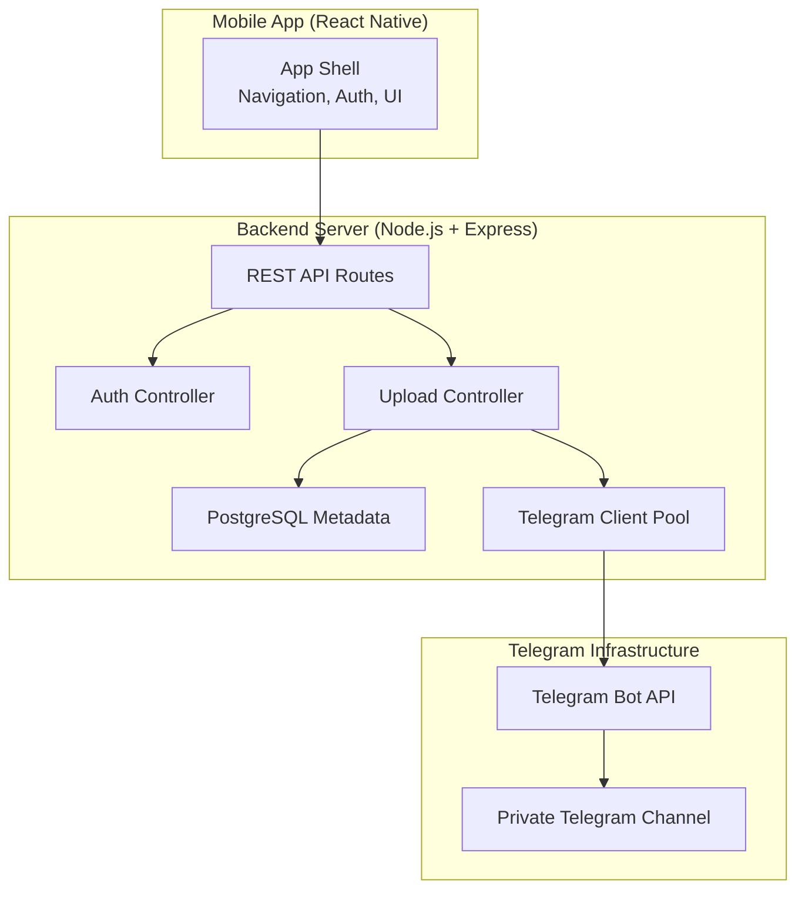
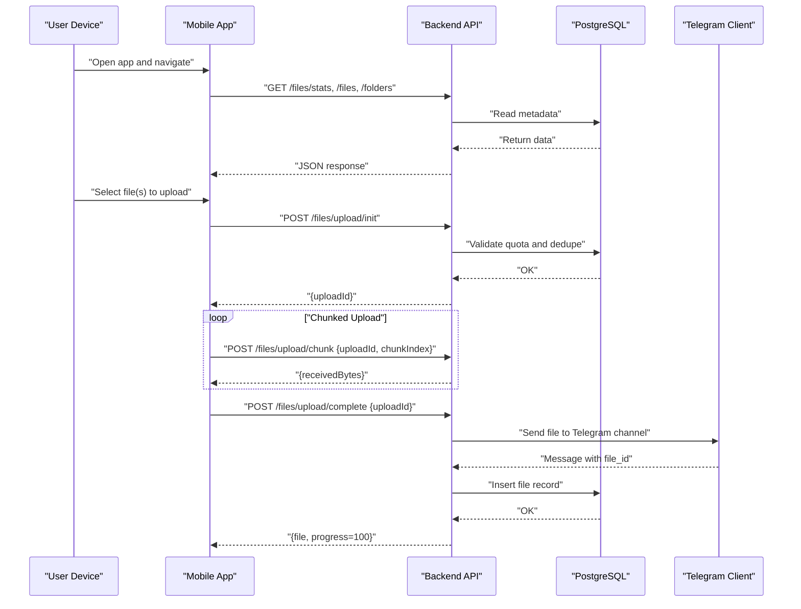
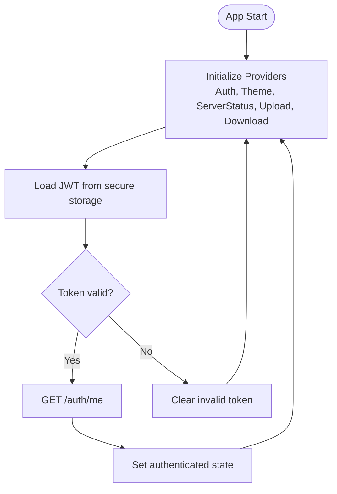
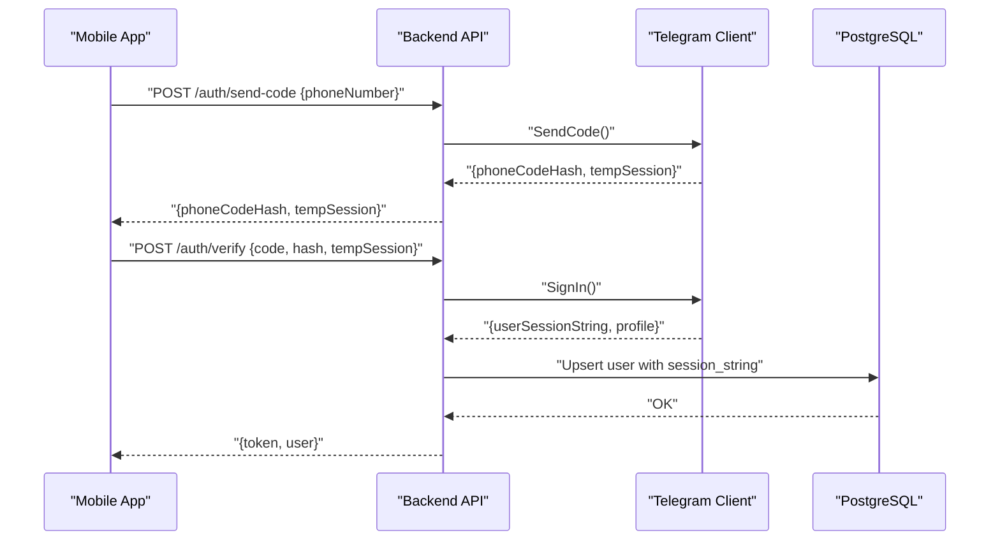
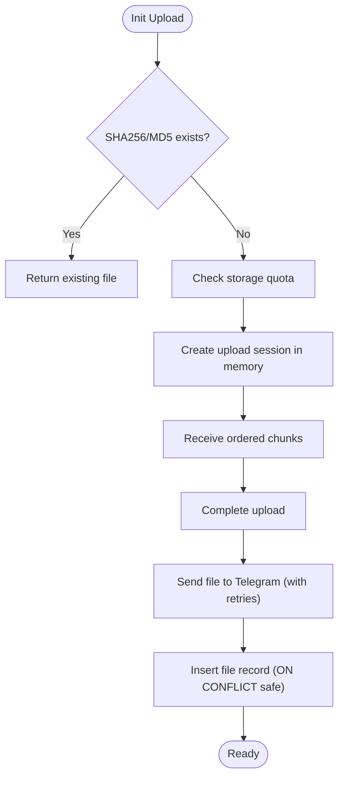
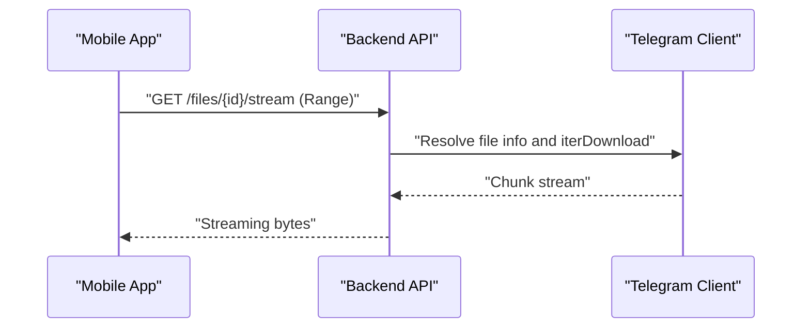
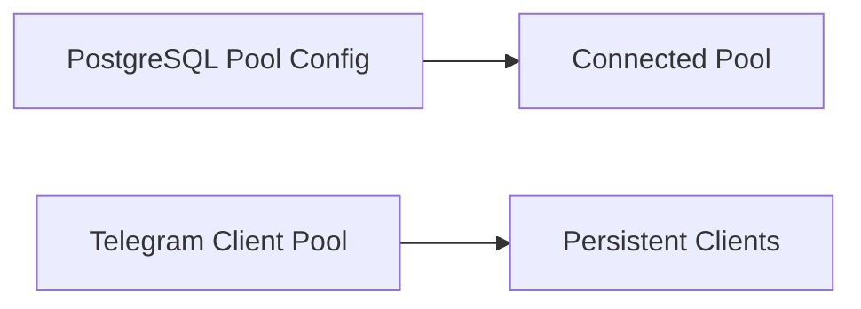
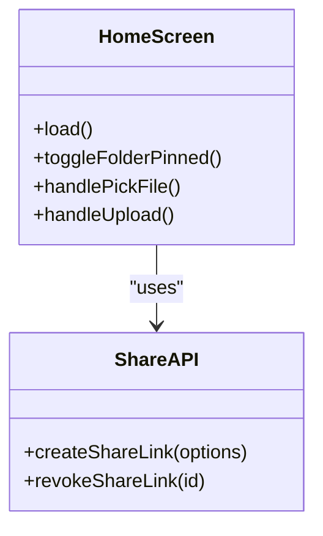
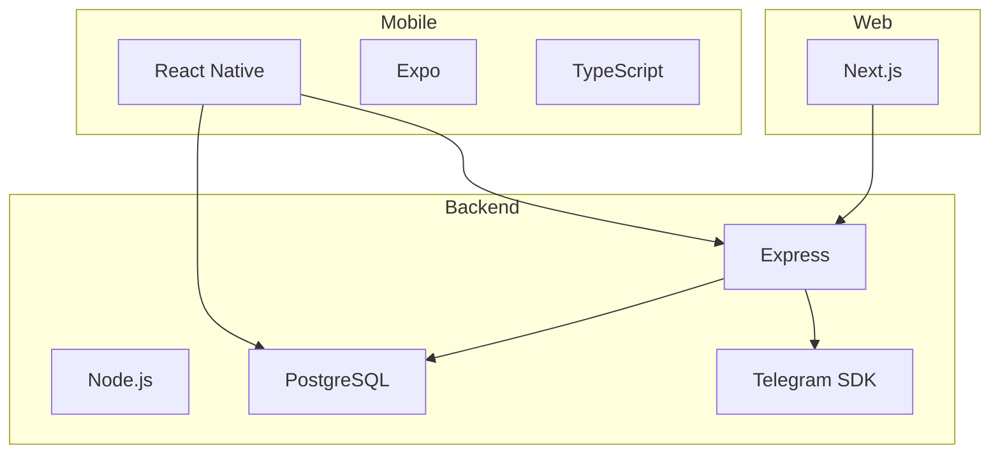

# Project Overview

<cite>
**Referenced Files in This Document**
- [README.md](file://README.md)
- [App.tsx](file://app/App.tsx)
- [AuthContext.tsx](file://app/src/context/AuthContext.tsx)
- [api.ts](file://app/src/services/api.ts)
- [HomeScreen.tsx](file://app/src/screens/HomeScreen.tsx)
- [index.ts](file://server/src/index.ts)
- [db.ts](file://server/src/config/db.ts)
- [telegram.ts](file://server/src/config/telegram.ts)
- [auth.controller.ts](file://server/src/controllers/auth.controller.ts)
- [upload.controller.ts](file://server/src/controllers/upload.controller.ts)
- [telegram.service.ts](file://server/src/services/telegram.service.ts)
- [package.json](file://app/package.json)
- [package.json](file://server/package.json)
- [package.json](file://web/package.json)
</cite>

## Table of Contents
1. [Introduction](#introduction)
2. [Project Structure](#project-structure)
3. [Core Components](#core-components)
4. [Architecture Overview](#architecture-overview)
5. [Detailed Component Analysis](#detailed-component-analysis)
6. [Dependency Analysis](#dependency-analysis)
7. [Performance Considerations](#performance-considerations)
8. [Troubleshooting Guide](#troubleshooting-guide)
9. [Conclusion](#conclusion)

## Introduction
ANYX is a self-hosted cloud storage system that turns a private Telegram channel into an unlimited, personal cloud drive. Instead of relying on commercial providers, ANYX leverages Telegram’s infrastructure for storage while offering a modern mobile app and optional web client for file management, media preview, and sharing. Its core philosophy centers on data ownership and privacy: your files live in your Telegram channel, under your control, with optional self-hosting of the backend.

Key benefits:
- Unlimited storage via Telegram channels
- Self-hosted backend for autonomy and control
- Modern UI with folder organization, background uploads, and media preview
- Privacy-first design with secure authentication and optional client-side encryption in future releases

Practical value proposition examples:
- Upload a 100 MB video from your phone; it lands in your Telegram channel and appears instantly in the app.
- Create a folder, organize your documents, and preview images or play videos without downloading.
- Generate a password-protected share link to safely distribute content outside your network.

**Section sources**
- [README.md](file://README.md#L29-L40)
- [README.md](file://README.md#L148-L163)
- [README.md](file://README.md#L178-L190)

## Project Structure
The repository is organized into three main areas:
- app: React Native mobile frontend with navigation, authentication, file management, and media preview
- server: Node.js + Express backend exposing REST APIs, managing PostgreSQL metadata, and orchestrating Telegram Bot operations
- web: Optional Next.js web client for sharing and public views

**Diagram sources**
- [index.ts](file://server/src/index.ts#L107-L221)
- [db.ts](file://server/src/config/db.ts#L27-L37)
- [telegram.ts](file://server/src/config/telegram.ts#L12-L14)
- [auth.controller.ts](file://server/src/controllers/auth.controller.ts#L9-L68)
- [upload.controller.ts](file://server/src/controllers/upload.controller.ts#L134-L268)

**Section sources**
- [README.md](file://README.md#L225-L246)
- [package.json](file://app/package.json#L1-L59)
- [package.json](file://server/package.json#L1-L57)
- [package.json](file://web/package.json#L1-L21)

## Core Components
- Mobile App (React Native)
  - Provides authentication, file browsing, folder management, media preview, and background upload orchestration.
  - Integrates with the backend via REST APIs and secure token storage.
- Backend Server (Node.js + Express)
  - Exposes authentication, file management, streaming, and sharing endpoints.
  - Manages PostgreSQL metadata and coordinates Telegram uploads/downloads.
- Telegram Integration
  - Uses a persistent client pool to upload files to a private Telegram channel and stream media progressively.
- Optional Web Client
  - Renders public share pages and password-gated previews.

Major features demonstrated by the codebase:
- Background uploads with chunked transfer, pause/resume, and progress tracking
- Media preview and streaming via Telegram’s progressive download
- Folder-based organization and search
- Share links with optional password protection

**Section sources**
- [App.tsx](file://app/App.tsx#L49-L95)
- [AuthContext.tsx](file://app/src/context/AuthContext.tsx#L19-L91)
- [HomeScreen.tsx](file://app/src/screens/HomeScreen.tsx#L360-L520)
- [index.ts](file://server/src/index.ts#L107-L221)
- [upload.controller.ts](file://server/src/controllers/upload.controller.ts#L134-L268)
- [telegram.service.ts](file://server/src/services/telegram.service.ts#L162-L251)

## Architecture Overview
ANYX separates concerns across layers:
- Presentation: React Native mobile app with navigation and UI
- Application: REST API with authentication, file management, and streaming
- Persistence: PostgreSQL for user accounts, files, folders, and shared links
- Storage: Telegram Bot API and private Telegram channel

**Diagram sources**
- [index.ts](file://server/src/index.ts#L107-L118)
- [upload.controller.ts](file://server/src/controllers/upload.controller.ts#L134-L268)
- [upload.controller.ts](file://server/src/controllers/upload.controller.ts#L316-L482)
- [telegram.service.ts](file://server/src/services/telegram.service.ts#L162-L251)

## Detailed Component Analysis

### Mobile App: Authentication and Session Management
The mobile app initializes providers for authentication, theme, server status, uploads, and downloads. It loads a persisted JWT token, verifies it against the backend, and exposes login/logout utilities. The app also sets up OTA update checks and notification channels.

**Diagram sources**
- [App.tsx](file://app/App.tsx#L247-L268)
- [AuthContext.tsx](file://app/src/context/AuthContext.tsx#L19-L91)

**Section sources**
- [App.tsx](file://app/App.tsx#L12-L18)
- [AuthContext.tsx](file://app/src/context/AuthContext.tsx#L19-L91)

### Backend: Authentication Flow
The backend handles phone-number-based OTP authentication, persists user sessions securely, and issues JWT tokens. It connects to Telegram to sign in and stores encrypted session strings per user.

**Diagram sources**
- [auth.controller.ts](file://server/src/controllers/auth.controller.ts#L9-L68)
- [telegram.service.ts](file://server/src/services/telegram.service.ts#L101-L160)
- [db.ts](file://server/src/config/db.ts#L27-L37)

**Section sources**
- [auth.controller.ts](file://server/src/controllers/auth.controller.ts#L9-L68)
- [telegram.service.ts](file://server/src/services/telegram.service.ts#L101-L160)

### Backend: Upload Pipeline and Telegram Integration
The upload pipeline supports chunked uploads, deduplication, quota checks, and background Telegram uploads with concurrency control and retries. It computes hashes, enforces chunk ordering, and inserts records into PostgreSQL upon completion.

**Diagram sources**
- [upload.controller.ts](file://server/src/controllers/upload.controller.ts#L134-L268)
- [upload.controller.ts](file://server/src/controllers/upload.controller.ts#L316-L482)
- [telegram.service.ts](file://server/src/services/telegram.service.ts#L35-L97)

**Section sources**
- [upload.controller.ts](file://server/src/controllers/upload.controller.ts#L134-L268)
- [upload.controller.ts](file://server/src/controllers/upload.controller.ts#L316-L482)
- [telegram.service.ts](file://server/src/services/telegram.service.ts#L35-L97)

### Backend: Streaming and Media Preview
The backend resolves Telegram file metadata and streams content progressively using iterDownload, enabling smooth video playback and image previews without buffering entire files.

**Diagram sources**
- [telegram.service.ts](file://server/src/services/telegram.service.ts#L171-L251)

**Section sources**
- [telegram.service.ts](file://server/src/services/telegram.service.ts#L171-L251)

### Backend: Database and Telegram Configuration
The backend configures a PostgreSQL connection pool optimized for serverless environments and initializes a Telegram client pool with automatic reconnect and TTL-based eviction.

**Diagram sources**
- [db.ts](file://server/src/config/db.ts#L27-L37)
- [telegram.ts](file://server/src/config/telegram.ts#L12-L14)

**Section sources**
- [db.ts](file://server/src/config/db.ts#L27-L37)
- [telegram.ts](file://server/src/config/telegram.ts#L12-L14)

### Mobile App: File Management and Sharing
The mobile app provides screens for files, folders, starred items, trash, and sharing. It integrates with share APIs to create and revoke share links.

**Diagram sources**
- [HomeScreen.tsx](file://app/src/screens/HomeScreen.tsx#L360-L520)
- [api.ts](file://app/src/services/api.ts#L10-L21)

**Section sources**
- [HomeScreen.tsx](file://app/src/screens/HomeScreen.tsx#L360-L520)
- [api.ts](file://app/src/services/api.ts#L10-L21)

## Dependency Analysis
Technology stack summary:
- Mobile: React Native, Expo, TypeScript, React Navigation, Reanimated, MMKV, Axios
- Backend: Node.js, Express, TypeScript, PostgreSQL, Telegram SDK
- Web: Next.js, React

**Diagram sources**
- [package.json](file://app/package.json#L11-L51)
- [package.json](file://server/package.json#L19-L40)
- [package.json](file://web/package.json#L10-L13)

**Section sources**
- [README.md](file://README.md#L178-L190)
- [package.json](file://app/package.json#L11-L51)
- [package.json](file://server/package.json#L19-L40)
- [package.json](file://web/package.json#L10-L13)

## Performance Considerations
- Upload throughput and reliability
  - Chunked uploads with ordered delivery and idempotent completion reduce overhead and improve resilience.
  - Concurrency control limits simultaneous Telegram operations to prevent OOM and throttling.
- Streaming efficiency
  - Progressive downloads with configurable chunk sizes minimize latency and memory usage.
- Database scaling
  - A small connection pool and careful error handling ensure stability on serverless platforms.
- Frontend responsiveness
  - Staggered initial loads and skeleton UI prevent jank on cold starts.

[No sources needed since this section provides general guidance]

## Troubleshooting Guide
Common issues and remedies:
- Telegram connection problems
  - Verify API ID and hash environment variables and ensure the session string is valid.
  - Check for “FLOOD_WAIT” and retry with backoff.
- Upload failures
  - Confirm chunk ordering and that the upload session exists and belongs to the authenticated user.
  - Inspect quota limits and deduplication behavior.
- Authentication errors
  - Ensure the JWT secret is configured and that the device can reach the backend.
  - On token verification failures, the app clears invalid tokens and stays logged out only on explicit 401/403.

**Section sources**
- [auth.controller.ts](file://server/src/controllers/auth.controller.ts#L23-L31)
- [upload.controller.ts](file://server/src/controllers/upload.controller.ts#L285-L290)
- [upload.controller.ts](file://server/src/controllers/upload.controller.ts#L332-L337)
- [AuthContext.tsx](file://app/src/context/AuthContext.tsx#L42-L51)

## Conclusion
ANYX delivers a modern, privacy-focused cloud storage solution by combining Telegram’s infrastructure with a self-hosted backend and a capable mobile app. Its architecture emphasizes scalability, resilience, and user control—allowing you to store unlimited files, organize them with folders, preview media seamlessly, and share securely. Whether you are a beginner exploring self-hosted storage or a developer evaluating the tech stack, ANYX offers a practical path to personal data sovereignty.

[No sources needed since this section summarizes without analyzing specific files]