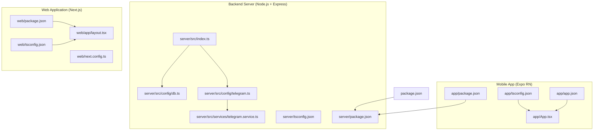
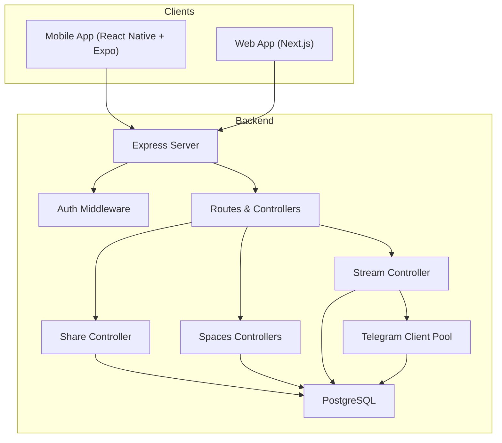
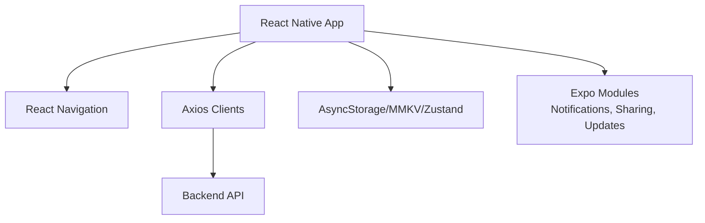
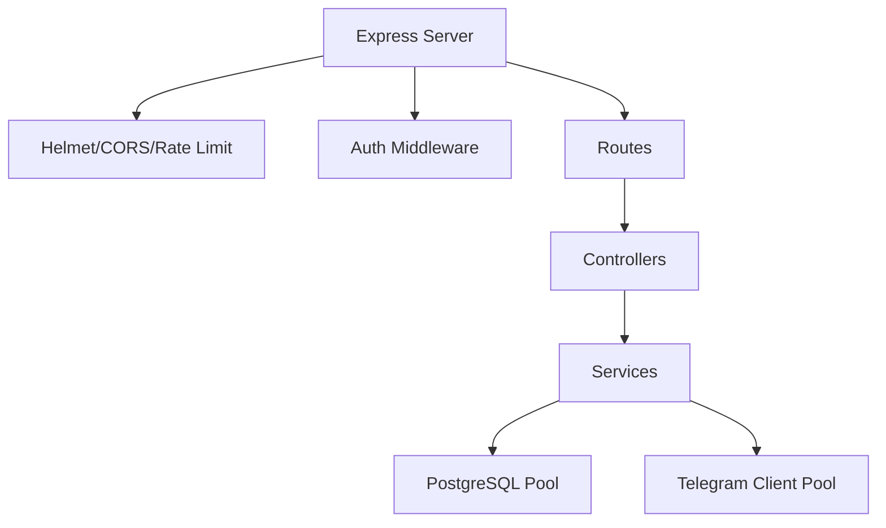
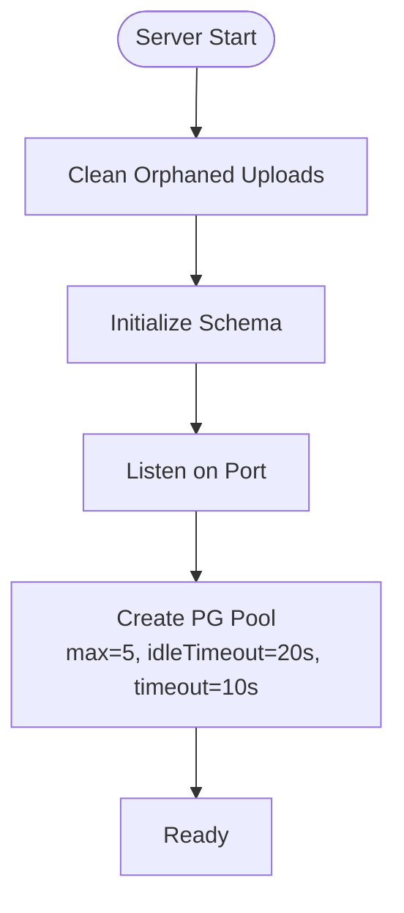
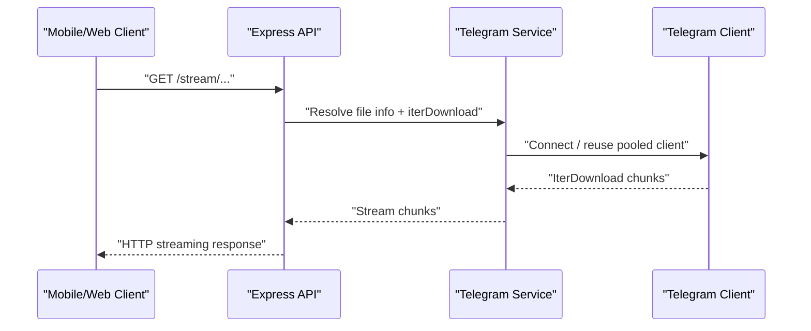
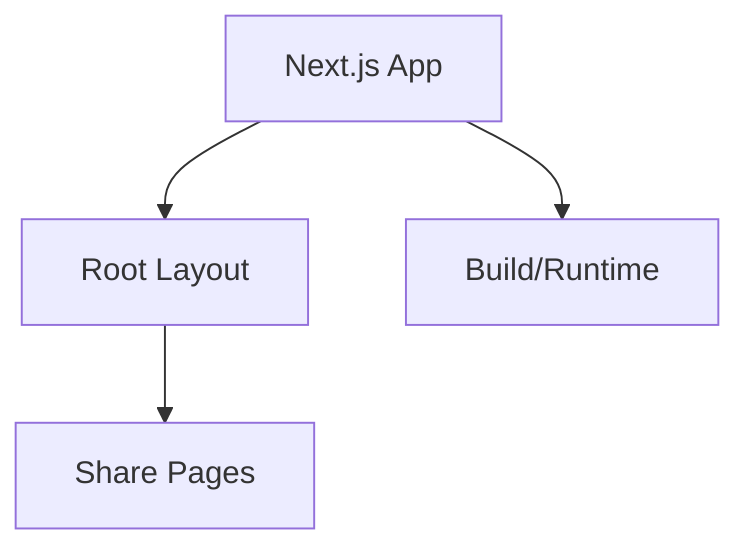
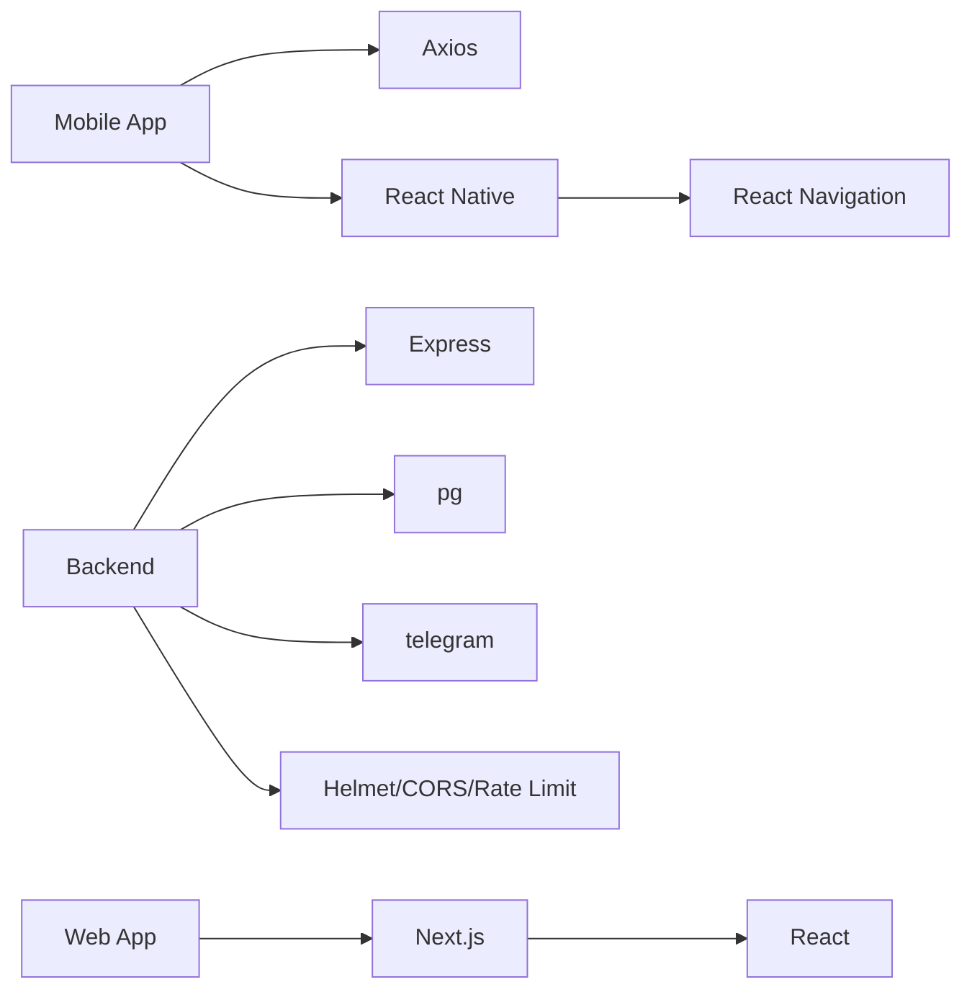

# Technology Stack

<cite>
**Referenced Files in This Document**
- [app/package.json](file://app/package.json)
- [app/tsconfig.json](file://app/tsconfig.json)
- [app/app.json](file://app/app.json)
- [app/App.tsx](file://app/App.tsx)
- [app/src/services/apiClient.ts](file://app/src/services/apiClient.ts)
- [app/src/services/api.ts](file://app/src/services/api.ts)
- [server/package.json](file://server/package.json)
- [server/tsconfig.json](file://server/tsconfig.json)
- [server/src/index.ts](file://server/src/index.ts)
- [server/src/config/db.ts](file://server/src/config/db.ts)
- [server/src/config/telegram.ts](file://server/src/config/telegram.ts)
- [server/src/services/telegram.service.ts](file://server/src/services/telegram.service.ts)
- [web/package.json](file://web/package.json)
- [web/tsconfig.json](file://web/tsconfig.json)
- [web/app/layout.tsx](file://web/app/layout.tsx)
- [web/next.config.ts](file://web/next.config.ts)
- [package.json](file://package.json)
</cite>

## Table of Contents
1. [Introduction](#introduction)
2. [Project Structure](#project-structure)
3. [Core Components](#core-components)
4. [Architecture Overview](#architecture-overview)
5. [Detailed Component Analysis](#detailed-component-analysis)
6. [Dependency Analysis](#dependency-analysis)
7. [Performance Considerations](#performance-considerations)
8. [Troubleshooting Guide](#troubleshooting-guide)
9. [Conclusion](#conclusion)

## Introduction
This document presents the complete technology stack used across the ANYX platform, covering:
- Mobile application built with Expo and React Native
- Backend server powered by Node.js and Express
- PostgreSQL database
- Telegram Bot API integration for file streaming and authentication
- Supporting technologies including TypeScript, React Navigation, and Axios
- Web application built with Next.js

It explains the rationale behind each choice, roles within the system, version requirements, compatibility considerations, and practical guidance for development and deployment.

## Project Structure
The repository is organized into three primary stacks:
- Mobile app: app/
- Backend server: server/
- Web application: web/

Each stack maintains its own package.json, TypeScript configuration, and runtime settings. A top-level package.json coordinates cross-cutting scripts for building and starting the backend.

**Diagram sources**
- [app/package.json](file://app/package.json#L1-L59)
- [app/tsconfig.json](file://app/tsconfig.json#L1-L5)
- [app/app.json](file://app/app.json#L1-L87)
- [app/App.tsx](file://app/App.tsx#L1-L287)
- [server/package.json](file://server/package.json#L1-L57)
- [server/tsconfig.json](file://server/tsconfig.json#L1-L13)
- [server/src/index.ts](file://server/src/index.ts#L1-L315)
- [server/src/config/db.ts](file://server/src/config/db.ts#L1-L61)
- [server/src/config/telegram.ts](file://server/src/config/telegram.ts#L1-L29)
- [server/src/services/telegram.service.ts](file://server/src/services/telegram.service.ts#L1-L260)
- [web/package.json](file://web/package.json#L1-L21)
- [web/tsconfig.json](file://web/tsconfig.json#L1-L36)
- [web/app/layout.tsx](file://web/app/layout.tsx#L1-L16)
- [web/next.config.ts](file://web/next.config.ts#L1-L8)
- [package.json](file://package.json#L1-L19)

**Section sources**
- [app/package.json](file://app/package.json#L1-L59)
- [server/package.json](file://server/package.json#L1-L57)
- [web/package.json](file://web/package.json#L1-L21)
- [package.json](file://package.json#L1-L19)

## Core Components
This section outlines the technology choices per stack, their roles, and compatibility.

- Mobile App (Expo React Native)
  - Purpose: Cross-platform mobile UI and offline-first capabilities
  - Key technologies: React Native, Expo, React Navigation, Axios, TypeScript
  - Version and compatibility: React 19.x, React Native 0.83.x, Expo SDK ~55.x, TypeScript ~5.9.x
  - Role in system: Handles authentication, file browsing, uploads/downloads, notifications, OTA updates, and deep linking

- Backend Server (Node.js + Express)
  - Purpose: API gateway, authentication, file orchestration, shared spaces, streaming, and Telegram integration
  - Key technologies: Express, TypeScript, Helmet, CORS, rate limiting, JSON Web Tokens, Multer, sharp, pg (PostgreSQL), node-telegram-bot-api, telegram (TDLib client)
  - Version and compatibility: Node.js 20.x, Express 5.x, TypeScript ~5.9.x
  - Role in system: Serves REST APIs, manages sessions, enforces security, streams media via Telegram, persists state in PostgreSQL

- Database (PostgreSQL)
  - Purpose: Relational persistence for users, files, shares, and metadata
  - Integration: pg connection pool configured for Render free tier and Neon serverless
  - Role in system: Central data store for application state and shared resources

- Storage (Telegram Bot API)
  - Purpose: Media streaming and progressive downloads without storing files on the server
  - Integration: telegram client with session pooling, iterative download, and client lifecycle management
  - Role in system: Provides scalable, cost-effective media delivery

- Web Application (Next.js)
  - Purpose: Public shared spaces and share pages rendered on the web
  - Key technologies: Next.js 15.x, TypeScript
  - Role in system: Renders public share experiences and shared spaces

**Section sources**
- [app/package.json](file://app/package.json#L11-L51)
- [app/tsconfig.json](file://app/tsconfig.json#L1-L5)
- [server/package.json](file://server/package.json#L19-L41)
- [server/tsconfig.json](file://server/tsconfig.json#L1-L13)
- [web/package.json](file://web/package.json#L10-L19)
- [web/tsconfig.json](file://web/tsconfig.json#L1-L36)

## Architecture Overview
The system follows a client-server model with optional web rendering for public shares. The mobile app communicates with the backend via HTTPS, while media streaming leverages Telegram’s infrastructure.

**Diagram sources**
- [app/App.tsx](file://app/App.tsx#L1-L287)
- [server/src/index.ts](file://server/src/index.ts#L1-L315)
- [server/src/config/db.ts](file://server/src/config/db.ts#L1-L61)
- [server/src/config/telegram.ts](file://server/src/config/telegram.ts#L1-L29)
- [server/src/services/telegram.service.ts](file://server/src/services/telegram.service.ts#L1-L260)
- [web/app/layout.tsx](file://web/app/layout.tsx#L1-L16)

## Detailed Component Analysis

### Mobile App Stack (Expo React Native)
- Technologies
  - React Native 0.83.x, React 19.x, Expo 55.x
  - Navigation: React Navigation (bottom tabs, native stack)
  - State and persistence: AsyncStorage, MMKV, ZUSTAND
  - UI: Lucide React Native icons, SVG, Safe Area Context
  - Networking: Axios for API calls
  - Build/runtime: Expo Updater, EAS, TypeScript
- Rationale
  - Rapid cross-platform development with native performance
  - Built-in OTA updates and deep linking
  - Rich ecosystem of Expo modules for file system, sharing, notifications, and video
- Version and compatibility
  - React 19.x, React Native 0.83.x, Expo SDK ~55.x
  - TypeScript ~5.9.x
  - Java 17 for Android builds (via Expo build properties)
- Practical guidance
  - Use Expo CLI for development and EAS for distribution
  - Configure API base URL via environment variables for dev/prod separation
  - Implement robust retry logic and user feedback for network issues

**Diagram sources**
- [app/App.tsx](file://app/App.tsx#L1-L287)
- [app/src/services/apiClient.ts](file://app/src/services/apiClient.ts#L1-L164)
- [app/package.json](file://app/package.json#L11-L51)

**Section sources**
- [app/package.json](file://app/package.json#L11-L51)
- [app/tsconfig.json](file://app/tsconfig.json#L1-L5)
- [app/app.json](file://app/app.json#L44-L70)
- [app/App.tsx](file://app/App.tsx#L1-L287)
- [app/src/services/apiClient.ts](file://app/src/services/apiClient.ts#L1-L164)

### Backend Server Stack (Node.js + Express)
- Technologies
  - Express 5.x, TypeScript, Helmet, CORS, rate limiting, cookie parser, JSON Web Tokens
  - File handling: Multer, sharp, archiver
  - Database: pg (PostgreSQL)
  - Telegram integration: telegram (TDLib client), node-telegram-bot-api
  - Logging: Winston
- Rationale
  - Express provides a mature, modular foundation for REST APIs
  - TypeScript ensures type safety and maintainability
  - Helmet and rate limiting enhance security and resilience
  - Telegram client pool enables efficient, long-lived connections for streaming
- Version and compatibility
  - Node.js 20.x
  - Express 5.x, pg ^8.19.0, telegram ^2.26.22, node-telegram-bot-api ^0.67.0
- Practical guidance
  - Configure DATABASE_URL for Neon/Render; pool optimized for free tier limits
  - Use environment variables for API ID/Hash and session storage
  - Implement health checks and graceful shutdown for cloud platforms

**Diagram sources**
- [server/src/index.ts](file://server/src/index.ts#L1-L315)
- [server/src/config/db.ts](file://server/src/config/db.ts#L1-L61)
- [server/src/config/telegram.ts](file://server/src/config/telegram.ts#L1-L29)
- [server/src/services/telegram.service.ts](file://server/src/services/telegram.service.ts#L1-L260)

**Section sources**
- [server/package.json](file://server/package.json#L19-L41)
- [server/tsconfig.json](file://server/tsconfig.json#L1-L13)
- [server/src/index.ts](file://server/src/index.ts#L1-L315)
- [server/src/config/db.ts](file://server/src/config/db.ts#L1-L61)
- [server/src/config/telegram.ts](file://server/src/config/telegram.ts#L1-L29)
- [server/src/services/telegram.service.ts](file://server/src/services/telegram.service.ts#L1-L260)

### Database Stack (PostgreSQL)
- Technologies
  - pg connection pool with configurable max connections and timeouts
  - Optimized for Render free tier and Neon serverless
- Rationale
  - Reliable relational storage for user accounts, files, shares, and metadata
  - Connection pooling reduces overhead and aligns with platform constraints
- Compatibility
  - Works with Neon serverless and Render-hosted PostgreSQL
- Practical guidance
  - Set DATABASE_URL in environment variables
  - Monitor pool idle timeouts and adjust for workload patterns

**Diagram sources**
- [server/src/index.ts](file://server/src/index.ts#L295-L312)
- [server/src/config/db.ts](file://server/src/config/db.ts#L27-L37)

**Section sources**
- [server/src/config/db.ts](file://server/src/config/db.ts#L1-L61)
- [server/src/index.ts](file://server/src/index.ts#L295-L312)

### Telegram Bot API Integration
- Technologies
  - telegram client with StringSession for persistent sessions
  - NodeCache for client pooling with TTL
  - Iterative download for progressive streaming
- Rationale
  - Leverages Telegram infrastructure for scalable media delivery
  - Client pooling improves performance and reduces re-auth overhead
- Compatibility
  - Requires TELEGRAM_API_ID, TELEGRAM_API_HASH, and TELEGRAM_SESSION
- Practical guidance
  - Store sessions securely on the server; never expose API secrets to clients
  - Implement session expiry detection and graceful reconnects

**Diagram sources**
- [server/src/services/telegram.service.ts](file://server/src/services/telegram.service.ts#L215-L251)
- [server/src/config/telegram.ts](file://server/src/config/telegram.ts#L12-L28)

**Section sources**
- [server/src/config/telegram.ts](file://server/src/config/telegram.ts#L1-L29)
- [server/src/services/telegram.service.ts](file://server/src/services/telegram.service.ts#L1-L260)

### Web Application Stack (Next.js)
- Technologies
  - Next.js 15.x, React 19.x, TypeScript
  - Static generation and SSR for public share pages
- Rationale
  - Fast, SEO-friendly rendering for public shared spaces
  - Strong typing and built-in optimizations
- Compatibility
  - React 19.x, Next 15.x, TypeScript ~5.9.x
- Practical guidance
  - Use app-dir routing for modern Next.js features
  - Configure strict mode and incremental static regeneration as needed

**Diagram sources**
- [web/app/layout.tsx](file://web/app/layout.tsx#L1-L16)
- [web/package.json](file://web/package.json#L10-L14)
- [web/tsconfig.json](file://web/tsconfig.json#L1-L36)
- [web/next.config.ts](file://web/next.config.ts#L1-L8)

**Section sources**
- [web/package.json](file://web/package.json#L10-L19)
- [web/tsconfig.json](file://web/tsconfig.json#L1-L36)
- [web/app/layout.tsx](file://web/app/layout.tsx#L1-L16)
- [web/next.config.ts](file://web/next.config.ts#L1-L8)

## Dependency Analysis
- Mobile app depends on:
  - Axios for HTTP communication
  - Expo modules for platform features
  - React Navigation for routing
- Backend depends on:
  - Express for HTTP server and middleware
  - pg for database connectivity
  - telegram for media streaming
  - helmet, cors, rate-limit for security and resilience
- Web app depends on:
  - Next.js for SSR/static rendering
  - React and TypeScript

**Diagram sources**
- [app/src/services/apiClient.ts](file://app/src/services/apiClient.ts#L1-L164)
- [app/App.tsx](file://app/App.tsx#L1-L287)
- [server/src/index.ts](file://server/src/index.ts#L1-L315)
- [server/src/config/db.ts](file://server/src/config/db.ts#L1-L61)
- [server/src/config/telegram.ts](file://server/src/config/telegram.ts#L1-L29)
- [web/package.json](file://web/package.json#L10-L19)

**Section sources**
- [app/src/services/apiClient.ts](file://app/src/services/apiClient.ts#L1-L164)
- [server/src/index.ts](file://server/src/index.ts#L1-L315)
- [web/package.json](file://web/package.json#L10-L19)

## Performance Considerations
- Backend
  - Connection pooling tuned for free-tier constraints (max 5 connections, short idle timeout)
  - Rate limiting adjusted for batch upload scenarios
  - Health checks and graceful shutdown for cloud platforms
- Mobile
  - Separate upload client with higher timeout to accommodate large files
  - Retry logic with exponential backoff
  - Server waking overlay to inform users during cold starts
- Streaming
  - Iterative downloads with fixed chunk size reduce memory usage
  - Client pooling minimizes repeated authentication overhead

[No sources needed since this section provides general guidance]

## Troubleshooting Guide
- Backend
  - Database connectivity issues: verify DATABASE_URL and SSL mode; monitor pool errors
  - Telegram client failures: check API ID/Hash and session validity; inspect pool eviction logs
  - CORS and security headers: confirm allowed origins and nonce injection for CSP
- Mobile
  - API base URL resolution: ensure EXPO_PUBLIC_API_URL is set for production builds
  - Network errors: leverage retry interceptor and server waking UI
- Web
  - Next.js build/runtime: confirm TypeScript strictness and module resolution settings

**Section sources**
- [server/src/config/db.ts](file://server/src/config/db.ts#L39-L58)
- [server/src/config/telegram.ts](file://server/src/config/telegram.ts#L16-L28)
- [server/src/index.ts](file://server/src/index.ts#L52-L83)
- [app/src/services/apiClient.ts](file://app/src/services/apiClient.ts#L14-L22)
- [web/tsconfig.json](file://web/tsconfig.json#L1-L36)

## Conclusion
ANYX employs a cohesive stack combining mobile-first development with a robust backend and scalable media delivery via Telegram. The choices emphasize developer productivity, security, and cost-effectiveness, while maintaining strong compatibility with modern cloud platforms. Following the guidance herein will streamline development, deployment, and maintenance across all stacks.