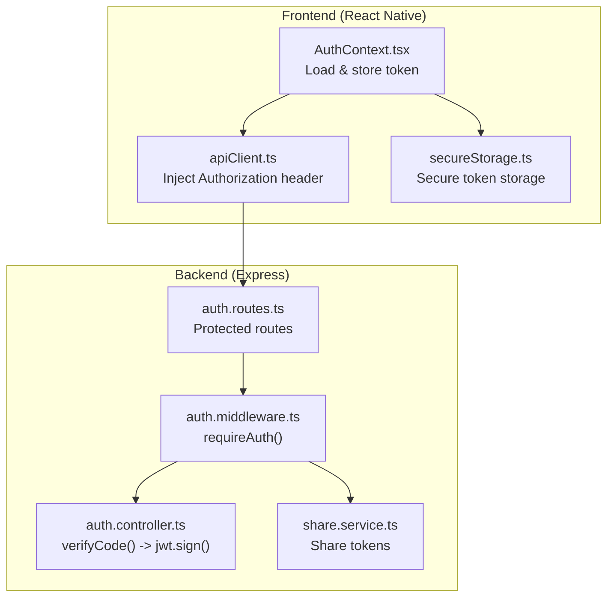
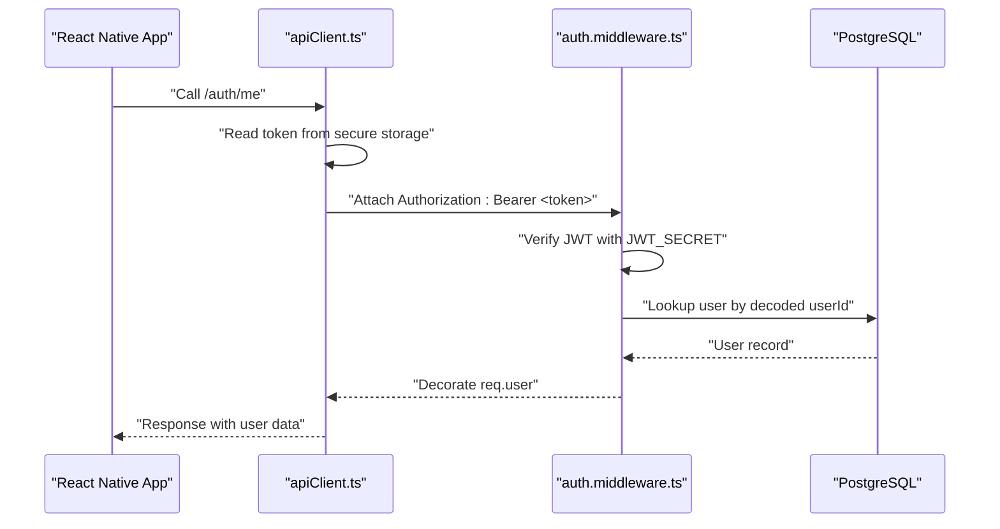
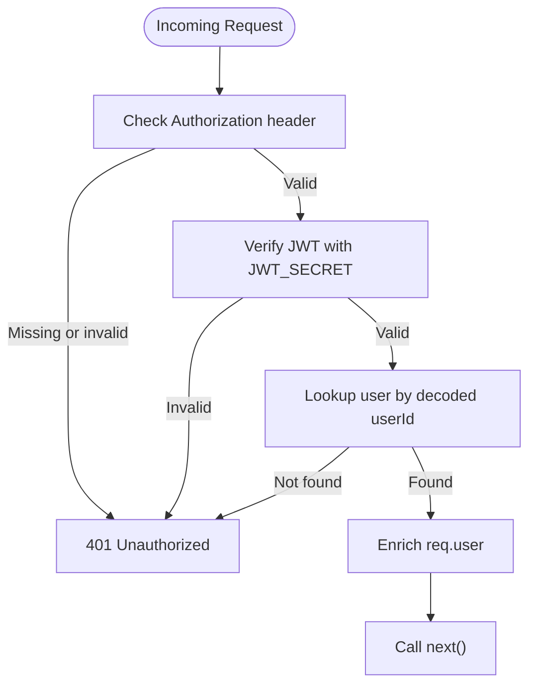
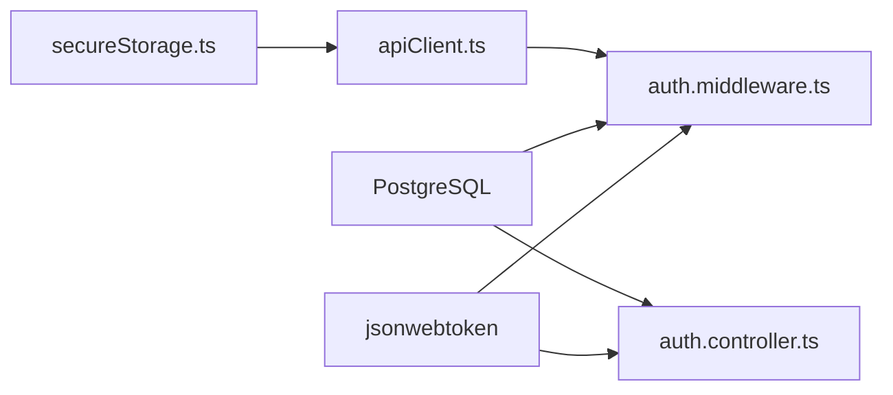

# JWT Token Security

<cite>
**Referenced Files in This Document**
- [auth.middleware.ts](file://server/src/middlewares/auth.middleware.ts)
- [auth.controller.ts](file://server/src/controllers/auth.controller.ts)
- [auth.routes.ts](file://server/src/routes/auth.routes.ts)
- [share.service.ts](file://server/src/services/share.service.ts)
- [AuthContext.tsx](file://app/src/context/AuthContext.tsx)
- [apiClient.ts](file://app/src/services/apiClient.ts)
- [secureStorage.ts](file://app/src/utils/secureStorage.ts)
- [package.json](file://server/package.json)
</cite>

## Table of Contents
1. [Introduction](#introduction)
2. [Project Structure](#project-structure)
3. [Core Components](#core-components)
4. [Architecture Overview](#architecture-overview)
5. [Detailed Component Analysis](#detailed-component-analysis)
6. [Dependency Analysis](#dependency-analysis)
7. [Performance Considerations](#performance-considerations)
8. [Troubleshooting Guide](#troubleshooting-guide)
9. [Conclusion](#conclusion)

## Introduction
This document explains the JWT token security implementation across the backend Express server and the React Native frontend. It covers the authentication middleware architecture, token verification process, user session management, environment configuration, token structure, expiration handling, and security best practices. It also documents how tokens are passed via the Authorization header, how shared access tokens differ, and how to mitigate common JWT vulnerabilities such as token signing algorithms, secret management, and secure transmission.

## Project Structure
The JWT authentication spans three layers:
- Backend middleware validates incoming requests and enriches them with user context.
- Backend controllers issue JWTs after successful phone-based authentication.
- Frontend stores tokens securely and attaches them to outgoing requests.

**Diagram sources**
- [auth.middleware.ts](file://server/src/middlewares/auth.middleware.ts#L1-L82)
- [auth.controller.ts](file://server/src/controllers/auth.controller.ts#L1-L96)
- [auth.routes.ts](file://server/src/routes/auth.routes.ts#L1-L13)
- [share.service.ts](file://server/src/services/share.service.ts#L1-L183)
- [AuthContext.tsx](file://app/src/context/AuthContext.tsx#L1-L98)
- [apiClient.ts](file://app/src/services/apiClient.ts#L1-L164)
- [secureStorage.ts](file://app/src/utils/secureStorage.ts#L1-L74)

**Section sources**
- [auth.middleware.ts](file://server/src/middlewares/auth.middleware.ts#L1-L82)
- [auth.controller.ts](file://server/src/controllers/auth.controller.ts#L1-L96)
- [auth.routes.ts](file://server/src/routes/auth.routes.ts#L1-L13)
- [share.service.ts](file://server/src/services/share.service.ts#L1-L183)
- [AuthContext.tsx](file://app/src/context/AuthContext.tsx#L1-L98)
- [apiClient.ts](file://app/src/services/apiClient.ts#L1-L164)
- [secureStorage.ts](file://app/src/utils/secureStorage.ts#L1-L74)

## Core Components
- JWT_SECRET environment variable: Required by both backend controllers and middleware for signing and verifying tokens. The absence of this variable prevents the server from starting.
- Authentication middleware: Extracts the Authorization header, verifies the JWT against JWT_SECRET, loads user data from the database, and decorates the request with user context.
- Auth controller: Issues a signed JWT containing the user identifier with a long-lived expiration after successful phone-based authentication.
- Frontend token handling: Stores the JWT securely and injects the Authorization header on every request.

Key implementation references:
- Environment check and middleware verification: [auth.middleware.ts](file://server/src/middlewares/auth.middleware.ts#L5-L81)
- Token issuance with expiration: [auth.controller.ts](file://server/src/controllers/auth.controller.ts#L58-L65)
- Frontend token injection: [apiClient.ts](file://app/src/services/apiClient.ts#L46-L74)
- Frontend secure storage: [secureStorage.ts](file://app/src/utils/secureStorage.ts#L30-L60)

**Section sources**
- [auth.middleware.ts](file://server/src/middlewares/auth.middleware.ts#L5-L81)
- [auth.controller.ts](file://server/src/controllers/auth.controller.ts#L58-L65)
- [apiClient.ts](file://app/src/services/apiClient.ts#L46-L74)
- [secureStorage.ts](file://app/src/utils/secureStorage.ts#L30-L60)

## Architecture Overview
The JWT authentication flow integrates the frontend and backend as follows:
- Frontend obtains a JWT from the backend after phone-based verification.
- Frontend persists the JWT securely and sends it on each request via the Authorization header.
- Backend middleware validates the JWT and enriches the request with user context for protected routes.

**Diagram sources**
- [AuthContext.tsx](file://app/src/context/AuthContext.tsx#L25-L60)
- [apiClient.ts](file://app/src/services/apiClient.ts#L46-L74)
- [auth.middleware.ts](file://server/src/middlewares/auth.middleware.ts#L55-L80)
- [auth.controller.ts](file://server/src/controllers/auth.controller.ts#L71-L80)

## Detailed Component Analysis

### JWT Secret Management and Validation
- Backend enforces that JWT_SECRET is present at startup in both middleware and controller modules. If missing, the server fails fast to prevent unsafe operation.
- Middleware verifies incoming JWTs using the same secret.
- Controllers sign new JWTs using the same secret and a long expiration.

Implementation references:
- Secret presence checks: [auth.middleware.ts](file://server/src/middlewares/auth.middleware.ts#L5-L6), [auth.controller.ts](file://server/src/controllers/auth.controller.ts#L6-L7)
- Verification and user lookup: [auth.middleware.ts](file://server/src/middlewares/auth.middleware.ts#L62-L75)
- Signing with expiration: [auth.controller.ts](file://server/src/controllers/auth.controller.ts#L58)

Security note:
- The project does not configure a signing algorithm explicitly. The library defaults apply. For stronger security, explicitly set the algorithm to a secure option and manage secrets via a secure secret manager in production.

**Section sources**
- [auth.middleware.ts](file://server/src/middlewares/auth.middleware.ts#L5-L6)
- [auth.controller.ts](file://server/src/controllers/auth.controller.ts#L6-L7)
- [auth.middleware.ts](file://server/src/middlewares/auth.middleware.ts#L62-L75)
- [auth.controller.ts](file://server/src/controllers/auth.controller.ts#L58)

### Token Structure and Expiration
- Issued token payload: Contains a user identifier claim.
- Expiration: Long-lived token issued by the backend controller.
- Shared access tokens: Separate signing secrets and TTLs managed by the share service.

Implementation references:
- Payload and signing: [auth.controller.ts](file://server/src/controllers/auth.controller.ts#L58)
- Shared link token signing and verification: [share.service.ts](file://server/src/services/share.service.ts#L62-L87)
- Shared access token signing and verification: [share.service.ts](file://server/src/services/share.service.ts#L89-L110)

Expiration handling:
- Backend sets a long expiration for user JWTs.
- Shared access tokens support configurable TTL via environment variables.

**Section sources**
- [auth.controller.ts](file://server/src/controllers/auth.controller.ts#L58)
- [share.service.ts](file://server/src/services/share.service.ts#L62-L87)
- [share.service.ts](file://server/src/services/share.service.ts#L89-L110)

### Authentication Middleware and User Session Management
- Extracts the Authorization header and validates Bearer token format.
- Verifies the JWT and loads user data from the database.
- Enriches the request with user context for downstream controllers.
- Supports a special bypass for shared links using separate share tokens.

Implementation references:
- Header parsing and verification: [auth.middleware.ts](file://server/src/middlewares/auth.middleware.ts#L55-L80)
- User enrichment: [auth.middleware.ts](file://server/src/middlewares/auth.middleware.ts#L71-L75)
- Shared link bypass logic: [auth.middleware.ts](file://server/src/middlewares/auth.middleware.ts#L19-L52)

**Diagram sources**
- [auth.middleware.ts](file://server/src/middlewares/auth.middleware.ts#L55-L80)

**Section sources**
- [auth.middleware.ts](file://server/src/middlewares/auth.middleware.ts#L55-L80)

### AuthRequest Interface and Authorization Header Handling
- The middleware defines an extended request interface that carries user context.
- Tokens are passed via the Authorization header with the Bearer scheme.
- Frontend reads the persisted token and attaches the header automatically.

Implementation references:
- AuthRequest interface: [auth.middleware.ts](file://server/src/middlewares/auth.middleware.ts#L9-L15)
- Header extraction and validation: [auth.middleware.ts](file://server/src/middlewares/auth.middleware.ts#L55-L60)
- Frontend injection: [apiClient.ts](file://app/src/services/apiClient.ts#L46-L52)

**Section sources**
- [auth.middleware.ts](file://server/src/middlewares/auth.middleware.ts#L9-L15)
- [auth.middleware.ts](file://server/src/middlewares/auth.middleware.ts#L55-L60)
- [apiClient.ts](file://app/src/services/apiClient.ts#L46-L52)

### Token Generation, Validation, and Refresh Mechanisms
- Generation: Backend controller signs a JWT with a user identifier and long expiration.
- Validation: Middleware verifies the JWT and enriches the request.
- Refresh: No dedicated refresh endpoint is implemented in the analyzed code. The existing token remains valid until expiration.

Implementation references:
- Generation: [auth.controller.ts](file://server/src/controllers/auth.controller.ts#L58)
- Validation: [auth.middleware.ts](file://server/src/middlewares/auth.middleware.ts#L62-L75)

Recommendation:
- Implement a separate refresh token mechanism (e.g., short-lived access tokens plus long-lived refresh tokens) to reduce exposure windows and enable controlled revocation.

**Section sources**
- [auth.controller.ts](file://server/src/controllers/auth.controller.ts#L58)
- [auth.middleware.ts](file://server/src/middlewares/auth.middleware.ts#L62-L75)

### Token Storage Security and Cross-Site Scripting Prevention
- Frontend secure storage:
  - Native platforms use a secure keystore/keychain for encrypted persistence.
  - Web falls back to non-encrypted storage; mitigate by restricting access and avoiding sensitive contexts.
- Cross-site scripting prevention:
  - The backend applies CSP hardening and nonce-based script tags in related controllers.
  - Frontend avoids storing tokens in DOM attributes or URLs; tokens are kept in secure storage and injected programmatically.

Implementation references:
- Secure storage abstraction: [secureStorage.ts](file://app/src/utils/secureStorage.ts#L30-L60)
- Frontend token injection: [apiClient.ts](file://app/src/services/apiClient.ts#L46-L52)
- CSP and nonce setup: [fix_csp.js](file://server/fix_csp.js#L10-L24)

**Section sources**
- [secureStorage.ts](file://app/src/utils/secureStorage.ts#L30-L60)
- [apiClient.ts](file://app/src/services/apiClient.ts#L46-L52)
- [fix_csp.js](file://server/fix_csp.js#L10-L24)

### Shared Access Tokens and Public Routes
- Shared link tokens allow public access to downloads/thumbnails when a valid share token is provided either as a query parameter or Authorization header.
- Separate signing secrets and TTLs are used for shared link and shared access tokens.

Implementation references:
- Shared link bypass in middleware: [auth.middleware.ts](file://server/src/middlewares/auth.middleware.ts#L19-L52)
- Shared token signing and verification: [share.service.ts](file://server/src/services/share.service.ts#L62-L110)

**Section sources**
- [auth.middleware.ts](file://server/src/middlewares/auth.middleware.ts#L19-L52)
- [share.service.ts](file://server/src/services/share.service.ts#L62-L110)

## Dependency Analysis
The JWT stack depends on:
- jsonwebtoken for signing and verifying tokens.
- PostgreSQL for user data retrieval during verification.
- Frontend secure storage for token persistence.

**Diagram sources**
- [package.json](file://server/package.json#L32-L32)
- [auth.middleware.ts](file://server/src/middlewares/auth.middleware.ts#L2-L3)
- [auth.controller.ts](file://server/src/controllers/auth.controller.ts#L4-L4)
- [secureStorage.ts](file://app/src/utils/secureStorage.ts#L15-L21)
- [apiClient.ts](file://app/src/services/apiClient.ts#L1-L7)

**Section sources**
- [package.json](file://server/package.json#L32-L32)
- [auth.middleware.ts](file://server/src/middlewares/auth.middleware.ts#L2-L3)
- [auth.controller.ts](file://server/src/controllers/auth.controller.ts#L4-L4)
- [secureStorage.ts](file://app/src/utils/secureStorage.ts#L15-L21)
- [apiClient.ts](file://app/src/services/apiClient.ts#L1-L7)

## Performance Considerations
- Token verification is lightweight; the primary cost is a single database lookup per protected request.
- Long-lived tokens reduce verification overhead but increase risk exposure; consider rotating tokens or implementing refresh flows.
- Avoid unnecessary retries on invalid tokens; the frontend already handles 401/403 by clearing auth state.

## Troubleshooting Guide
Common issues and resolutions:
- Missing JWT_SECRET:
  - Symptom: Server fails to start with an error indicating the environment variable is not set.
  - Resolution: Set JWT_SECRET in the environment and restart the server.
  - Reference: [auth.middleware.ts](file://server/src/middlewares/auth.middleware.ts#L5-L6), [auth.controller.ts](file://server/src/controllers/auth.controller.ts#L6-L7)
- Invalid Authorization header:
  - Symptom: 401 Unauthorized due to missing or malformed Bearer token.
  - Resolution: Ensure the client sends "Authorization: Bearer <token>".
  - Reference: [auth.middleware.ts](file://server/src/middlewares/auth.middleware.ts#L55-L58)
- Invalid or expired token:
  - Symptom: 401 Unauthorized during verification.
  - Resolution: Re-authenticate to obtain a new token; verify server time and clock synchronization.
  - Reference: [auth.middleware.ts](file://server/src/middlewares/auth.middleware.ts#L78-L80)
- Token not attached to requests:
  - Symptom: Backend rejects requests with 401.
  - Resolution: Confirm the frontend reads the token from secure storage and injects the Authorization header.
  - Reference: [apiClient.ts](file://app/src/services/apiClient.ts#L46-L52), [secureStorage.ts](file://app/src/utils/secureStorage.ts#L30-L38)
- Shared link access denied:
  - Symptom: Public route access fails despite a valid share token.
  - Resolution: Verify the share token matches the intended resource and is not expired.
  - Reference: [auth.middleware.ts](file://server/src/middlewares/auth.middleware.ts#L19-L52), [share.service.ts](file://server/src/services/share.service.ts#L79-L87)

**Section sources**
- [auth.middleware.ts](file://server/src/middlewares/auth.middleware.ts#L5-L6)
- [auth.controller.ts](file://server/src/controllers/auth.controller.ts#L6-L7)
- [auth.middleware.ts](file://server/src/middlewares/auth.middleware.ts#L55-L58)
- [auth.middleware.ts](file://server/src/middlewares/auth.middleware.ts#L78-L80)
- [apiClient.ts](file://app/src/services/apiClient.ts#L46-L52)
- [secureStorage.ts](file://app/src/utils/secureStorage.ts#L30-L38)
- [auth.middleware.ts](file://server/src/middlewares/auth.middleware.ts#L19-L52)
- [share.service.ts](file://server/src/services/share.service.ts#L79-L87)

## Conclusion
The project implements a straightforward JWT-based authentication system with:
- Strict secret enforcement at startup.
- Middleware-driven token verification and user enrichment.
- Frontend secure storage and automatic header injection.
- Separate token handling for shared access scenarios.

To strengthen security, consider:
- Explicitly configuring a secure signing algorithm.
- Implementing refresh tokens and short-lived access tokens.
- Enhancing transport security with strict TLS and CSRF protections.
- Regular rotation of secrets and monitoring for misuse.