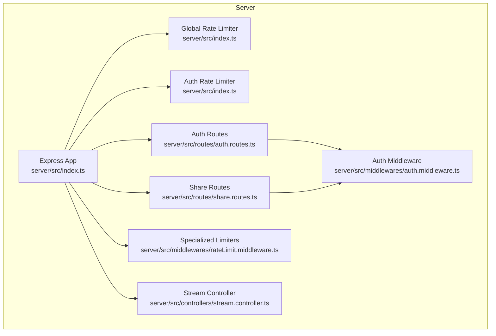
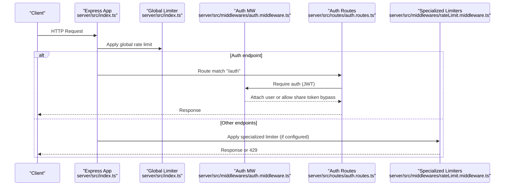
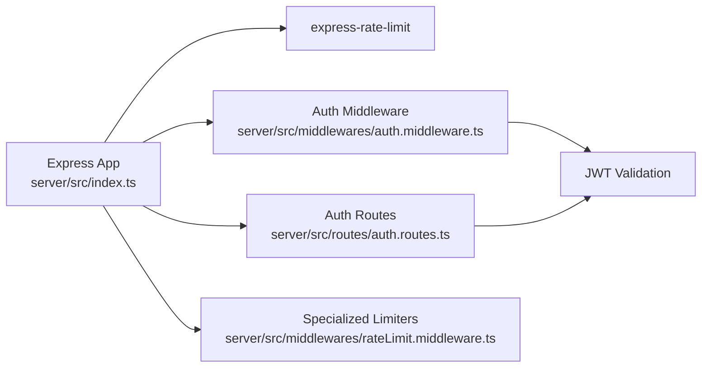

# Rate Limiting and API Protection

<cite>
**Referenced Files in This Document**
- [index.ts](file://server/src/index.ts)
- [rateLimit.middleware.ts](file://server/src/middlewares/rateLimit.middleware.ts)
- [auth.routes.ts](file://server/src/routes/auth.routes.ts)
- [auth.controller.ts](file://server/src/controllers/auth.controller.ts)
- [auth.middleware.ts](file://server/src/middlewares/auth.middleware.ts)
- [share.routes.ts](file://server/src/routes/share.routes.ts)
- [stream.controller.ts](file://server/src/controllers/stream.controller.ts)
- [test_rate_limit.js](file://server/test_rate_limit.js)
- [test_rate_limit2.js](file://server/test_rate_limit2.js)
- [test_express_limiter.js](file://server/test_express_limiter.js)
- [package.json](file://server/package.json)
</cite>

## Table of Contents
1. [Introduction](#introduction)
2. [Project Structure](#project-structure)
3. [Core Components](#core-components)
4. [Architecture Overview](#architecture-overview)
5. [Detailed Component Analysis](#detailed-component-analysis)
6. [Dependency Analysis](#dependency-analysis)
7. [Performance Considerations](#performance-considerations)
8. [Troubleshooting Guide](#troubleshooting-guide)
9. [Conclusion](#conclusion)
10. [Appendices](#appendices)

## Introduction
This document explains the rate limiting and API protection mechanisms implemented in the backend server. It covers the middleware configuration, request throttling strategies, and abuse prevention techniques. It also documents the supported rate limiting algorithms, IP-based and user-based limiting, dynamic threshold adjustments, configuration examples, violation handling, monitoring approaches, and integration with Redis for distributed rate limiting. Guidance is included for tuning thresholds based on system capacity and user behavior patterns, along with considerations for performance impact.

## Project Structure
The rate limiting and API protection features are primarily implemented in the Express server under server/src. Key areas include:
- Global rate limiting and per-route throttling in the main server entry
- Dedicated middleware module for specialized share and space limits
- Authentication routes and middleware enforcing JWT-based user identity
- Controllers and routes for share and streaming that benefit from rate limiting
- Tests demonstrating key generator behavior and custom key generation

**Diagram sources**
- [index.ts](file://server/src/index.ts#L85-L111)
- [rateLimit.middleware.ts](file://server/src/middlewares/rateLimit.middleware.ts#L1-L47)
- [auth.routes.ts](file://server/src/routes/auth.routes.ts#L1-L13)
- [share.routes.ts](file://server/src/routes/share.routes.ts#L1-L12)
- [auth.middleware.ts](file://server/src/middlewares/auth.middleware.ts#L1-L82)
- [stream.controller.ts](file://server/src/controllers/stream.controller.ts#L1-L33)

**Section sources**
- [index.ts](file://server/src/index.ts#L85-L111)
- [rateLimit.middleware.ts](file://server/src/middlewares/rateLimit.middleware.ts#L1-L47)

## Core Components
- Global rate limiter: Applies a broad cap to protect the server from overload, skipping health checks.
- Auth rate limiter: Prevents brute-force OTP attempts on authentication endpoints.
- Specialized limiters: Targeted throttling for share/password, share views/downloads, shared space access, space password, uploads, and signed downloads.
- Authentication middleware: Enforces JWT-based user identity and supports share-link token bypass for public resources.
- Trust proxy configuration: Ensures accurate client IP detection behind load balancers/proxies.

Key implementation references:
- Global limiter and auth limiter configuration
- Specialized limiters exported from the dedicated middleware module
- Authentication routes and middleware
- Trust proxy setting for IP resolution

**Section sources**
- [index.ts](file://server/src/index.ts#L85-L111)
- [rateLimit.middleware.ts](file://server/src/middlewares/rateLimit.middleware.ts#L1-L47)
- [auth.routes.ts](file://server/src/routes/auth.routes.ts#L1-L13)
- [auth.middleware.ts](file://server/src/middlewares/auth.middleware.ts#L1-L82)

## Architecture Overview
The rate limiting architecture integrates at two layers:
- Application-level middleware using express-rate-limit for IP-based quotas
- Route-specific middleware for targeted throttling on sensitive endpoints
- Authentication middleware enabling user-aware access patterns and share-link token bypass

**Diagram sources**
- [index.ts](file://server/src/index.ts#L85-L111)
- [auth.middleware.ts](file://server/src/middlewares/auth.middleware.ts#L19-L81)
- [auth.routes.ts](file://server/src/routes/auth.routes.ts#L1-L13)
- [rateLimit.middleware.ts](file://server/src/middlewares/rateLimit.middleware.ts#L1-L47)

## Detailed Component Analysis

### Global Rate Limiter
- Purpose: Broad protection against excessive requests across the entire server.
- Behavior: Applies a sliding-window quota over a fixed interval, with configurable max requests and header standards.
- Skip conditions: Health check endpoint is excluded to avoid self-DOS during probes.
- Violation handling: Returns a structured error response indicating retry timing.

Implementation highlights:
- Window and max values, header preferences, skip predicate, and message format are defined centrally.

**Section sources**
- [index.ts](file://server/src/index.ts#L85-L98)

### Authentication Rate Limiter
- Purpose: Mitigates brute-force OTP attempts by constraining repeated authentication requests.
- Behavior: Sliding-window throttle on the /auth routes, with a short window and low max to deter rapid retries.
- Violation handling: Returns a structured error response advising a cooldown period.

Integration:
- Mounted on the auth routes to enforce per-IP constraints during OTP send/verify flows.

**Section sources**
- [index.ts](file://server/src/index.ts#L100-L108)
- [auth.routes.ts](file://server/src/routes/auth.routes.ts#L1-L13)

### Specialized Throttling Limiters (Share, Space, Downloads)
- Purpose: Protect high-traffic or sensitive endpoints with fine-grained quotas.
- Scope: Includes share password attempts, share views/downloads, shared space access, space password, uploads, and signed downloads.
- Behavior: Each limiter defines a window and max, with tailored messages for user feedback.
- Key limiter types:
  - sharePasswordLimiter: Strict per-IP password attempts
  - shareViewLimiter and shareDownloadLimiter: Per-minute and per-5-minute quotas for public views/downloads
  - spaceViewLimiter and spacePasswordLimiter: Per-space access and password attempts
  - spaceUploadLimiter: Per-15-minute upload attempts
  - signedDownloadLimiter: Per-5-minute signed download attempts

Usage pattern:
- These limiters are exported from the dedicated middleware module and can be applied to specific routes as needed.

**Section sources**
- [rateLimit.middleware.ts](file://server/src/middlewares/rateLimit.middleware.ts#L1-L47)

### Authentication Middleware and Share-Link Token Bypass
- Purpose: Enforce JWT-based user identity and enable public resource access via share-link tokens.
- Behavior:
  - Validates Authorization header for JWT-based requests
  - Supports share-link token bypass for public downloads/thumbnails when appropriate
  - Attaches user context and share payload to the request for downstream controllers
- Impact on rate limiting:
  - Public access via share tokens avoids user-based quotas but still respects IP-based limits where applied.

**Section sources**
- [auth.middleware.ts](file://server/src/middlewares/auth.middleware.ts#L1-L82)

### Trust Proxy and IP Resolution
- Purpose: Ensure accurate client IP detection behind proxies/load balancers.
- Behavior: Enables trust proxy for cloud platforms, allowing rate limiter to derive the real client IP.

**Section sources**
- [index.ts](file://server/src/index.ts#L43-L44)

### Algorithm and Keying Model
- Algorithm: Sliding-window rate limiting via express-rate-limit.
- Keying model:
  - Default IP-based keying applies per client IP address.
  - Custom key generators can be used to combine IP with route parameters or user identifiers.
- Demonstrations:
  - Tests show IP key generator usage and custom key generation combining IP and route token.

**Section sources**
- [test_rate_limit.js](file://server/test_rate_limit.js#L1-L8)
- [test_rate_limit2.js](file://server/test_rate_limit2.js#L1-L3)
- [test_express_limiter.js](file://server/test_express_limiter.js#L1-L34)

### Distributed Rate Limiting with Redis
- Current state: The codebase uses express-rate-limit with in-memory storage by default.
- Redis integration: To enable distributed rate limiting across instances, configure express-rate-limit with a Redis store adapter. This allows sharing counters across nodes and maintaining consistent quotas regardless of which instance serves a request.
- Recommended approach:
  - Use a Redis-backed store for express-rate-limit
  - Ensure consistent key generation across instances
  - Configure TTL and eviction policies aligned with window sizes
- Notes:
  - The project’s package.json includes express-rate-limit but does not declare a Redis store dependency; add the appropriate adapter if enabling Redis.

**Section sources**
- [package.json](file://server/package.json#L28-L28)

### Abuse Prevention Techniques
- Brute-force protection:
  - Auth limiter reduces OTP retry cadence
  - Share password limiter caps password attempts per IP
- DDoS mitigation:
  - Global limiter prevents overload spikes
  - Specialized limiters constrain high-volume endpoints (downloads, views, uploads)
- API misuse prevention:
  - Route-specific limiters target misuse patterns (e.g., repeated signed download attempts)
  - Share-link token bypass is restricted to public endpoints to minimize exposure

**Section sources**
- [index.ts](file://server/src/index.ts#L85-L111)
- [rateLimit.middleware.ts](file://server/src/middlewares/rateLimit.middleware.ts#L1-L47)
- [auth.middleware.ts](file://server/src/middlewares/auth.middleware.ts#L19-L52)

### Monitoring Approaches
- Request logging: Centralized request completion logs capture method, URL, status, duration, and client IP for observability.
- Rate limit violations: Responses include structured error bodies; integrate with logging and alerting systems to track violation rates and IP patterns.
- Health endpoint: Exposed for uptime and readiness checks, unaffected by global limiter.

**Section sources**
- [index.ts](file://server/src/index.ts#L28-L41)
- [index.ts](file://server/src/index.ts#L222-L231)

### Dynamic Threshold Adjustment
- Current implementation: Static window and max values per limiter.
- Strategies for dynamic adjustment:
  - Monitor request volume and latency; adjust window/max based on observed patterns
  - Introduce adaptive scaling for peak hours or special events
  - Segment thresholds by route or user segment (requires user-based keying)
- Implementation note: User-based limiting can be achieved by customizing the key generator to include user identifiers alongside IP.

**Section sources**
- [rateLimit.middleware.ts](file://server/src/middlewares/rateLimit.middleware.ts#L1-L47)
- [test_express_limiter.js](file://server/test_express_limiter.js#L11-L11)

### Tuning Guidelines
- Capacity-based tuning:
  - Start with conservative defaults; increase max for batch operations (e.g., uploads) and reduce for sensitive endpoints (e.g., OTP verification)
  - Align window sizes with expected burstiness and acceptable latency
- User behavior patterns:
  - Differentiate between anonymous and authenticated users; apply stricter limits for anonymous access
  - Adjust per-route thresholds based on typical usage (e.g., downloads vs. views)
- Operational feedback loop:
  - Track 429 responses and average queue times; iteratively refine thresholds
  - Use health metrics and error logs to detect anomalies and adjust dynamically

[No sources needed since this section provides general guidance]

## Dependency Analysis
The rate limiting system depends on express-rate-limit and integrates with Express routing and middleware. Authentication middleware influences which requests are subject to user-based access patterns versus public share-link access.

**Diagram sources**
- [index.ts](file://server/src/index.ts#L85-L111)
- [auth.middleware.ts](file://server/src/middlewares/auth.middleware.ts#L1-L82)
- [auth.routes.ts](file://server/src/routes/auth.routes.ts#L1-L13)
- [rateLimit.middleware.ts](file://server/src/middlewares/rateLimit.middleware.ts#L1-L47)

**Section sources**
- [index.ts](file://server/src/index.ts#L85-L111)
- [auth.middleware.ts](file://server/src/middlewares/auth.middleware.ts#L1-L82)
- [auth.routes.ts](file://server/src/routes/auth.routes.ts#L1-L13)
- [rateLimit.middleware.ts](file://server/src/middlewares/rateLimit.middleware.ts#L1-L47)

## Performance Considerations
- Memory footprint: In-memory storage is efficient but not shared across instances; consider Redis for distributed environments.
- Header overhead: Enabling standard headers increases response size; evaluate trade-offs for high-throughput scenarios.
- Latency: Sliding windows introduce minimal overhead; ensure window sizes align with expected QPS to avoid unnecessary blocking.
- Trust proxy: Properly configuring trust proxy ensures accurate IP-based limiting; misconfiguration can lead to ineffective quotas.

[No sources needed since this section provides general guidance]

## Troubleshooting Guide
- Symptom: Unexpected 429 responses
  - Verify route-specific limiters and global limiter configuration
  - Confirm skip predicates (e.g., health endpoint) and custom key generators
- Symptom: Rate limiter appears ineffective behind proxies
  - Ensure trust proxy is enabled and correctly configured
- Symptom: Violations on public endpoints
  - Review share-link token bypass logic and confirm it only applies to intended routes
- Monitoring:
  - Use centralized logs to correlate 429 responses with client IPs and endpoints
  - Track error rates and durations to identify hotspots

**Section sources**
- [index.ts](file://server/src/index.ts#L43-L44)
- [index.ts](file://server/src/index.ts#L85-L111)
- [auth.middleware.ts](file://server/src/middlewares/auth.middleware.ts#L19-L52)

## Conclusion
The server implements a layered rate limiting strategy using express-rate-limit, with a global cap, targeted auth throttling, and specialized limiters for shares, spaces, and downloads. While the current setup uses in-memory storage, Redis integration is straightforward and recommended for distributed deployments. By combining IP-based quotas with route-specific controls and careful tuning, the system effectively mitigates brute-force attacks, DDoS-like behavior, and API misuse while maintaining responsiveness and scalability.

[No sources needed since this section summarizes without analyzing specific files]

## Appendices

### Example Configuration References
- Global limiter configuration
  - [index.ts](file://server/src/index.ts#L85-L98)
- Auth limiter configuration
  - [index.ts](file://server/src/index.ts#L100-L108)
- Specialized limiters
  - [rateLimit.middleware.ts](file://server/src/middlewares/rateLimit.middleware.ts#L1-L47)

### Attack Vectors and Mitigations
- Brute force OTP attacks
  - Auth limiter reduces retry frequency
  - Reference: [index.ts](file://server/src/index.ts#L100-L108)
- Unauthorized share access
  - Share password limiter restricts attempts
  - Reference: [rateLimit.middleware.ts](file://server/src/middlewares/rateLimit.middleware.ts#L3-L8)
- DDoS on downloads/views
  - Specialized limiters for downloads/views/uploads
  - Reference: [rateLimit.middleware.ts](file://server/src/middlewares/rateLimit.middleware.ts#L10-L46)
- Misuse of signed URLs
  - Signed download limiter constrains repeated attempts
  - Reference: [rateLimit.middleware.ts](file://server/src/middlewares/rateLimit.middleware.ts#L42-L46)

### Integration Notes
- Redis for distributed rate limiting
  - Add Redis store adapter for express-rate-limit
  - Reference: [package.json](file://server/package.json#L28-L28)
- Custom key generation
  - Combine IP and route parameters or user identifiers
  - References: [test_express_limiter.js](file://server/test_express_limiter.js#L11-L11), [test_rate_limit2.js](file://server/test_rate_limit2.js#L1-L3)