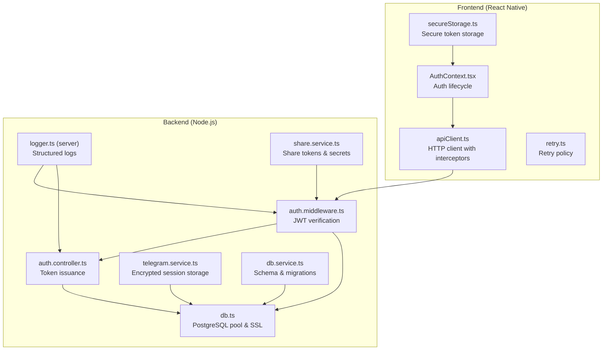
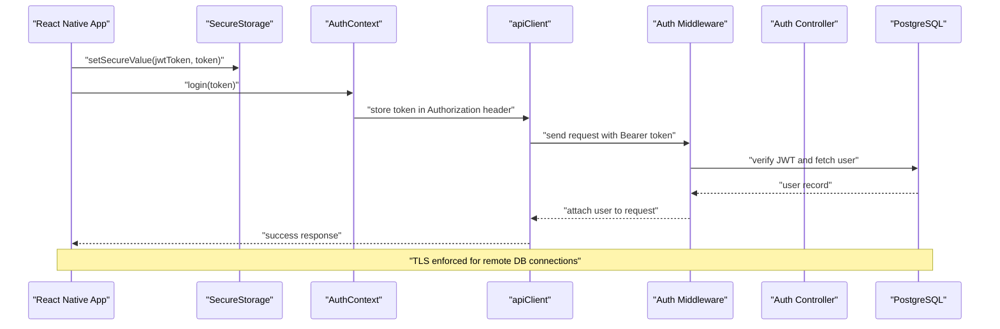
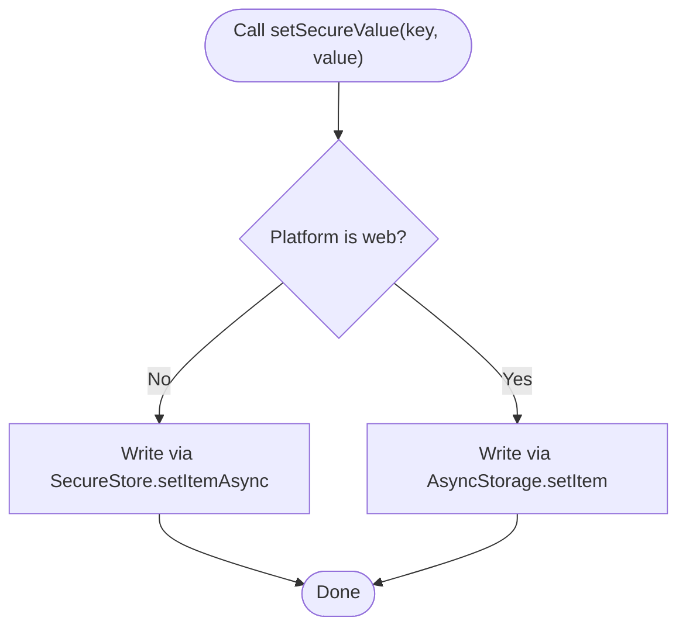
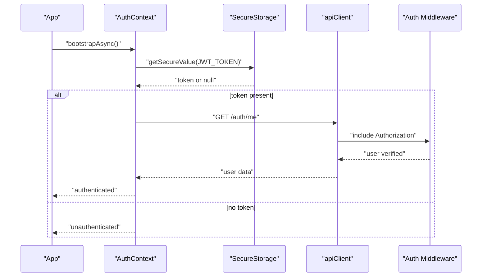
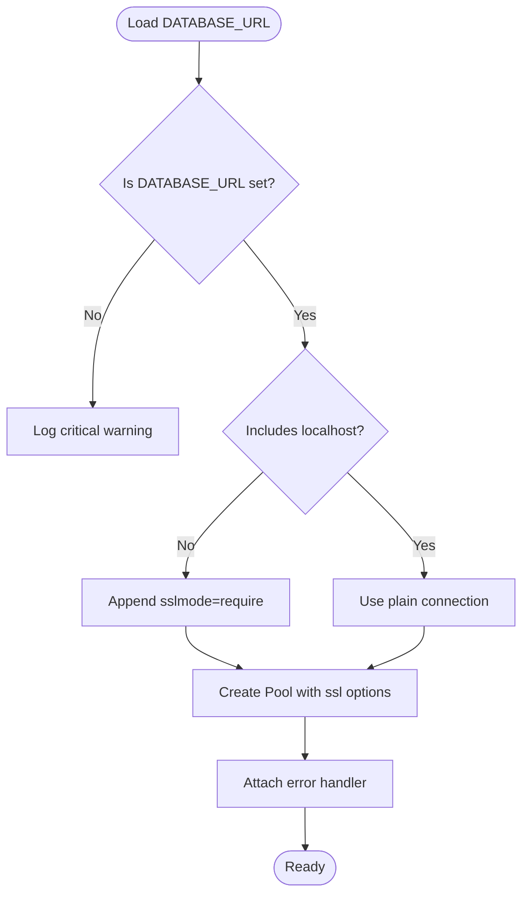
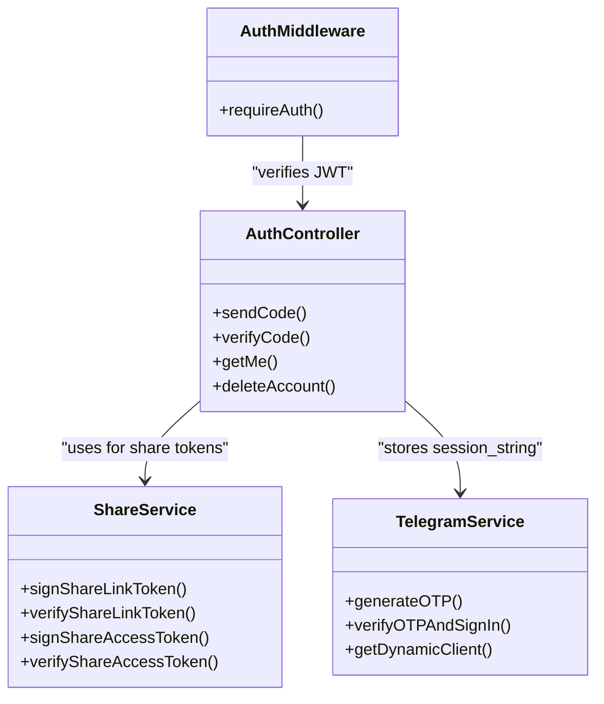
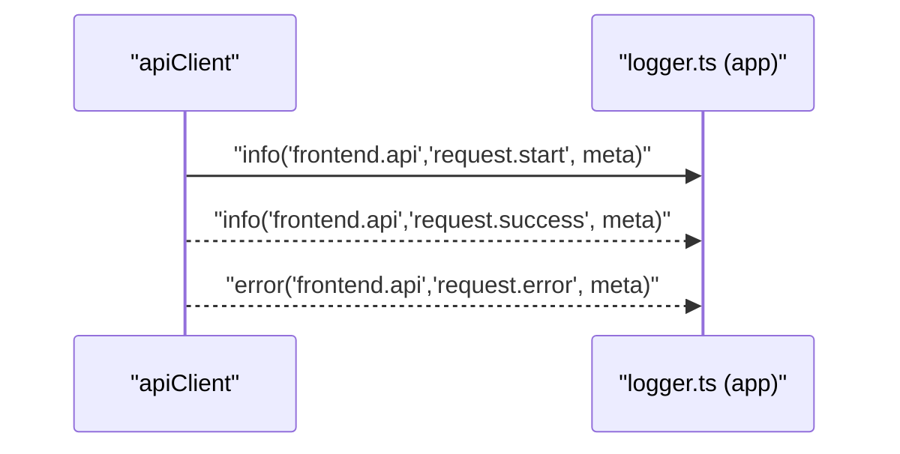
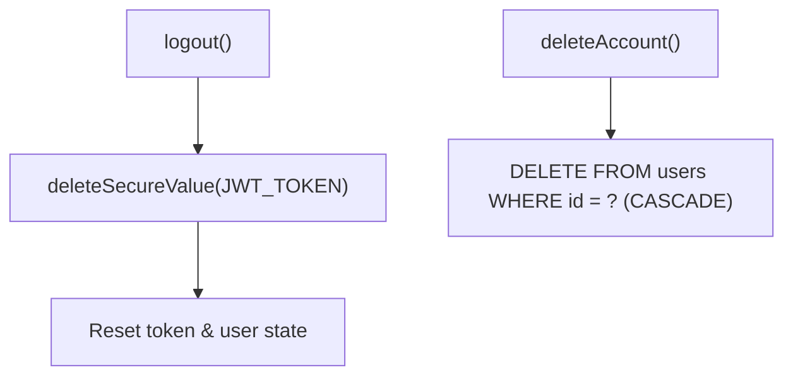
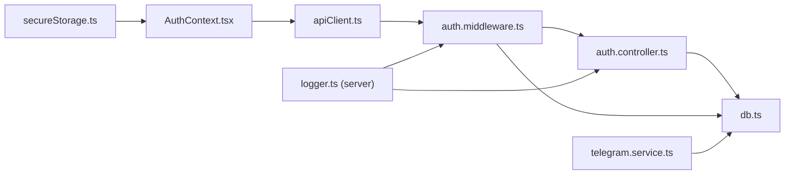

# Secure Storage and Data Encryption

<cite>
**Referenced Files in This Document**
- [secureStorage.ts](file://app/src/utils/secureStorage.ts)
- [AuthContext.tsx](file://app/src/context/AuthContext.tsx)
- [apiClient.ts](file://app/src/services/apiClient.ts)
- [db.ts](file://server/src/config/db.ts)
- [auth.controller.ts](file://server/src/controllers/auth.controller.ts)
- [auth.middleware.ts](file://server/src/middlewares/auth.middleware.ts)
- [telegram.service.ts](file://server/src/services/telegram.service.ts)
- [db.service.ts](file://server/src/services/db.service.ts)
- [logger.ts (server)](file://server/src/utils/logger.ts)
- [logger.ts (app)](file://app/src/utils/logger.ts)
- [share.service.ts](file://server/src/services/share.service.ts)
- [retry.ts](file://app/src/utils/retry.ts)
</cite>

## Table of Contents
1. [Introduction](#introduction)
2. [Project Structure](#project-structure)
3. [Core Components](#core-components)
4. [Architecture Overview](#architecture-overview)
5. [Detailed Component Analysis](#detailed-component-analysis)
6. [Dependency Analysis](#dependency-analysis)
7. [Performance Considerations](#performance-considerations)
8. [Troubleshooting Guide](#troubleshooting-guide)
9. [Conclusion](#conclusion)
10. [Appendices](#appendices)

## Introduction
This document explains the secure storage and data encryption strategies implemented in the project. It focuses on protecting sensitive data such as JWT tokens and session strings, securing database connections, managing secrets, and enabling audit logging for security events. It also covers platform-specific secure storage integrations, cross-platform compatibility, and practical guidance for extending encryption layers while maintaining data confidentiality.

## Project Structure
The secure data handling spans three primary areas:
- Frontend secure storage and token lifecycle
- Backend authentication, secrets, and database connectivity
- Audit logging and telemetry for security events

**Diagram sources**
- [secureStorage.ts](file://app/src/utils/secureStorage.ts#L1-L74)
- [AuthContext.tsx](file://app/src/context/AuthContext.tsx#L1-L98)
- [apiClient.ts](file://app/src/services/apiClient.ts#L1-L164)
- [retry.ts](file://app/src/utils/retry.ts#L1-L34)
- [db.ts](file://server/src/config/db.ts#L1-L61)
- [auth.middleware.ts](file://server/src/middlewares/auth.middleware.ts#L1-L82)
- [auth.controller.ts](file://server/src/controllers/auth.controller.ts#L1-L96)
- [telegram.service.ts](file://server/src/services/telegram.service.ts#L1-L260)
- [logger.ts (server)](file://server/src/utils/logger.ts#L1-L27)
- [share.service.ts](file://server/src/services/share.service.ts#L1-L183)
- [db.service.ts](file://server/src/services/db.service.ts#L1-L315)

**Section sources**
- [secureStorage.ts](file://app/src/utils/secureStorage.ts#L1-L74)
- [AuthContext.tsx](file://app/src/context/AuthContext.tsx#L1-L98)
- [apiClient.ts](file://app/src/services/apiClient.ts#L1-L164)
- [db.ts](file://server/src/config/db.ts#L1-L61)
- [auth.middleware.ts](file://server/src/middlewares/auth.middleware.ts#L1-L82)
- [auth.controller.ts](file://server/src/controllers/auth.controller.ts#L1-L96)
- [telegram.service.ts](file://server/src/services/telegram.service.ts#L1-L260)
- [logger.ts (server)](file://server/src/utils/logger.ts#L1-L27)
- [share.service.ts](file://server/src/services/share.service.ts#L1-L183)
- [db.service.ts](file://server/src/services/db.service.ts#L1-L315)

## Core Components
- Secure token storage on mobile:
  - Uses platform-specific secure storage on native devices and falls back to AsyncStorage on web.
  - Stores JWT tokens and refresh tokens under dedicated keys.
- Authentication lifecycle:
  - Loads tokens on startup, verifies them against the backend, and clears them on logout.
- Encrypted session storage:
  - Telegram session strings are stored in the database and never exposed to the client.
- Database connectivity:
  - Enforces TLS for remote connections and optimizes connection pooling for reliability.
- Secrets and tokens:
  - JWT secret and share/access secrets are loaded from environment variables.
- Audit logging:
  - Structured logging for frontend requests and backend operations.

**Section sources**
- [secureStorage.ts](file://app/src/utils/secureStorage.ts#L1-L74)
- [AuthContext.tsx](file://app/src/context/AuthContext.tsx#L1-L98)
- [apiClient.ts](file://app/src/services/apiClient.ts#L1-L164)
- [db.ts](file://server/src/config/db.ts#L1-L61)
- [auth.controller.ts](file://server/src/controllers/auth.controller.ts#L1-L96)
- [telegram.service.ts](file://server/src/services/telegram.service.ts#L1-L260)
- [logger.ts (server)](file://server/src/utils/logger.ts#L1-L27)
- [logger.ts (app)](file://app/src/utils/logger.ts#L1-L27)

## Architecture Overview
The system enforces layered security:
- At-rest: Telegram session strings are stored encrypted in the database; JWT tokens are stored in secure platform storage on native devices.
- In-transit: HTTPS/TLS is enforced for database connections and API communication; requests include Authorization headers.
- Secrets management: Environment variables are used for JWT and share secrets; database connection string is loaded from environment variables.
- Auditability: Structured logs capture request lifecycle and errors for security event monitoring.

**Diagram sources**
- [secureStorage.ts](file://app/src/utils/secureStorage.ts#L30-L38)
- [AuthContext.tsx](file://app/src/context/AuthContext.tsx#L62-L68)
- [apiClient.ts](file://app/src/services/apiClient.ts#L46-L52)
- [auth.middleware.ts](file://server/src/middlewares/auth.middleware.ts#L54-L81)
- [auth.controller.ts](file://server/src/controllers/auth.controller.ts#L58-L65)
- [db.ts](file://server/src/config/db.ts#L27-L37)

## Detailed Component Analysis

### Secure Storage Utility (Mobile)
- Purpose: Provide a unified interface to store sensitive data securely on native devices and as a fallback on web.
- Implementation highlights:
  - Dynamic import of secure storage only on non-web platforms.
  - Uses platform keychain/keystore on native; AsyncStorage on web.
  - Dedicated keys for JWT and refresh tokens.
- Security considerations:
  - On native, tokens are protected by the OS keychain.
  - On web, tokens are stored in browser storage; treat as least-privileged and clear promptly.

**Diagram sources**
- [secureStorage.ts](file://app/src/utils/secureStorage.ts#L30-L38)

**Section sources**
- [secureStorage.ts](file://app/src/utils/secureStorage.ts#L1-L74)

### Authentication Lifecycle and Token Management
- On app boot:
  - Reads JWT from secure storage and attempts to verify with the backend.
  - Handles transient network/server errors without clearing auth; explicitly clears on 401/403.
- During login:
  - Stores the JWT in secure storage and marks the user as authenticated.
- During logout:
  - Removes the JWT from secure storage and resets state.

**Diagram sources**
- [AuthContext.tsx](file://app/src/context/AuthContext.tsx#L25-L60)
- [secureStorage.ts](file://app/src/utils/secureStorage.ts#L43-L49)
- [apiClient.ts](file://app/src/services/apiClient.ts#L46-L52)
- [auth.middleware.ts](file://server/src/middlewares/auth.middleware.ts#L54-L81)

**Section sources**
- [AuthContext.tsx](file://app/src/context/AuthContext.tsx#L1-L98)
- [apiClient.ts](file://app/src/services/apiClient.ts#L1-L164)

### Database Connection Security and TLS
- Enforces TLS for non-local connections by appending sslmode=require when missing.
- Optimizes connection pooling for serverless environments with conservative limits and timeouts.
- Emits structured logs for connection errors and timeouts to aid incident triage.

**Diagram sources**
- [db.ts](file://server/src/config/db.ts#L6-L37)
- [db.ts](file://server/src/config/db.ts#L39-L52)

**Section sources**
- [db.ts](file://server/src/config/db.ts#L1-L61)

### Secrets and Token Issuance
- JWT secret is required for signing tokens; the server refuses to start without it.
- Share link and share access tokens use separate secrets configured via environment variables.
- Session strings for Telegram are stored in the database and never exposed to the client.

**Diagram sources**
- [auth.controller.ts](file://server/src/controllers/auth.controller.ts#L1-L96)
- [auth.middleware.ts](file://server/src/middlewares/auth.middleware.ts#L1-L82)
- [share.service.ts](file://server/src/services/share.service.ts#L62-L110)
- [telegram.service.ts](file://server/src/services/telegram.service.ts#L101-L160)

**Section sources**
- [auth.controller.ts](file://server/src/controllers/auth.controller.ts#L1-L96)
- [auth.middleware.ts](file://server/src/middlewares/auth.middleware.ts#L1-L82)
- [share.service.ts](file://server/src/services/share.service.ts#L1-L183)
- [telegram.service.ts](file://server/src/services/telegram.service.ts#L1-L260)

### Audit Logging for Security Events
- Frontend:
  - Interceptors log request start, success, and error events with correlation IDs and timing.
- Backend:
  - Structured logger emits JSON-formatted entries for info/warn/error with timestamps and scopes.
- Recommendations:
  - Forward logs to centralized logging systems.
  - Redact sensitive fields in logs.
  - Monitor for repeated failures, timeouts, and unauthorized access patterns.

**Diagram sources**
- [apiClient.ts](file://app/src/services/apiClient.ts#L87-L132)
- [logger.ts (app)](file://app/src/utils/logger.ts#L1-L27)

**Section sources**
- [apiClient.ts](file://app/src/services/apiClient.ts#L1-L164)
- [logger.ts (app)](file://app/src/utils/logger.ts#L1-L27)
- [logger.ts (server)](file://server/src/utils/logger.ts#L1-L27)

### Secure Deletion Practices
- On logout, the JWT token is removed from secure storage.
- Account deletion triggers cascading removal of user data, ensuring sensitive records are purged.

**Diagram sources**
- [AuthContext.tsx](file://app/src/context/AuthContext.tsx#L70-L76)
- [auth.controller.ts](file://server/src/controllers/auth.controller.ts#L85-L95)

**Section sources**
- [AuthContext.tsx](file://app/src/context/AuthContext.tsx#L1-L98)
- [auth.controller.ts](file://server/src/controllers/auth.controller.ts#L85-L95)

### Cross-Platform Compatibility and Platform-Specific APIs
- Mobile:
  - Secure storage uses OS keychain/keystore on native; AsyncStorage fallback on web.
- Web:
  - Tokens stored in browser storage; ensure HTTPS and secure cookies if applicable.
- Environment variables:
  - Secrets and connection strings are loaded from environment variables; validate presence early.

**Section sources**
- [secureStorage.ts](file://app/src/utils/secureStorage.ts#L1-L74)
- [db.ts](file://server/src/config/db.ts#L1-L12)

## Dependency Analysis
- Frontend depends on secure storage for token persistence and on the HTTP client for authenticated requests.
- Backend middleware validates JWT and accesses user data; controllers issue tokens and manage accounts.
- Database configuration centralizes TLS and pooling behavior; Telegram service stores session strings encrypted at rest.

**Diagram sources**
- [secureStorage.ts](file://app/src/utils/secureStorage.ts#L1-L74)
- [AuthContext.tsx](file://app/src/context/AuthContext.tsx#L1-L98)
- [apiClient.ts](file://app/src/services/apiClient.ts#L1-L164)
- [auth.middleware.ts](file://server/src/middlewares/auth.middleware.ts#L1-L82)
- [auth.controller.ts](file://server/src/controllers/auth.controller.ts#L1-L96)
- [db.ts](file://server/src/config/db.ts#L1-L61)
- [telegram.service.ts](file://server/src/services/telegram.service.ts#L1-L260)
- [logger.ts (server)](file://server/src/utils/logger.ts#L1-L27)

**Section sources**
- [secureStorage.ts](file://app/src/utils/secureStorage.ts#L1-L74)
- [AuthContext.tsx](file://app/src/context/AuthContext.tsx#L1-L98)
- [apiClient.ts](file://app/src/services/apiClient.ts#L1-L164)
- [auth.middleware.ts](file://server/src/middlewares/auth.middleware.ts#L1-L82)
- [auth.controller.ts](file://server/src/controllers/auth.controller.ts#L1-L96)
- [db.ts](file://server/src/config/db.ts#L1-L61)
- [telegram.service.ts](file://server/src/services/telegram.service.ts#L1-L260)
- [logger.ts (server)](file://server/src/utils/logger.ts#L1-L27)

## Performance Considerations
- Connection pooling:
  - Conservative max connections and short idle timeouts reduce resource pressure on serverless deployments.
- Retry strategy:
  - Exponential backoff for transient network and server errors minimizes wasted retries and improves resilience.
- Streaming:
  - Telegram downloads use chunked iteration to avoid buffering entire files in memory.

**Section sources**
- [db.ts](file://server/src/config/db.ts#L22-L37)
- [retry.ts](file://app/src/utils/retry.ts#L1-L34)
- [telegram.service.ts](file://server/src/services/telegram.service.ts#L215-L251)

## Troubleshooting Guide
- Missing secrets:
  - The server refuses to start if JWT secret is not set; ensure environment variables are configured.
- Database connectivity:
  - For remote databases, ensure sslmode=require is present in the connection string; inspect structured logs for timeout or SSL-related errors.
- Authentication failures:
  - 401/403 responses trigger automatic logout; verify token validity and server-side user existence.
- Frontend retries:
  - Network errors, 5xx responses, and timeouts are retried with exponential backoff; confirm retry thresholds and environment configuration.

**Section sources**
- [auth.controller.ts](file://server/src/controllers/auth.controller.ts#L6-L7)
- [db.ts](file://server/src/config/db.ts#L9-L12)
- [db.ts](file://server/src/config/db.ts#L39-L52)
- [auth.middleware.ts](file://server/src/middlewares/auth.middleware.ts#L54-L81)
- [apiClient.ts](file://app/src/services/apiClient.ts#L118-L127)

## Conclusion
The project implements a layered security model: secure token storage on native devices, encrypted database connections, strict JWT-based authentication, and comprehensive audit logging. By enforcing TLS, validating secrets at startup, and providing secure deletion mechanisms, it maintains confidentiality and integrity of sensitive data across platforms. Extending encryption layers—such as encrypting stored session strings at rest or adding transport-layer encryption for internal services—can further strengthen the design.

## Appendices

### Data Privacy Compliance Checklist
- Minimize data collection; retain only what is necessary.
- Encrypt at rest for sensitive fields (e.g., session strings).
- Enforce TLS in transit for all external communications.
- Implement secure deletion and data retention policies.
- Centralize and protect audit logs; redact PII.
- Regularly rotate secrets and review access controls.

### Secure Key Storage Examples
- Use platform secure storage for tokens on native devices.
- On web, store tokens in secure, same-site, HTTP-only cookies when feasible; otherwise, use browser storage with caution.
- Avoid committing secrets to version control; use environment variables or secret managers.

### Encrypted Database Connections
- Ensure DATABASE_URL includes sslmode=require for non-local deployments.
- Configure rejectUnauthorized appropriately for your environment.
- Monitor connection errors and timeouts via structured logs.

### Secure Environment Variable Handling
- Validate presence of secrets at startup and fail fast if missing.
- Restrict access to environment files and CI/CD secrets.
- Rotate secrets periodically and update deployments atomically.

### Additional Encryption Layers
- Encrypt sensitive database columns (e.g., session strings) using database-side encryption or application-side encryption with a managed key.
- Consider encrypting local caches and temporary files on disk.
- Implement transport encryption for inter-service communication if scaling horizontally.