# Security and Authentication

<cite>
**Referenced Files in This Document**
- [auth.middleware.ts](file://server/src/middlewares/auth.middleware.ts)
- [rateLimit.middleware.ts](file://server/src/middlewares/rateLimit.middleware.ts)
- [auth.controller.ts](file://server/src/controllers/auth.controller.ts)
- [telegram.service.ts](file://server/src/services/telegram.service.ts)
- [share.service.ts](file://server/src/services/share.service.ts)
- [spaces.controller.ts](file://server/src/controllers/spaces.controller.ts)
- [auth.routes.ts](file://server/src/routes/auth.routes.ts)
- [share.routes.ts](file://server/src/routes/share.routes.ts)
- [secureStorage.ts](file://app/src/utils/secureStorage.ts)
- [AuthContext.tsx](file://app/src/context/AuthContext.tsx)
- [apiClient.ts](file://app/src/services/apiClient.ts)
- [logger.ts](file://server/src/utils/logger.ts)
- [telegram.ts](file://server/src/config/telegram.ts)
- [middleware-manifest.json](file://web/.next/server/middleware-manifest.json)
- [fix_csp.js](file://server/fix_csp.js)
</cite>

## Table of Contents
1. [Introduction](#introduction)
2. [Project Structure](#project-structure)
3. [Core Components](#core-components)
4. [Architecture Overview](#architecture-overview)
5. [Detailed Component Analysis](#detailed-component-analysis)
6. [Dependency Analysis](#dependency-analysis)
7. [Performance Considerations](#performance-considerations)
8. [Troubleshooting Guide](#troubleshooting-guide)
9. [Conclusion](#conclusion)
10. [Appendices](#appendices)

## Introduction
This document focuses on security and authentication across the Teledrive backend and frontend. It explains JWT token security, Telegram API integration security, rate limiting and protection mechanisms, and secure storage of sensitive data. It also documents authentication middleware, rate limiting middleware, and secure storage utilities, along with best practices for token management, API security, encryption at rest and in transit, and audit logging. Practical examples are provided via file references and diagrams mapped to actual source code.

## Project Structure
Security-critical components are organized by responsibility:
- Backend Express server with JWT-based authentication and Telegram integration
- Rate limiting middleware for various endpoints
- Frontend secure storage and token injection utilities
- Audit logging and CSP hardening

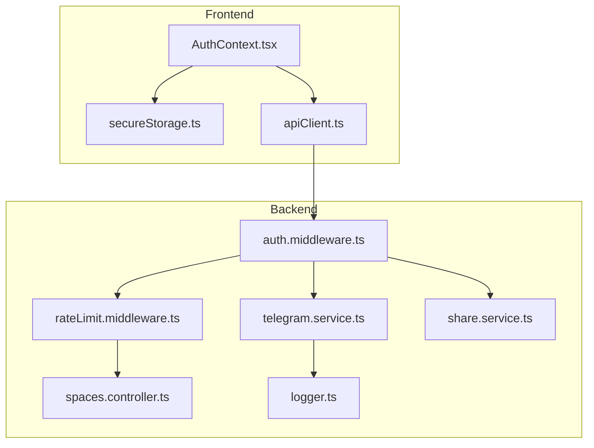

**Diagram sources**
- [AuthContext.tsx](file://app/src/context/AuthContext.tsx#L1-L98)
- [secureStorage.ts](file://app/src/utils/secureStorage.ts#L1-L74)
- [apiClient.ts](file://app/src/services/apiClient.ts#L1-L164)
- [auth.middleware.ts](file://server/src/middlewares/auth.middleware.ts#L1-L82)
- [rateLimit.middleware.ts](file://server/src/middlewares/rateLimit.middleware.ts#L1-L47)
- [telegram.service.ts](file://server/src/services/telegram.service.ts#L1-L260)
- [spaces.controller.ts](file://server/src/controllers/spaces.controller.ts#L43-L114)
- [share.service.ts](file://server/src/services/share.service.ts#L1-L183)
- [logger.ts](file://server/src/utils/logger.ts#L1-L27)

**Section sources**
- [auth.middleware.ts](file://server/src/middlewares/auth.middleware.ts#L1-L82)
- [rateLimit.middleware.ts](file://server/src/middlewares/rateLimit.middleware.ts#L1-L47)
- [secureStorage.ts](file://app/src/utils/secureStorage.ts#L1-L74)
- [AuthContext.tsx](file://app/src/context/AuthContext.tsx#L1-L98)
- [apiClient.ts](file://app/src/services/apiClient.ts#L1-L164)
- [telegram.service.ts](file://server/src/services/telegram.service.ts#L1-L260)
- [spaces.controller.ts](file://server/src/controllers/spaces.controller.ts#L43-L114)
- [share.service.ts](file://server/src/services/share.service.ts#L1-L183)
- [logger.ts](file://server/src/utils/logger.ts#L1-L27)

## Core Components
- Authentication middleware validates Bearer tokens and supports share-link bypass for public routes.
- Rate limiting middleware enforces strict limits for password attempts, public views, downloads, shared spaces, uploads, and signed downloads.
- Telegram service integrates securely with GramJS, manages persistent client pools, and stores session strings encrypted in the database.
- Secure storage utilities persist tokens using platform-specific secure stores on native and AsyncStorage fallback on web.
- Frontend API client injects Authorization headers and logs requests/responses for observability.
- Audit logging utilities centralize structured logs for security events.

**Section sources**
- [auth.middleware.ts](file://server/src/middlewares/auth.middleware.ts#L1-L82)
- [rateLimit.middleware.ts](file://server/src/middlewares/rateLimit.middleware.ts#L1-L47)
- [telegram.service.ts](file://server/src/services/telegram.service.ts#L1-L260)
- [secureStorage.ts](file://app/src/utils/secureStorage.ts#L1-L74)
- [apiClient.ts](file://app/src/services/apiClient.ts#L1-L164)
- [logger.ts](file://server/src/utils/logger.ts#L1-L27)

## Architecture Overview
The system enforces authentication at the gateway and applies granular rate limits per endpoint category. Telegram integration is encapsulated behind secure services with persistent client pooling and robust error handling. Tokens are stored securely on the device and injected automatically into outgoing requests.

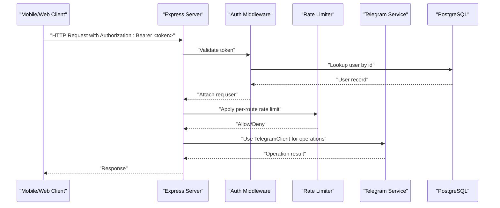

**Diagram sources**
- [auth.middleware.ts](file://server/src/middlewares/auth.middleware.ts#L19-L81)
- [rateLimit.middleware.ts](file://server/src/middlewares/rateLimit.middleware.ts#L1-L47)
- [telegram.service.ts](file://server/src/services/telegram.service.ts#L57-L97)
- [auth.routes.ts](file://server/src/routes/auth.routes.ts#L1-L13)
- [share.routes.ts](file://server/src/routes/share.routes.ts#L1-L12)

## Detailed Component Analysis

### Authentication Middleware
The middleware enforces JWT-based authentication and selectively bypasses it for valid share-link tokens on public routes. It verifies tokens against the configured secret and enriches the request with user context.

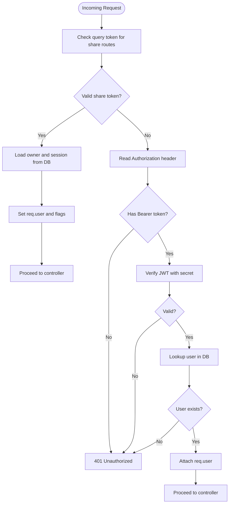

**Diagram sources**
- [auth.middleware.ts](file://server/src/middlewares/auth.middleware.ts#L19-L81)

**Section sources**
- [auth.middleware.ts](file://server/src/middlewares/auth.middleware.ts#L1-L82)

### Rate Limiting Middleware
Multiple rate limiters protect different access patterns:
- Password attempts throttling
- Public view and download throttling
- Shared space access and upload limits
- Signed download attempts

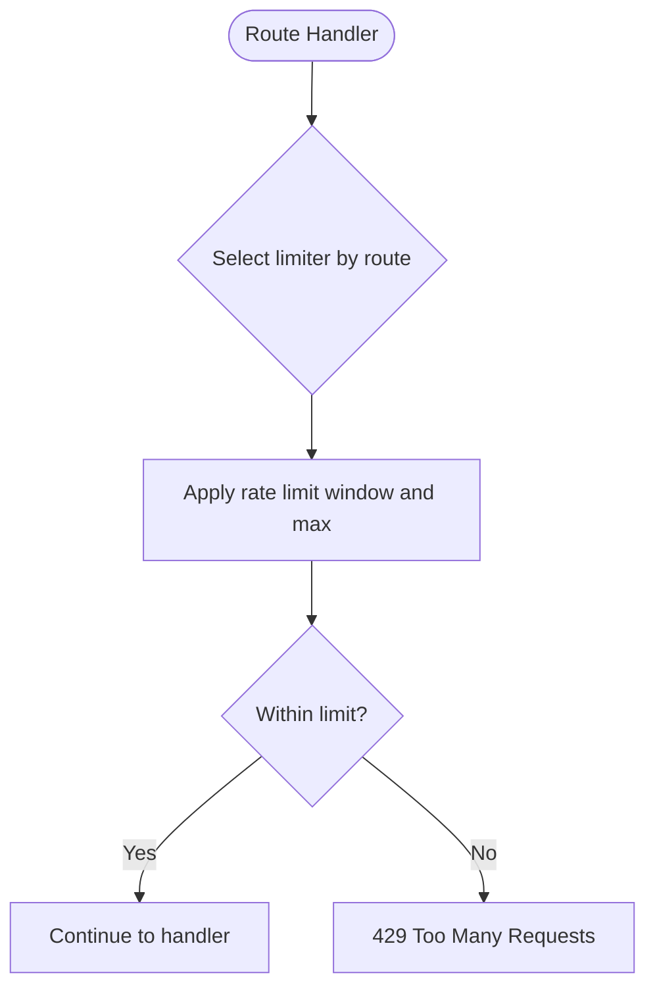

**Diagram sources**
- [rateLimit.middleware.ts](file://server/src/middlewares/rateLimit.middleware.ts#L4-L46)

**Section sources**
- [rateLimit.middleware.ts](file://server/src/middlewares/rateLimit.middleware.ts#L1-L47)

### Telegram API Integration Security
The Telegram service maintains a persistent client pool with TTL and auto-reconnect, stores session strings encrypted in the database, and avoids exposing API credentials to clients. It streams file downloads progressively to avoid memory pressure.

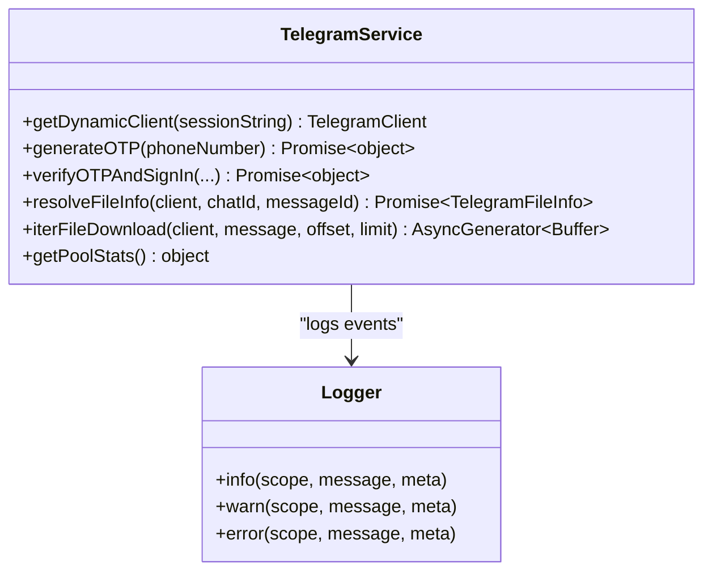

**Diagram sources**
- [telegram.service.ts](file://server/src/services/telegram.service.ts#L57-L97)
- [logger.ts](file://server/src/utils/logger.ts#L21-L25)

**Section sources**
- [telegram.service.ts](file://server/src/services/telegram.service.ts#L1-L260)
- [logger.ts](file://server/src/utils/logger.ts#L1-L27)
- [telegram.ts](file://server/src/config/telegram.ts#L1-L29)

### Secure Storage Implementation
The frontend stores tokens securely on native devices using platform-specific secure stores and falls back to AsyncStorage on web. It exposes helpers to set, get, and delete tokens and defines secure key constants.

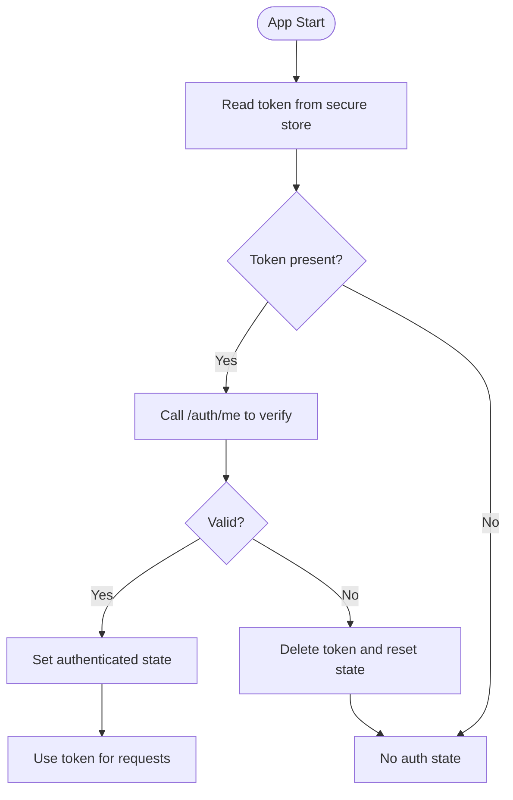

**Diagram sources**
- [AuthContext.tsx](file://app/src/context/AuthContext.tsx#L25-L60)
- [secureStorage.ts](file://app/src/utils/secureStorage.ts#L30-L60)

**Section sources**
- [secureStorage.ts](file://app/src/utils/secureStorage.ts#L1-L74)
- [AuthContext.tsx](file://app/src/context/AuthContext.tsx#L1-L98)
- [apiClient.ts](file://app/src/services/apiClient.ts#L46-L74)

### Share Link and Access Tokens
Share links and access tokens use separate secrets and short-lived expirations. The system signs and verifies tokens for both link generation and access control, with helpers to derive base URLs and normalize paths.

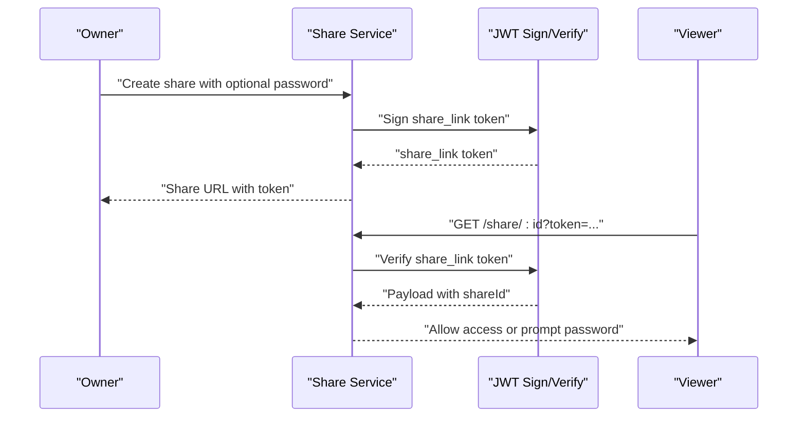

**Diagram sources**
- [share.service.ts](file://server/src/services/share.service.ts#L62-L100)

**Section sources**
- [share.service.ts](file://server/src/services/share.service.ts#L1-L183)

### Shared Spaces Access Control
Shared spaces use dedicated access tokens and password checks. The controller signs space access tokens and writes non-blocking access logs for auditability.

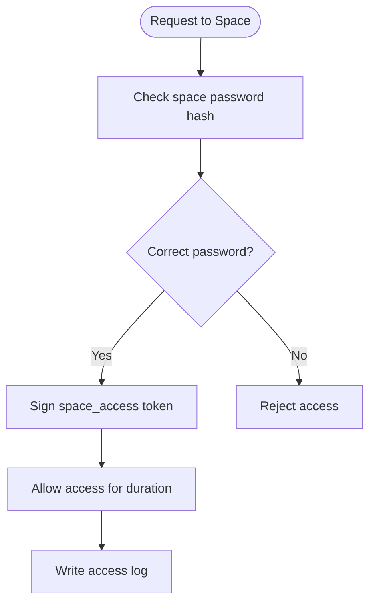

**Diagram sources**
- [spaces.controller.ts](file://server/src/controllers/spaces.controller.ts#L76-L106)

**Section sources**
- [spaces.controller.ts](file://server/src/controllers/spaces.controller.ts#L43-L114)

### Audit Logging
Structured logging is centralized to capture request lifecycle, errors, warnings, and security-relevant events. This enables monitoring and incident response.

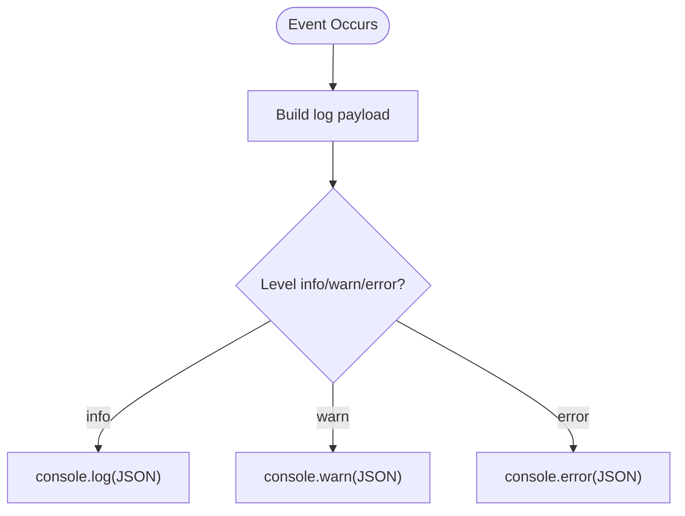

**Diagram sources**
- [logger.ts](file://server/src/utils/logger.ts#L3-L25)

**Section sources**
- [logger.ts](file://server/src/utils/logger.ts#L1-L27)

### API Client and Request Injection
The frontend API client injects Authorization headers automatically, logs request lifecycle, and retries transient failures with exponential backoff.

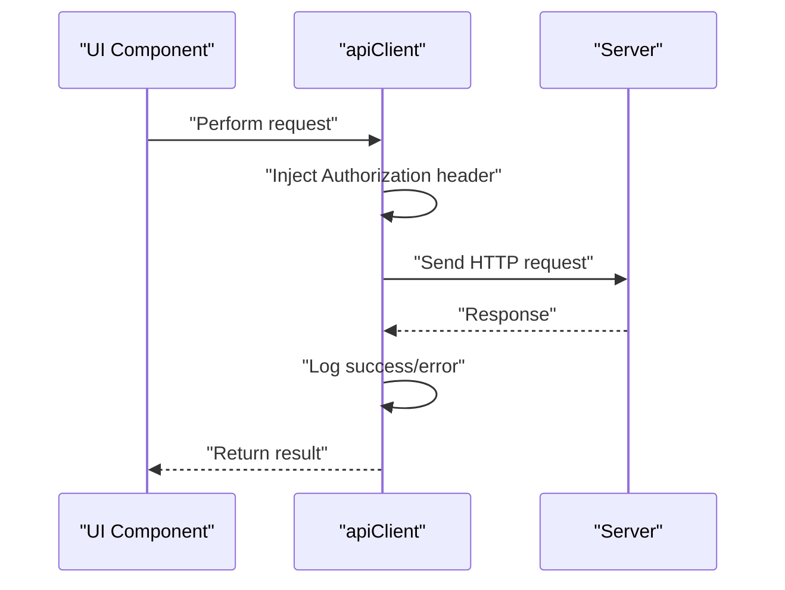

**Diagram sources**
- [apiClient.ts](file://app/src/services/apiClient.ts#L46-L132)

**Section sources**
- [apiClient.ts](file://app/src/services/apiClient.ts#L1-L164)

## Dependency Analysis
Security depends on correct configuration of secrets, rate limiters, and middleware ordering. The following diagram highlights key dependencies.

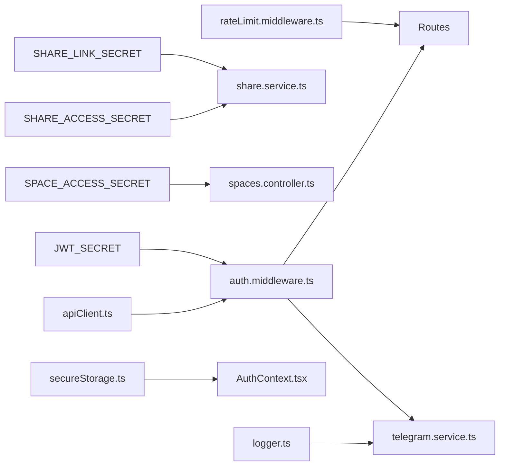

**Diagram sources**
- [auth.middleware.ts](file://server/src/middlewares/auth.middleware.ts#L5-L6)
- [share.service.ts](file://server/src/services/share.service.ts#L33-L34)
- [spaces.controller.ts](file://server/src/controllers/spaces.controller.ts#L65-L66)
- [rateLimit.middleware.ts](file://server/src/middlewares/rateLimit.middleware.ts#L1-L47)
- [auth.routes.ts](file://server/src/routes/auth.routes.ts#L1-L13)
- [share.routes.ts](file://server/src/routes/share.routes.ts#L1-L12)
- [telegram.service.ts](file://server/src/services/telegram.service.ts#L1-L260)
- [secureStorage.ts](file://app/src/utils/secureStorage.ts#L1-L74)
- [AuthContext.tsx](file://app/src/context/AuthContext.tsx#L1-L98)
- [apiClient.ts](file://app/src/services/apiClient.ts#L1-L164)
- [logger.ts](file://server/src/utils/logger.ts#L1-L27)

**Section sources**
- [auth.middleware.ts](file://server/src/middlewares/auth.middleware.ts#L1-L82)
- [share.service.ts](file://server/src/services/share.service.ts#L1-L183)
- [spaces.controller.ts](file://server/src/controllers/spaces.controller.ts#L43-L114)
- [rateLimit.middleware.ts](file://server/src/middlewares/rateLimit.middleware.ts#L1-L47)
- [auth.routes.ts](file://server/src/routes/auth.routes.ts#L1-L13)
- [share.routes.ts](file://server/src/routes/share.routes.ts#L1-L12)
- [telegram.service.ts](file://server/src/services/telegram.service.ts#L1-L260)
- [secureStorage.ts](file://app/src/utils/secureStorage.ts#L1-L74)
- [AuthContext.tsx](file://app/src/context/AuthContext.tsx#L1-L98)
- [apiClient.ts](file://app/src/services/apiClient.ts#L1-L164)
- [logger.ts](file://server/src/utils/logger.ts#L1-L27)

## Performance Considerations
- Use persistent Telegram client pools with TTL to reduce connection overhead during streaming.
- Prefer progressive file downloads to avoid memory spikes.
- Tune rate limiter windows and max values to balance user experience and abuse prevention.
- Centralized logging should avoid heavy payloads to prevent I/O bottlenecks.

[No sources needed since this section provides general guidance]

## Troubleshooting Guide
Common issues and mitigations:
- Missing JWT_SECRET or SHARE_* secrets cause fatal startup or runtime failures. Ensure environment variables are set and validated early.
- Invalid token payloads or missing Authorization headers result in 401 responses. Verify client-side token injection and refresh flows.
- Telegram connectivity failures indicate expired or revoked sessions; the service evicts clients and suggests re-authentication.
- Rate limit exceeded responses require adjusting client-side retry/backoff or reducing request frequency.
- Web CSP violations can be resolved by applying nonce-based CSP directives as demonstrated in the repository’s CSP fix script.

**Section sources**
- [auth.middleware.ts](file://server/src/middlewares/auth.middleware.ts#L5-L6)
- [share.service.ts](file://server/src/services/share.service.ts#L33-L34)
- [telegram.service.ts](file://server/src/services/telegram.service.ts#L42-L47)
- [rateLimit.middleware.ts](file://server/src/middlewares/rateLimit.middleware.ts#L4-L46)
- [fix_csp.js](file://server/fix_csp.js#L1-L38)

## Conclusion
Teledrive implements layered security with JWT-based authentication, share-link tokens, strict rate limiting, secure storage on devices, and robust Telegram integration with persistent client pools. Centralized logging and CSP hardening further strengthen the system. Adhering to the best practices and configurations outlined here will maintain strong security posture while preserving usability.

[No sources needed since this section summarizes without analyzing specific files]

## Appendices

### Best Practices for Token Management
- Rotate secrets regularly and enforce separate secrets for different token types.
- Use short-lived access tokens and refresh tokens via secure storage.
- Invalidate sessions on logout and handle transient network errors without clearing auth state prematurely.

**Section sources**
- [auth.middleware.ts](file://server/src/middlewares/auth.middleware.ts#L5-L6)
- [share.service.ts](file://server/src/services/share.service.ts#L33-L34)
- [secureStorage.ts](file://app/src/utils/secureStorage.ts#L1-L74)
- [AuthContext.tsx](file://app/src/context/AuthContext.tsx#L70-L76)

### API Security Measures
- Enforce HTTPS in production and validate API credentials server-side.
- Sanitize and normalize inputs (paths, sorts) to prevent injection and traversal.
- Use separate rate limiters for different resource categories.

**Section sources**
- [share.service.ts](file://server/src/services/share.service.ts#L141-L157)
- [rateLimit.middleware.ts](file://server/src/middlewares/rateLimit.middleware.ts#L1-L47)

### Data Encryption at Rest and in Transit
- Encrypt Telegram session strings in the database; never expose raw session strings to clients.
- Enforce TLS for all external communications and internal transport.
- Avoid storing sensitive data in browser storage; rely on secure stores on native platforms.

**Section sources**
- [telegram.service.ts](file://server/src/services/telegram.service.ts#L6-L11)
- [secureStorage.ts](file://app/src/utils/secureStorage.ts#L7-L9)

### Audit Logging Implementation
- Emit structured logs for authentication, authorization, rate limit events, and Telegram client lifecycle.
- Include correlation IDs and timestamps for traceability.

**Section sources**
- [logger.ts](file://server/src/utils/logger.ts#L1-L27)
- [telegram.service.ts](file://server/src/services/telegram.service.ts#L42-L47)

### Penetration Testing Considerations
- Validate JWT signature verification and secret strength.
- Test brute-force protections for password endpoints and shared space access.
- Verify CSP and header security policies are applied consistently.

**Section sources**
- [auth.middleware.ts](file://server/src/middlewares/auth.middleware.ts#L62-L80)
- [rateLimit.middleware.ts](file://server/src/middlewares/rateLimit.middleware.ts#L4-L46)
- [fix_csp.js](file://server/fix_csp.js#L10-L24)

### Security Monitoring Strategies
- Monitor rate limit triggers and repeated failures for potential abuse.
- Alert on repeated Telegram client eviction and reconnect failures.
- Track access logs for shared spaces and suspicious activities.

**Section sources**
- [spaces.controller.ts](file://server/src/controllers/spaces.controller.ts#L97-L106)
- [telegram.service.ts](file://server/src/services/telegram.service.ts#L42-L47)