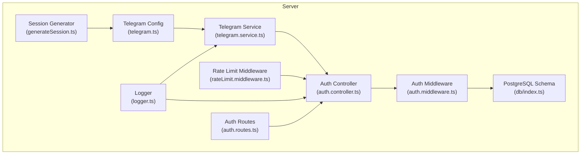
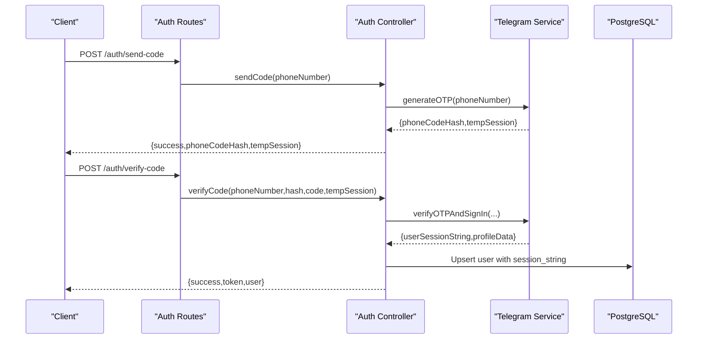
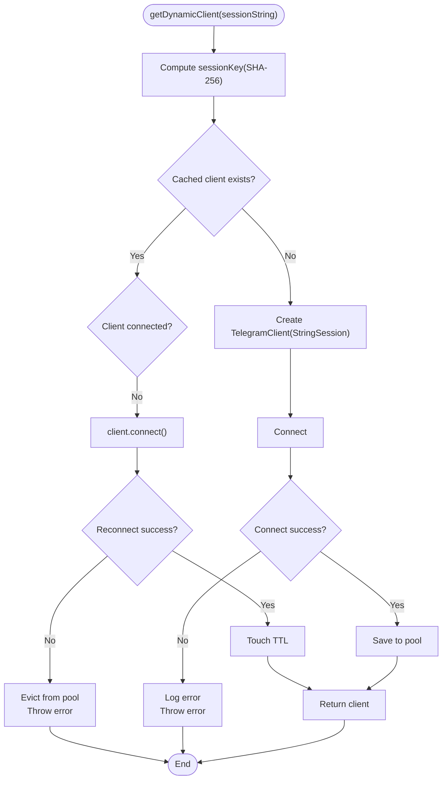
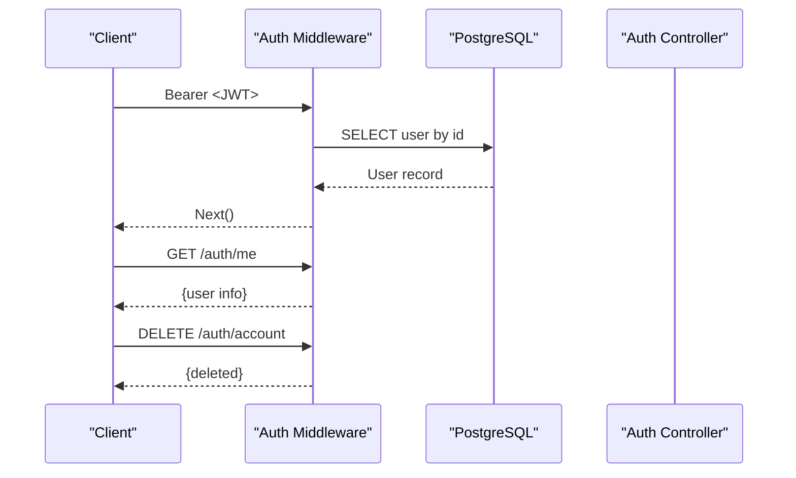
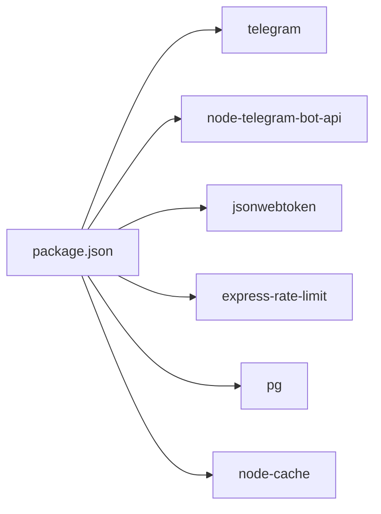

# Telegram API Integration Security

<cite>
**Referenced Files in This Document**
- [telegram.ts](file://server/src/config/telegram.ts)
- [telegram.service.ts](file://server/src/services/telegram.service.ts)
- [auth.controller.ts](file://server/src/controllers/auth.controller.ts)
- [auth.middleware.ts](file://server/src/middlewares/auth.middleware.ts)
- [rateLimit.middleware.ts](file://server/src/middlewares/rateLimit.middleware.ts)
- [db/index.ts](file://server/src/db/index.ts)
- [logger.ts](file://server/src/utils/logger.ts)
- [generateSession.ts](file://server/src/generateSession.ts)
- [auth.routes.ts](file://server/src/routes/auth.routes.ts)
- [package.json](file://server/package.json)
</cite>

## Table of Contents
1. [Introduction](#introduction)
2. [Project Structure](#project-structure)
3. [Core Components](#core-components)
4. [Architecture Overview](#architecture-overview)
5. [Detailed Component Analysis](#detailed-component-analysis)
6. [Dependency Analysis](#dependency-analysis)
7. [Performance Considerations](#performance-considerations)
8. [Troubleshooting Guide](#troubleshooting-guide)
9. [Conclusion](#conclusion)
10. [Appendices](#appendices)

## Introduction
This document focuses on Telegram API integration security within the backend server. It explains how Telegram bot tokens and session strings are handled, how authentication is performed, and how secure storage and rate limiting protect the system. It also covers session synchronization with the local database, secure token exchange mechanisms, and operational monitoring. Guidance is provided for additional Telegram-specific security measures and API usage pattern monitoring.

## Project Structure
The Telegram integration resides in the server module and consists of:
- Configuration for Telegram client initialization
- Service layer for Telegram operations, including client pooling, OTP-based login, and progressive file streaming
- Authentication controller and middleware for JWT-based access and shared-link token bypass
- Rate limiting middleware for protecting sensitive endpoints
- Local PostgreSQL database schema for storing user Telegram session strings
- Logging utilities for audit trails
- A CLI script to generate session strings during initial setup

**Diagram sources**
- [telegram.ts](file://server/src/config/telegram.ts#L1-L29)
- [telegram.service.ts](file://server/src/services/telegram.service.ts#L1-L260)
- [auth.controller.ts](file://server/src/controllers/auth.controller.ts#L1-L96)
- [auth.middleware.ts](file://server/src/middlewares/auth.middleware.ts#L1-L82)
- [rateLimit.middleware.ts](file://server/src/middlewares/rateLimit.middleware.ts#L1-L47)
- [db/index.ts](file://server/src/db/index.ts#L1-L56)
- [logger.ts](file://server/src/utils/logger.ts#L1-L27)
- [generateSession.ts](file://server/src/generateSession.ts#L1-L36)
- [auth.routes.ts](file://server/src/routes/auth.routes.ts#L1-L13)

**Section sources**
- [telegram.ts](file://server/src/config/telegram.ts#L1-L29)
- [telegram.service.ts](file://server/src/services/telegram.service.ts#L1-L260)
- [auth.controller.ts](file://server/src/controllers/auth.controller.ts#L1-L96)
- [auth.middleware.ts](file://server/src/middlewares/auth.middleware.ts#L1-L82)
- [rateLimit.middleware.ts](file://server/src/middlewares/rateLimit.middleware.ts#L1-L47)
- [db/index.ts](file://server/src/db/index.ts#L1-L56)
- [logger.ts](file://server/src/utils/logger.ts#L1-L27)
- [generateSession.ts](file://server/src/generateSession.ts#L1-L36)
- [auth.routes.ts](file://server/src/routes/auth.routes.ts#L1-L13)

## Core Components
- Telegram client configuration and connection management
- Telegram service with client pooling, OTP-based login, and progressive file streaming
- Authentication controller and middleware for JWT and shared-link token access
- Rate limiting for sensitive operations
- PostgreSQL schema for secure storage of session strings
- Logging for audit and monitoring
- Session generation utility for initial setup

Security highlights:
- Telegram API ID and hash are loaded from environment variables and never exposed to clients.
- Session strings are stored encrypted in the database and never returned to clients.
- Client pooling reduces repeated connections and supports auto-reconnect with eviction on expiration.
- JWT-based authentication with optional shared-link token bypass for public downloads.
- Rate limiting protects against brute force and abuse.

**Section sources**
- [telegram.ts](file://server/src/config/telegram.ts#L1-L29)
- [telegram.service.ts](file://server/src/services/telegram.service.ts#L1-L260)
- [auth.controller.ts](file://server/src/controllers/auth.controller.ts#L1-L96)
- [auth.middleware.ts](file://server/src/middlewares/auth.middleware.ts#L1-L82)
- [rateLimit.middleware.ts](file://server/src/middlewares/rateLimit.middleware.ts#L1-L47)
- [db/index.ts](file://server/src/db/index.ts#L1-L56)
- [logger.ts](file://server/src/utils/logger.ts#L1-L27)
- [generateSession.ts](file://server/src/generateSession.ts#L1-L36)

## Architecture Overview
The Telegram integration follows a layered approach:
- Configuration layer initializes the Telegram client using environment variables and a session string.
- Service layer manages client lifecycle, OTP-based login, and streaming downloads.
- Controller layer handles authentication requests and user profile retrieval.
- Middleware enforces JWT-based access and optional shared-link token bypass.
- Database stores user records with encrypted session strings.
- Rate limiting protects sensitive endpoints.
- Logger records events for auditing.

**Diagram sources**
- [auth.routes.ts](file://server/src/routes/auth.routes.ts#L1-L13)
- [auth.controller.ts](file://server/src/controllers/auth.controller.ts#L1-L96)
- [telegram.service.ts](file://server/src/services/telegram.service.ts#L101-L160)
- [db/index.ts](file://server/src/db/index.ts#L14-L22)

## Detailed Component Analysis

### Telegram Client Configuration and Connection
- Loads Telegram API ID and hash from environment variables.
- Initializes a Telegram client with a StringSession derived from the stored session string.
- Attempts connection and checks authorization state; logs outcomes.

Security considerations:
- API ID and hash are never exposed to clients.
- Session string is kept in-memory and not logged.

**Section sources**
- [telegram.ts](file://server/src/config/telegram.ts#L1-L29)

### Telegram Service: Client Pooling, OTP, and Streaming
- Client pooling with TTL and eviction on expiration.
- Session key derived from SHA-256 fingerprint of session string for pooling.
- Auto-reconnect for cached clients; eviction on reconnect failure.
- OTP generation and sign-in flow with temporary session handling.
- Progressive file download using iterDownload for streaming without buffering.

Security and performance:
- Client reuse reduces overhead and improves responsiveness.
- Iterative download prevents memory spikes and supports range requests.
- Session eviction ensures stale or revoked sessions are removed.

**Diagram sources**
- [telegram.service.ts](file://server/src/services/telegram.service.ts#L57-L97)

**Section sources**
- [telegram.service.ts](file://server/src/services/telegram.service.ts#L1-L260)

### Authentication Controller and Middleware
- Authentication controller:
  - OTP request endpoint returns phoneCodeHash and a temporary session string.
  - OTP verification endpoint signs in the user, upserts session string, and issues JWT.
  - Protected endpoints for user info and account deletion.
- Authentication middleware:
  - Supports shared-link token bypass for public downloads/thumbnails.
  - Standard JWT verification and user lookup from the database.
  - Attaches user context to the request for downstream handlers.

Security controls:
- JWT secret must be configured; otherwise server startup fails.
- Shared-link token bypass queries the database for owner session string.
- User session string is stored in the database and retrieved only when needed.

**Diagram sources**
- [auth.middleware.ts](file://server/src/middlewares/auth.middleware.ts#L19-L81)
- [auth.controller.ts](file://server/src/controllers/auth.controller.ts#L71-L96)
- [db/index.ts](file://server/src/db/index.ts#L14-L22)

**Section sources**
- [auth.controller.ts](file://server/src/controllers/auth.controller.ts#L1-L96)
- [auth.middleware.ts](file://server/src/middlewares/auth.middleware.ts#L1-L82)
- [db/index.ts](file://server/src/db/index.ts#L1-L56)

### Rate Limiting for Telegram Operations
- Dedicated rate limiters for share password attempts, public views, downloads, shared space access, uploads, and signed downloads.
- Configured windows and maximum attempts per window to prevent abuse.

Security benefits:
- Limits brute-force attempts on password-protected shares.
- Controls public view and download rates to mitigate scraping.

**Section sources**
- [rateLimit.middleware.ts](file://server/src/middlewares/rateLimit.middleware.ts#L1-L47)

### Secure Storage of Session Strings
- PostgreSQL schema stores user session strings in the users table.
- Session strings are never returned to clients; only used server-side for Telegram operations.
- Uppercase environment variables are used for secrets (TELEGRAM_API_ID, TELEGRAM_API_HASH, TELEGRAM_SESSION, JWT_SECRET).

Best practices:
- Store secrets in environment variables, not in code or logs.
- Rotate secrets periodically and revoke compromised sessions.
- Restrict database access and enable backups with encryption.

**Section sources**
- [db/index.ts](file://server/src/db/index.ts#L14-L22)
- [telegram.ts](file://server/src/config/telegram.ts#L7-L14)

### Session String Generation and Initial Setup
- A CLI script generates a session string after prompting for phone number, optional 2FA password, and OTP.
- Prints the session string for secure copy and suggests adding it to the environment.

Security guidance:
- Run the generator in a secure environment.
- Immediately store the session string in environment variables and remove from terminal history.
- Avoid committing session strings to version control.

**Section sources**
- [generateSession.ts](file://server/src/generateSession.ts#L1-L36)

### Audit Logging and Monitoring
- Centralized logger writes structured JSON logs with timestamps, levels, scopes, messages, and metadata.
- Used extensively in Telegram service and authentication flows for audit trails.

Monitoring recommendations:
- Forward logs to a centralized logging system.
- Alert on frequent reconnect failures, pool evictions, and authentication errors.
- Correlate Telegram operations with user actions in the application.

**Section sources**
- [logger.ts](file://server/src/utils/logger.ts#L1-L27)
- [telegram.service.ts](file://server/src/services/telegram.service.ts#L42-L47)
- [auth.controller.ts](file://server/src/controllers/auth.controller.ts#L16-L31)

## Dependency Analysis
External dependencies relevant to Telegram integration:
- telegram: Telegram client library for MTProto communication
- node-telegram-bot-api: Telegram Bot API client (may be used for bot features)
- jsonwebtoken: JWT signing and verification for authentication
- express-rate-limit: Rate limiting for HTTP endpoints
- pg: PostgreSQL client for secure session storage
- node-cache: In-memory client pooling with TTL

**Diagram sources**
- [package.json](file://server/package.json#L19-L41)

**Section sources**
- [package.json](file://server/package.json#L1-L57)

## Performance Considerations
- Client pooling with TTL and eviction prevents resource leaks and supports auto-reconnect.
- Progressive file streaming avoids buffering entire files in memory.
- Connection retries and request retries improve resilience under network variability.
- WebSocket usage disabled for large uploads to prevent timeouts.

Recommendations:
- Monitor pool statistics and adjust TTL based on traffic patterns.
- Tune chunk sizes for iterDownload to balance latency and throughput.
- Apply rate limiting to protect upstream Telegram APIs from excessive requests.

**Section sources**
- [telegram.service.ts](file://server/src/services/telegram.service.ts#L35-L47)
- [telegram.service.ts](file://server/src/services/telegram.service.ts#L215-L251)

## Troubleshooting Guide
Common issues and resolutions:
- Telegram connection failures:
  - Verify TELEGRAM_API_ID and TELEGRAM_API_HASH environment variables.
  - Check client connectivity and reconnection logs.
  - Evict pooled clients on reconnect failure and prompt user to re-authenticate.
- Authentication errors:
  - Ensure JWT_SECRET is configured; server startup fails if missing.
  - Validate bearer token format and payload.
  - Confirm user exists in the database and session string is present.
- Rate limit exceeded:
  - Review rate limiter configurations and adjust windows or limits as needed.
  - Monitor shared-link token bypass usage to prevent abuse.

Operational checks:
- Inspect logs for pool eviction and reconnect failure events.
- Validate database schema initialization and table creation.

**Section sources**
- [telegram.ts](file://server/src/config/telegram.ts#L16-L28)
- [auth.middleware.ts](file://server/src/middlewares/auth.middleware.ts#L5-L6)
- [auth.middleware.ts](file://server/src/middlewares/auth.middleware.ts#L54-L81)
- [rateLimit.middleware.ts](file://server/src/middlewares/rateLimit.middleware.ts#L1-L47)
- [db/index.ts](file://server/src/db/index.ts#L12-L53)

## Conclusion
The Telegram integration employs robust security measures: environment-based configuration, encrypted session storage, client pooling with auto-reconnect, JWT-based authentication with shared-link bypass, and rate limiting. Logging enables comprehensive audit trails. Together, these practices mitigate risks associated with unauthorized access, session compromise, and API abuse while maintaining performance and scalability.

## Appendices

### Secure Bot Configuration Checklist
- Set TELEGRAM_API_ID and TELEGRAM_API_HASH via environment variables.
- Store TELEGRAM_SESSION securely and avoid exposing it.
- Configure JWT_SECRET and ensure it is strong and rotated periodically.
- Use HTTPS and restrict CORS origins.
- Enable rate limiting for sensitive endpoints.

### Webhook Security and Message Validation
- Validate webhook signatures using shared secrets.
- Verify origin and content-type headers.
- Reject malformed or unsigned payloads.
- Log and monitor suspicious activities.

### API Rate Limiting Guidelines
- Apply distinct limits for OTP requests, downloads, and uploads.
- Enforce sliding window policies and per-IP quotas.
- Provide clear error messages without leaking internal details.

### Session Synchronization and Token Exchange
- On successful OTP verification, persist session string in the database.
- Retrieve session string server-side for Telegram operations.
- Issue JWT tokens for authenticated access; invalidate on logout or account deletion.

### Additional Telegram-Specific Security Measures
- Monitor Telegram API response codes and error patterns.
- Implement circuit breaker logic for upstream failures.
- Use separate API credentials for development and production.
- Regularly review and prune expired or unused sessions.