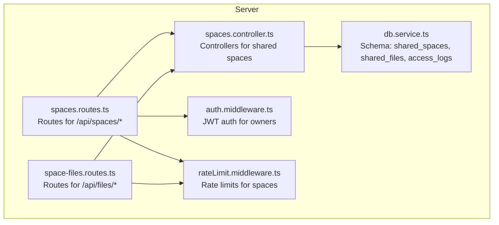
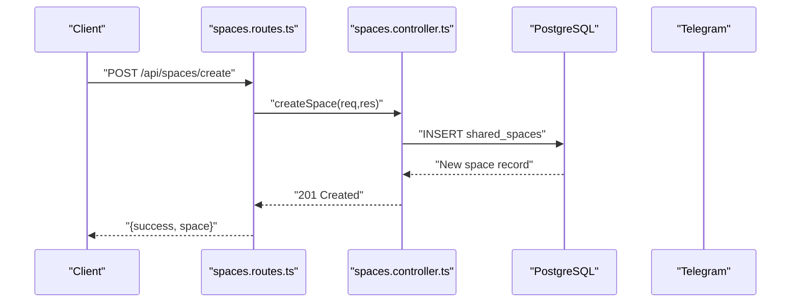
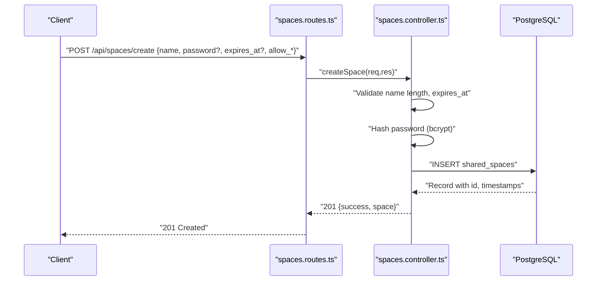
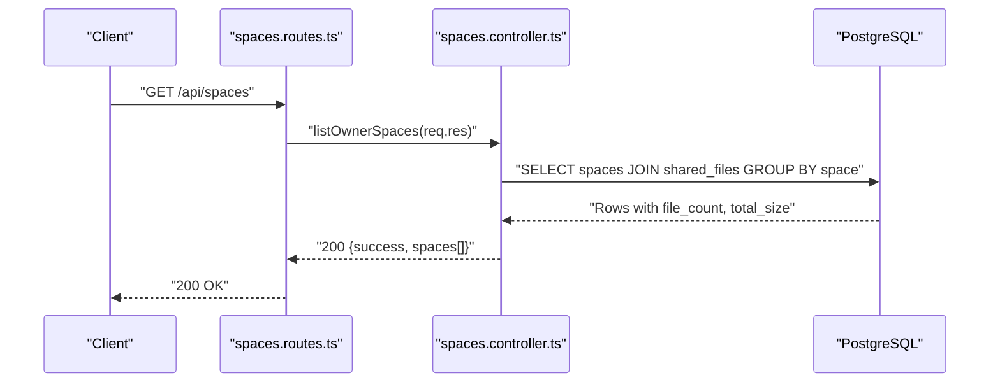
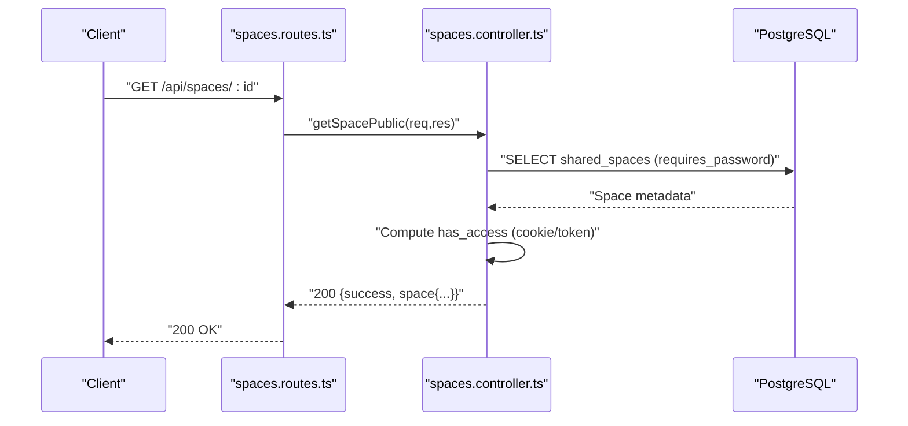
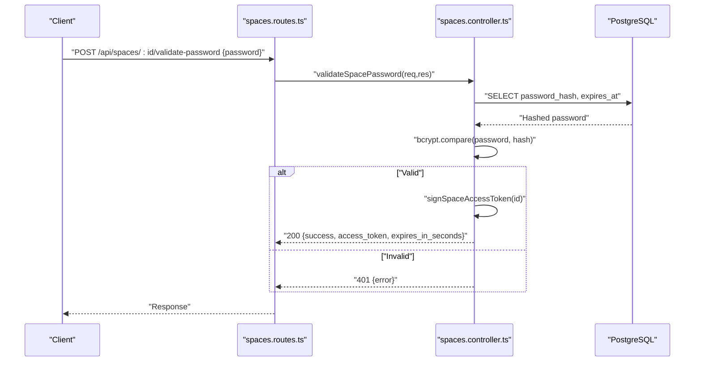
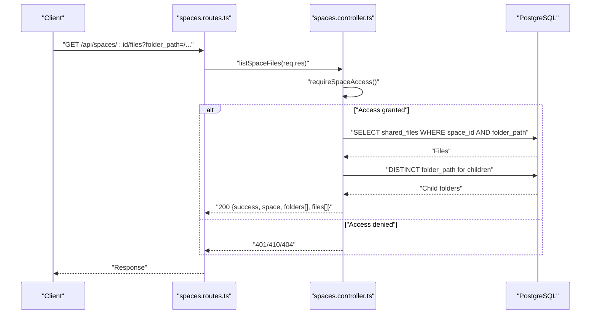
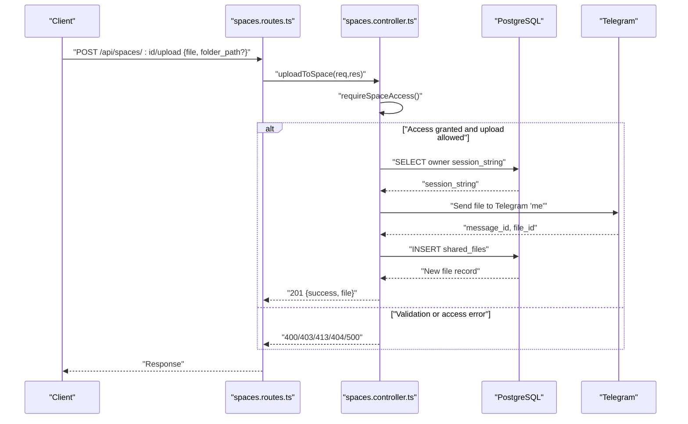
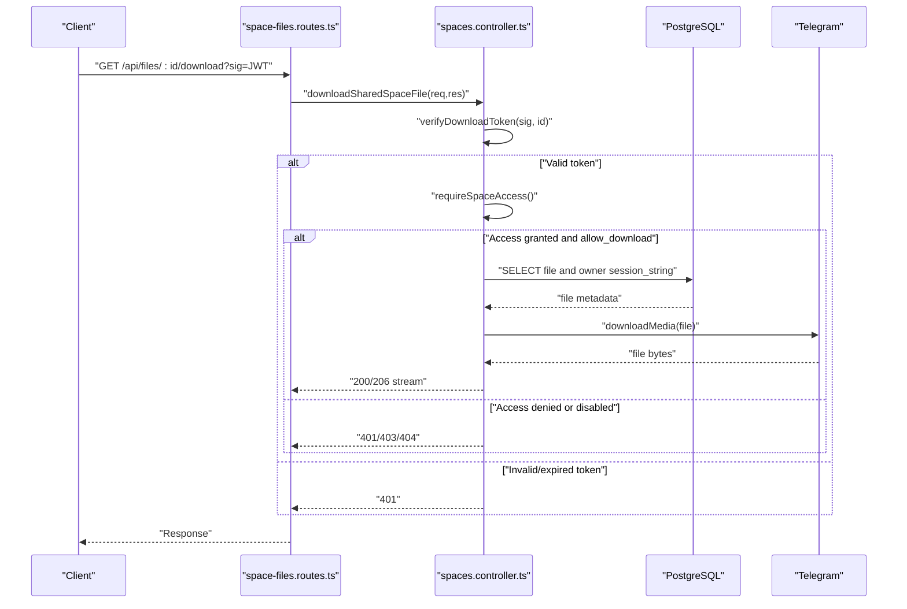
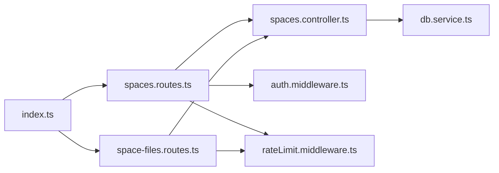

# API Endpoints and Endpoints

<cite>
**Referenced Files in This Document**
- [spaces.controller.ts](file://server/src/controllers/spaces.controller.ts)
- [spaces.routes.ts](file://server/src/routes/spaces.routes.ts)
- [space-files.routes.ts](file://server/src/routes/space-files.routes.ts)
- [auth.middleware.ts](file://server/src/middlewares/auth.middleware.ts)
- [rateLimit.middleware.ts](file://server/src/middlewares/rateLimit.middleware.ts)
- [db.service.ts](file://server/src/services/db.service.ts)
- [index.ts](file://server/src/index.ts)
- [README.md](file://README.md)
</cite>

## Table of Contents
1. [Introduction](#introduction)
2. [Project Structure](#project-structure)
3. [Core Components](#core-components)
4. [Architecture Overview](#architecture-overview)
5. [Detailed Component Analysis](#detailed-component-analysis)
6. [Dependency Analysis](#dependency-analysis)
7. [Performance Considerations](#performance-considerations)
8. [Troubleshooting Guide](#troubleshooting-guide)
9. [Conclusion](#conclusion)

## Introduction
This document describes the shared spaces REST API endpoints implemented in the server module. It focuses on:
- POST /api/spaces/create for authenticated space creation
- GET /api/spaces for retrieving owner spaces with file_count and total_size
- GET /api/spaces/:id for public space metadata retrieval with requires_password and has_access
- POST /api/spaces/:id/validate-password for password validation with bcrypt comparison and access token issuance
- GET /api/spaces/:id/files for file listing with folder_path query parameter and security measures
- POST /api/spaces/:id/upload for guest uploads with multipart file handling and rate limiting
- GET /api/files/:id/download for signed download URLs with token validation and streaming behavior

It also documents authentication requirements, error codes, rate limiting, and security considerations for each endpoint.

## Project Structure
The shared spaces endpoints are organized under the server module:
- Routes define endpoint paths and attach middleware and controllers
- Controllers implement business logic and interact with the database and Telegram services
- Middlewares enforce authentication and rate limiting
- Database schema defines shared_spaces, shared_files, and access_logs tables

**Diagram sources**
- [spaces.routes.ts](file://server/src/routes/spaces.routes.ts#L1-L35)
- [space-files.routes.ts](file://server/src/routes/space-files.routes.ts#L1-L10)
- [spaces.controller.ts](file://server/src/controllers/spaces.controller.ts#L1-L498)
- [auth.middleware.ts](file://server/src/middlewares/auth.middleware.ts#L1-L82)
- [rateLimit.middleware.ts](file://server/src/middlewares/rateLimit.middleware.ts#L1-L47)
- [db.service.ts](file://server/src/services/db.service.ts#L83-L113)

**Section sources**
- [spaces.routes.ts](file://server/src/routes/spaces.routes.ts#L1-L35)
- [space-files.routes.ts](file://server/src/routes/space-files.routes.ts#L1-L10)
- [spaces.controller.ts](file://server/src/controllers/spaces.controller.ts#L1-L498)
- [auth.middleware.ts](file://server/src/middlewares/auth.middleware.ts#L1-L82)
- [rateLimit.middleware.ts](file://server/src/middlewares/rateLimit.middleware.ts#L1-L47)
- [db.service.ts](file://server/src/services/db.service.ts#L83-L113)

## Core Components
- Authentication: JWT-based for owners; bearer token required for owner endpoints
- Rate Limiting: Dedicated limits for space views, password attempts, uploads, and signed downloads
- Access Control: Spaces enforce password protection and expiration; guest access granted via signed access cookies/tokens
- Data Model: shared_spaces and shared_files tables store metadata; access_logs track actions

Key implementation references:
- Authentication middleware and bearer token parsing
- Space access enforcement and password validation
- File listing and upload pipeline to Telegram
- Signed download URL generation and streaming

**Section sources**
- [auth.middleware.ts](file://server/src/middlewares/auth.middleware.ts#L19-L81)
- [spaces.controller.ts](file://server/src/controllers/spaces.controller.ts#L128-L159)
- [spaces.controller.ts](file://server/src/controllers/spaces.controller.ts#L255-L295)
- [spaces.controller.ts](file://server/src/controllers/spaces.controller.ts#L297-L355)
- [spaces.controller.ts](file://server/src/controllers/spaces.controller.ts#L357-L425)
- [spaces.controller.ts](file://server/src/controllers/spaces.controller.ts#L427-L497)

## Architecture Overview
The shared spaces API integrates with PostgreSQL for metadata and Telegram for storage. Requests flow through routes to controllers, which enforce auth and rate limits, query the database, and interact with Telegram services.

**Diagram sources**
- [spaces.routes.ts](file://server/src/routes/spaces.routes.ts#L26-L27)
- [spaces.controller.ts](file://server/src/controllers/spaces.controller.ts#L161-L194)
- [db.service.ts](file://server/src/services/db.service.ts#L83-L92)

## Detailed Component Analysis

### POST /api/spaces/create
- Purpose: Create a new shared space owned by the authenticated user
- Authentication: Required (Bearer token)
- Request body
  - name: string (required, 2–120 chars)
  - allow_upload: boolean (optional, default false)
  - allow_download: boolean (optional, default true)
  - password: string (optional, trimmed)
  - expires_at: ISO date string (optional, must be in the future)
- Validation
  - Name length validated
  - expires_at must be a valid future date
  - Password hashed with bcrypt before storage
- Response
  - 201 Created with created space object
  - On validation errors: 400 Bad Request
  - On hashing errors: 401 Unauthorized
- Security
  - Requires owner JWT
  - Password stored as bcrypt hash
- Rate Limiting
  - Not rate-limited at route level; owner-only endpoint

**Diagram sources**
- [spaces.routes.ts](file://server/src/routes/spaces.routes.ts#L27)
- [spaces.controller.ts](file://server/src/controllers/spaces.controller.ts#L161-L194)
- [db.service.ts](file://server/src/services/db.service.ts#L83-L92)

**Section sources**
- [spaces.controller.ts](file://server/src/controllers/spaces.controller.ts#L161-L194)
- [auth.middleware.ts](file://server/src/middlewares/auth.middleware.ts#L19-L81)
- [db.service.ts](file://server/src/services/db.service.ts#L83-L92)

### GET /api/spaces
- Purpose: Retrieve all shared spaces owned by the authenticated user with aggregated file metrics
- Authentication: Required (Bearer token)
- Response fields
  - success: boolean
  - spaces: array of objects with:
    - id, name, owner_id, allow_upload, allow_download, expires_at, created_at
    - file_count: integer
    - total_size: bigint
- Security
  - Owner-only endpoint
- Notes
  - Aggregation performed via SQL GROUP BY and SUM/COUNT

**Diagram sources**
- [spaces.routes.ts](file://server/src/routes/spaces.routes.ts#L26)
- [spaces.controller.ts](file://server/src/controllers/spaces.controller.ts#L196-L216)
- [db.service.ts](file://server/src/services/db.service.ts#L94-L105)

**Section sources**
- [spaces.controller.ts](file://server/src/controllers/spaces.controller.ts#L196-L216)
- [auth.middleware.ts](file://server/src/middlewares/auth.middleware.ts#L19-L81)
- [db.service.ts](file://server/src/services/db.service.ts#L94-L105)

### GET /api/spaces/:id
- Purpose: Public metadata retrieval for a shared space
- Authentication: Optional (guests)
- Path parameter
  - id: shared space identifier
- Response fields
  - success: boolean
  - space: object with:
    - id, name, allow_upload, allow_download, expires_at, created_at
    - requires_password: boolean (derived from presence of password_hash)
    - has_access: boolean (true if space is not password-protected or if valid access token is present)
- Security
  - Returns requires_password and has_access for UI gating
  - Enforces expiration and optional password protection
- Rate Limiting
  - spaceViewLimiter enforced

**Diagram sources**
- [spaces.routes.ts](file://server/src/routes/spaces.routes.ts#L29)
- [spaces.controller.ts](file://server/src/controllers/spaces.controller.ts#L218-L253)
- [db.service.ts](file://server/src/services/db.service.ts#L83-L92)

**Section sources**
- [spaces.controller.ts](file://server/src/controllers/spaces.controller.ts#L218-L253)
- [rateLimit.middleware.ts](file://server/src/middlewares/rateLimit.middleware.ts#L24-L28)

### POST /api/spaces/:id/validate-password
- Purpose: Validate password for a password-protected space and issue a space access token
- Authentication: None (public)
- Path parameter
  - id: shared space identifier
- Request body
  - password: string (required)
- Response fields
  - success: boolean
  - access_token: string (JWT issued for 24 hours)
  - expires_in_seconds: number
- Security
  - Uses bcrypt compare against stored hash
  - Issues HttpOnly, SameSite, Secure cookie for access
- Rate Limiting
  - spacePasswordLimiter enforced

**Diagram sources**
- [spaces.routes.ts](file://server/src/routes/spaces.routes.ts#L30)
- [spaces.controller.ts](file://server/src/controllers/spaces.controller.ts#L255-L295)
- [db.service.ts](file://server/src/services/db.service.ts#L83-L92)

**Section sources**
- [spaces.controller.ts](file://server/src/controllers/spaces.controller.ts#L87-L95)
- [spaces.controller.ts](file://server/src/controllers/spaces.controller.ts#L255-L295)
- [rateLimit.middleware.ts](file://server/src/middlewares/rateLimit.middleware.ts#L30-L34)

### GET /api/spaces/:id/files
- Purpose: List files in a shared space filtered by folder_path with nested folder discovery
- Authentication: Required for access (via requireSpaceAccess)
- Path parameter
  - id: shared space identifier
- Query parameters
  - folder_path: string (normalized to safe path prefix)
- Response fields
  - success: boolean
  - space: object with id, name, allow_upload, allow_download, expires_at
  - folder_path: string
  - folders: array of child folder descriptors
  - files: array of file descriptors with optional download_url when allow_download is true
- Security
  - Enforces password protection and expiration
  - Generates signed download tokens for files when allowed
- Rate Limiting
  - spaceViewLimiter enforced

**Diagram sources**
- [spaces.routes.ts](file://server/src/routes/spaces.routes.ts#L31)
- [spaces.controller.ts](file://server/src/controllers/spaces.controller.ts#L297-L355)
- [db.service.ts](file://server/src/services/db.service.ts#L94-L105)

**Section sources**
- [spaces.controller.ts](file://server/src/controllers/spaces.controller.ts#L297-L355)
- [rateLimit.middleware.ts](file://server/src/middlewares/rateLimit.middleware.ts#L24-L28)

### POST /api/spaces/:id/upload
- Purpose: Upload a file to a shared space (guests with access)
- Authentication: Required for access (via requireSpaceAccess)
- Path parameter
  - id: shared space identifier
- Request
  - multipart/form-data with field "file"
  - Optional body: folder_path (normalized)
- Validation
  - File size limited by SHARED_SPACE_MAX_UPLOAD_BYTES
  - MIME type must be whitelisted
- Behavior
  - Uploads to Telegram via dynamic client using owner session_string
  - Persists shared_files record with telegram_message_id and metadata
  - Responds with created file descriptor
- Security
  - Enforces allow_upload flag and password protection
  - Cleans up temporary upload files
- Rate Limiting
  - spaceUploadLimiter enforced

**Diagram sources**
- [spaces.routes.ts](file://server/src/routes/spaces.routes.ts#L32)
- [spaces.controller.ts](file://server/src/controllers/spaces.controller.ts#L357-L425)
- [db.service.ts](file://server/src/services/db.service.ts#L94-L105)

**Section sources**
- [spaces.controller.ts](file://server/src/controllers/spaces.controller.ts#L357-L425)
- [rateLimit.middleware.ts](file://server/src/middlewares/rateLimit.middleware.ts#L36-L40)

### GET /api/files/:id/download (Signed Download)
- Purpose: Stream a file from a shared space using a signed token
- Authentication: None (public)
- Path parameter
  - id: shared file identifier
- Query parameters
  - sig: JWT signed token containing file and space identifiers
- Validation
  - Validates signature and ensures space_id matches
  - Enforces space access (password protection and expiration)
  - Enforces allow_download flag
- Behavior
  - Downloads file from Telegram to a temporary path
  - Streams file content with appropriate headers
  - Cleans up temporary file on completion or error
- Security
  - Tokens expire after 10 minutes
  - Signed with dedicated secret
- Rate Limiting
  - signedDownloadLimiter enforced

**Diagram sources**
- [space-files.routes.ts](file://server/src/routes/space-files.routes.ts#L7)
- [spaces.controller.ts](file://server/src/controllers/spaces.controller.ts#L427-L497)
- [db.service.ts](file://server/src/services/db.service.ts#L94-L105)

**Section sources**
- [spaces.controller.ts](file://server/src/controllers/spaces.controller.ts#L108-L126)
- [spaces.controller.ts](file://server/src/controllers/spaces.controller.ts#L427-L497)
- [rateLimit.middleware.ts](file://server/src/middlewares/rateLimit.middleware.ts#L42-L46)

## Dependency Analysis
- Routes depend on controllers and middlewares
- Controllers depend on:
  - Authentication middleware for owner endpoints
  - Rate limiters for public/guest endpoints
  - Database service for schema and queries
  - Telegram client for file operations
- Index wires routes and applies global middleware

**Diagram sources**
- [index.ts](file://server/src/index.ts#L19-L219)
- [spaces.routes.ts](file://server/src/routes/spaces.routes.ts#L1-L35)
- [space-files.routes.ts](file://server/src/routes/space-files.routes.ts#L1-L10)
- [spaces.controller.ts](file://server/src/controllers/spaces.controller.ts#L1-L498)
- [auth.middleware.ts](file://server/src/middlewares/auth.middleware.ts#L1-L82)
- [rateLimit.middleware.ts](file://server/src/middlewares/rateLimit.middleware.ts#L1-L47)
- [db.service.ts](file://server/src/services/db.service.ts#L1-L315)

**Section sources**
- [index.ts](file://server/src/index.ts#L19-L219)
- [spaces.routes.ts](file://server/src/routes/spaces.routes.ts#L1-L35)
- [space-files.routes.ts](file://server/src/routes/space-files.routes.ts#L1-L10)
- [spaces.controller.ts](file://server/src/controllers/spaces.controller.ts#L1-L498)
- [auth.middleware.ts](file://server/src/middlewares/auth.middleware.ts#L1-L82)
- [rateLimit.middleware.ts](file://server/src/middlewares/rateLimit.middleware.ts#L1-L47)
- [db.service.ts](file://server/src/services/db.service.ts#L1-L315)

## Performance Considerations
- Streaming downloads: Temporary files are written to disk and streamed to reduce memory usage
- Tokenized downloads: Short-lived signatures prevent long-running open endpoints
- Rate limiting: Configured windows and max values balance usability and abuse prevention
- Database indexing: Indexes on shared_spaces and shared_files optimize frequent queries

[No sources needed since this section provides general guidance]

## Troubleshooting Guide
Common issues and resolutions:
- 401 Unauthorized
  - Missing or invalid Bearer token for owner endpoints
  - Missing or invalid space access token/cookie for guest endpoints
- 403 Forbidden
  - Uploads/downloads disabled for the space
- 404 Not Found
  - Space or file not found
- 410 Gone
  - Space has expired
- 413 Payload Too Large
  - File exceeds SHARED_SPACE_MAX_UPLOAD_BYTES
- 429 Too Many Requests
  - Exceeded spaceViewLimiter, spacePasswordLimiter, spaceUploadLimiter, or signedDownloadLimiter

Operational tips:
- Verify JWT_SECRET and related secrets are configured
- Confirm SHARED_SPACE_MAX_UPLOAD_BYTES and allowed MIME types
- Check access_logs for recent actions and password attempts

**Section sources**
- [spaces.controller.ts](file://server/src/controllers/spaces.controller.ts#L128-L159)
- [spaces.controller.ts](file://server/src/controllers/spaces.controller.ts#L255-L295)
- [spaces.controller.ts](file://server/src/controllers/spaces.controller.ts#L357-L425)
- [spaces.controller.ts](file://server/src/controllers/spaces.controller.ts#L427-L497)
- [rateLimit.middleware.ts](file://server/src/middlewares/rateLimit.middleware.ts#L24-L46)
- [db.service.ts](file://server/src/services/db.service.ts#L83-L113)

## Conclusion
The shared spaces API provides a secure, rate-limited, and efficient mechanism for owners to create spaces and for guests to browse and upload files. It enforces authentication and access controls, supports streaming downloads, and maintains audit logs for compliance and monitoring.