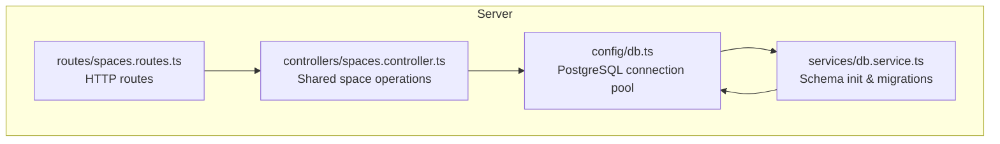
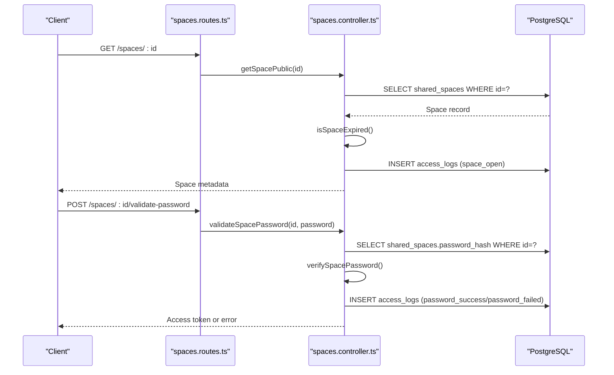
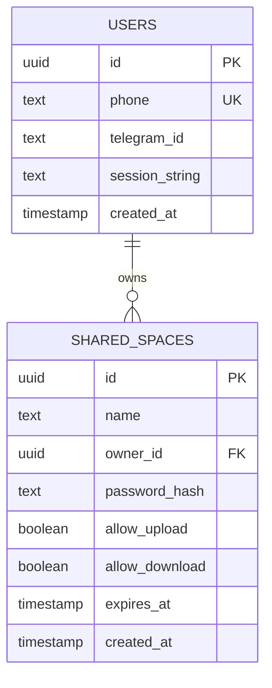
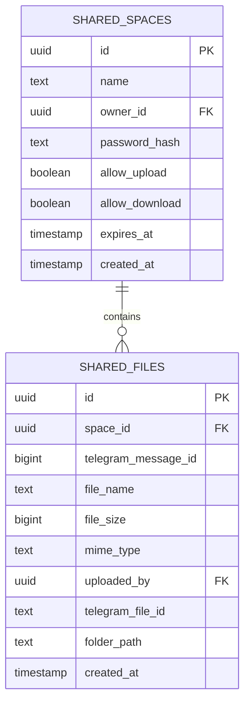
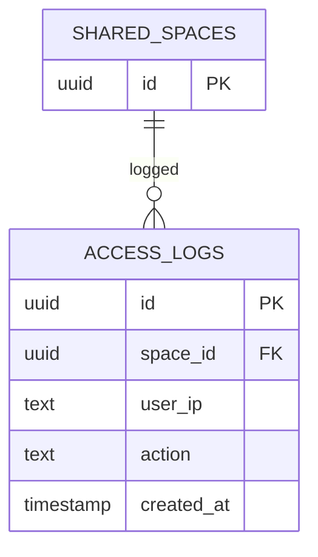
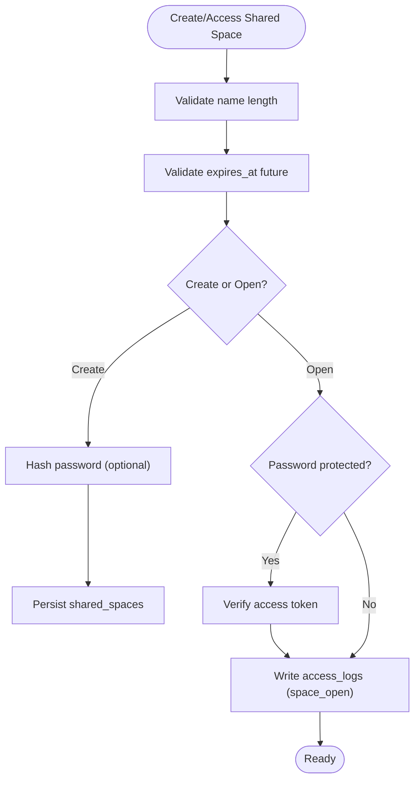
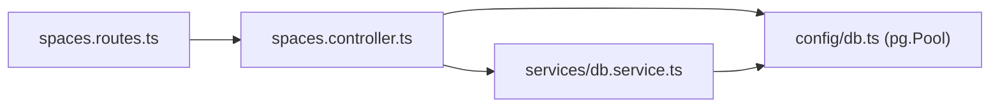

# Database Schema and Design

<cite>
**Referenced Files in This Document**
- [db.service.ts](file://server/src/services/db.service.ts)
- [spaces.controller.ts](file://server/src/controllers/spaces.controller.ts)
- [spaces.routes.ts](file://server/src/routes/spaces.routes.ts)
- [db.ts](file://server/src/config/db.ts)
- [index.ts](file://server/src/db/index.ts)
</cite>

## Table of Contents
1. [Introduction](#introduction)
2. [Project Structure](#project-structure)
3. [Core Components](#core-components)
4. [Architecture Overview](#architecture-overview)
5. [Detailed Component Analysis](#detailed-component-analysis)
6. [Dependency Analysis](#dependency-analysis)
7. [Performance Considerations](#performance-considerations)
8. [Troubleshooting Guide](#troubleshooting-guide)
9. [Conclusion](#conclusion)

## Introduction
This document describes the shared spaces database schema and design, focusing on table relationships, field definitions, constraints, indexing strategy, and operational behavior. It covers:
- Users table for Telegram session management
- Shared spaces table for collaborative containers
- Shared files table for file metadata and organization
- Access logs table for audit trails
- Foreign keys, indexes, and validation rules
- Data lifecycle, security considerations, and performance optimization

## Project Structure
The database schema is defined and migrated by the backend service layer. The schema creation and maintenance logic resides in a dedicated service module, while controllers and routes orchestrate shared space operations.

**Diagram sources**
- [db.ts](file://server/src/config/db.ts#L27-L37)
- [db.service.ts](file://server/src/services/db.service.ts#L3-L137)
- [spaces.controller.ts](file://server/src/controllers/spaces.controller.ts#L128-L159)
- [spaces.routes.ts](file://server/src/routes/spaces.routes.ts#L18-L32)

**Section sources**
- [db.ts](file://server/src/config/db.ts#L1-L61)
- [db.service.ts](file://server/src/services/db.service.ts#L1-L315)
- [spaces.controller.ts](file://server/src/controllers/spaces.controller.ts#L1-L498)
- [spaces.routes.ts](file://server/src/routes/spaces.routes.ts#L1-L35)

## Core Components
This section documents the core tables used by the shared spaces feature.

- Users
  - Purpose: Store user identity and Telegram session credentials for file operations.
  - Key fields: id (UUID primary key), session_string (TEXT), created_at (TIMESTAMP).
  - Notes: The users table definition here is aligned with the shared spaces schema; the legacy users table in the older db initializer is not used by shared spaces.

- Shared spaces
  - Purpose: Define collaborative containers with optional password protection, upload/download permissions, expiration, and ownership.
  - Key fields: id (UUID primary key), name (TEXT), owner_id (UUID references users.id), password_hash (TEXT), allow_upload (BOOLEAN), allow_download (BOOLEAN), expires_at (TIMESTAMP), created_at (TIMESTAMP).
  - Constraints: Not-null defaults for allow_upload and allow_download; foreign key to users on owner_id.

- Shared files
  - Purpose: Track files uploaded into a shared space, linking to Telegram message identifiers and storing metadata.
  - Key fields: id (UUID primary key), space_id (UUID references shared_spaces.id), telegram_message_id (BIGINT), file_name (TEXT), file_size (BIGINT), mime_type (TEXT), uploaded_by (UUID references users.id), telegram_file_id (TEXT), folder_path (TEXT), created_at (TIMESTAMP).
  - Constraints: Foreign key to shared_spaces; default folder_path is "/"; default file_size is 0.

- Access logs
  - Purpose: Audit trail for shared space events (e.g., open, password attempts, list, upload, download).
  - Key fields: id (UUID primary key), space_id (UUID references shared_spaces.id), user_ip (TEXT), action (TEXT), created_at (TIMESTAMP).
  - Constraints: Foreign key to shared_spaces.

**Section sources**
- [db.service.ts](file://server/src/services/db.service.ts#L7-L18)
- [db.service.ts](file://server/src/services/db.service.ts#L83-L92)
- [db.service.ts](file://server/src/services/db.service.ts#L94-L105)
- [db.service.ts](file://server/src/services/db.service.ts#L107-L113)

## Architecture Overview
The shared spaces feature integrates HTTP routes, controllers, and database operations. Controllers enforce access policies (password, expiration), validate inputs, and log actions. Database indexes optimize frequent queries.

**Diagram sources**
- [spaces.routes.ts](file://server/src/routes/spaces.routes.ts#L29-L30)
- [spaces.controller.ts](file://server/src/controllers/spaces.controller.ts#L218-L253)
- [spaces.controller.ts](file://server/src/controllers/spaces.controller.ts#L255-L295)
- [spaces.controller.ts](file://server/src/controllers/spaces.controller.ts#L97-L106)

## Detailed Component Analysis

### Users Table
- Fields
  - id: UUID, primary key, default generated
  - phone: TEXT, unique, not null
  - telegram_id: TEXT
  - session_string: TEXT (used for Telegram client operations)
  - created_at: TIMESTAMP, default now
- Purpose
  - Identifies users and holds Telegram session credentials required to operate on Telegram channel storage.
- Constraints
  - Unique constraint on phone
  - Default timestamps
- Notes
  - The shared spaces feature references users via owner_id and uploaded_by; session_string is used to connect to Telegram for file operations.

**Section sources**
- [db.service.ts](file://server/src/services/db.service.ts#L7-L18)

### Shared Spaces Table
- Fields
  - id: UUID, primary key, default generated
  - name: TEXT, not null
  - owner_id: UUID, not null, references users.id (ON DELETE CASCADE)
  - password_hash: TEXT
  - allow_upload: BOOLEAN, not null, default false
  - allow_download: BOOLEAN, not null, default true
  - expires_at: TIMESTAMP
  - created_at: TIMESTAMP, not null, default now
- Purpose
  - Defines a container for shared files, with access control and lifecycle management.
- Constraints
  - Not-null defaults for allow_upload and allow_download
  - Foreign key to users on owner_id
- Indexes
  - Owner and created_at descending
  - Expiration timestamp

**Diagram sources**
- [db.service.ts](file://server/src/services/db.service.ts#L7-L18)
- [db.service.ts](file://server/src/services/db.service.ts#L83-L92)

**Section sources**
- [db.service.ts](file://server/src/services/db.service.ts#L83-L92)
- [db.service.ts](file://server/src/services/db.service.ts#L215-L216)

### Shared Files Table
- Fields
  - id: UUID, primary key, default generated
  - space_id: UUID, not null, references shared_spaces.id (ON DELETE CASCADE)
  - telegram_message_id: BIGINT, not null
  - file_name: TEXT, not null
  - file_size: BIGINT, not null, default 0
  - mime_type: TEXT
  - uploaded_by: UUID, references users.id (ON DELETE SET NULL)
  - telegram_file_id: TEXT
  - folder_path: TEXT, not null, default "/"
  - created_at: TIMESTAMP, not null, default now
- Purpose
  - Stores metadata for files uploaded into a shared space, enabling listing, filtering, and retrieval.
- Constraints
  - Foreign key to shared_spaces
  - Default folder_path "/"
- Indexes
  - Space and created_at descending
  - Space and folder_path

**Diagram sources**
- [db.service.ts](file://server/src/services/db.service.ts#L83-L92)
- [db.service.ts](file://server/src/services/db.service.ts#L94-L105)

**Section sources**
- [db.service.ts](file://server/src/services/db.service.ts#L94-L105)
- [db.service.ts](file://server/src/services/db.service.ts#L214-L215)
- [db.service.ts](file://server/src/services/db.service.ts#L221-L222)

### Access Logs Table
- Fields
  - id: UUID, primary key, default generated
  - space_id: UUID, not null, references shared_spaces.id (ON DELETE CASCADE)
  - user_ip: TEXT, not null
  - action: TEXT, not null
  - created_at: TIMESTAMP, not null, default now
- Purpose
  - Audit trail for shared space activities.
- Indexes
  - Space and created_at descending

**Diagram sources**
- [db.service.ts](file://server/src/services/db.service.ts#L107-L113)

**Section sources**
- [db.service.ts](file://server/src/services/db.service.ts#L107-L113)
- [db.service.ts](file://server/src/services/db.service.ts#L223-L224)

### Data Validation and Business Rules
- Shared space creation
  - Name length validation and optional expiration enforcement
  - Optional password hashing before storage
- Access control
  - Password-protected spaces require a valid access token before listing or uploading
  - Expiration check blocks operations on expired spaces
- Upload validation
  - File size limit enforced
  - MIME type whitelist validation
  - Optional upload destination folder path normalization
- Download validation
  - Signed tokens grant temporary access to specific files within a space
  - Download counts tracked via access logs

**Diagram sources**
- [spaces.controller.ts](file://server/src/controllers/spaces.controller.ts#L170-L178)
- [spaces.controller.ts](file://server/src/controllers/spaces.controller.ts#L180-L187)
- [spaces.controller.ts](file://server/src/controllers/spaces.controller.ts#L255-L295)
- [spaces.controller.ts](file://server/src/controllers/spaces.controller.ts#L97-L106)

**Section sources**
- [spaces.controller.ts](file://server/src/controllers/spaces.controller.ts#L161-L194)
- [spaces.controller.ts](file://server/src/controllers/spaces.controller.ts#L218-L253)
- [spaces.controller.ts](file://server/src/controllers/spaces.controller.ts#L255-L295)
- [spaces.controller.ts](file://server/src/controllers/spaces.controller.ts#L297-L355)
- [spaces.controller.ts](file://server/src/controllers/spaces.controller.ts#L357-L425)
- [spaces.controller.ts](file://server/src/controllers/spaces.controller.ts#L427-L497)

## Dependency Analysis
- Controllers depend on the database pool for SQL operations and on Telegram client utilities for file operations.
- Routes define the HTTP surface and apply rate-limiting middleware for shared space endpoints.
- Database service defines schema, indexes, and migrations.

**Diagram sources**
- [spaces.routes.ts](file://server/src/routes/spaces.routes.ts#L1-L35)
- [spaces.controller.ts](file://server/src/controllers/spaces.controller.ts#L1-L11)
- [db.ts](file://server/src/config/db.ts#L1-L61)
- [db.service.ts](file://server/src/services/db.service.ts#L1-L315)

**Section sources**
- [spaces.routes.ts](file://server/src/routes/spaces.routes.ts#L1-L35)
- [spaces.controller.ts](file://server/src/controllers/spaces.controller.ts#L1-L11)
- [db.ts](file://server/src/config/db.ts#L1-L61)
- [db.service.ts](file://server/src/services/db.service.ts#L1-L315)

## Performance Considerations
- Connection pooling
  - Limited pool size and short idle timeouts to prevent resource exhaustion on hosted plans
  - Warm connection kept to reduce cold-start latency
- Indexes
  - Owner and created_at on shared_spaces
  - Expires timestamp on shared_spaces
  - Space and created_at on shared_files
  - Space and folder_path on shared_files
  - Space and created_at on access_logs
- Query patterns
  - Listing files by space and folder_path
  - Access log writes are non-blocking
- Upload/download
  - Temporary file handling and cleanup
  - Streaming downloads via Telegram client

**Section sources**
- [db.ts](file://server/src/config/db.ts#L22-L37)
- [db.service.ts](file://server/src/services/db.service.ts#L215-L224)
- [spaces.controller.ts](file://server/src/controllers/spaces.controller.ts#L418-L424)
- [spaces.controller.ts](file://server/src/controllers/spaces.controller.ts#L472-L493)

## Troubleshooting Guide
- Database URL not configured
  - Symptom: Warning about DATABASE_URL missing
  - Action: Set DATABASE_URL in environment variables
- SSL mode issues
  - Symptom: SSL-related errors
  - Action: Ensure DATABASE_URL includes sslmode parameter as required
- Connection timeouts or unexpected termination
  - Symptom: Pool errors indicating timeouts or unexpected termination
  - Action: Review network connectivity and adjust pool settings if needed
- Shared space not found or expired
  - Symptom: 404 or 410 responses when accessing shared spaces
  - Action: Verify space ID and expiration timestamp
- Password-protected space access failures
  - Symptom: 401 responses when validating password
  - Action: Confirm password hash and access token validity
- Upload failures
  - Symptom: 400/413 errors for unsupported or oversized files
  - Action: Check MIME whitelist and size limits; confirm Telegram session availability

**Section sources**
- [db.ts](file://server/src/config/db.ts#L9-L12)
- [db.ts](file://server/src/config/db.ts#L40-L52)
- [spaces.controller.ts](file://server/src/controllers/spaces.controller.ts#L133-L142)
- [spaces.controller.ts](file://server/src/controllers/spaces.controller.ts#L268-L278)
- [spaces.controller.ts](file://server/src/controllers/spaces.controller.ts#L365-L372)

## Conclusion
The shared spaces schema centers on four tables with clear relationships and constraints. Controllers enforce validation, access control, and audit logging, while the database service maintains schema integrity and indexes. The design balances security (password protection, signed tokens), observability (access logs), and performance (optimized indexes and connection pooling) to support scalable shared file operations.