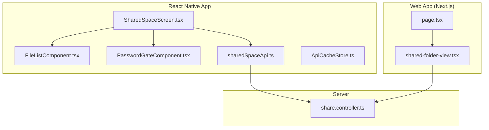
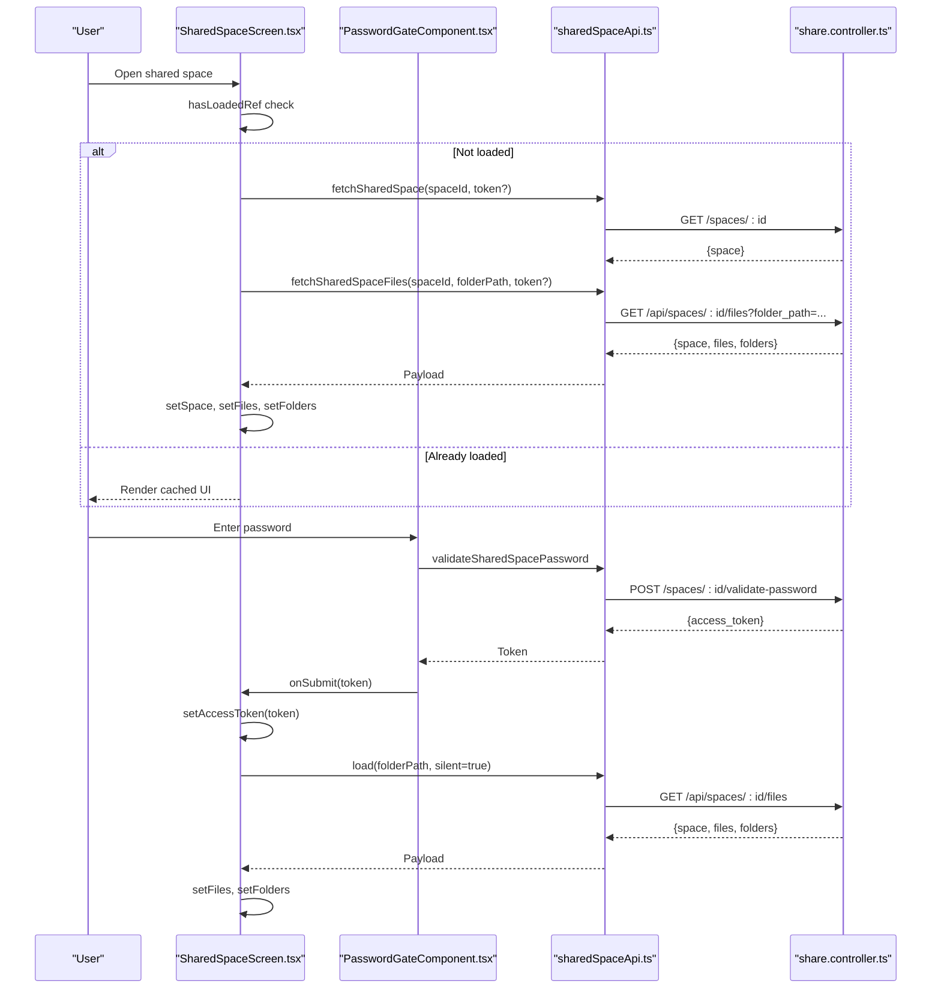
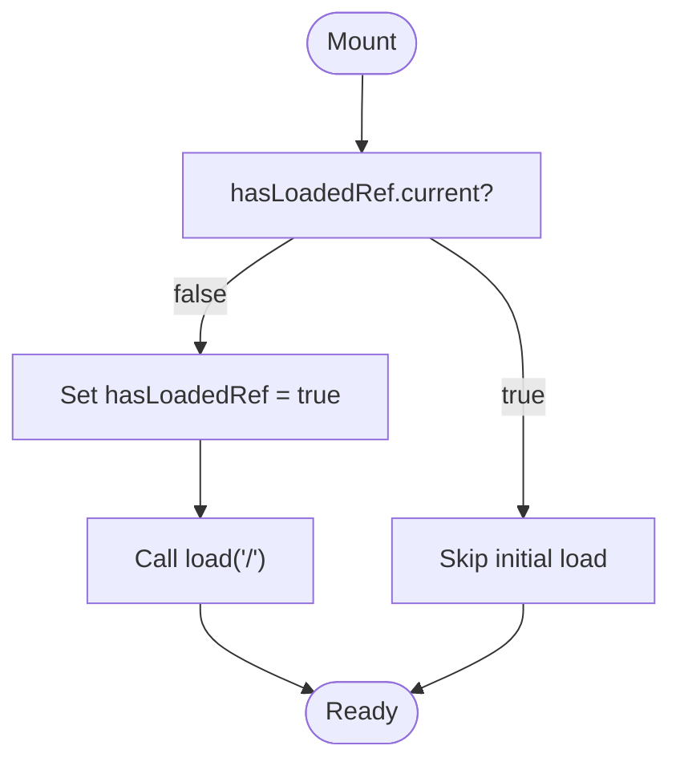
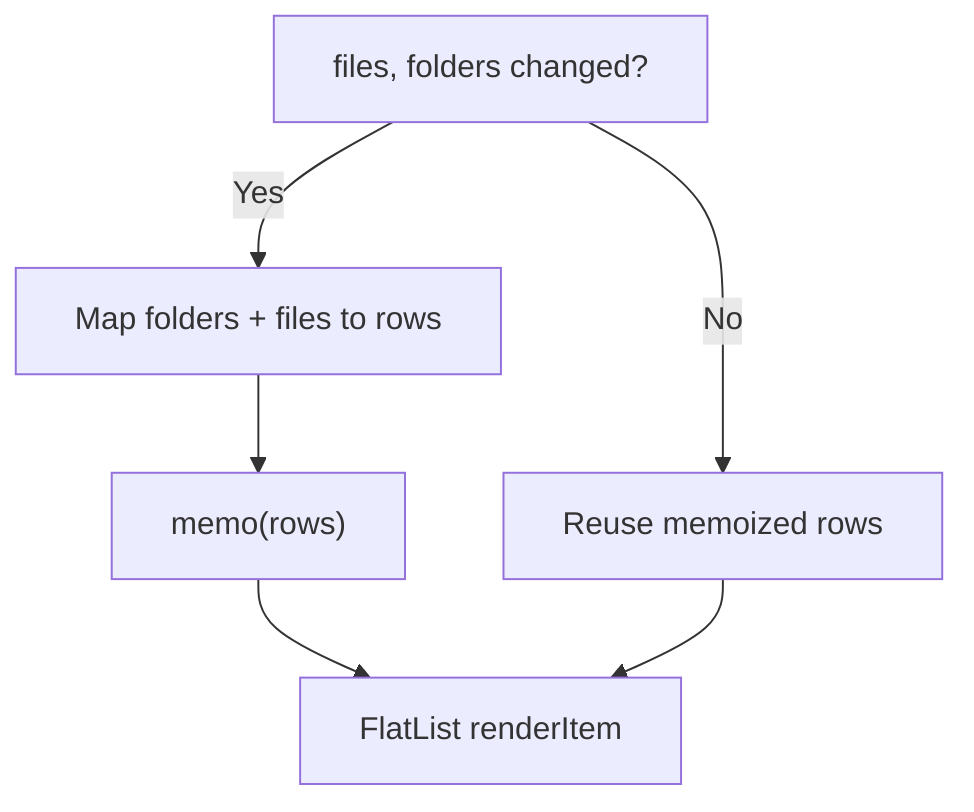
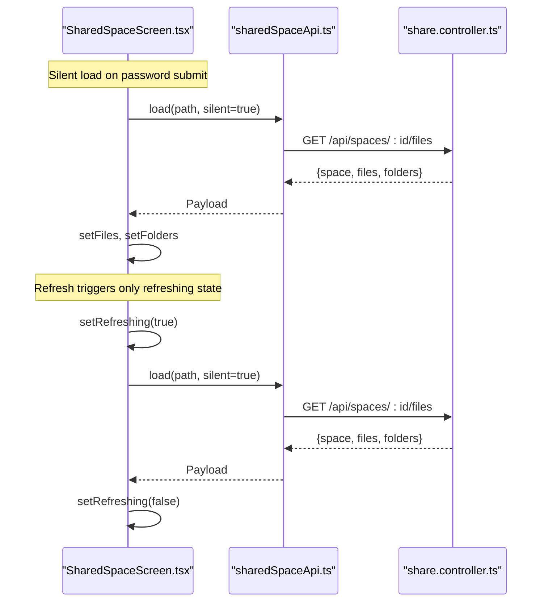
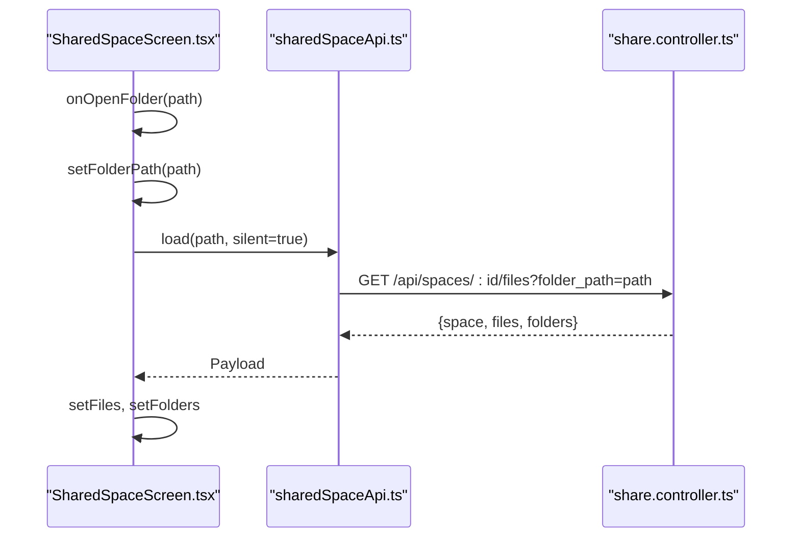
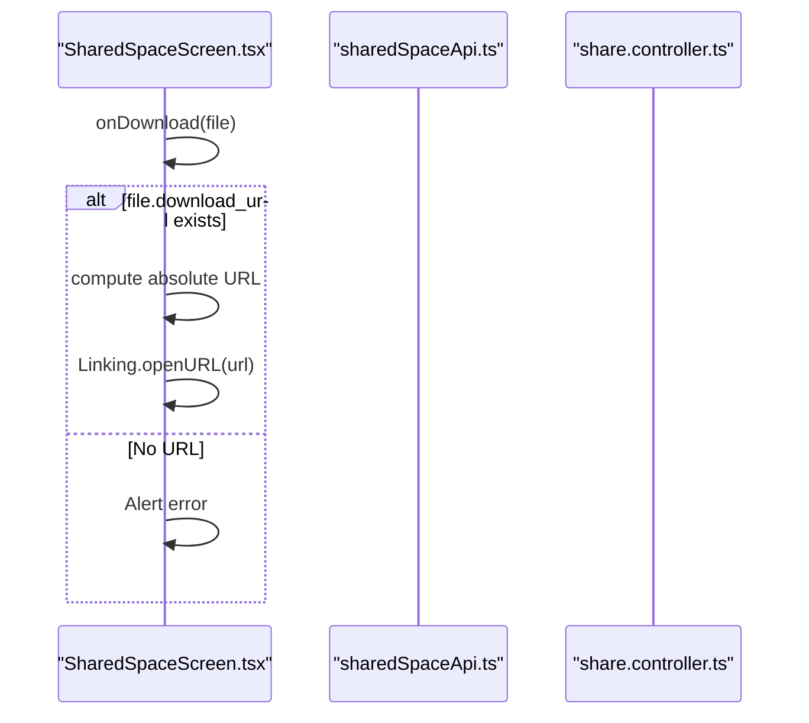
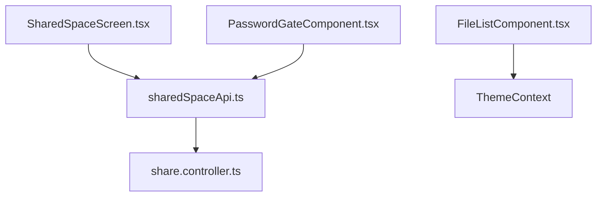

# Performance and Optimization

<cite>
**Referenced Files in This Document**
- [FileListComponent.tsx](file://app/src/components/FileListComponent.tsx)
- [SharedSpaceScreen.tsx](file://app/src/screens/SharedSpaceScreen.tsx)
- [PasswordGateComponent.tsx](file://app/src/components/PasswordGateComponent.tsx)
- [sharedSpaceApi.ts](file://app/src/services/sharedSpaceApi.ts)
- [FolderFilesScreen.tsx](file://app/src/screens/FolderFilesScreen.tsx)
- [ApiCacheStore.ts](file://app/src/context/ApiCacheStore.ts)
- [retry.ts](file://app/src/utils/retry.ts)
- [share.controller.ts](file://server/src/controllers/share.controller.ts)
- [page.tsx](file://web/app/s/[spaceId]/page.tsx)
- [shared-folder-view.tsx](file://web/app/s/[spaceId]/shared-folder-view.tsx)
</cite>

## Table of Contents
1. [Introduction](#introduction)
2. [Project Structure](#project-structure)
3. [Core Components](#core-components)
4. [Architecture Overview](#architecture-overview)
5. [Detailed Component Analysis](#detailed-component-analysis)
6. [Dependency Analysis](#dependency-analysis)
7. [Performance Considerations](#performance-considerations)
8. [Troubleshooting Guide](#troubleshooting-guide)
9. [Conclusion](#conclusion)

## Introduction
This document focuses on performance and optimization for shared spaces, covering flicker reduction, efficient loading, scalable architecture, and robust state isolation. It explains how stable effects are implemented with initial load guards, how memoized list rows and callbacks minimize unnecessary re-renders, and how isolated loading states keep the UI responsive during password submission, uploads, and list refreshes. It also details folder navigation using incremental reload without remounting screen state, and how precomputed download links reduce latency. Finally, it outlines performance monitoring strategies, memory management techniques, and scalability patterns for large shared spaces with thousands of files and concurrent users, with cross-platform considerations for React Native and web.

## Project Structure
The shared spaces feature spans three layers:
- React Native screens and components for mobile experiences
- Web Next.js app for browser-based shared spaces
- Server controllers implementing secure, paginated, and optimized file retrieval

**Diagram sources**
- [SharedSpaceScreen.tsx](file://app/src/screens/SharedSpaceScreen.tsx#L16-L174)
- [FileListComponent.tsx](file://app/src/components/FileListComponent.tsx#L19-L59)
- [PasswordGateComponent.tsx](file://app/src/components/PasswordGateComponent.tsx#L9-L51)
- [sharedSpaceApi.ts](file://app/src/services/sharedSpaceApi.ts#L33-L56)
- [page.tsx](file://web/app/s/[spaceId]/page.tsx#L1-L7)
- [shared-folder-view.tsx](file://web/app/s/[spaceId]/shared-folder-view.tsx#L194-L365)
- [share.controller.ts](file://server/src/controllers/share.controller.ts#L394-L538)

**Section sources**
- [SharedSpaceScreen.tsx](file://app/src/screens/SharedSpaceScreen.tsx#L16-L174)
- [sharedSpaceApi.ts](file://app/src/services/sharedSpaceApi.ts#L33-L56)
- [share.controller.ts](file://server/src/controllers/share.controller.ts#L394-L538)
- [page.tsx](file://web/app/s/[spaceId]/page.tsx#L1-L7)
- [shared-folder-view.tsx](file://web/app/s/[spaceId]/shared-folder-view.tsx#L194-L365)

## Core Components
- Stable initial load guard: The initial load runs only once via a ref flag to prevent redundant fetches on mount.
- Memoized list rendering: File lists are constructed once per dependency change and rendered efficiently with FlatList.
- Isolated loading states: Password submission, uploads, and refreshes update only their targeted state slices.
- Incremental navigation: Navigating folders triggers a focused reload of the current path without resetting unrelated UI state.
- Precomputed download links: Server returns ready-to-use URLs to eliminate extra client roundtrips.

**Section sources**
- [SharedSpaceScreen.tsx](file://app/src/screens/SharedSpaceScreen.tsx#L27-L75)
- [FileListComponent.tsx](file://app/src/components/FileListComponent.tsx#L19-L59)
- [sharedSpaceApi.ts](file://app/src/services/sharedSpaceApi.ts#L45-L56)
- [PasswordGateComponent.tsx](file://app/src/components/PasswordGateComponent.tsx#L9-L51)

## Architecture Overview
The shared space experience follows a predictable flow:
- Initial load checks access and fetches space metadata and contents
- Password gate resolves access tokens and retries the load silently
- Folder navigation updates path and reloads only the current view
- Downloads use precomputed URLs returned by the server

**Diagram sources**
- [SharedSpaceScreen.tsx](file://app/src/screens/SharedSpaceScreen.tsx#L29-L81)
- [PasswordGateComponent.tsx](file://app/src/components/PasswordGateComponent.tsx#L15-L27)
- [sharedSpaceApi.ts](file://app/src/services/sharedSpaceApi.ts#L33-L56)
- [share.controller.ts](file://server/src/controllers/share.controller.ts#L394-L538)

## Detailed Component Analysis

### Stable Effects and Initial Load Guards
- The initial load executes only once using a ref to guard against repeated mounts.
- Silent loading avoids global loading indicators during password validation and refresh operations.

**Diagram sources**
- [SharedSpaceScreen.tsx](file://app/src/screens/SharedSpaceScreen.tsx#L71-L75)

**Section sources**
- [SharedSpaceScreen.tsx](file://app/src/screens/SharedSpaceScreen.tsx#L27-L75)

### Memoized List Rows and Callbacks
- Rows are precomputed once per dependency change to avoid re-allocations and improve FlatList performance.
- Callbacks are wrapped with useCallback to stabilize event handlers and reduce renders.

**Diagram sources**
- [FileListComponent.tsx](file://app/src/components/FileListComponent.tsx#L21-L27)

**Section sources**
- [FileListComponent.tsx](file://app/src/components/FileListComponent.tsx#L19-L59)

### Isolated Loading States
- Password submission, refresh, and folder navigation update only their targeted state slices.
- Global loading indicator remains hidden during silent operations to avoid flicker.

**Diagram sources**
- [SharedSpaceScreen.tsx](file://app/src/screens/SharedSpaceScreen.tsx#L77-L86)
- [sharedSpaceApi.ts](file://app/src/services/sharedSpaceApi.ts#L45-L56)
- [share.controller.ts](file://server/src/controllers/share.controller.ts#L394-L538)

**Section sources**
- [SharedSpaceScreen.tsx](file://app/src/screens/SharedSpaceScreen.tsx#L25-L86)

### Folder Navigation with Incremental Reload
- Navigating folders updates the current path and reloads only the affected view.
- This keeps unrelated UI state intact and avoids remounting the screen.

**Diagram sources**
- [SharedSpaceScreen.tsx](file://app/src/screens/SharedSpaceScreen.tsx#L88-L91)
- [sharedSpaceApi.ts](file://app/src/services/sharedSpaceApi.ts#L45-L56)
- [share.controller.ts](file://server/src/controllers/share.controller.ts#L394-L538)

**Section sources**
- [SharedSpaceScreen.tsx](file://app/src/screens/SharedSpaceScreen.tsx#L88-L91)

### Precomputed Download Links
- Server returns ready-to-use download URLs, eliminating extra client roundtrips.
- Client opens the URL directly, reducing latency and simplifying flow.

**Diagram sources**
- [SharedSpaceScreen.tsx](file://app/src/screens/SharedSpaceScreen.tsx#L93-L103)

**Section sources**
- [SharedSpaceScreen.tsx](file://app/src/screens/SharedSpaceScreen.tsx#L93-L103)

### Web Implementation Notes
- The Next.js page delegates to a client component that renders the shared folder view.
- The view component handles breadcrumbs, upload, and download actions with minimal re-renders.

**Diagram sources**
- [page.tsx](file://web/app/s/[spaceId]/page.tsx#L1-L7)
- [shared-folder-view.tsx](file://web/app/s/[spaceId]/shared-folder-view.tsx#L194-L365)

**Section sources**
- [page.tsx](file://web/app/s/[spaceId]/page.tsx#L1-L7)
- [shared-folder-view.tsx](file://web/app/s/[spaceId]/shared-folder-view.tsx#L194-L365)

## Dependency Analysis
- Client-side dependencies:
  - SharedSpaceScreen depends on sharedSpaceApi for fetching space metadata and files.
  - FileListComponent depends on theme and props to render efficiently.
  - PasswordGateComponent encapsulates password submission with isolated state.
- Server-side dependencies:
  - share.controller orchestrates authorized access, pagination, and precomputed metadata for downloads.

**Diagram sources**
- [SharedSpaceScreen.tsx](file://app/src/screens/SharedSpaceScreen.tsx#L1-L15)
- [sharedSpaceApi.ts](file://app/src/services/sharedSpaceApi.ts#L1-L81)
- [share.controller.ts](file://server/src/controllers/share.controller.ts#L1-L633)
- [FileListComponent.tsx](file://app/src/components/FileListComponent.tsx#L1-L59)
- [PasswordGateComponent.tsx](file://app/src/components/PasswordGateComponent.tsx#L1-L51)

**Section sources**
- [SharedSpaceScreen.tsx](file://app/src/screens/SharedSpaceScreen.tsx#L1-L15)
- [sharedSpaceApi.ts](file://app/src/services/sharedSpaceApi.ts#L1-L81)
- [share.controller.ts](file://server/src/controllers/share.controller.ts#L1-L633)
- [FileListComponent.tsx](file://app/src/components/FileListComponent.tsx#L1-L59)
- [PasswordGateComponent.tsx](file://app/src/components/PasswordGateComponent.tsx#L1-L51)

## Performance Considerations
- Flicker reduction
  - Use initial load guards to prevent redundant fetches on mount.
  - Keep global loading indicators off during silent operations to avoid perceived flicker.
- Efficient loading
  - Memoize computed rows and stabilize callbacks to minimize re-renders.
  - Use incremental reload on folder navigation to avoid remounting the screen.
- Scalable architecture
  - Server returns precomputed download URLs to reduce client-server roundtrips.
  - Paginate and sort on the server to keep payloads small and manageable.
- Memory management
  - Avoid storing large arrays in component state; prefer derived computations and stable references.
  - Clear caches selectively when leaving screens to free memory.
- Monitoring and resilience
  - Implement retry logic for transient network failures and cold starts.
  - Track slow requests and long-tail render times to identify bottlenecks.

[No sources needed since this section provides general guidance]

## Troubleshooting Guide
- Password validation fails silently
  - Ensure the password gate sets an error state and the screen handles 401/password messages gracefully.
- Excessive re-renders in file lists
  - Verify rows are memoized and callbacks are wrapped with useCallback.
- Slow initial load
  - Confirm initial load guard is active and silent loads are used for subsequent refreshes.
- Download link errors
  - Validate that the server returns a valid download URL and the client constructs an absolute URL before opening.

**Section sources**
- [PasswordGateComponent.tsx](file://app/src/components/PasswordGateComponent.tsx#L15-L27)
- [FileListComponent.tsx](file://app/src/components/FileListComponent.tsx#L19-L59)
- [SharedSpaceScreen.tsx](file://app/src/screens/SharedSpaceScreen.tsx#L61-L68)
- [SharedSpaceScreen.tsx](file://app/src/screens/SharedSpaceScreen.tsx#L93-L103)

## Conclusion
By combining stable effects with initial load guards, memoized list rows, isolated loading states, incremental navigation, and precomputed download links, the shared spaces feature achieves smooth UX and strong performance. On the server, pagination and precomputation reduce payload sizes and latency. With resilient retry logic and selective caching, the system scales to large shared spaces and concurrent users while maintaining responsiveness across React Native and web platforms.