# Security Controls and Access Management

<cite>
**Referenced Files in This Document**
- [index.ts](file://server/src/index.ts)
- [spaces.controller.ts](file://server/src/controllers/spaces.controller.ts)
- [auth.middleware.ts](file://server/src/middlewares/auth.middleware.ts)
- [rateLimit.middleware.ts](file://server/src/middlewares/rateLimit.middleware.ts)
- [spaces.routes.ts](file://server/src/routes/spaces.routes.ts)
- [space-files.routes.ts](file://server/src/routes/space-files.routes.ts)
- [share.controller.ts](file://server/src/controllers/share.controller.ts)
- [share.service.ts](file://server/src/services/share.service.ts)
- [db.service.ts](file://server/src/services/db.service.ts)
- [logger.ts](file://server/src/utils/logger.ts)
- [db.ts](file://server/src/config/db.ts)
- [package.json](file://server/package.json)
</cite>

## Table of Contents
1. [Introduction](#introduction)
2. [Project Structure](#project-structure)
3. [Core Components](#core-components)
4. [Architecture Overview](#architecture-overview)
5. [Detailed Component Analysis](#detailed-component-analysis)
6. [Dependency Analysis](#dependency-analysis)
7. [Performance Considerations](#performance-considerations)
8. [Troubleshooting Guide](#troubleshooting-guide)
9. [Conclusion](#conclusion)

## Introduction
This document details the security controls and access management for shared spaces, focusing on authentication, authorization, and access protection. It explains bcrypt password hashing with configurable cost, space access tokens via header or httpOnly cookies, file upload size limits and MIME allowlists, link expiry enforcement, per-action rate limiters, signed download tokens with short TTL, security middleware, threat mitigations, and audit logging. It also covers common vulnerabilities and their prevention in shared space operations.

## Project Structure
Security-critical logic is implemented across controllers, middlewares, routes, services, and configuration. The Express server applies global security middleware, CORS/CSP policies, and rate limiting. Controllers enforce access checks, validate inputs, and emit audit logs. Services manage JWT signing/verification and database schema initialization.

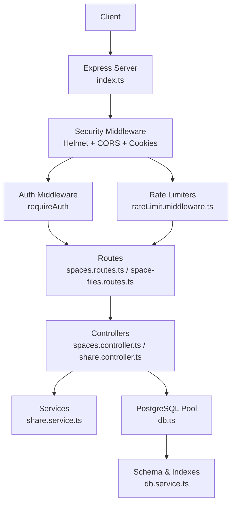

**Diagram sources**
- [index.ts](file://server/src/index.ts#L46-L108)
- [auth.middleware.ts](file://server/src/middlewares/auth.middleware.ts#L19-L81)
- [rateLimit.middleware.ts](file://server/src/middlewares/rateLimit.middleware.ts#L1-L47)
- [spaces.routes.ts](file://server/src/routes/spaces.routes.ts#L1-L35)
- [space-files.routes.ts](file://server/src/routes/space-files.routes.ts#L1-L10)
- [spaces.controller.ts](file://server/src/controllers/spaces.controller.ts#L128-L159)
- [share.controller.ts](file://server/src/controllers/share.controller.ts#L84-L112)
- [share.service.ts](file://server/src/services/share.service.ts#L33-L109)
- [db.ts](file://server/src/config/db.ts#L27-L37)
- [db.service.ts](file://server/src/services/db.service.ts#L3-L137)

**Section sources**
- [index.ts](file://server/src/index.ts#L46-L108)
- [spaces.routes.ts](file://server/src/routes/spaces.routes.ts#L1-L35)
- [space-files.routes.ts](file://server/src/routes/space-files.routes.ts#L1-L10)
- [spaces.controller.ts](file://server/src/controllers/spaces.controller.ts#L128-L159)
- [share.controller.ts](file://server/src/controllers/share.controller.ts#L84-L112)
- [share.service.ts](file://server/src/services/share.service.ts#L33-L109)
- [db.ts](file://server/src/config/db.ts#L27-L37)
- [db.service.ts](file://server/src/services/db.service.ts#L3-L137)

## Core Components
- Authentication and Authorization
  - JWT-based authentication for internal APIs with bearer tokens.
  - Space access tokens via x-space-access-token header or httpOnly cookies for shared spaces.
  - Share link tokens and access tokens for public sharing with expiration enforcement.
- Password Hashing
  - bcrypt with configurable cost for storing passwords in shared_spaces and shared_links.
- Access Protection
  - Expiration checks for shared spaces and links.
  - Signed download tokens with short TTL for direct file access.
- Upload Controls
  - Multer configuration with runtime size validation and MIME allowlist enforcement.
- Rate Limiting
  - Per-action limiters for password attempts, views, uploads, downloads, and signed downloads.
- Audit Logging
  - access_logs table captures actions for shared spaces.

**Section sources**
- [auth.middleware.ts](file://server/src/middlewares/auth.middleware.ts#L19-L81)
- [spaces.controller.ts](file://server/src/controllers/spaces.controller.ts#L65-L85)
- [spaces.controller.ts](file://server/src/controllers/spaces.controller.ts#L181-L181)
- [spaces.controller.ts](file://server/src/controllers/spaces.controller.ts#L26-L41)
- [spaces.controller.ts](file://server/src/controllers/spaces.controller.ts#L60-L63)
- [spaces.controller.ts](file://server/src/controllers/spaces.controller.ts#L108-L126)
- [spaces.routes.ts](file://server/src/routes/spaces.routes.ts#L19-L24)
- [rateLimit.middleware.ts](file://server/src/middlewares/rateLimit.middleware.ts#L4-L46)
- [db.service.ts](file://server/src/services/db.service.ts#L107-L113)

## Architecture Overview
The server enforces layered security:
- Transport and request hardening via Helmet and CORS.
- Centralized auth middleware validating JWTs and optionally bypassing for share links.
- Route-level rate limiters for sensitive actions.
- Controller-level access checks, input validation, and audit logging.
- Database-backed storage with indexes and constraints for integrity.

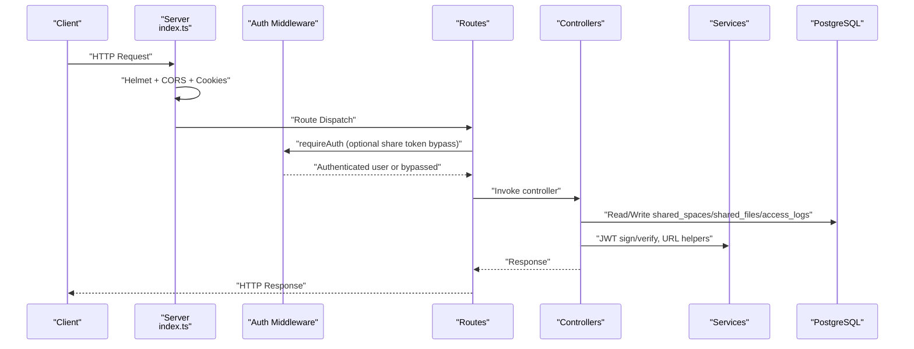

**Diagram sources**
- [index.ts](file://server/src/index.ts#L46-L108)
- [auth.middleware.ts](file://server/src/middlewares/auth.middleware.ts#L19-L81)
- [spaces.routes.ts](file://server/src/routes/spaces.routes.ts#L29-L32)
- [spaces.controller.ts](file://server/src/controllers/spaces.controller.ts#L128-L159)
- [share.controller.ts](file://server/src/controllers/share.controller.ts#L84-L112)
- [share.service.ts](file://server/src/services/share.service.ts#L62-L109)
- [db.ts](file://server/src/config/db.ts#L27-L37)

## Detailed Component Analysis

### Authentication and Authorization
- JWT-based authentication for internal endpoints validates bearer tokens and enriches requests with user context.
- Share link token bypass allows public download/thumbnail routes when a valid share link token is present.
- Space access tokens are validated via JWT verification and enforced in requireSpaceAccess.

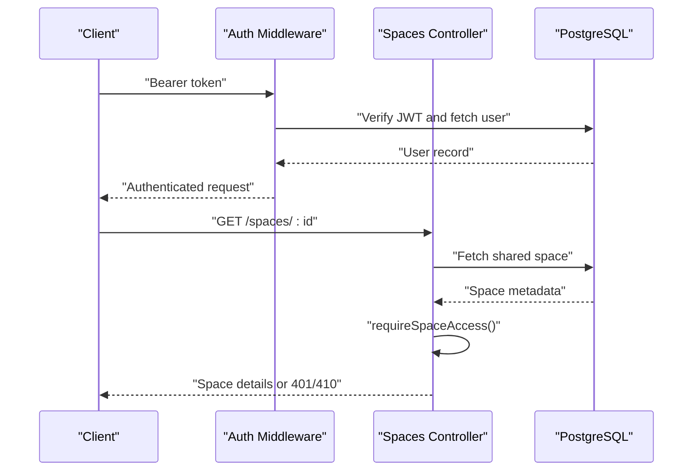

**Diagram sources**
- [auth.middleware.ts](file://server/src/middlewares/auth.middleware.ts#L19-L81)
- [spaces.controller.ts](file://server/src/controllers/spaces.controller.ts#L128-L159)
- [db.ts](file://server/src/config/db.ts#L27-L37)

**Section sources**
- [auth.middleware.ts](file://server/src/middlewares/auth.middleware.ts#L19-L81)
- [spaces.controller.ts](file://server/src/controllers/spaces.controller.ts#L128-L159)

### Space Access Tokens (x-space-access-token header or httpOnly cookies)
- Token generation signs a payload with a dedicated secret and 24-hour expiry.
- Validation reads token from header or httpOnly cookie, verifies signature, and ensures type and space ID match.
- requireSpaceAccess enforces password-protected spaces and expiration.

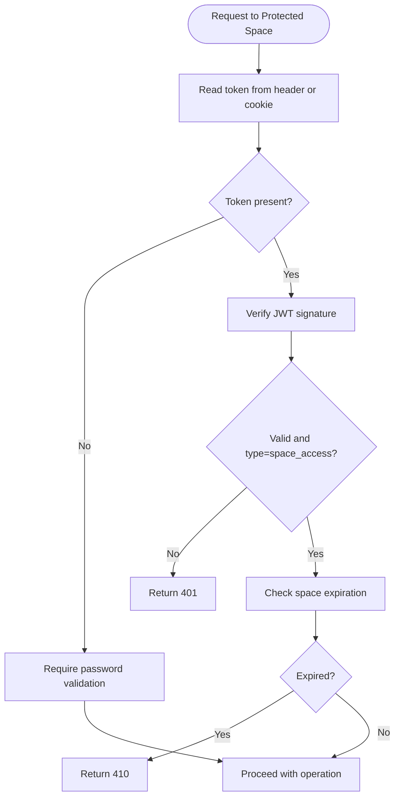

**Diagram sources**
- [spaces.controller.ts](file://server/src/controllers/spaces.controller.ts#L65-L85)
- [spaces.controller.ts](file://server/src/controllers/spaces.controller.ts#L128-L159)

**Section sources**
- [spaces.controller.ts](file://server/src/controllers/spaces.controller.ts#L65-L85)
- [spaces.controller.ts](file://server/src/controllers/spaces.controller.ts#L128-L159)

### Password Hashing with bcrypt (salt rounds=12)
- Passwords for shared_spaces and shared_links are hashed using bcrypt with a cost factor of 12.
- Verification uses bcrypt.compare with pre-checks to mitigate timing and format attacks.

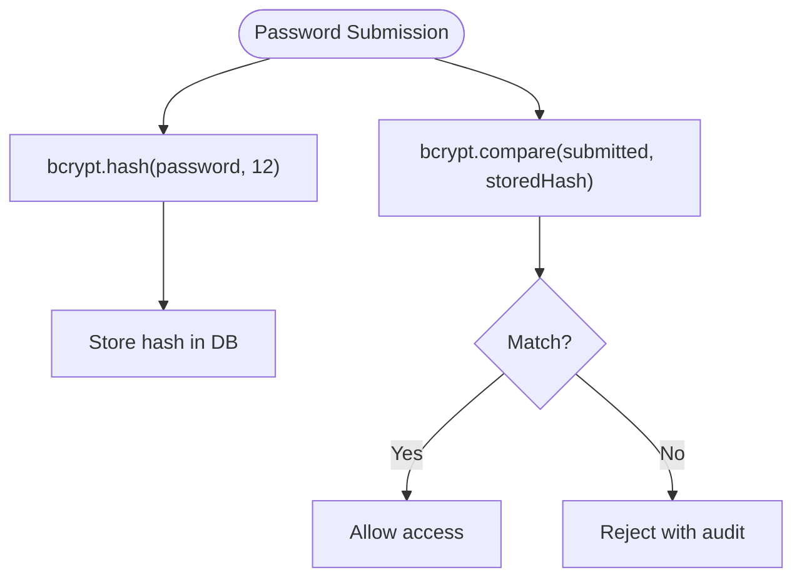

**Diagram sources**
- [spaces.controller.ts](file://server/src/controllers/spaces.controller.ts#L181-L181)
- [spaces.controller.ts](file://server/src/controllers/spaces.controller.ts#L87-L95)
- [share.controller.ts](file://server/src/controllers/share.controller.ts#L241-L241)
- [share.controller.ts](file://server/src/controllers/share.controller.ts#L380-L380)

**Section sources**
- [spaces.controller.ts](file://server/src/controllers/spaces.controller.ts#L181-L181)
- [spaces.controller.ts](file://server/src/controllers/spaces.controller.ts#L87-L95)
- [share.controller.ts](file://server/src/controllers/share.controller.ts#L241-L241)
- [share.controller.ts](file://server/src/controllers/share.controller.ts#L380-L380)

### File Upload Size Limits and MIME Allowlist
- Multer configured with destination and fileSize limit derived from environment variable (default ~200 MiB).
- Runtime validation rejects uploads exceeding the limit and unsupported MIME types against an allowlist.
- Uploaded files are streamed to Telegram, then metadata is persisted.

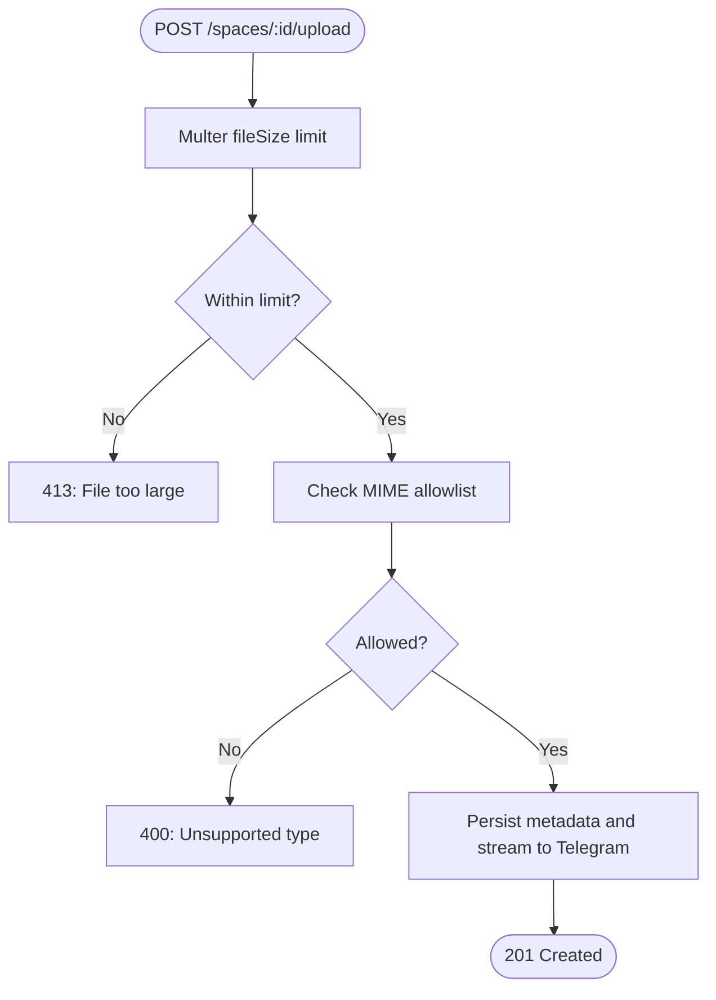

**Diagram sources**
- [spaces.routes.ts](file://server/src/routes/spaces.routes.ts#L19-L24)
- [spaces.controller.ts](file://server/src/controllers/spaces.controller.ts#L365-L372)

**Section sources**
- [spaces.routes.ts](file://server/src/routes/spaces.routes.ts#L19-L24)
- [spaces.controller.ts](file://server/src/controllers/spaces.controller.ts#L365-L372)
- [spaces.controller.ts](file://server/src/controllers/spaces.controller.ts#L26-L41)

### Link Expiry Enforcement (Public Endpoints)
- Shared spaces and links enforce expiration via timestamp checks.
- Controllers return 410 when expired; HTML render routes also guard against expired content.

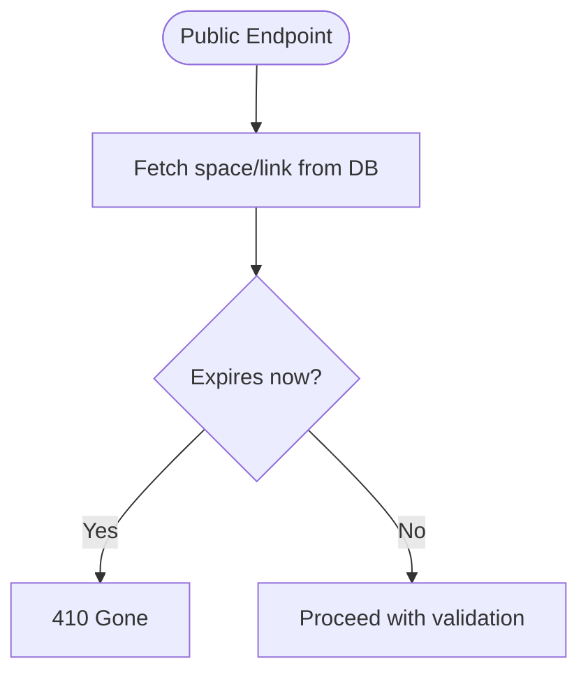

**Diagram sources**
- [spaces.controller.ts](file://server/src/controllers/spaces.controller.ts#L139-L142)
- [share.controller.ts](file://server/src/controllers/share.controller.ts#L102-L105)
- [index.ts](file://server/src/index.ts#L137-L138)

**Section sources**
- [spaces.controller.ts](file://server/src/controllers/spaces.controller.ts#L139-L142)
- [share.controller.ts](file://server/src/controllers/share.controller.ts#L102-L105)
- [index.ts](file://server/src/index.ts#L137-L138)

### Per-Action Rate Limiters
- Password attempts: strict limits for both share and space password endpoints.
- Views: throttling for public space and share views.
- Downloads: separate limits for share downloads and signed space downloads.
- Uploads: rate limiting for space uploads.
- Global rate limiter reduces DoS impact on non-sensitive endpoints.

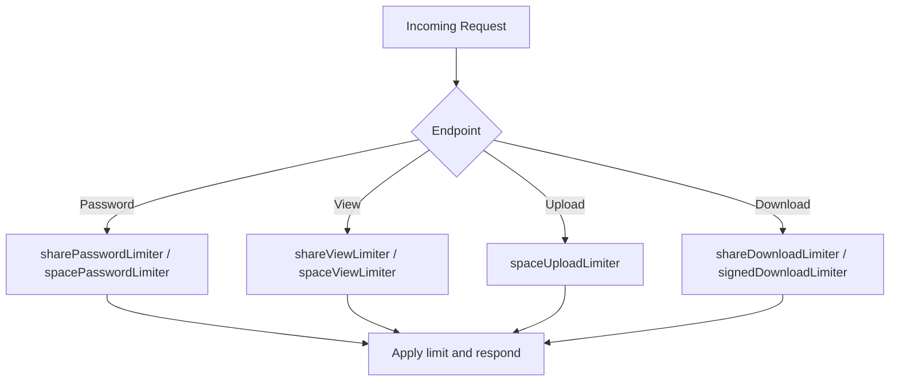

**Diagram sources**
- [rateLimit.middleware.ts](file://server/src/middlewares/rateLimit.middleware.ts#L4-L46)
- [spaces.routes.ts](file://server/src/routes/spaces.routes.ts#L29-L32)
- [space-files.routes.ts](file://server/src/routes/space-files.routes.ts#L7-L7)
- [index.ts](file://server/src/index.ts#L87-L98)

**Section sources**
- [rateLimit.middleware.ts](file://server/src/middlewares/rateLimit.middleware.ts#L4-L46)
- [spaces.routes.ts](file://server/src/routes/spaces.routes.ts#L29-L32)
- [space-files.routes.ts](file://server/src/routes/space-files.routes.ts#L7-L7)
- [index.ts](file://server/src/index.ts#L87-L98)

### Signed Download Token System (space_id + file_id binding, 10-minute TTL)
- Tokens bind space_id and file_id, signed with a dedicated secret, and expire in 10 minutes.
- Validation ensures token type, file binding, and presence of space_id.

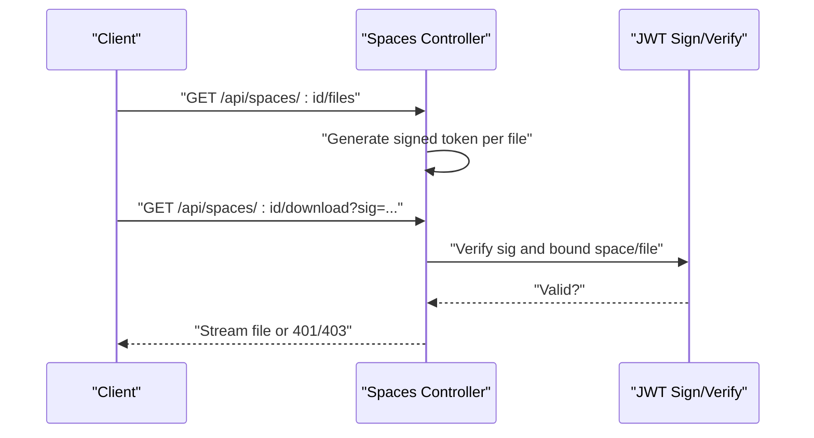

**Diagram sources**
- [spaces.controller.ts](file://server/src/controllers/spaces.controller.ts#L108-L126)
- [spaces.controller.ts](file://server/src/controllers/spaces.controller.ts#L427-L497)

**Section sources**
- [spaces.controller.ts](file://server/src/controllers/spaces.controller.ts#L108-L126)
- [spaces.controller.ts](file://server/src/controllers/spaces.controller.ts#L427-L497)

### Security Middleware Implementation
- Helmet sets CSP with nonce for script-src, reducing XSS risk.
- CORS configured with allowed origins and credential support; relaxed for share/public endpoints.
- Cookie parser with secret for signed cookies.
- Global rate limiter and auth-specific limiter reduce brute-force and abuse.

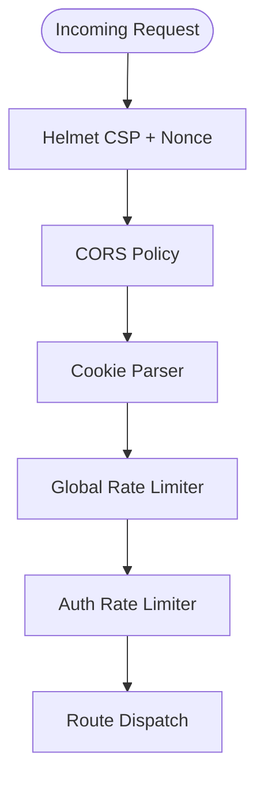

**Diagram sources**
- [index.ts](file://server/src/index.ts#L46-L108)
- [package.json](file://server/package.json#L29-L40)

**Section sources**
- [index.ts](file://server/src/index.ts#L46-L108)
- [package.json](file://server/package.json#L29-L40)

### Threat Mitigation Strategies
- Input sanitization and normalization (e.g., safeFolderPath) prevents path traversal and injection.
- Strict MIME allowlist and size limits mitigate malicious uploads.
- Short-lived signed tokens minimize exposure windows.
- Expiration checks on spaces and links prevent replay.
- Rate limiters protect sensitive operations from brute-force.
- Audit logging enables post-incident investigation.

**Section sources**
- [spaces.controller.ts](file://server/src/controllers/spaces.controller.ts#L43-L51)
- [spaces.controller.ts](file://server/src/controllers/spaces.controller.ts#L26-L41)
- [spaces.controller.ts](file://server/src/controllers/spaces.controller.ts#L108-L126)
- [spaces.controller.ts](file://server/src/controllers/spaces.controller.ts#L139-L142)
- [rateLimit.middleware.ts](file://server/src/middlewares/rateLimit.middleware.ts#L4-L46)
- [db.service.ts](file://server/src/services/db.service.ts#L107-L113)

### Audit Logging Through access_logs
- Controllers write access logs for significant actions (open space, password attempts, list files, upload, download).
- Logs include space_id, user IP, and action.

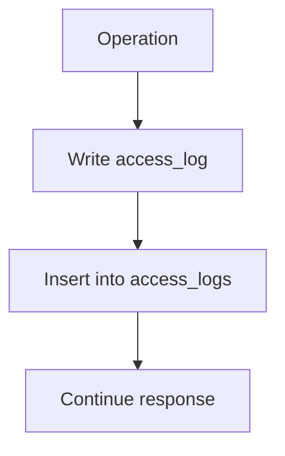

**Diagram sources**
- [spaces.controller.ts](file://server/src/controllers/spaces.controller.ts#L97-L106)
- [spaces.controller.ts](file://server/src/controllers/spaces.controller.ts#L277-L279)
- [spaces.controller.ts](file://server/src/controllers/spaces.controller.ts#L414-L414)
- [spaces.controller.ts](file://server/src/controllers/spaces.controller.ts#L479-L479)
- [db.service.ts](file://server/src/services/db.service.ts#L107-L113)

**Section sources**
- [spaces.controller.ts](file://server/src/controllers/spaces.controller.ts#L97-L106)
- [spaces.controller.ts](file://server/src/controllers/spaces.controller.ts#L277-L279)
- [spaces.controller.ts](file://server/src/controllers/spaces.controller.ts#L414-L414)
- [spaces.controller.ts](file://server/src/controllers/spaces.controller.ts#L479-L479)
- [db.service.ts](file://server/src/services/db.service.ts#L107-L113)

### Common Security Vulnerabilities and Prevention
- Path traversal: safeFolderPath normalizes and sanitizes folder paths.
- MIME/type confusion: allowlist enforcement restricts uploads to known safe types.
- Brute-force password attacks: strict per-action rate limiters.
- Replay/download abuse: signed tokens with short TTL and binding to space/file.
- Expiration bypass: timestamp checks on spaces and links.
- Insecure direct object references: requireSpaceAccess and signed download token binding.
- Insufficient logging: centralized writeAccessLog for auditable events.

**Section sources**
- [spaces.controller.ts](file://server/src/controllers/spaces.controller.ts#L43-L51)
- [spaces.controller.ts](file://server/src/controllers/spaces.controller.ts#L26-L41)
- [rateLimit.middleware.ts](file://server/src/middlewares/rateLimit.middleware.ts#L4-L46)
- [spaces.controller.ts](file://server/src/controllers/spaces.controller.ts#L108-L126)
- [spaces.controller.ts](file://server/src/controllers/spaces.controller.ts#L139-L142)
- [spaces.controller.ts](file://server/src/controllers/spaces.controller.ts#L128-L159)
- [spaces.controller.ts](file://server/src/controllers/spaces.controller.ts#L97-L106)

## Dependency Analysis
Security-related dependencies and their roles:
- express-rate-limit: per-endpoint and global rate limiting.
- helmet: CSP and transport security headers.
- cookie-parser: signed cookie parsing for httpOnly cookies.
- bcryptjs: password hashing and verification.
- jsonwebtoken: JWT signing/verification for tokens.
- multer: file upload handling with size limits.
- pg: PostgreSQL connection pool with SSL and timeouts.

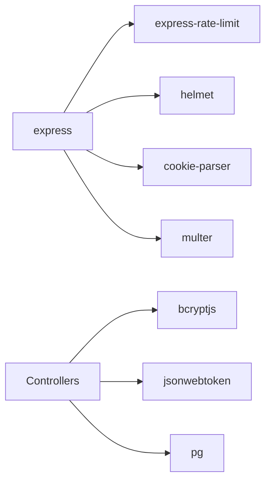

**Diagram sources**
- [package.json](file://server/package.json#L23-L40)
- [spaces.controller.ts](file://server/src/controllers/spaces.controller.ts#L6-L11)
- [auth.middleware.ts](file://server/src/middlewares/auth.middleware.ts#L2-L4)
- [spaces.routes.ts](file://server/src/routes/spaces.routes.ts#L2-L2)

**Section sources**
- [package.json](file://server/package.json#L23-L40)
- [spaces.controller.ts](file://server/src/controllers/spaces.controller.ts#L6-L11)
- [auth.middleware.ts](file://server/src/middlewares/auth.middleware.ts#L2-L4)
- [spaces.routes.ts](file://server/src/routes/spaces.routes.ts#L2-L2)

## Performance Considerations
- Multer destination and fileSize limits prevent resource exhaustion.
- bcrypt cost 12 balances security and CPU usage; adjust based on deployment capacity.
- Database pool tuned for small instances with SSL and idle timeouts.
- Global rate limiter avoids overwhelming downstream operations.

[No sources needed since this section provides general guidance]

## Troubleshooting Guide
- JWT_SECRET not set: fatal startup error in auth middleware and controllers.
- Multer file too large: handled globally and returned as 413.
- Missing or invalid bearer token: 401 from requireAuth.
- Invalid or expired signed download token: 401 from download handler.
- Space or link expired: 410 responses.
- Upload rejected due to MIME type: 400 responses.
- Audit logs not recorded: ensure writeAccessLog is invoked and DB is reachable.

**Section sources**
- [auth.middleware.ts](file://server/src/middlewares/auth.middleware.ts#L5-L6)
- [spaces.controller.ts](file://server/src/controllers/spaces.controller.ts#L97-L106)
- [index.ts](file://server/src/index.ts#L243-L246)
- [spaces.controller.ts](file://server/src/controllers/spaces.controller.ts#L427-L435)
- [spaces.controller.ts](file://server/src/controllers/spaces.controller.ts#L139-L142)
- [spaces.controller.ts](file://server/src/controllers/spaces.controller.ts#L369-L372)

## Conclusion
The shared spaces security model combines strong authentication, strict access tokens, robust upload controls, per-action rate limiting, short-lived signed tokens, and comprehensive audit logging. Together, these measures mitigate common threats while maintaining usability and performance.