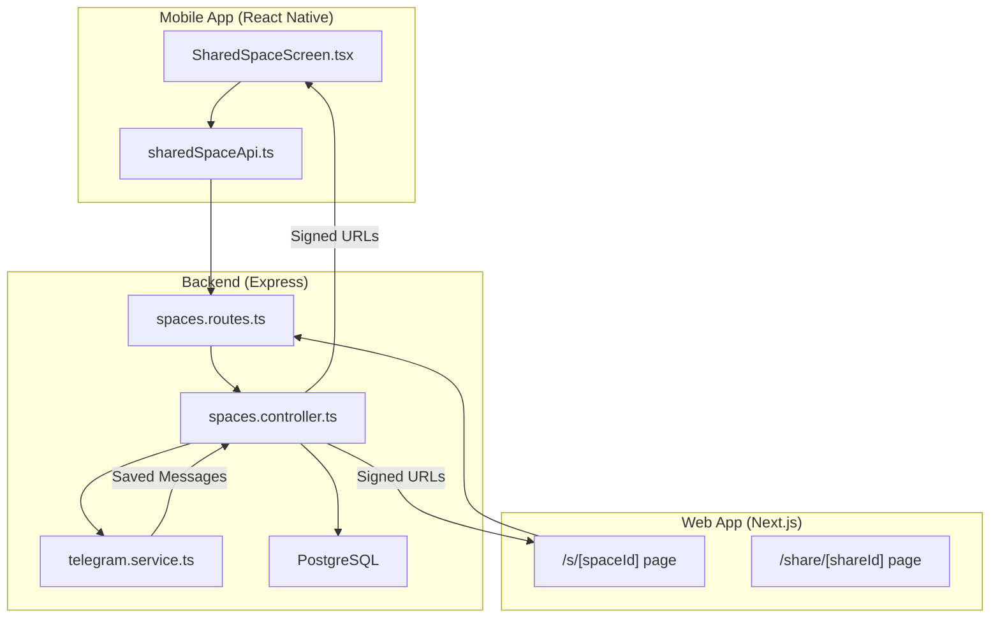
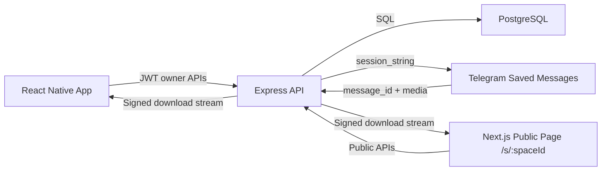
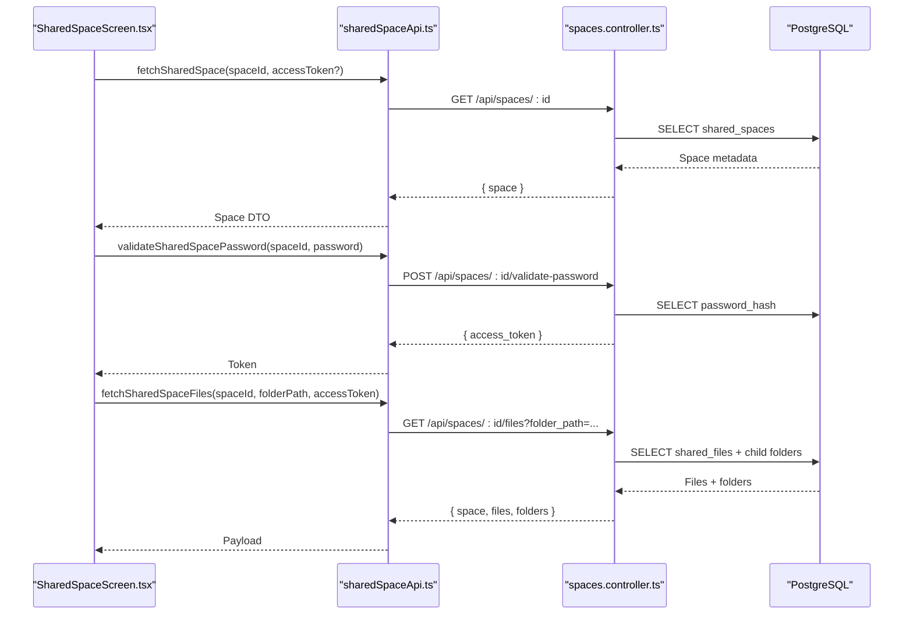
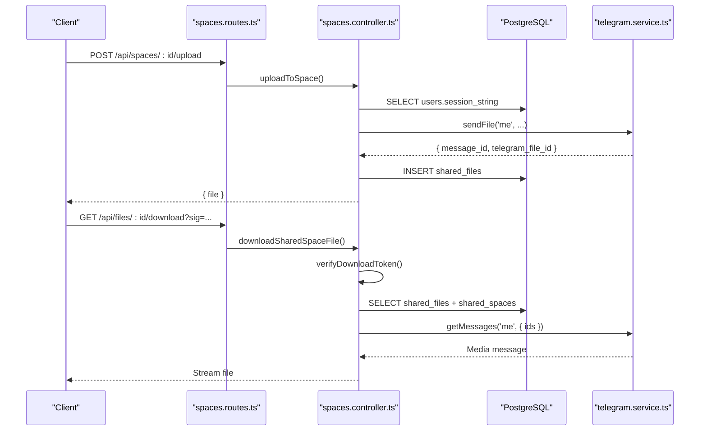
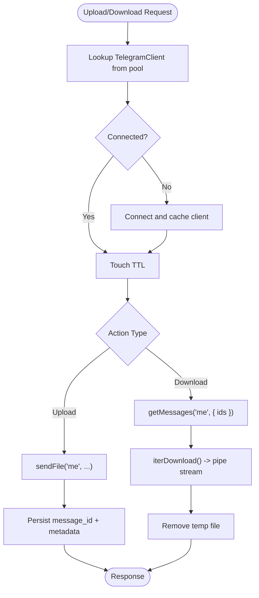
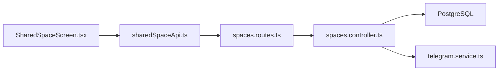
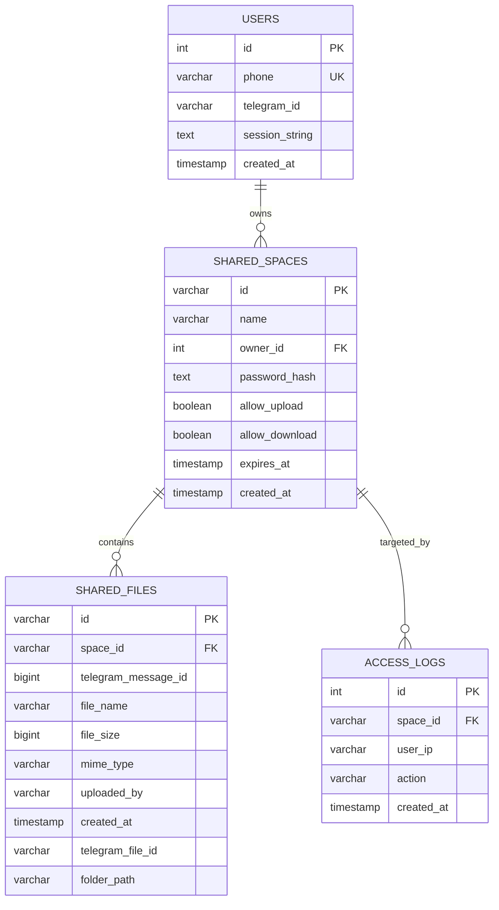

# Shared Spaces Architecture

<cite>
**Referenced Files in This Document**
- [shared-space-system.md](file://docs/shared-space-system.md)
- [spaces.controller.ts](file://server/src/controllers/spaces.controller.ts)
- [spaces.routes.ts](file://server/src/routes/spaces.routes.ts)
- [telegram.service.ts](file://server/src/services/telegram.service.ts)
- [db.service.ts](file://server/src/services/db.service.ts)
- [sharedSpaceApi.ts](file://app/src/services/sharedSpaceApi.ts)
- [SharedSpaceScreen.tsx](file://app/src/screens/SharedSpaceScreen.tsx)
- [index.ts](file://server/src/index.ts)
</cite>

## Table of Contents
1. [Introduction](#introduction)
2. [Project Structure](#project-structure)
3. [Core Components](#core-components)
4. [Architecture Overview](#architecture-overview)
5. [Detailed Component Analysis](#detailed-component-analysis)
6. [Dependency Analysis](#dependency-analysis)
7. [Performance Considerations](#performance-considerations)
8. [Security Architecture](#security-architecture)
9. [Database Schema and Relationships](#database-schema-and-relationships)
10. [Scalability Considerations](#scalability-considerations)
11. [Implementation Guidelines](#implementation-guidelines)
12. [Troubleshooting Guide](#troubleshooting-guide)
13. [Conclusion](#conclusion)

## Introduction
This document explains the Shared Spaces architecture for collaborative workspace design and system integration. It covers the high-level flow between a React Native mobile app, a Next.js public web page, an Express API, a PostgreSQL database, and Telegram Saved Messages as the storage backend. It documents component interactions, data flows, security controls, performance optimizations, and operational guidelines for extending and maintaining the system.

## Project Structure
The system spans three primary surfaces:
- Mobile app (React Native): navigates to shared spaces, handles password gates, lists files, and triggers downloads.
- Web app (Next.js): serves public pages under /s/:spaceId and /share/:shareId.
- Backend (Express): exposes REST endpoints, enforces access control, validates passwords, manages uploads/downloads, and integrates with Telegram.

**Diagram sources**
- [SharedSpaceScreen.tsx](file://app/src/screens/SharedSpaceScreen.tsx#L1-L282)
- [sharedSpaceApi.ts](file://app/src/services/sharedSpaceApi.ts#L1-L81)
- [spaces.routes.ts](file://server/src/routes/spaces.routes.ts#L1-L35)
- [spaces.controller.ts](file://server/src/controllers/spaces.controller.ts#L1-L498)
- [telegram.service.ts](file://server/src/services/telegram.service.ts#L1-L260)

**Section sources**
- [shared-space-system.md](file://docs/shared-space-system.md#L1-L134)
- [spaces.routes.ts](file://server/src/routes/spaces.routes.ts#L1-L35)
- [spaces.controller.ts](file://server/src/controllers/spaces.controller.ts#L1-L498)
- [telegram.service.ts](file://server/src/services/telegram.service.ts#L1-L260)
- [sharedSpaceApi.ts](file://app/src/services/sharedSpaceApi.ts#L1-L81)
- [SharedSpaceScreen.tsx](file://app/src/screens/SharedSpaceScreen.tsx#L1-L282)

## Core Components
- Mobile app screens and services:
  - SharedSpaceScreen orchestrates loading, password validation, folder navigation, and file actions.
  - sharedSpaceApi encapsulates HTTP calls to the backend with access tokens.
- Backend controllers and routes:
  - spaces.controller implements all shared space operations: creation, listing, password validation, file listing, uploads, and downloads.
  - spaces.routes defines endpoints and middleware (rate limits).
- Telegram integration:
  - telegram.service manages a persistent client pool, connects via session strings, and streams media progressively.
- Database service:
  - db.service initializes and maintains shared_spaces, shared_files, and access_logs tables.

**Section sources**
- [SharedSpaceScreen.tsx](file://app/src/screens/SharedSpaceScreen.tsx#L1-L282)
- [sharedSpaceApi.ts](file://app/src/services/sharedSpaceApi.ts#L1-L81)
- [spaces.controller.ts](file://server/src/controllers/spaces.controller.ts#L1-L498)
- [spaces.routes.ts](file://server/src/routes/spaces.routes.ts#L1-L35)
- [telegram.service.ts](file://server/src/services/telegram.service.ts#L1-L260)
- [db.service.ts](file://server/src/services/db.service.ts#L82-L121)

## Architecture Overview
The system uses a layered architecture:
- Presentation layer: React Native app and Next.js pages.
- Application layer: Express routes and controllers implementing business logic.
- Data layer: PostgreSQL for metadata and Telegram Saved Messages for binary storage.
- Integration layer: Telegram client pool for reliable, progressive streaming.

**Diagram sources**
- [shared-space-system.md](file://docs/shared-space-system.md#L5-L26)
- [spaces.controller.ts](file://server/src/controllers/spaces.controller.ts#L427-L497)
- [telegram.service.ts](file://server/src/services/telegram.service.ts#L57-L97)

## Detailed Component Analysis

### Mobile App: SharedSpaceScreen and sharedSpaceApi
- Responsibilities:
  - Load space metadata and files with optional password access.
  - Present folders and files, enable uploads when allowed, and trigger downloads via signed URLs.
- Key flows:
  - On mount, fetch space metadata; if password-protected, show PasswordGateComponent.
  - After successful password validation, persist access token and reload content.
  - Navigate folders and refresh lists without remounting the screen.

**Diagram sources**
- [SharedSpaceScreen.tsx](file://app/src/screens/SharedSpaceScreen.tsx#L29-L91)
- [sharedSpaceApi.ts](file://app/src/services/sharedSpaceApi.ts#L33-L56)
- [spaces.controller.ts](file://server/src/controllers/spaces.controller.ts#L218-L355)

**Section sources**
- [SharedSpaceScreen.tsx](file://app/src/screens/SharedSpaceScreen.tsx#L1-L282)
- [sharedSpaceApi.ts](file://app/src/services/sharedSpaceApi.ts#L1-L81)

### Backend: Express Routes and Controllers
- Routes:
  - Define authentication-required endpoints for owners and public endpoints for guests.
  - Apply rate-limiting middleware per action (view, password, upload).
- Controllers:
  - Enforce space expiration and password access checks.
  - Validate MIME types and upload sizes.
  - Generate signed tokens for downloads bound to both space and file identifiers.
  - Stream media from Telegram via a temporary file path and remove it after transfer.

**Diagram sources**
- [spaces.routes.ts](file://server/src/routes/spaces.routes.ts#L18-L35)
- [spaces.controller.ts](file://server/src/controllers/spaces.controller.ts#L357-L497)
- [telegram.service.ts](file://server/src/services/telegram.service.ts#L357-L401)

**Section sources**
- [spaces.routes.ts](file://server/src/routes/spaces.routes.ts#L1-L35)
- [spaces.controller.ts](file://server/src/controllers/spaces.controller.ts#L1-L498)
- [telegram.service.ts](file://server/src/services/telegram.service.ts#L1-L260)

### Telegram Integration: Client Pool and Progressive Streaming
- Client lifecycle:
  - Persistent pool keyed by session fingerprint with TTL eviction and reconnect on disconnect.
  - Graceful error propagation for expired or revoked sessions.
- Streaming:
  - Iterative download with configurable chunk size and byte-range support.
  - Temporary file writes and cleanup to avoid memory pressure.

**Diagram sources**
- [telegram.service.ts](file://server/src/services/telegram.service.ts#L57-L97)
- [telegram.service.ts](file://server/src/services/telegram.service.ts#L215-L251)

**Section sources**
- [telegram.service.ts](file://server/src/services/telegram.service.ts#L1-L260)

## Dependency Analysis
- Mobile app depends on sharedSpaceApi for HTTP communication and on SharedSpaceScreen for UI orchestration.
- Backend routes depend on controllers for business logic and on telegram.service for Telegram operations.
- Controllers depend on PostgreSQL for persistence and on telegram.service for media retrieval.
- Rate-limiting middleware is applied at the route level to protect public endpoints.

**Diagram sources**
- [SharedSpaceScreen.tsx](file://app/src/screens/SharedSpaceScreen.tsx#L1-L282)
- [sharedSpaceApi.ts](file://app/src/services/sharedSpaceApi.ts#L1-L81)
- [spaces.routes.ts](file://server/src/routes/spaces.routes.ts#L1-L35)
- [spaces.controller.ts](file://server/src/controllers/spaces.controller.ts#L1-L498)
- [telegram.service.ts](file://server/src/services/telegram.service.ts#L1-L260)

**Section sources**
- [spaces.routes.ts](file://server/src/routes/spaces.routes.ts#L1-L35)
- [spaces.controller.ts](file://server/src/controllers/spaces.controller.ts#L1-L498)
- [telegram.service.ts](file://server/src/services/telegram.service.ts#L1-L260)
- [sharedSpaceApi.ts](file://app/src/services/sharedSpaceApi.ts#L1-L81)
- [SharedSpaceScreen.tsx](file://app/src/screens/SharedSpaceScreen.tsx#L1-L282)

## Performance Considerations
- Stable effects and memoization:
  - Initial load guard prevents redundant work; memoized callbacks reduce re-renders.
- Incremental reloads:
  - Folder navigation reloads only affected views without remounting.
- Precomputed signed URLs:
  - Download links are computed server-side to avoid extra client roundtrips.
- Streaming optimizations:
  - Telegram iterDownload streams chunks without full buffering; temporary files are cleaned up promptly.
- Upload pipeline:
  - Multer destination and size limits prevent resource exhaustion; uploads are rejected early on invalid MIME types.

**Section sources**
- [shared-space-system.md](file://docs/shared-space-system.md#L109-L116)
- [spaces.controller.ts](file://server/src/controllers/spaces.controller.ts#L357-L497)
- [telegram.service.ts](file://server/src/services/telegram.service.ts#L215-L251)

## Security Architecture
- Authentication and access control:
  - Owner-only endpoints require JWT; public endpoints enforce password access via signed space access tokens stored in cookies.
- Cryptography:
  - Passwords hashed with bcrypt at configured cost; signed tokens for downloads bound to both space and file identifiers with short TTL.
- Content validation:
  - MIME allowlist and maximum upload size enforced at controller and middleware layers.
- Expiry enforcement:
  - Spaces and tokens expire; controllers reject requests accordingly.
- Rate limiting:
  - Separate rate limiters for view, password validation, and upload actions.

**Section sources**
- [spaces.controller.ts](file://server/src/controllers/spaces.controller.ts#L87-L126)
- [spaces.controller.ts](file://server/src/controllers/spaces.controller.ts#L161-L194)
- [spaces.routes.ts](file://server/src/routes/spaces.routes.ts#L12-L16)

## Database Schema and Relationships
The system uses three core tables:
- users: stores owner identities and Telegram session strings.
- shared_spaces: defines public spaces, permissions, and expiry.
- shared_files: records uploaded files’ metadata and Telegram message pointers.
- access_logs: tracks access events for auditing and abuse tracing.

**Diagram sources**
- [shared-space-system.md](file://docs/shared-space-system.md#L28-L62)
- [db.service.ts](file://server/src/services/db.service.ts#L82-L121)

**Section sources**
- [shared-space-system.md](file://docs/shared-space-system.md#L28-L62)
- [db.service.ts](file://server/src/services/db.service.ts#L82-L121)

## Scalability Considerations
- Horizontal scaling:
  - Stateless controllers and shared PostgreSQL database enable load balancing behind a reverse proxy.
- Caching:
  - Telegram client pool reduces connection churn; consider caching frequently accessed metadata.
- Asynchronous tasks:
  - Offload long-running operations (e.g., large file processing) to background jobs.
- CDN and edge:
  - Serve signed download streams efficiently; consider edge caching for repeated downloads.
- Observability:
  - Monitor access_logs for abuse detection and capacity planning; instrument rate-limiters and download metrics.

[No sources needed since this section provides general guidance]

## Implementation Guidelines
- Extending shared spaces:
  - Add new controller actions and routes following existing patterns; reuse rate-limiting middleware and access-control helpers.
  - For new UI features, mirror the existing separation between screens and service modules.
- Maintaining integrity:
  - Always verify space expiry and password access before mutating or exposing resources.
  - Ensure uploads validate MIME types and sizes; persist Telegram message identifiers reliably.
  - Clean up temporary files after streaming; log access events for auditability.
- Operational hygiene:
  - Keep secrets (JWT secrets, Telegram API credentials) in environment variables.
  - Monitor pool stats and client eviction events; alert on recurring reconnect failures.

[No sources needed since this section provides general guidance]

## Troubleshooting Guide
- Common issues and resolutions:
  - Expired or revoked Telegram sessions: client pool evicts expired clients; prompt users to re-authenticate and regenerate session strings.
  - Missing or invalid signed tokens: verify token TTL and binding to both space and file identifiers.
  - Upload failures: confirm MIME allowlist and size limits; inspect multer destination and cleanup logic.
  - Access denied errors: ensure password validation succeeded and access cookie/token is included in subsequent requests.
  - Rate-limited responses: adjust client-side retry delays and reduce bursty operations.

**Section sources**
- [telegram.service.ts](file://server/src/services/telegram.service.ts#L42-L47)
- [spaces.controller.ts](file://server/src/controllers/spaces.controller.ts#L128-L159)
- [spaces.controller.ts](file://server/src/controllers/spaces.controller.ts#L427-L497)

## Conclusion
The Shared Spaces system combines a React Native mobile interface, a Next.js public web presence, an Express backend, a PostgreSQL metadata store, and Telegram Saved Messages for scalable, collaborative file sharing. Its design emphasizes robust access control, progressive streaming, and operational resilience, with clear extension points and strong security defaults.

[No sources needed since this section summarizes without analyzing specific files]