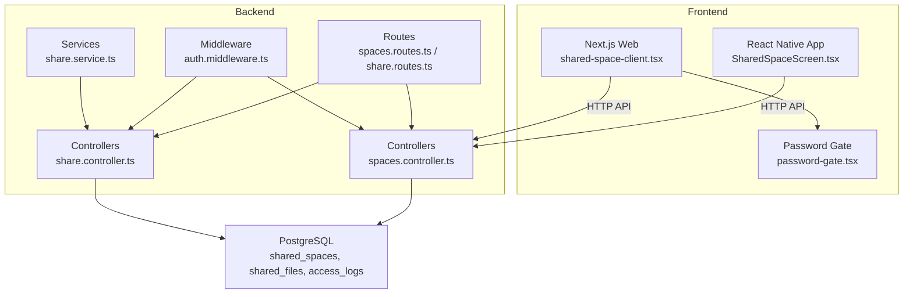
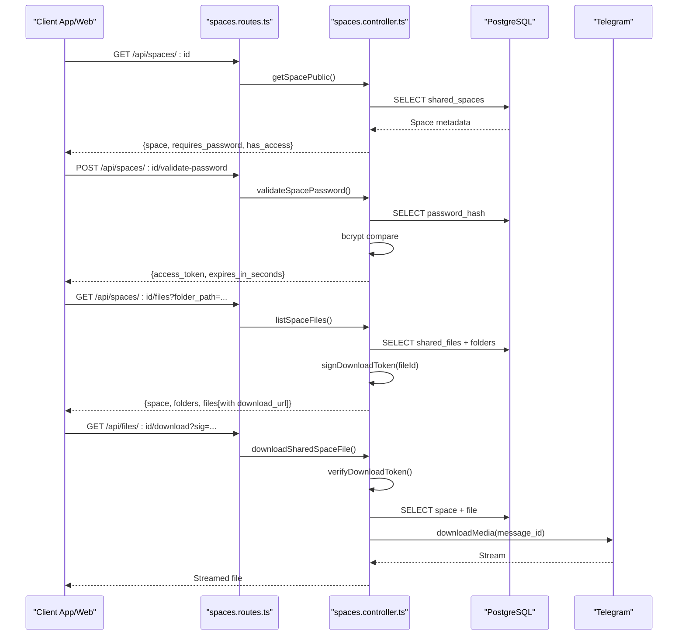
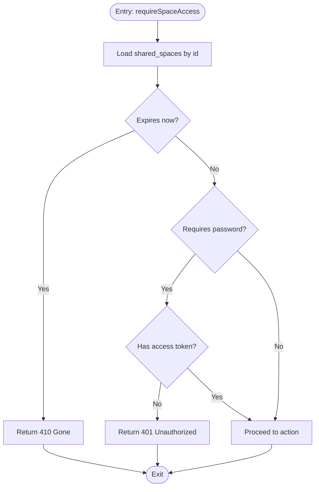
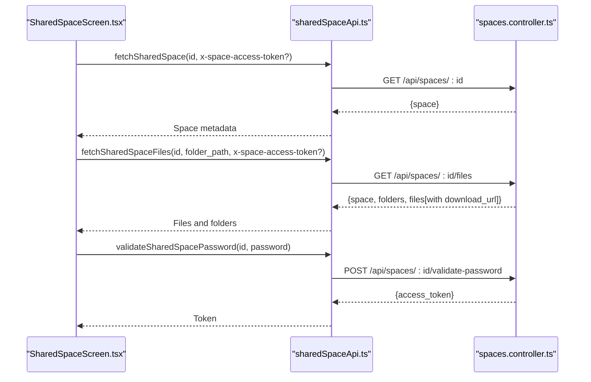
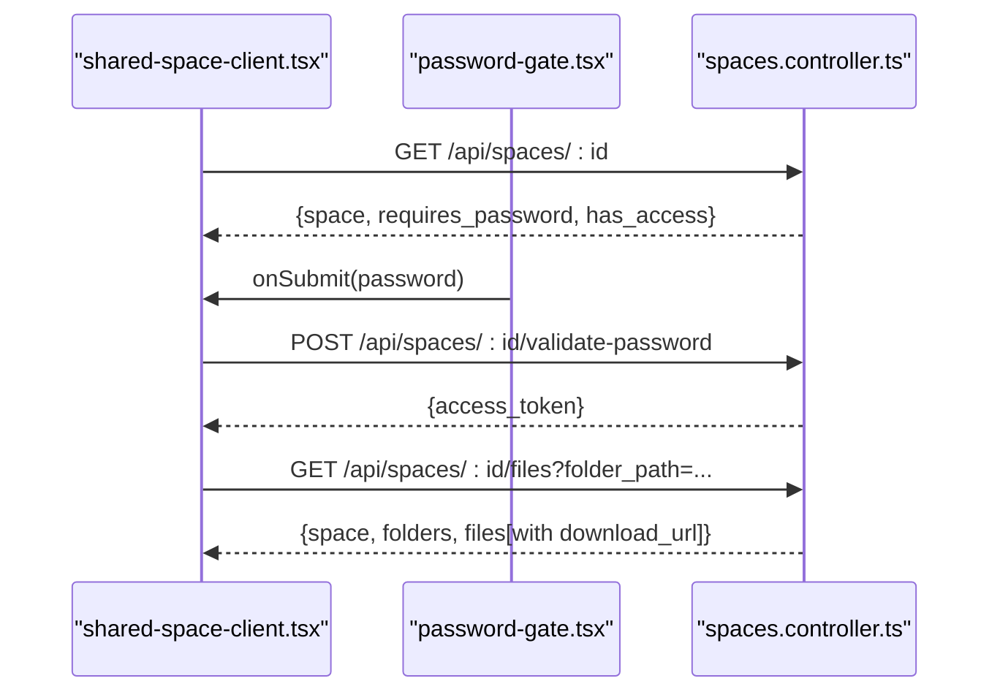
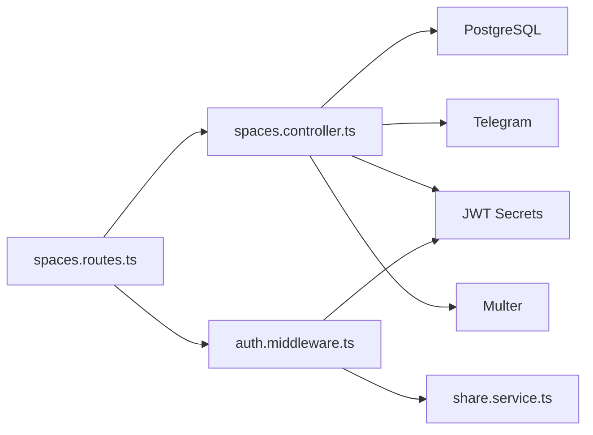

# Shared Spaces System

<cite>
**Referenced Files in This Document**
- [shared-space-system.md](file://docs/shared-space-system.md)
- [spaces.controller.ts](file://server/src/controllers/spaces.controller.ts)
- [share.controller.ts](file://server/src/controllers/share.controller.ts)
- [spaces.routes.ts](file://server/src/routes/spaces.routes.ts)
- [share.routes.ts](file://server/src/routes/share.routes.ts)
- [auth.middleware.ts](file://server/src/middlewares/auth.middleware.ts)
- [share.service.ts](file://server/src/services/share.service.ts)
- [sharedSpaceApi.ts](file://app/src/services/sharedSpaceApi.ts)
- [SharedSpaceScreen.tsx](file://app/src/screens/SharedSpaceScreen.tsx)
- [shared-space-client.tsx](file://web/app/s/[spaceId]/shared-space-client.tsx)
- [password-gate.tsx](file://web/app/s/[spaceId]/password-gate.tsx)
</cite>

## Table of Contents
1. [Introduction](#introduction)
2. [Project Structure](#project-structure)
3. [Core Components](#core-components)
4. [Architecture Overview](#architecture-overview)
5. [Detailed Component Analysis](#detailed-component-analysis)
6. [Dependency Analysis](#dependency-analysis)
7. [Performance Considerations](#performance-considerations)
8. [Security Considerations](#security-considerations)
9. [Troubleshooting Guide](#troubleshooting-guide)
10. [Implementation Guidelines](#implementation-guidelines)
11. [Conclusion](#conclusion)

## Introduction
This document explains the Shared Spaces system for collaborative workspaces, focusing on:
- Collaborative workspace creation and lifecycle
- File sharing mechanisms and access control
- Password protection and access tokens
- Backend controllers, frontend integrations, and security controls

The system uses Telegram Saved Messages as the storage backend, PostgreSQL for metadata, and JWT-based tokens for access control. It supports both a React Native app and a Next.js web interface for accessing shared spaces.

## Project Structure
The Shared Spaces feature spans three layers:
- Backend (Express): controllers, routes, middleware, and services
- Frontend (React Native): screens and service clients
- Frontend (Next.js Web): client components for public access

**Diagram sources**
- [spaces.routes.ts](file://server/src/routes/spaces.routes.ts#L1-L35)
- [share.routes.ts](file://server/src/routes/share.routes.ts#L1-L12)
- [spaces.controller.ts](file://server/src/controllers/spaces.controller.ts#L1-L498)
- [share.controller.ts](file://server/src/controllers/share.controller.ts#L1-L633)
- [auth.middleware.ts](file://server/src/middlewares/auth.middleware.ts#L1-L82)
- [share.service.ts](file://server/src/services/share.service.ts#L1-L183)
- [SharedSpaceScreen.tsx](file://app/src/screens/SharedSpaceScreen.tsx#L1-L282)
- [shared-space-client.tsx](file://web/app/s/[spaceId]/shared-space-client.tsx#L1-L162)
- [password-gate.tsx](file://web/app/s/[spaceId]/password-gate.tsx#L1-L97)

**Section sources**
- [spaces.routes.ts](file://server/src/routes/spaces.routes.ts#L1-L35)
- [share.routes.ts](file://server/src/routes/share.routes.ts#L1-L12)
- [spaces.controller.ts](file://server/src/controllers/spaces.controller.ts#L1-L498)
- [share.controller.ts](file://server/src/controllers/share.controller.ts#L1-L633)
- [auth.middleware.ts](file://server/src/middlewares/auth.middleware.ts#L1-L82)
- [share.service.ts](file://server/src/services/share.service.ts#L1-L183)
- [SharedSpaceScreen.tsx](file://app/src/screens/SharedSpaceScreen.tsx#L1-L282)
- [shared-space-client.tsx](file://web/app/s/[spaceId]/shared-space-client.tsx#L1-L162)
- [password-gate.tsx](file://web/app/s/[spaceId]/password-gate.tsx#L1-L97)

## Core Components
- Spaces Controller: Manages shared space creation, metadata retrieval, password validation, file listing, uploads, and downloads.
- Share Controller: Manages legacy share links (not covered in this document’s objective).
- Spaces Routes: Exposes REST endpoints for spaces with rate-limiting and auth middleware.
- Auth Middleware: Validates JWT for owners and allows share link token bypass for public downloads.
- Share Service: Provides token signing/verification and URL generation for share links.
- Frontend Clients:
  - React Native: SharedSpaceScreen orchestrates password gates, file listing, and uploads.
  - Next.js Web: shared-space-client.tsx handles public access, password validation, and file browsing.

Key responsibilities:
- Access control: password-required spaces issue access cookies/tokens; downloads use signed tokens bound to space/file.
- Storage: uploads go to Telegram Saved Messages; metadata stored in shared_files.
- Audit: access_logs tracks opens, password attempts, and downloads.

**Section sources**
- [spaces.controller.ts](file://server/src/controllers/spaces.controller.ts#L161-L194)
- [spaces.controller.ts](file://server/src/controllers/spaces.controller.ts#L218-L253)
- [spaces.controller.ts](file://server/src/controllers/spaces.controller.ts#L255-L295)
- [spaces.controller.ts](file://server/src/controllers/spaces.controller.ts#L297-L355)
- [spaces.controller.ts](file://server/src/controllers/spaces.controller.ts#L357-L425)
- [spaces.controller.ts](file://server/src/controllers/spaces.controller.ts#L427-L497)
- [spaces.routes.ts](file://server/src/routes/spaces.routes.ts#L18-L34)
- [auth.middleware.ts](file://server/src/middlewares/auth.middleware.ts#L19-L81)
- [share.service.ts](file://server/src/services/share.service.ts#L62-L129)
- [sharedSpaceApi.ts](file://app/src/services/sharedSpaceApi.ts#L29-L80)
- [SharedSpaceScreen.tsx](file://app/src/screens/SharedSpaceScreen.tsx#L16-L174)
- [shared-space-client.tsx](file://web/app/s/[spaceId]/shared-space-client.tsx#L29-L161)
- [password-gate.tsx](file://web/app/s/[spaceId]/password-gate.tsx#L14-L47)

## Architecture Overview
High-level flow:
- Owner creates a shared space with optional password and expiration.
- Public users access the space via URL; if password-protected, they must authenticate to receive an access token.
- File listing returns signed short-lived download tokens when allowed.
- Downloads stream directly from Telegram using a signed token bound to space and file.

**Diagram sources**
- [spaces.routes.ts](file://server/src/routes/spaces.routes.ts#L29-L32)
- [spaces.controller.ts](file://server/src/controllers/spaces.controller.ts#L218-L253)
- [spaces.controller.ts](file://server/src/controllers/spaces.controller.ts#L255-L295)
- [spaces.controller.ts](file://server/src/controllers/spaces.controller.ts#L297-L355)
- [spaces.controller.ts](file://server/src/controllers/spaces.controller.ts#L427-L497)

## Detailed Component Analysis

### Spaces Controller
Responsibilities:
- Space creation: validates name, optional password, future expiry; stores hashed password.
- Public metadata: checks expiry and password access; logs access.
- Password validation: bcrypt compare, rate-limited, sets httpOnly cookie for access.
- File listing: lists folders and files under a folder path; signs per-file download tokens.
- Upload: validates size/type, sends to Telegram Saved Messages, records metadata.
- Download: verifies signed token, checks space/file access, streams from Telegram.

**Diagram sources**
- [spaces.controller.ts](file://server/src/controllers/spaces.controller.ts#L128-L159)

Key helpers:
- Token signing/verification for space access and file downloads.
- IP extraction and access logging.
- MIME allowlist and safe folder path normalization.

**Section sources**
- [spaces.controller.ts](file://server/src/controllers/spaces.controller.ts#L13-L18)
- [spaces.controller.ts](file://server/src/controllers/spaces.controller.ts#L38-L51)
- [spaces.controller.ts](file://server/src/controllers/spaces.controller.ts#L53-L58)
- [spaces.controller.ts](file://server/src/controllers/spaces.controller.ts#L60-L67)
- [spaces.controller.ts](file://server/src/controllers/spaces.controller.ts#L69-L85)
- [spaces.controller.ts](file://server/src/controllers/spaces.controller.ts#L87-L95)
- [spaces.controller.ts](file://server/src/controllers/spaces.controller.ts#L97-L106)
- [spaces.controller.ts](file://server/src/controllers/spaces.controller.ts#L108-L126)
- [spaces.controller.ts](file://server/src/controllers/spaces.controller.ts#L128-L159)
- [spaces.controller.ts](file://server/src/controllers/spaces.controller.ts#L161-L194)
- [spaces.controller.ts](file://server/src/controllers/spaces.controller.ts#L218-L253)
- [spaces.controller.ts](file://server/src/controllers/spaces.controller.ts#L255-L295)
- [spaces.controller.ts](file://server/src/controllers/spaces.controller.ts#L297-L355)
- [spaces.controller.ts](file://server/src/controllers/spaces.controller.ts#L357-L425)
- [spaces.controller.ts](file://server/src/controllers/spaces.controller.ts#L427-L497)

### Spaces Routes
- Enforce auth for owner-only endpoints.
- Apply rate limiters for view, password, and upload actions.
- Mount multer for single file uploads with size limits.

**Section sources**
- [spaces.routes.ts](file://server/src/routes/spaces.routes.ts#L18-L34)

### Auth Middleware
- Standard JWT auth for owners.
- Share link token bypass for public download/stream/thumbnail endpoints, resolving owner session for Telegram access.

**Section sources**
- [auth.middleware.ts](file://server/src/middlewares/auth.middleware.ts#L19-L81)

### Share Service (for share links)
- Provides token signing/verification for share links and access tokens.
- Generates share URLs and normalizes paths for breadcrumb navigation.

Note: This service is used by the share controller and is included for completeness.

**Section sources**
- [share.service.ts](file://server/src/services/share.service.ts#L62-L129)
- [share.service.ts](file://server/src/services/share.service.ts#L141-L182)

### Frontend Integrations

#### React Native SharedSpaceScreen
- Loads space metadata and files.
- Shows password gate when required.
- Supports upload and download actions.

**Diagram sources**
- [SharedSpaceScreen.tsx](file://app/src/screens/SharedSpaceScreen.tsx#L29-L86)
- [sharedSpaceApi.ts](file://app/src/services/sharedSpaceApi.ts#L33-L56)
- [sharedSpaceApi.ts](file://app/src/services/sharedSpaceApi.ts#L39-L43)
- [spaces.controller.ts](file://server/src/controllers/spaces.controller.ts#L218-L253)
- [spaces.controller.ts](file://server/src/controllers/spaces.controller.ts#L255-L295)

**Section sources**
- [SharedSpaceScreen.tsx](file://app/src/screens/SharedSpaceScreen.tsx#L16-L174)
- [sharedSpaceApi.ts](file://app/src/services/sharedSpaceApi.ts#L1-L81)

#### Next.js Web shared-space-client.tsx
- Client-side state for space, files, folders, password, and access token.
- Password gate component renders a styled form.
- Uses fetch with x-space-access-token header or cookies.

**Diagram sources**
- [shared-space-client.tsx](file://web/app/s/[spaceId]/shared-space-client.tsx#L29-L161)
- [password-gate.tsx](file://web/app/s/[spaceId]/password-gate.tsx#L14-L47)
- [spaces.controller.ts](file://server/src/controllers/spaces.controller.ts#L218-L253)
- [spaces.controller.ts](file://server/src/controllers/spaces.controller.ts#L255-L295)
- [spaces.controller.ts](file://server/src/controllers/spaces.controller.ts#L297-L355)

**Section sources**
- [shared-space-client.tsx](file://web/app/s/[spaceId]/shared-space-client.tsx#L1-L162)
- [password-gate.tsx](file://web/app/s/[spaceId]/password-gate.tsx#L1-L97)

## Dependency Analysis
- Controllers depend on:
  - Database pool for SQL queries
  - Telegram client for uploads/downloads
  - JWT for access tokens and signed download tokens
  - Multer for uploads
- Routes depend on:
  - Controllers
  - Rate limiters
  - Multer for uploads
- Middleware depends on:
  - JWT secret
  - Share service for token verification (for share links)
- Services depend on:
  - JWT secrets for signing/verifying tokens
  - Environment variables for base URLs and TTLs

**Diagram sources**
- [spaces.routes.ts](file://server/src/routes/spaces.routes.ts#L1-L35)
- [spaces.controller.ts](file://server/src/controllers/spaces.controller.ts#L1-L498)
- [auth.middleware.ts](file://server/src/middlewares/auth.middleware.ts#L1-L82)
- [share.service.ts](file://server/src/services/share.service.ts#L1-L183)

**Section sources**
- [spaces.routes.ts](file://server/src/routes/spaces.routes.ts#L1-L35)
- [spaces.controller.ts](file://server/src/controllers/spaces.controller.ts#L1-L498)
- [auth.middleware.ts](file://server/src/middlewares/auth.middleware.ts#L1-L82)
- [share.service.ts](file://server/src/services/share.service.ts#L1-L183)

## Performance Considerations
- Stable effects and memoization reduce re-renders and redundant network calls.
- Incremental reloads for folder navigation avoid full-screen resets.
- Precomputed signed download URLs eliminate extra client roundtrips.
- Temporary download directories and cleanup minimize disk usage.

[No sources needed since this section provides general guidance]

## Security Considerations
- Password hashing: bcrypt with 12 rounds for shared spaces.
- Access tokens: httpOnly cookies for space access; signed tokens for downloads.
- Rate limiting: per-action rate limiters for view, password, upload, and download.
- Expiration: spaces and tokens expire; enforced on both server and client.
- MIME allowlist and size caps prevent abuse.
- Signed download tokens bind to both space and file, with short TTL.
- Audit logging: access_logs captures opens, password attempts, and downloads.

**Section sources**
- [shared-space-system.md](file://docs/shared-space-system.md#L99-L108)
- [spaces.controller.ts](file://server/src/controllers/spaces.controller.ts#L18-L18)
- [spaces.controller.ts](file://server/src/controllers/spaces.controller.ts#L26-L36)
- [spaces.controller.ts](file://server/src/controllers/spaces.controller.ts#L108-L126)
- [spaces.controller.ts](file://server/src/controllers/spaces.controller.ts#L97-L106)

## Troubleshooting Guide
Common issues and resolutions:
- 401 Unauthorized during file listing: indicates missing or invalid access token; trigger password validation again.
- 401/410 on download: verify signed token validity and space/file existence.
- 403 Upload/Download disabled: check space.allow_upload or allow_download flags.
- 413 Upload size exceeded: ensure file size respects configured limit.
- 400 Unsupported MIME type: confirm file type against allowlist.
- Rate limit errors: implement backoff and retry logic client-side.

**Section sources**
- [spaces.controller.ts](file://server/src/controllers/spaces.controller.ts#L365-L372)
- [spaces.controller.ts](file://server/src/controllers/spaces.controller.ts#L377-L380)
- [spaces.controller.ts](file://server/src/controllers/spaces.controller.ts#L441-L443)
- [spaces.controller.ts](file://server/src/controllers/spaces.controller.ts#L432-L435)

## Implementation Guidelines
Extending shared space functionality:
- Add new flags or fields to shared_spaces and shared_files tables with appropriate defaults.
- Update controllers to validate new constraints and enforce permissions.
- Extend routes with new endpoints and apply rate limiters.
- Update frontend clients to surface new UI and handle new responses.
- Add audit logging entries for new actions.
- Integrate with Telegram client for new storage behaviors.

Integration patterns:
- Use x-space-access-token header or httpOnly cookie for protected endpoints.
- Generate signed download tokens server-side and pass only the sig parameter to clients.
- Normalize folder paths and enforce allowlists for MIME types and sizes.
- Respect space expiration and access flags in all public endpoints.

**Section sources**
- [shared-space-system.md](file://docs/shared-space-system.md#L126-L134)
- [spaces.controller.ts](file://server/src/controllers/spaces.controller.ts#L13-L18)
- [spaces.controller.ts](file://server/src/controllers/spaces.controller.ts#L26-L36)
- [spaces.controller.ts](file://server/src/controllers/spaces.controller.ts#L108-L126)
- [spaces.controller.ts](file://server/src/controllers/spaces.controller.ts#L388-L394)
- [spaces.controller.ts](file://server/src/controllers/spaces.controller.ts#L427-L497)

## Conclusion
The Shared Spaces system provides a secure, scalable way to collaborate via password-protected workspaces with fine-grained permissions and auditability. By combining PostgreSQL metadata, Telegram-backed storage, and JWT-based access tokens, it delivers a modern, self-hosted solution suitable for teams and individuals who value privacy and control.