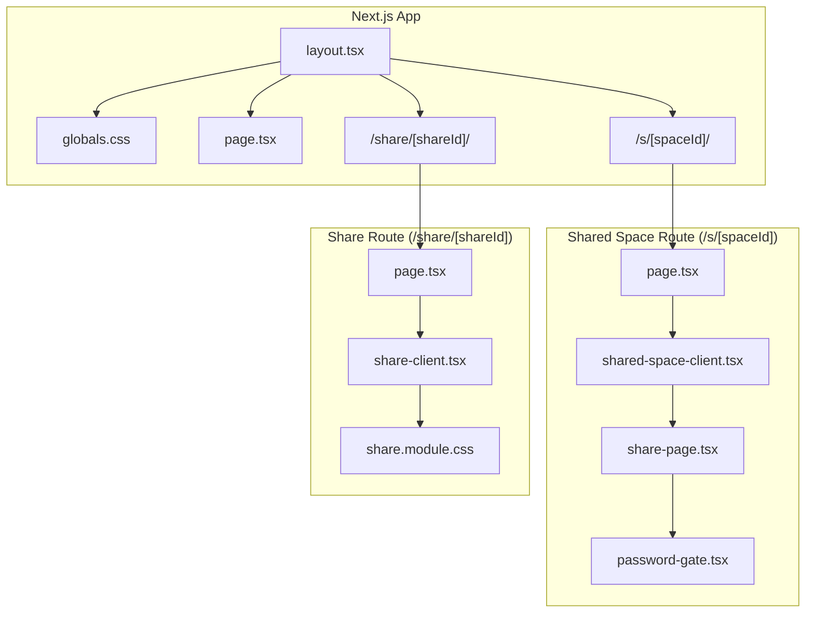
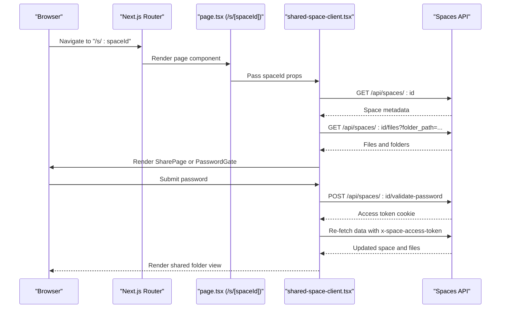
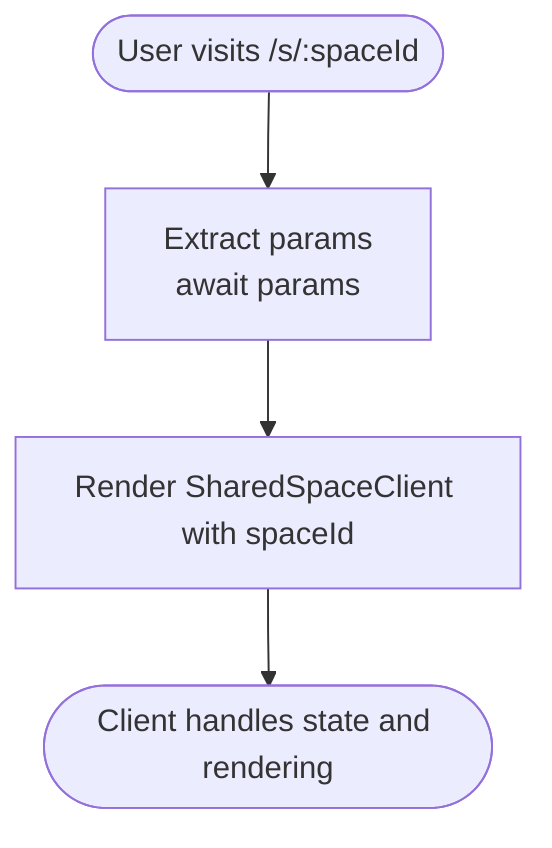
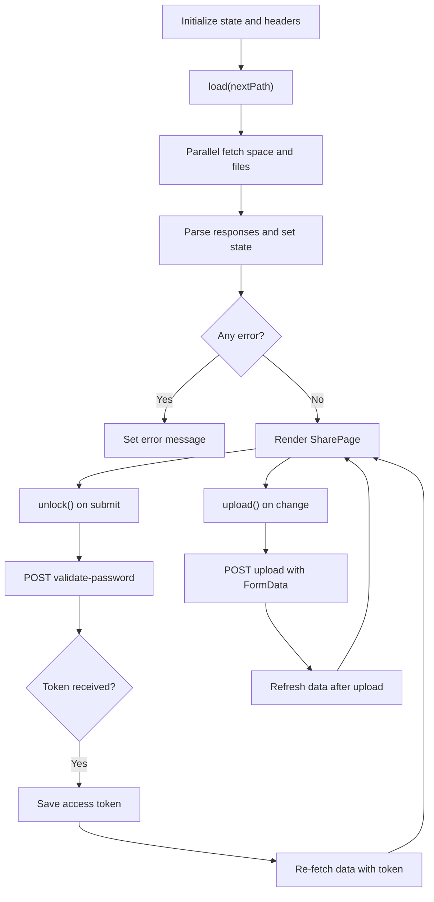
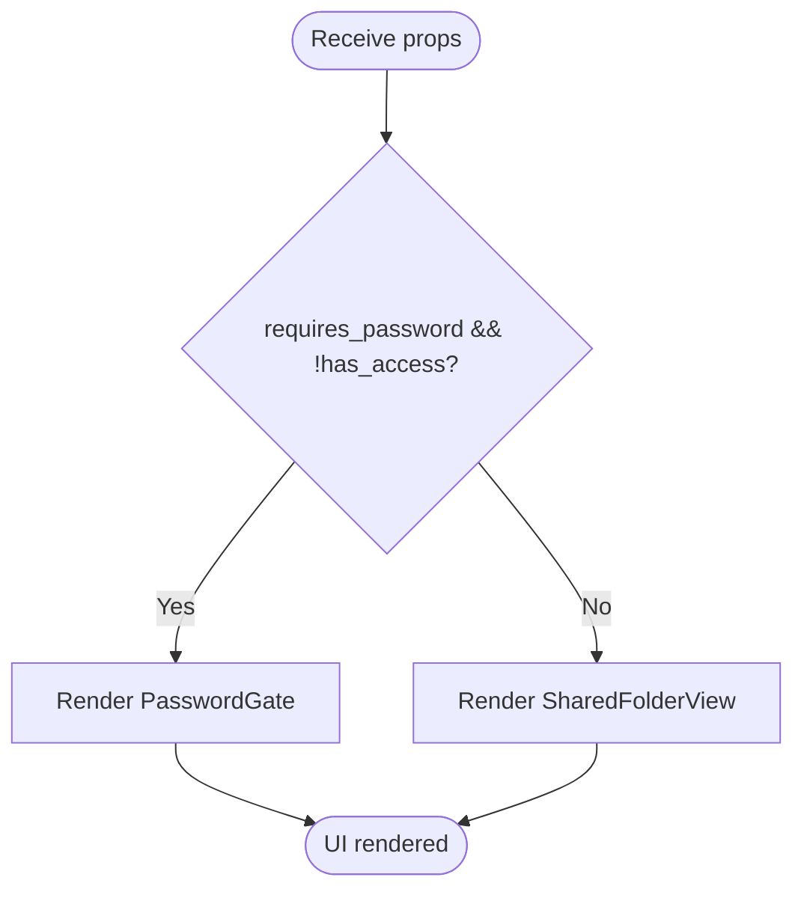
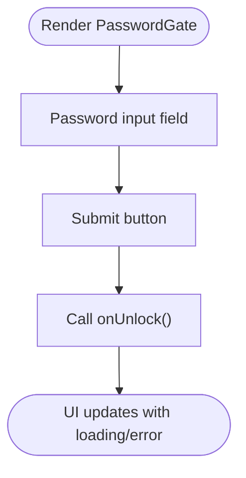
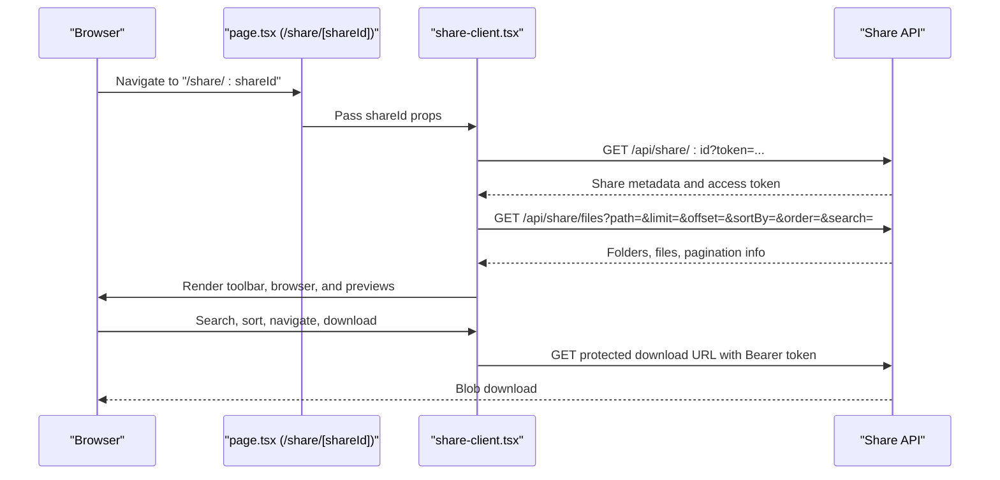
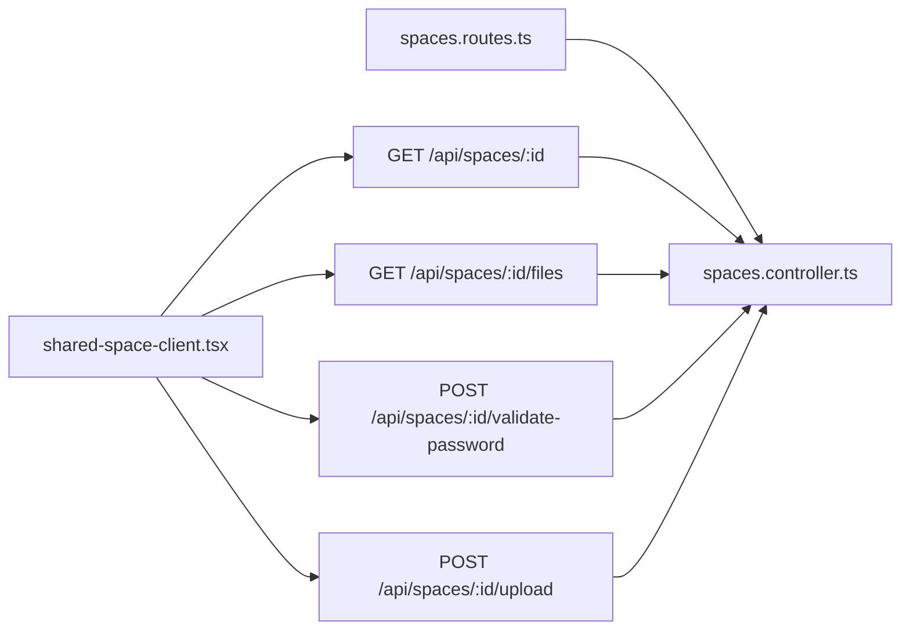
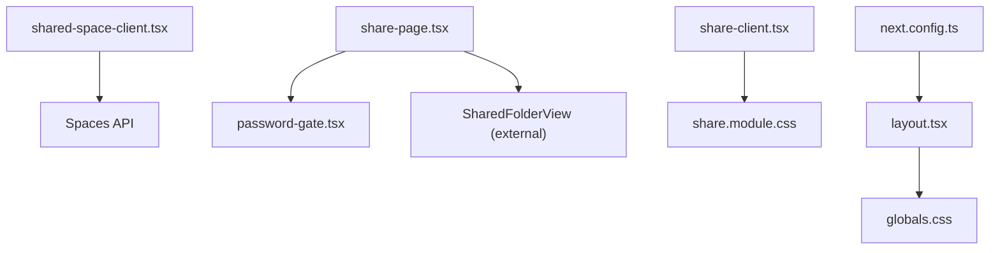

# Web Interface Integration

<cite>
**Referenced Files in This Document**
- [web/app/layout.tsx](file://web/app/layout.tsx)
- [web/app/page.tsx](file://web/app/page.tsx)
- [web/app/s/[spaceId]/page.tsx](file://web/app/s/[spaceId]/page.tsx)
- [web/app/s/[spaceId]/shared-space-client.tsx](file://web/app/s/[spaceId]/shared-space-client.tsx)
- [web/app/s/[spaceId]/share-page.tsx](file://web/app/s/[spaceId]/share-page.tsx)
- [web/app/s/[spaceId]/password-gate.tsx](file://web/app/s/[spaceId]/password-gate.tsx)
- [web/app/share/[shareId]/page.tsx](file://web/app/share/[shareId]/page.tsx)
- [web/app/share/[shareId]/share-client.tsx](file://web/app/share/[shareId]/share-client.tsx)
- [web/app/share/[shareId]/share.module.css](file://web/app/share/[shareId]/share.module.css)
- [web/next.config.ts](file://web/next.config.ts)
- [web/app/globals.css](file://web/app/globals.css)
- [server/src/controllers/spaces.controller.ts](file://server/src/controllers/spaces.controller.ts)
- [server/src/routes/spaces.routes.ts](file://server/src/routes/spaces.routes.ts)
</cite>

## Table of Contents
1. [Introduction](#introduction)
2. [Project Structure](#project-structure)
3. [Core Components](#core-components)
4. [Architecture Overview](#architecture-overview)
5. [Detailed Component Analysis](#detailed-component-analysis)
6. [Dependency Analysis](#dependency-analysis)
7. [Performance Considerations](#performance-considerations)
8. [Troubleshooting Guide](#troubleshooting-guide)
9. [Conclusion](#conclusion)
10. [Appendices](#appendices)

## Introduction
This document explains the web interface integration for Next.js application structure and shared space client implementation. It focuses on:
- Next.js routing with the /s/:spaceId URL pattern and page component structure
- Client-side state management, authentication handling, and real-time updates in shared-space-client.tsx
- Public shared space access via share-page.tsx with password gate functionality
- Rendering of spaces, file listings, and user interaction patterns in page.tsx
- Component composition patterns and integration with shared space API endpoints
- Responsive design, accessibility, and cross-browser compatibility
- Performance optimization techniques including memoization, lazy loading, and efficient data fetching

## Project Structure
The web application is organized under the Next.js app directory with route segments for shared spaces and general pages. Key areas:
- Root layout and global styles define the application shell and theme
- Route groups for /s/[spaceId] implement public shared space access
- Route groups for /share/[shareId] implement another sharing mechanism
- Global CSS and Next.js configuration provide consistent styling and runtime behavior

**Diagram sources**
- [web/app/layout.tsx](file://web/app/layout.tsx#L1-L16)
- [web/app/globals.css](file://web/app/globals.css#L1-L184)
- [web/app/page.tsx](file://web/app/page.tsx#L1-L9)
- [web/app/s/[spaceId]/page.tsx](file://web/app/s/[spaceId]/page.tsx#L1-L7)
- [web/app/s/[spaceId]/shared-space-client.tsx](file://web/app/s/[spaceId]/shared-space-client.tsx#L1-L167)
- [web/app/s/[spaceId]/share-page.tsx](file://web/app/s/[spaceId]/share-page.tsx#L1-L73)
- [web/app/s/[spaceId]/password-gate.tsx](file://web/app/s/[spaceId]/password-gate.tsx#L1-L97)
- [web/app/share/[shareId]/page.tsx](file://web/app/share/[shareId]/page.tsx#L1-L7)
- [web/app/share/[shareId]/share-client.tsx](file://web/app/share/[shareId]/share-client.tsx#L1-L800)
- [web/app/share/[shareId]/share.module.css](file://web/app/share/[shareId]/share.module.css#L1-L847)

**Section sources**
- [web/app/layout.tsx](file://web/app/layout.tsx#L1-L16)
- [web/app/globals.css](file://web/app/globals.css#L1-L184)
- [web/app/page.tsx](file://web/app/page.tsx#L1-L9)
- [web/app/s/[spaceId]/page.tsx](file://web/app/s/[spaceId]/page.tsx#L1-L7)
- [web/app/share/[shareId]/page.tsx](file://web/app/share/[shareId]/page.tsx#L1-L7)

## Core Components
This section documents the primary building blocks for shared space access and rendering.

- SharedSpacePage (/s/[spaceId]/page.tsx): Entry point that extracts the spaceId and renders the client component.
- SharedSpaceClient (/s/[spaceId]/shared-space-client.tsx): Central client component managing state, authentication, file/folder listing, and uploads.
- SharePage (/s/[spaceId]/share-page.tsx): Renders either the password gate or the shared folder view based on access state.
- PasswordGate (/s/[spaceId]/password-gate.tsx): UI for entering passwords to unlock shared spaces.
- ShareClient (/share/[shareId]/share-client.tsx): Alternative client for share links with advanced features like pagination, search, sorting, and previews.
- Styles: Global and module CSS provide responsive design and accessibility-compliant UI.

Key responsibilities:
- State management: Tracks space metadata, files, folders, current path, access token, and errors
- Authentication: Validates passwords and manages access tokens via cookies
- Data fetching: Uses concurrent requests for space and files, with robust error handling
- Interactions: Supports upload, navigation, and download actions

**Section sources**
- [web/app/s/[spaceId]/page.tsx](file://web/app/s/[spaceId]/page.tsx#L1-L7)
- [web/app/s/[spaceId]/shared-space-client.tsx](file://web/app/s/[spaceId]/shared-space-client.tsx#L1-L167)
- [web/app/s/[spaceId]/share-page.tsx](file://web/app/s/[spaceId]/share-page.tsx#L1-L73)
- [web/app/s/[spaceId]/password-gate.tsx](file://web/app/s/[spaceId]/password-gate.tsx#L1-L97)
- [web/app/share/[shareId]/share-client.tsx](file://web/app/share/[shareId]/share-client.tsx#L1-L800)
- [web/app/share/[shareId]/share.module.css](file://web/app/share/[shareId]/share.module.css#L1-L847)

## Architecture Overview
The shared space flow integrates Next.js dynamic routes, client components, and backend APIs. The client components coordinate:
- Route extraction of identifiers
- Conditional rendering based on access state
- Fetching space metadata and file listings
- Managing authentication tokens and password gates
- Handling uploads and downloads

**Diagram sources**
- [web/app/s/[spaceId]/page.tsx](file://web/app/s/[spaceId]/page.tsx#L1-L7)
- [web/app/s/[spaceId]/shared-space-client.tsx](file://web/app/s/[spaceId]/shared-space-client.tsx#L43-L80)
- [server/src/controllers/spaces.controller.ts](file://server/src/controllers/spaces.controller.ts#L218-L295)
- [server/src/routes/spaces.routes.ts](file://server/src/routes/spaces.routes.ts#L29-L32)

## Detailed Component Analysis

### Next.js Routing with /s/:spaceId
- Dynamic segment: The route group /s/[spaceId] captures the space identifier
- Page component: Extracts params asynchronously and passes spaceId to the client component
- Behavior: Enables public access to shared spaces via the spaceId

**Diagram sources**
- [web/app/s/[spaceId]/page.tsx](file://web/app/s/[spaceId]/page.tsx#L3-L6)

**Section sources**
- [web/app/s/[spaceId]/page.tsx](file://web/app/s/[spaceId]/page.tsx#L1-L7)

### SharedSpaceClient: State Management, Authentication, and Real-Time Updates
Responsibilities:
- State: Manages space metadata, files, folders, current folder path, password, access token, loading, and error states
- Headers: Builds conditional headers using the access token
- Concurrent loading: Fetches space and files in parallel
- Password validation: Submits password to backend and sets access token cookie
- Uploads: Posts FormData with folder_path and file, then refreshes data
- Navigation: Supports moving up and opening folders

**Diagram sources**
- [web/app/s/[spaceId]/shared-space-client.tsx](file://web/app/s/[spaceId]/shared-space-client.tsx#L29-L167)

**Section sources**
- [web/app/s/[spaceId]/shared-space-client.tsx](file://web/app/s/[spaceId]/shared-space-client.tsx#L1-L167)

### SharePage: Conditional Rendering and Composition
Responsibilities:
- Determines whether to render the password gate or the shared folder view
- Passes props for space, files, folders, folder path, loading, error, and handlers

**Diagram sources**
- [web/app/s/[spaceId]/share-page.tsx](file://web/app/s/[spaceId]/share-page.tsx#L40-L72)

**Section sources**
- [web/app/s/[spaceId]/share-page.tsx](file://web/app/s/[spaceId]/share-page.tsx#L1-L73)

### PasswordGate: Public Access Control
Responsibilities:
- Displays branding and folder name
- Provides a password input with submit action
- Shows loading state and error messages
- Uses secure input attributes and styled UI

**Diagram sources**
- [web/app/s/[spaceId]/password-gate.tsx](file://web/app/s/[spaceId]/password-gate.tsx#L14-L47)

**Section sources**
- [web/app/s/[spaceId]/password-gate.tsx](file://web/app/s/[spaceId]/password-gate.tsx#L1-L97)

### ShareClient: Advanced Shared Link Experience
Responsibilities:
- Resolves legacy tokens embedded in shareId
- Loads session data and access tokens
- Implements pagination, search, sorting, and breadcrumb navigation
- Handles file previews and downloads with protected URLs
- Manages loading states, errors, and UI feedback

**Diagram sources**
- [web/app/share/[shareId]/page.tsx](file://web/app/share/[shareId]/page.tsx#L1-L7)
- [web/app/share/[shareId]/share-client.tsx](file://web/app/share/[shareId]/share-client.tsx#L89-L476)
- [web/app/share/[shareId]/share.module.css](file://web/app/share/[shareId]/share.module.css#L1-L847)

**Section sources**
- [web/app/share/[shareId]/page.tsx](file://web/app/share/[shareId]/page.tsx#L1-L7)
- [web/app/share/[shareId]/share-client.tsx](file://web/app/share/[shareId]/share-client.tsx#L1-L800)
- [web/app/share/[shareId]/share.module.css](file://web/app/share/[shareId]/share.module.css#L1-L847)

### Component Composition Patterns
- Props drilling: SharePage composes PasswordGate and SharedFolderView
- Conditional rendering: Based on access state and feature flags
- Event handlers: Callbacks passed down to child components for actions like upload, navigation, and download
- Memoization: useMemo used for derived data and headers to avoid unnecessary re-renders

**Section sources**
- [web/app/s/[spaceId]/share-page.tsx](file://web/app/s/[spaceId]/share-page.tsx#L40-L72)
- [web/app/s/[spaceId]/shared-space-client.tsx](file://web/app/s/[spaceId]/shared-space-client.tsx#L39-L80)

### Integration with Shared Space API Endpoints
- Space retrieval: GET /api/spaces/:id
- File listing: GET /api/spaces/:id/files?folder_path=...
- Password validation: POST /api/spaces/:id/validate-password
- Upload: POST /api/spaces/:id/upload with FormData
- Rate limiting and middleware: Enforced via dedicated route handlers

**Diagram sources**
- [web/app/s/[spaceId]/shared-space-client.tsx](file://web/app/s/[spaceId]/shared-space-client.tsx#L47-L147)
- [server/src/routes/spaces.routes.ts](file://server/src/routes/spaces.routes.ts#L29-L32)
- [server/src/controllers/spaces.controller.ts](file://server/src/controllers/spaces.controller.ts#L218-L295)

**Section sources**
- [server/src/routes/spaces.routes.ts](file://server/src/routes/spaces.routes.ts#L1-L34)
- [server/src/controllers/spaces.controller.ts](file://server/src/controllers/spaces.controller.ts#L218-L295)

## Dependency Analysis
- Client-to-API: SharedSpaceClient depends on backend endpoints for space metadata, files, password validation, and uploads
- UI composition: SharePage depends on PasswordGate and SharedFolderView
- Styling: Module CSS and global CSS provide responsive and accessible UI
- Next.js configuration: Strict mode enabled for development correctness

**Diagram sources**
- [web/app/s/[spaceId]/shared-space-client.tsx](file://web/app/s/[spaceId]/shared-space-client.tsx#L1-L167)
- [web/app/s/[spaceId]/share-page.tsx](file://web/app/s/[spaceId]/share-page.tsx#L1-L73)
- [web/app/s/[spaceId]/password-gate.tsx](file://web/app/s/[spaceId]/password-gate.tsx#L1-L97)
- [web/app/share/[shareId]/share-client.tsx](file://web/app/share/[shareId]/share-client.tsx#L1-L800)
- [web/app/share/[shareId]/share.module.css](file://web/app/share/[shareId]/share.module.css#L1-L847)
- [web/app/layout.tsx](file://web/app/layout.tsx#L1-L16)
- [web/app/globals.css](file://web/app/globals.css#L1-L184)
- [web/next.config.ts](file://web/next.config.ts#L1-L8)

**Section sources**
- [web/app/s/[spaceId]/shared-space-client.tsx](file://web/app/s/[spaceId]/shared-space-client.tsx#L1-L167)
- [web/app/s/[spaceId]/share-page.tsx](file://web/app/s/[spaceId]/share-page.tsx#L1-L73)
- [web/app/s/[spaceId]/password-gate.tsx](file://web/app/s/[spaceId]/password-gate.tsx#L1-L97)
- [web/app/share/[shareId]/share-client.tsx](file://web/app/share/[shareId]/share-client.tsx#L1-L800)
- [web/app/share/[shareId]/share.module.css](file://web/app/share/[shareId]/share.module.css#L1-L847)
- [web/app/layout.tsx](file://web/app/layout.tsx#L1-L16)
- [web/app/globals.css](file://web/app/globals.css#L1-L184)
- [web/next.config.ts](file://web/next.config.ts#L1-L8)

## Performance Considerations
- Memoization: useMemo for headers and derived data reduces unnecessary recalculations
- Concurrent data fetching: Promise.all for space and files improves perceived performance
- Lazy loading: Images and videos support lazy loading and protected URL generation
- Pagination: Controlled offsets and page sizes prevent large payloads
- Debounced search: Input debouncing minimizes API calls during typing
- Efficient rendering: Conditional rendering avoids rendering heavy components when locked

Recommendations:
- Use caching strategies for repeated queries
- Implement virtualized lists for large file sets
- Optimize image previews and video playback
- Minimize re-renders by keeping props stable and using shallow comparisons

**Section sources**
- [web/app/s/[spaceId]/shared-space-client.tsx](file://web/app/s/[spaceId]/shared-space-client.tsx#L39-L80)
- [web/app/share/[shareId]/share-client.tsx](file://web/app/share/[shareId]/share-client.tsx#L122-L173)

## Troubleshooting Guide
Common issues and resolutions:
- Password validation failures: Incorrect password, rate-limited attempts, or expired links
- Access denied: Missing or invalid access token; ensure cookies are accepted and not blocked
- Network errors: Verify API base URL and CORS settings; check for mixed content warnings
- Expired content: Handle 410 responses and prompt users appropriately
- Upload failures: Validate file size limits and supported types

Debugging tips:
- Inspect network tab for failed requests and status codes
- Log error messages from API responses
- Confirm cookie presence for access tokens
- Validate folder paths and permissions

**Section sources**
- [web/app/s/[spaceId]/shared-space-client.tsx](file://web/app/s/[spaceId]/shared-space-client.tsx#L54-L70)
- [web/app/s/[spaceId]/shared-space-client.tsx](file://web/app/s/[spaceId]/shared-space-client.tsx#L103-L110)
- [server/src/controllers/spaces.controller.ts](file://server/src/controllers/spaces.controller.ts#L268-L294)

## Conclusion
The Next.js web interface integrates dynamic routing, client-side state management, and robust API interactions to deliver a responsive and accessible shared space experience. By leveraging concurrent data fetching, conditional rendering, and modular UI components, the system supports both simple public access and advanced browsing with previews, search, and pagination.

## Appendices

### Accessibility and Cross-Browser Compatibility
- Focus management: :focus-visible ensures visible focus indicators
- Semantic HTML: Buttons and inputs use native semantics
- Color contrast: Theme variables maintain WCAG-friendly contrast
- Responsive breakpoints: Media queries adapt layouts for smaller screens
- Cross-browser: CSS custom properties and widely supported APIs

**Section sources**
- [web/app/globals.css](file://web/app/globals.css#L159-L183)
- [web/app/share/[shareId]/share.module.css](file://web/app/share/[shareId]/share.module.css#L747-L800)

### Next.js Configuration
- Strict mode enabled for development correctness
- No additional experimental flags required for current features

**Section sources**
- [web/next.config.ts](file://web/next.config.ts#L1-L8)