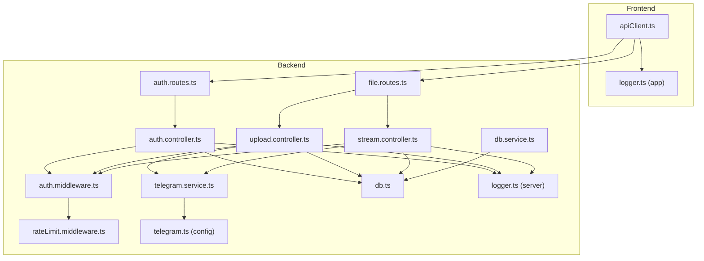
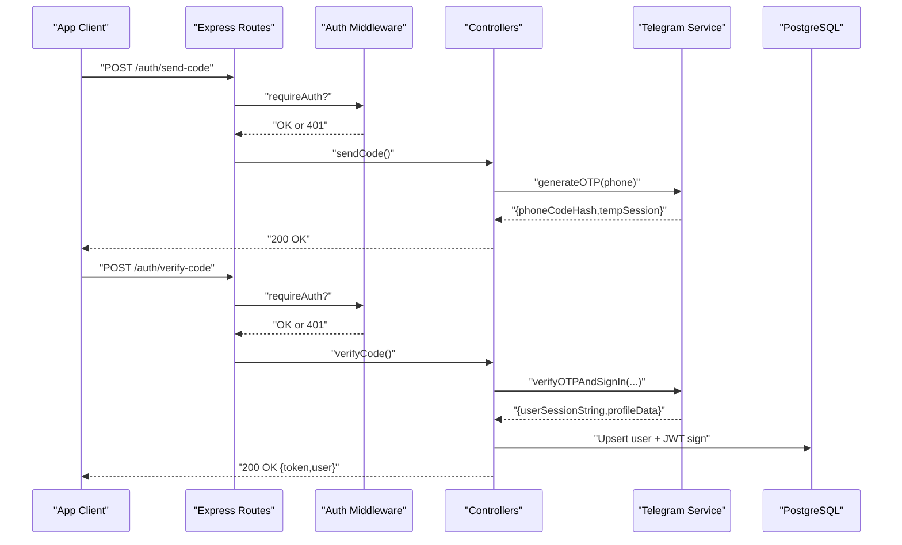
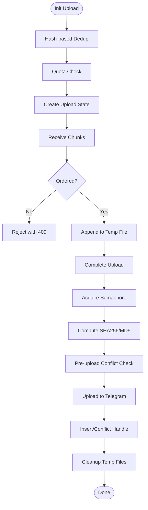
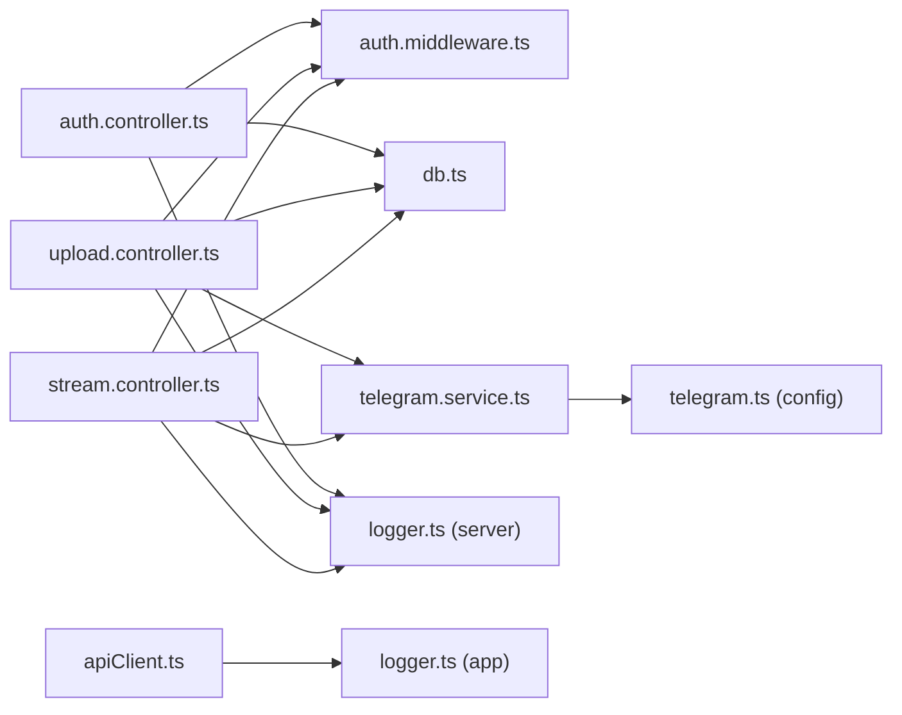

# Troubleshooting and FAQ

<cite>
**Referenced Files in This Document**
- [auth.controller.ts](file://server/src/controllers/auth.controller.ts)
- [telegram.service.ts](file://server/src/services/telegram.service.ts)
- [db.service.ts](file://server/src/services/db.service.ts)
- [db.ts](file://server/src/config/db.ts)
- [auth.middleware.ts](file://server/src/middlewares/auth.middleware.ts)
- [upload.controller.ts](file://server/src/controllers/upload.controller.ts)
- [stream.controller.ts](file://server/src/controllers/stream.controller.ts)
- [rateLimit.middleware.ts](file://server/src/middlewares/rateLimit.middleware.ts)
- [auth.routes.ts](file://server/src/routes/auth.routes.ts)
- [file.routes.ts](file://server/src/routes/file.routes.ts)
- [logger.ts (server)](file://server/src/utils/logger.ts)
- [logger.ts (app)](file://app/src/utils/logger.ts)
- [apiClient.ts](file://app/src/services/apiClient.ts)
- [telegram.ts (config)](file://server/src/config/telegram.ts)
</cite>

## Table of Contents
1. [Introduction](#introduction)
2. [Project Structure](#project-structure)
3. [Core Components](#core-components)
4. [Architecture Overview](#architecture-overview)
5. [Detailed Component Analysis](#detailed-component-analysis)
6. [Dependency Analysis](#dependency-analysis)
7. [Performance Considerations](#performance-considerations)
8. [Troubleshooting Guide](#troubleshooting-guide)
9. [Conclusion](#conclusion)
10. [Appendices](#appendices)

## Introduction
This document provides a comprehensive troubleshooting and FAQ guide for Teledrive. It focuses on diagnosing and resolving common issues across authentication, Telegram integration, database connectivity, uploads, downloads, streaming, rate limiting, and configuration. It also includes systematic approaches, debugging techniques, and preventive measures to reduce recurring problems.

## Project Structure
Teledrive consists of:
- Frontend (React Native) with an Axios-based HTTP client and logging utilities
- Backend (Node.js/Express) with controllers, middleware, services, and database schema initialization
- Telegram integration via a persistent client pool and progressive streaming helpers
- PostgreSQL connection pooling with production-grade defaults and error handling

**Diagram sources**
- [auth.routes.ts](file://server/src/routes/auth.routes.ts#L1-L13)
- [file.routes.ts](file://server/src/routes/file.routes.ts#L1-L118)
- [auth.controller.ts](file://server/src/controllers/auth.controller.ts#L1-L96)
- [upload.controller.ts](file://server/src/controllers/upload.controller.ts#L1-L540)
- [stream.controller.ts](file://server/src/controllers/stream.controller.ts#L1-L460)
- [auth.middleware.ts](file://server/src/middlewares/auth.middleware.ts#L1-L82)
- [rateLimit.middleware.ts](file://server/src/middlewares/rateLimit.middleware.ts#L1-L47)
- [telegram.service.ts](file://server/src/services/telegram.service.ts#L1-L260)
- [db.ts](file://server/src/config/db.ts#L1-L61)
- [db.service.ts](file://server/src/services/db.service.ts#L1-L315)
- [telegram.ts (config)](file://server/src/config/telegram.ts#L1-L29)
- [logger.ts (server)](file://server/src/utils/logger.ts#L1-L27)
- [logger.ts (app)](file://app/src/utils/logger.ts#L1-L27)
- [apiClient.ts](file://app/src/services/apiClient.ts#L1-L164)

**Section sources**
- [auth.routes.ts](file://server/src/routes/auth.routes.ts#L1-L13)
- [file.routes.ts](file://server/src/routes/file.routes.ts#L1-L118)
- [auth.controller.ts](file://server/src/controllers/auth.controller.ts#L1-L96)
- [upload.controller.ts](file://server/src/controllers/upload.controller.ts#L1-L540)
- [stream.controller.ts](file://server/src/controllers/stream.controller.ts#L1-L460)
- [auth.middleware.ts](file://server/src/middlewares/auth.middleware.ts#L1-L82)
- [rateLimit.middleware.ts](file://server/src/middlewares/rateLimit.middleware.ts#L1-L47)
- [telegram.service.ts](file://server/src/services/telegram.service.ts#L1-L260)
- [db.ts](file://server/src/config/db.ts#L1-L61)
- [db.service.ts](file://server/src/services/db.service.ts#L1-L315)
- [telegram.ts (config)](file://server/src/config/telegram.ts#L1-L29)
- [logger.ts (server)](file://server/src/utils/logger.ts#L1-L27)
- [logger.ts (app)](file://app/src/utils/logger.ts#L1-L27)
- [apiClient.ts](file://app/src/services/apiClient.ts#L1-L164)

## Core Components
- Authentication controller handles OTP generation and verification, JWT issuance, and user retrieval. It integrates with Telegram’s client pool and the database.
- Telegram service manages a persistent client pool, auto-reconnect, session lifecycle, and progressive file iteration for streaming.
- Database service initializes schema and migrations, enforces integrity, and exposes the connection pool.
- Upload controller implements a multipart-like chunked upload with deduplication, quota checks, concurrency control, and robust error handling.
- Stream controller implements a download-then-cache model with Range support, progress tracking, and ownership caching.
- Middleware enforces JWT-based auth and optional share-link bypass, plus rate limiting for sensitive endpoints.
- Logging utilities capture structured logs on both frontend and backend for diagnostics.

**Section sources**
- [auth.controller.ts](file://server/src/controllers/auth.controller.ts#L1-L96)
- [telegram.service.ts](file://server/src/services/telegram.service.ts#L1-L260)
- [db.service.ts](file://server/src/services/db.service.ts#L1-L315)
- [db.ts](file://server/src/config/db.ts#L1-L61)
- [upload.controller.ts](file://server/src/controllers/upload.controller.ts#L1-L540)
- [stream.controller.ts](file://server/src/controllers/stream.controller.ts#L1-L460)
- [auth.middleware.ts](file://server/src/middlewares/auth.middleware.ts#L1-L82)
- [rateLimit.middleware.ts](file://server/src/middlewares/rateLimit.middleware.ts#L1-L47)
- [logger.ts (server)](file://server/src/utils/logger.ts#L1-L27)
- [logger.ts (app)](file://app/src/utils/logger.ts#L1-L27)

## Architecture Overview
The system follows a layered architecture:
- Routes define endpoints and apply middleware
- Controllers orchestrate business logic, calling services and the database
- Services encapsulate Telegram client management and streaming helpers
- Middleware validates tokens and applies rate limits
- Configuration files manage environment-specific settings

**Diagram sources**
- [auth.routes.ts](file://server/src/routes/auth.routes.ts#L1-L13)
- [auth.controller.ts](file://server/src/controllers/auth.controller.ts#L1-L96)
- [auth.middleware.ts](file://server/src/middlewares/auth.middleware.ts#L1-L82)
- [telegram.service.ts](file://server/src/services/telegram.service.ts#L101-L160)
- [db.ts](file://server/src/config/db.ts#L1-L61)

## Detailed Component Analysis

### Authentication Flow and Troubleshooting
Common issues:
- Missing or invalid environment variables for Telegram API ID/HASH or JWT secret
- Invalid phone number format or API ID/Hash errors
- Session expiration or revocation leading to reconnect failures

Diagnostic steps:
- Verify TELEGRAM_API_ID and TELEGRAM_API_HASH are set and valid
- Confirm JWT_SECRET is present and not empty
- Validate phone number format (international)
- Inspect logs for Telegram-specific error messages and session expiry events

Resolution procedures:
- Regenerate Telegram API credentials and update environment variables
- Ensure phone number matches international format
- Trigger a fresh OTP request and re-authenticate
- Clear expired client pool entries if reconnect fails

**Section sources**
- [auth.controller.ts](file://server/src/controllers/auth.controller.ts#L6-L32)
- [auth.middleware.ts](file://server/src/middlewares/auth.middleware.ts#L5-L7)
- [telegram.service.ts](file://server/src/services/telegram.service.ts#L24-L29)
- [telegram.service.ts](file://server/src/services/telegram.service.ts#L42-L78)
- [logger.ts (server)](file://server/src/utils/logger.ts#L1-L27)

### Upload Pipeline and Troubleshooting
Common issues:
- Duplicate uploads, quota exceeded, zero-byte uploads
- Chunk ordering violations, semaphore starvation
- Telegram flood waits and upload failures

Diagnostic steps:
- Check uploadId state and status in the in-memory map
- Monitor progress callbacks and Telegram error messages
- Validate chunk indices and expected ordering
- Inspect quota usage and storage counters

Resolution procedures:
- Deduplicate by hash before uploading; reuse existing records
- Reduce batch sizes or throttle uploads to respect flood waits
- Ensure chunk ordering and handle conflicts gracefully
- Free up storage within quotas or upgrade plan

**Diagram sources**
- [upload.controller.ts](file://server/src/controllers/upload.controller.ts#L136-L268)
- [upload.controller.ts](file://server/src/controllers/upload.controller.ts#L271-L314)
- [upload.controller.ts](file://server/src/controllers/upload.controller.ts#L317-L482)

**Section sources**
- [upload.controller.ts](file://server/src/controllers/upload.controller.ts#L136-L268)
- [upload.controller.ts](file://server/src/controllers/upload.controller.ts#L271-L314)
- [upload.controller.ts](file://server/src/controllers/upload.controller.ts#L317-L482)
- [db.service.ts](file://server/src/services/db.service.ts#L312-L315)

### Streaming and Download Troubleshooting
Common issues:
- Cache miss or partial file availability
- Range request misconfiguration
- Ownership validation failures
- Client disconnects and resource leaks

Diagnostic steps:
- Inspect cache directory and TTL
- Verify ownership cache entries and DB queries
- Check download progress and in-flight locks
- Monitor Range header parsing and available bytes

Resolution procedures:
- Allow time for initial download to complete; partial files are acceptable for serving
- Adjust timeouts and ensure sufficient bytes are available before responding
- Clear ownership cache on 404 and re-validate ownership
- Handle client disconnects to free streams and temporary files

**Section sources**
- [stream.controller.ts](file://server/src/controllers/stream.controller.ts#L38-L45)
- [stream.controller.ts](file://server/src/controllers/stream.controller.ts#L58-L89)
- [stream.controller.ts](file://server/src/controllers/stream.controller.ts#L180-L264)
- [stream.controller.ts](file://server/src/controllers/stream.controller.ts#L322-L459)

### Rate Limiting and Access Control
Common issues:
- Too many password attempts or downloads causing throttling
- Misconfigured rate limits for shared spaces and uploads

Diagnostic steps:
- Review rate limit middleware configurations
- Check IP/user-based keys and windowMs settings
- Monitor responses indicating rate limit triggers

Resolution procedures:
- Adjust rate limit windows and max values for legitimate usage patterns
- Apply separate limits for different actions (password attempts vs. downloads)
- Educate users on retry cadence and cooldown periods

**Section sources**
- [rateLimit.middleware.ts](file://server/src/middlewares/rateLimit.middleware.ts#L1-L47)
- [file.routes.ts](file://server/src/routes/file.routes.ts#L60-L81)

### Database Connectivity and Schema Integrity
Common issues:
- Missing DATABASE_URL or SSL configuration
- Connection drops, timeouts, or unexpected termination
- Migration failures or integrity constraint violations

Diagnostic steps:
- Confirm DATABASE_URL presence and SSL mode
- Monitor pool error events and warnings
- Validate migrations and integrity checks

Resolution procedures:
- Set DATABASE_URL with proper sslmode for remote databases
- Tune pool settings for Render free tier and Neon serverless
- Rerun migrations and fix critical failures before restart

**Section sources**
- [db.ts](file://server/src/config/db.ts#L7-L12)
- [db.ts](file://server/src/config/db.ts#L39-L52)
- [db.service.ts](file://server/src/services/db.service.ts#L276-L311)

## Dependency Analysis

**Diagram sources**
- [auth.controller.ts](file://server/src/controllers/auth.controller.ts#L1-L96)
- [auth.middleware.ts](file://server/src/middlewares/auth.middleware.ts#L1-L82)
- [upload.controller.ts](file://server/src/controllers/upload.controller.ts#L1-L540)
- [stream.controller.ts](file://server/src/controllers/stream.controller.ts#L1-L460)
- [telegram.service.ts](file://server/src/services/telegram.service.ts#L1-L260)
- [telegram.ts (config)](file://server/src/config/telegram.ts#L1-L29)
- [db.ts](file://server/src/config/db.ts#L1-L61)
- [logger.ts (server)](file://server/src/utils/logger.ts#L1-L27)
- [apiClient.ts](file://app/src/services/apiClient.ts#L1-L164)
- [logger.ts (app)](file://app/src/utils/logger.ts#L1-L27)

**Section sources**
- [auth.controller.ts](file://server/src/controllers/auth.controller.ts#L1-L96)
- [upload.controller.ts](file://server/src/controllers/upload.controller.ts#L1-L540)
- [stream.controller.ts](file://server/src/controllers/stream.controller.ts#L1-L460)
- [auth.middleware.ts](file://server/src/middlewares/auth.middleware.ts#L1-L82)
- [telegram.service.ts](file://server/src/services/telegram.service.ts#L1-L260)
- [telegram.ts (config)](file://server/src/config/telegram.ts#L1-L29)
- [db.ts](file://server/src/config/db.ts#L1-L61)
- [logger.ts (server)](file://server/src/utils/logger.ts#L1-L27)
- [apiClient.ts](file://app/src/services/apiClient.ts#L1-L164)
- [logger.ts (app)](file://app/src/utils/logger.ts#L1-L27)

## Performance Considerations
- Connection pooling: Keep a warm connection and release idle ones promptly to avoid cold starts and resource exhaustion
- Streaming: Use progressive chunked downloads with appropriate chunk sizes to balance throughput and latency
- Concurrency: Limit simultaneous Telegram uploads to prevent OOM and rate limiting
- Caching: Cache ownership and downloads to minimize repeated database and Telegram calls
- Timeouts: Configure client and server timeouts to avoid hanging requests and long-lived connections

[No sources needed since this section provides general guidance]

## Troubleshooting Guide

### Authentication Problems
Symptoms:
- “Telegram connection failed” or “Invalid Telegram API ID or Hash”
- “Phone number is required” or “Invalid phone number format”
- “Unauthorized” responses due to missing or invalid JWT

Root causes and fixes:
- Ensure TELEGRAM_API_ID and TELEGRAM_API_HASH are set and valid; update environment variables and restart
- Use international phone number format (e.g., +1234567890)
- Verify JWT_SECRET is configured; otherwise, the server will refuse to start
- Re-initiate OTP and sign-in flow; ensure session string is stored securely

Diagnostics:
- Check server logs for Telegram-specific error messages
- Validate token presence and validity in Authorization header
- Confirm user exists in DB and session string is up-to-date

**Section sources**
- [auth.controller.ts](file://server/src/controllers/auth.controller.ts#L23-L31)
- [auth.controller.ts](file://server/src/controllers/auth.controller.ts#L37-L38)
- [auth.middleware.ts](file://server/src/middlewares/auth.middleware.ts#L5-L7)
- [auth.middleware.ts](file://server/src/middlewares/auth.middleware.ts#L54-L80)

### Telegram Integration Problems
Symptoms:
- “Telegram session expired or revoked. Please log in again.”
- “Failed to connect to Telegram. Session may be expired.”
- Frequent “FLOOD_WAIT” errors during uploads

Root causes and fixes:
- Sessions expire or are revoked; trigger a new OTP flow
- Network instability or connection retries exhausted; improve connectivity or adjust retry settings
- Respect Telegram flood waits; implement backoff and delays

Diagnostics:
- Monitor client pool eviction events and reconnect attempts
- Inspect Telegram service logs for connection and reconnection events
- Track pool statistics for health

**Section sources**
- [telegram.service.ts](file://server/src/services/telegram.service.ts#L42-L47)
- [telegram.service.ts](file://server/src/services/telegram.service.ts#L67-L72)
- [telegram.service.ts](file://server/src/services/telegram.service.ts#L90-L93)
- [upload.controller.ts](file://server/src/controllers/upload.controller.ts#L38-L71)

### Database Connection Issues
Symptoms:
- “DATABASE_URL is not defined in environment variables”
- “Connection terminated unexpectedly” or SSL-related errors
- Timeout errors when acquiring connections

Root causes and fixes:
- Missing DATABASE_URL; configure it with proper sslmode for remote databases
- SSL mismatch or missing sslmode; append sslmode=require for non-local deployments
- Pool too small or idle timeouts too long; tune pool settings for deployment

Diagnostics:
- Observe pool error events and warnings
- Verify connection establishment logs
- Check for Neon serverless sleep behavior and auto-reconnect

**Section sources**
- [db.ts](file://server/src/config/db.ts#L9-L12)
- [db.ts](file://server/src/config/db.ts#L39-L52)
- [db.ts](file://server/src/config/db.ts#L27-L37)

### Upload Failures
Symptoms:
- “Missing file info (originalname, size required)” or “No chunk data provided”
- “Expected chunk X, got Y” leading to 409
- “Storage quota exceeded”
- “No data received — cannot upload an empty file”

Root causes and fixes:
- Missing or malformed request payloads; ensure all required fields are present
- Out-of-order chunks; enforce sequential chunk delivery
- Quota exceeded; free up space or upgrade plan
- Zero-byte uploads; ensure file creation and chunk writing succeed

Diagnostics:
- Inspect uploadId state and progress
- Validate chunk indices and expected ordering
- Check quota usage and storage counters

**Section sources**
- [upload.controller.ts](file://server/src/controllers/upload.controller.ts#L141-L143)
- [upload.controller.ts](file://server/src/controllers/upload.controller.ts#L285-L290)
- [upload.controller.ts](file://server/src/controllers/upload.controller.ts#L226-L233)
- [upload.controller.ts](file://server/src/controllers/upload.controller.ts#L333-L337)

### Download and Streaming Issues
Symptoms:
- “File not found or access denied”
- “Background download failed” or “Download to disk failed”
- “Range request out of bounds” or “No data available”
- Client disconnects leaving resources open

Root causes and fixes:
- Ownership validation failure; confirm file belongs to user and is not trashed
- Telegram download failure; handle session expiry and retry
- Range parsing errors; cap end offset to available bytes
- Resource leaks on client disconnect; destroy read streams

Diagnostics:
- Check ownership cache and DB queries
- Inspect download progress and in-flight locks
- Validate Range headers and available bytes

**Section sources**
- [stream.controller.ts](file://server/src/controllers/stream.controller.ts#L330-L332)
- [stream.controller.ts](file://server/src/controllers/stream.controller.ts#L347-L353)
- [stream.controller.ts](file://server/src/controllers/stream.controller.ts#L395-L402)
- [stream.controller.ts](file://server/src/controllers/stream.controller.ts#L435-L446)

### Rate Limiting and Access Control
Symptoms:
- “Too many password attempts. Please try again later.”
- “Download limit reached. Please try again in 5 minutes.”
- “Too many views. Please slow down.”

Root causes and fixes:
- Overly strict limits for legitimate usage; adjust windowMs and max
- Misconfigured user/IP key generation; ensure stable keys per user
- Separate limits for different actions; avoid cross-contamination

Diagnostics:
- Review rate limit middleware configurations
- Monitor responses indicating throttling

**Section sources**
- [rateLimit.middleware.ts](file://server/src/middlewares/rateLimit.middleware.ts#L4-L8)
- [file.routes.ts](file://server/src/routes/file.routes.ts#L60-L81)

### Configuration Errors
Symptoms:
- Server refuses to start due to missing secrets
- API routes return 401 without clear cause
- Frontend cannot reach backend due to base URL issues

Root causes and fixes:
- Missing JWT_SECRET or Telegram API credentials; set environment variables
- Incorrect API base URL; verify EXPO_PUBLIC_API_URL or development fallbacks
- CORS or proxy issues; ensure correct origin and reverse proxy configuration

Diagnostics:
- Check startup logs for fatal environment errors
- Validate Authorization header injection in API client
- Confirm frontend resolves API_BASE correctly

**Section sources**
- [auth.middleware.ts](file://server/src/middlewares/auth.middleware.ts#L5-L7)
- [auth.controller.ts](file://server/src/controllers/auth.controller.ts#L6-L7)
- [apiClient.ts](file://app/src/services/apiClient.ts#L14-L22)
- [apiClient.ts](file://app/src/services/apiClient.ts#L46-L74)

### Logging Strategies and Monitoring
Recommended practices:
- Use structured logs with timestamps, scopes, and metadata
- Capture frontend and backend logs separately for correlation
- Monitor Telegram client pool stats and DB pool events
- Implement request timers and retry logs for proactive detection

Tools:
- Frontend logger for request lifecycle and errors
- Server logger for Telegram and upload/stream events
- Pool error handlers for DB connectivity issues

**Section sources**
- [logger.ts (server)](file://server/src/utils/logger.ts#L1-L27)
- [logger.ts (app)](file://app/src/utils/logger.ts#L1-L27)
- [telegram.service.ts](file://server/src/services/telegram.service.ts#L255-L260)
- [db.ts](file://server/src/config/db.ts#L39-L52)
- [apiClient.ts](file://app/src/services/apiClient.ts#L87-L132)

## Conclusion
This guide consolidates practical troubleshooting steps, diagnostic strategies, and preventive measures for Teledrive. By validating environment configuration, monitoring logs, understanding component interactions, and applying rate limits thoughtfully, most issues can be resolved quickly and efficiently. Regular schema and pool maintenance, along with robust error handling and retries, will improve reliability and user experience.

[No sources needed since this section summarizes without analyzing specific files]

## Appendices

### Quick Reference: Common Error Messages and Remedies
- Telegram API ID/Hash invalid: Reconfigure TELEGRAM_API_ID and TELEGRAM_API_HASH
- Phone number invalid: Use international format
- Unauthorized: Check JWT_SECRET and token validity
- DATABASE_URL missing: Set DATABASE_URL with sslmode for remote DBs
- SSL errors: Add sslmode=require to DATABASE_URL
- Flood wait: Implement exponential backoff and delays
- Quota exceeded: Free up storage or upgrade plan
- Chunk ordering: Enforce sequential chunk delivery
- Range errors: Cap end offset to available bytes
- Rate limit exceeded: Adjust windowMs and max values

[No sources needed since this section provides general guidance]