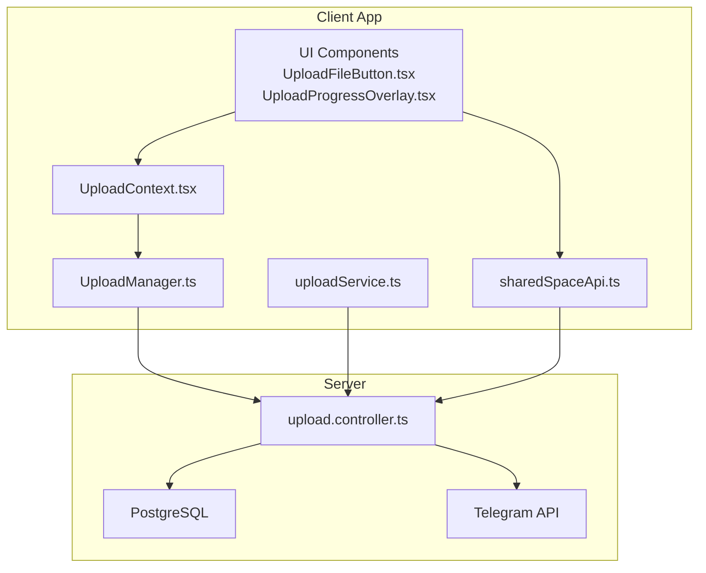
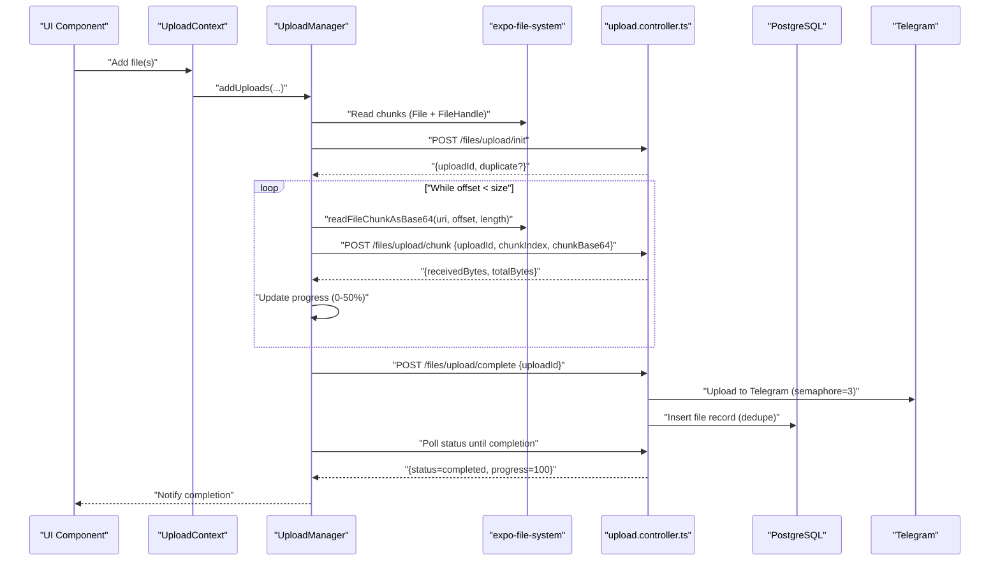
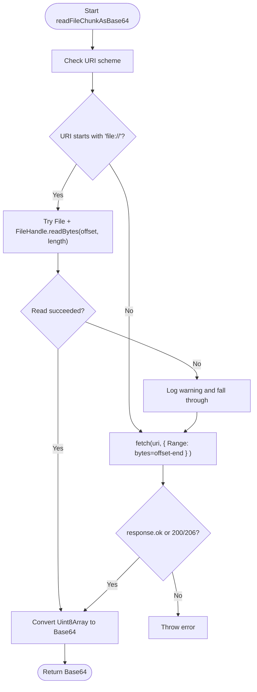
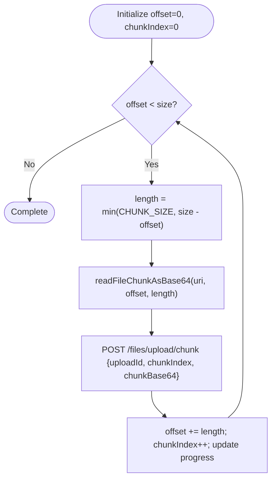
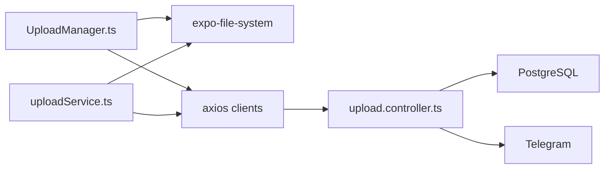

# Chunked Upload Processing

<cite>
**Referenced Files in This Document**
- [UploadManager.ts](file://app/src/services/UploadManager.ts)
- [uploadService.ts](file://app/src/services/uploadService.ts)
- [upload.controller.ts](file://server/src/controllers/upload.controller.ts)
- [UploadContext.tsx](file://app/src/context/UploadContext.tsx)
- [UploadProgressOverlay.tsx](file://app/src/components/UploadProgressOverlay.tsx)
- [UploadFileButton.tsx](file://app/src/components/UploadFileButton.tsx)
- [sharedSpaceApi.ts](file://app/src/services/sharedSpaceApi.ts)
</cite>

## Table of Contents
1. [Introduction](#introduction)
2. [Project Structure](#project-structure)
3. [Core Components](#core-components)
4. [Architecture Overview](#architecture-overview)
5. [Detailed Component Analysis](#detailed-component-analysis)
6. [Dependency Analysis](#dependency-analysis)
7. [Performance Considerations](#performance-considerations)
8. [Troubleshooting Guide](#troubleshooting-guide)
9. [Conclusion](#conclusion)

## Introduction
This document explains the chunked upload processing system used to upload large files efficiently and reliably. It covers the 5 MB chunk size strategy, file reading using expo-file-system's modern File and FileHandle APIs, Base64 encoding for chunk transmission, and robust fallback mechanisms for different URI schemes. It also documents chunk processing logic, byte offset management, memory-efficient handling of large files, and platform-specific considerations for iOS and Android.

## Project Structure
The chunked upload pipeline spans the client application and the backend server:
- Client-side services implement chunked reading, Base64 conversion, and upload scheduling.
- The server validates and reassembles chunks, performs deduplication, and uploads to Telegram with concurrency control.

**Diagram sources**
- [UploadManager.ts](file://app/src/services/UploadManager.ts#L126-L992)
- [uploadService.ts](file://app/src/services/uploadService.ts#L1-L207)
- [upload.controller.ts](file://server/src/controllers/upload.controller.ts#L134-L540)
- [UploadContext.tsx](file://app/src/context/UploadContext.tsx#L1-L123)
- [UploadProgressOverlay.tsx](file://app/src/components/UploadProgressOverlay.tsx#L1-L360)
- [UploadFileButton.tsx](file://app/src/components/UploadFileButton.tsx#L1-L63)
- [sharedSpaceApi.ts](file://app/src/services/sharedSpaceApi.ts#L1-L81)

**Section sources**
- [UploadManager.ts](file://app/src/services/UploadManager.ts#L1-L200)
- [uploadService.ts](file://app/src/services/uploadService.ts#L1-L15)
- [upload.controller.ts](file://server/src/controllers/upload.controller.ts#L134-L268)

## Core Components
- UploadManager: Queue-based upload orchestrator with concurrency control, persistence, progress tracking, and retry logic.
- uploadService: Standalone single-file upload helper using the same chunking and Base64 strategy.
- upload.controller: Server-side chunk ingestion, ordering validation, deduplication, and Telegram upload with concurrency limits.
- UploadContext and UI overlays: Provide real-time progress and controls for uploads.

Key characteristics:
- 5 MB chunk size for optimal throughput and memory efficiency.
- Native file reading via expo-file-system File + FileHandle APIs with Base64 encoding.
- Fallback to fetch() with Range header for content:// URIs and edge cases.
- Byte-accurate progress calculation across upload and Telegram delivery phases.

**Section sources**
- [UploadManager.ts](file://app/src/services/UploadManager.ts#L126-L135)
- [uploadService.ts](file://app/src/services/uploadService.ts#L15-L15)
- [upload.controller.ts](file://server/src/controllers/upload.controller.ts#L270-L314)

## Architecture Overview
End-to-end flow from UI to server and Telegram:

**Diagram sources**
- [UploadManager.ts](file://app/src/services/UploadManager.ts#L804-L981)
- [uploadService.ts](file://app/src/services/uploadService.ts#L67-L206)
- [upload.controller.ts](file://server/src/controllers/upload.controller.ts#L134-L540)

## Detailed Component Analysis

### 5 MB Chunk Size Strategy
- Both UploadManager and uploadService define a constant 5 MB chunk size.
- This balance minimizes overhead while keeping memory usage reasonable for large files.
- Chunk boundaries align with file size to avoid partial reads beyond the end.

Implementation references:
- [CHUNK_SIZE definition](file://app/src/services/UploadManager.ts#L132-L132)
- [CHUNK_SIZE definition](file://app/src/services/uploadService.ts#L15-L15)

**Section sources**
- [UploadManager.ts](file://app/src/services/UploadManager.ts#L132-L132)
- [uploadService.ts](file://app/src/services/uploadService.ts#L15-L15)

### File Reading Implementation Using expo-file-system APIs
- Native (iOS/Android): Use new File and FileHandle APIs for efficient, synchronous-like chunk reads.
- The FileHandle maintains an internal offset, enabling precise byte positioning.
- On failure, the system falls back to fetch() with a Range header to support content:// URIs and edge cases.

Key functions and logic:
- [readFileChunkAsBase64 with FileHandle and fetch fallback](file://app/src/services/UploadManager.ts#L92-L122)
- [readFileChunkAsBase64 in standalone service](file://app/src/services/uploadService.ts#L37-L63)

**Diagram sources**
- [UploadManager.ts](file://app/src/services/UploadManager.ts#L92-L122)
- [uploadService.ts](file://app/src/services/uploadService.ts#L37-L63)

**Section sources**
- [UploadManager.ts](file://app/src/services/UploadManager.ts#L92-L122)
- [uploadService.ts](file://app/src/services/uploadService.ts#L37-L63)

### Base64 Encoding for Chunk Transmission
- After reading raw bytes from the file, the system converts them to Base64 for safe transport in JSON payloads.
- The conversion uses a shared helper to ensure consistency across platforms and services.

References:
- [uint8ArrayToBase64 helper](file://app/src/services/UploadManager.ts#L69-L72)
- [uint8ArrayToBase64 helper](file://app/src/services/uploadService.ts#L28-L30)

**Section sources**
- [UploadManager.ts](file://app/src/services/UploadManager.ts#L69-L72)
- [uploadService.ts](file://app/src/services/uploadService.ts#L28-L30)

### Chunk Processing Logic and Byte Offset Management
- The upload loop computes the effective chunk length (never exceeding remaining bytes).
- Offsets advance by the actual length read, ensuring accurate byte progression.
- Progress percentage is computed as a capped proportion of uploaded bytes vs total size.

References:
- [Loop with dynamic length and offset advancement](file://app/src/services/UploadManager.ts#L872-L907)
- [Loop with dynamic length and offset advancement](file://app/src/services/uploadService.ts#L127-L144)

**Diagram sources**
- [UploadManager.ts](file://app/src/services/UploadManager.ts#L872-L907)
- [uploadService.ts](file://app/src/services/uploadService.ts#L127-L144)

**Section sources**
- [UploadManager.ts](file://app/src/services/UploadManager.ts#L872-L907)
- [uploadService.ts](file://app/src/services/uploadService.ts#L127-L144)

### Memory-Efficient Handling of Large Files
- Fixed-size chunks prevent loading entire files into memory.
- Base64 increases payload size by approximately 33%, but remains practical for 5 MB chunks.
- Native FileHandle reads minimize JS bridging overhead compared to legacy APIs.
- Server-side chunk ordering validation and append-only writes reduce memory pressure.

References:
- [Fixed chunk size and loop](file://app/src/services/UploadManager.ts#L132-L132)
- [Server-side chunk append and ordering](file://server/src/controllers/upload.controller.ts#L270-L314)

**Section sources**
- [UploadManager.ts](file://app/src/services/UploadManager.ts#L132-L132)
- [upload.controller.ts](file://server/src/controllers/upload.controller.ts#L270-L314)

### Platform-Specific Considerations (iOS and Android)
- file:// URIs: Use the native File + FileHandle APIs for highest performance and reliability.
- content:// URIs: Fall back to fetch() with Range header to support DocumentPicker and similar providers.
- Web platform: Uses Blob slicing and FormData for multipart uploads; progress accounting differs slightly due to browser constraints.

References:
- [Native vs fallback logic](file://app/src/services/UploadManager.ts#L97-L122)
- [Web-specific handling](file://app/src/services/uploadService.ts#L110-L127)

**Section sources**
- [UploadManager.ts](file://app/src/services/UploadManager.ts#L97-L122)
- [uploadService.ts](file://app/src/services/uploadService.ts#L110-L127)

### Upload Scheduling and Progress Tracking
- UploadManager manages a queue with concurrency limits and exponential backoff.
- Progress is split: 0–50% for uploaded bytes, 50–100% for Telegram delivery polling.
- Real-time progress updates are throttled to reduce React re-renders.

References:
- [Concurrency and progress split](file://app/src/services/UploadManager.ts#L128-L134)
- [onUploadProgress handling with fallbacks](file://app/src/services/UploadManager.ts#L886-L896)
- [Polling and progress computation](file://app/src/services/UploadManager.ts#L919-L980)

**Section sources**
- [UploadManager.ts](file://app/src/services/UploadManager.ts#L128-L134)
- [UploadManager.ts](file://app/src/services/UploadManager.ts#L886-L896)
- [UploadManager.ts](file://app/src/services/UploadManager.ts#L919-L980)

### Server-Side Chunk Handling and Deduplication
- The server validates chunk indices to ensure ordered reception.
- Stores chunks incrementally and computes hashes to detect duplicates before Telegram upload.
- Limits concurrent Telegram uploads to prevent resource exhaustion.

References:
- [Chunk ingestion and ordering](file://server/src/controllers/upload.controller.ts#L270-L314)
- [Duplicate detection and insertion](file://server/src/controllers/upload.controller.ts#L134-L268)
- [Telegram upload with semaphore](file://server/src/controllers/upload.controller.ts#L343-L482)

**Section sources**
- [upload.controller.ts](file://server/src/controllers/upload.controller.ts#L270-L314)
- [upload.controller.ts](file://server/src/controllers/upload.controller.ts#L134-L268)
- [upload.controller.ts](file://server/src/controllers/upload.controller.ts#L343-L482)

## Dependency Analysis
- Client-side dependencies:
  - expo-file-system for native file access and MD5 hashing.
  - buffer for Base64 conversion.
  - axios-based clients for upload and status polling.
- Server-side dependencies:
  - PostgreSQL for deduplication and file records.
  - Telegram client for media delivery with retry and flood handling.
  - In-memory upload state with automatic cleanup.

**Diagram sources**
- [UploadManager.ts](file://app/src/services/UploadManager.ts#L20-L25)
- [uploadService.ts](file://app/src/services/uploadService.ts#L10-L13)
- [upload.controller.ts](file://server/src/controllers/upload.controller.ts#L1-L11)

**Section sources**
- [UploadManager.ts](file://app/src/services/UploadManager.ts#L20-L25)
- [uploadService.ts](file://app/src/services/uploadService.ts#L10-L13)
- [upload.controller.ts](file://server/src/controllers/upload.controller.ts#L1-L11)

## Performance Considerations
- Chunk size: 5 MB balances throughput and memory usage effectively.
- Concurrency: Limit to 3 concurrent uploads to the Telegram backend to avoid resource saturation.
- Progress accuracy: Use known lengths or fallbacks to compute precise per-chunk progress.
- Network efficiency: Base64 adds ~33% overhead; acceptable given chunk size and bandwidth.
- Memory: Append-only server writes and fixed-size client chunks keep memory footprint predictable.

[No sources needed since this section provides general guidance]

## Troubleshooting Guide
Common issues and remedies:
- Fallback triggered for content:// URIs: Verify device permissions and provider compatibility; the fetch fallback with Range header should resolve most cases.
- Upload stuck at 50%: Indicates Telegram delivery polling; check network connectivity and Telegram API availability.
- Duplicate uploads: The system detects duplicates via hash; ensure consistent hashing across platforms.
- Cancellation and retries: Use AbortController and built-in retry logic; verify task state transitions.

References:
- [Fallback logging and error handling](file://app/src/services/UploadManager.ts#L107-L118)
- [Cancellation checks and abort handling](file://app/src/services/uploadService.ts#L78-L80)
- [Polling timeouts and error propagation](file://app/src/services/uploadService.ts#L164-L205)

**Section sources**
- [UploadManager.ts](file://app/src/services/UploadManager.ts#L107-L118)
- [uploadService.ts](file://app/src/services/uploadService.ts#L78-L80)
- [uploadService.ts](file://app/src/services/uploadService.ts#L164-L205)

## Conclusion
The chunked upload system leverages modern React Native APIs for efficient, reliable file transfers. The 5 MB chunk size, native file reading, Base64 encoding, and robust fallbacks ensure broad compatibility across iOS, Android, and web environments. Server-side safeguards like chunk ordering, deduplication, and concurrency control deliver a scalable and resilient upload pipeline.