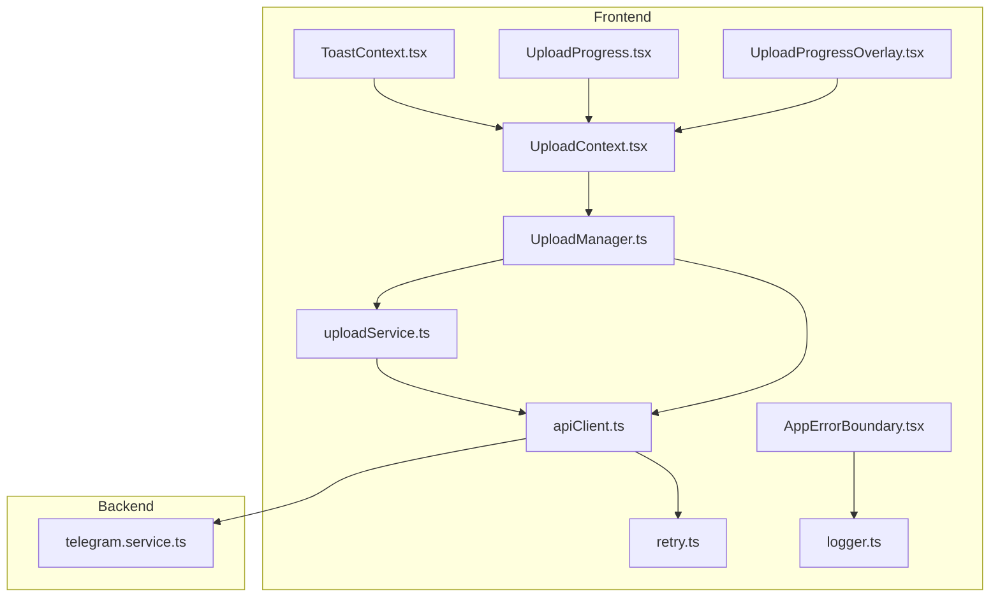
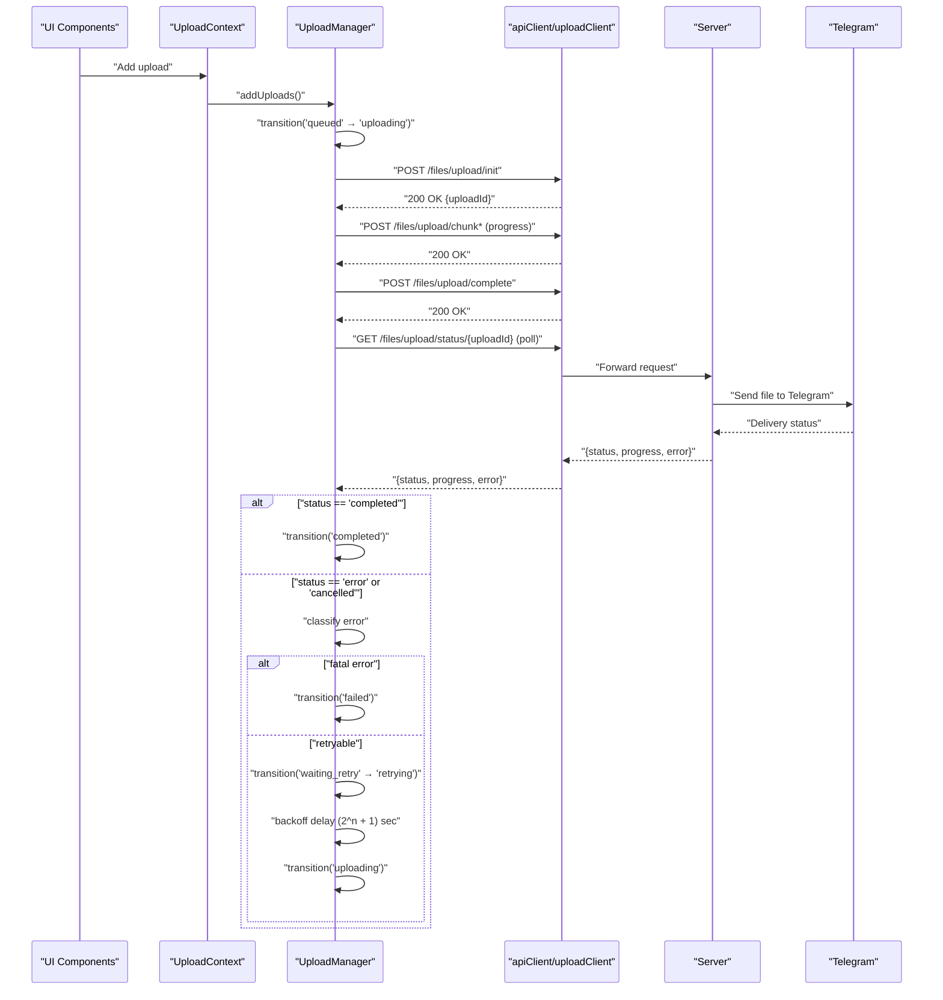
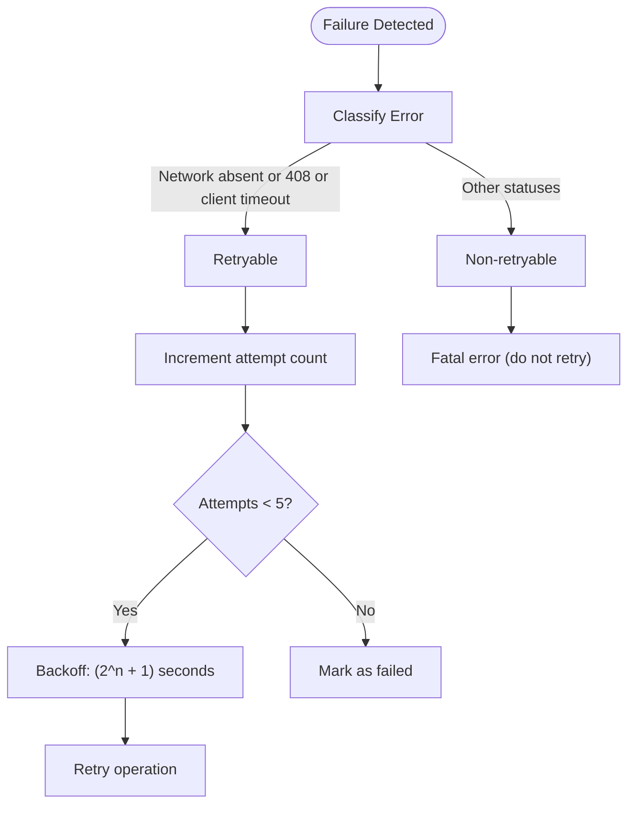
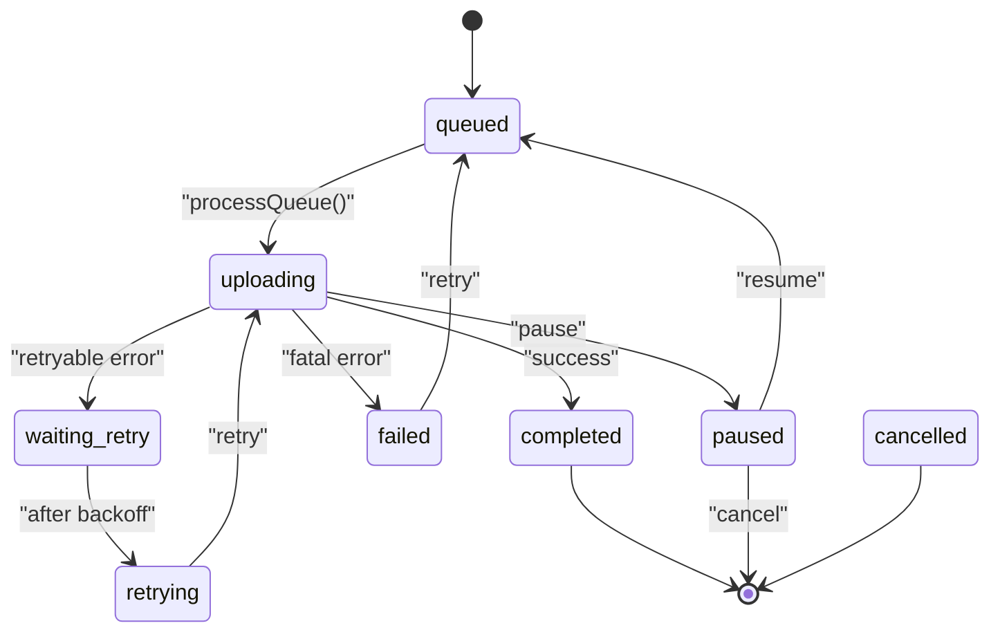
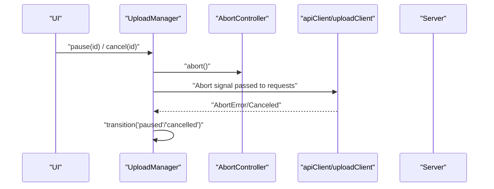
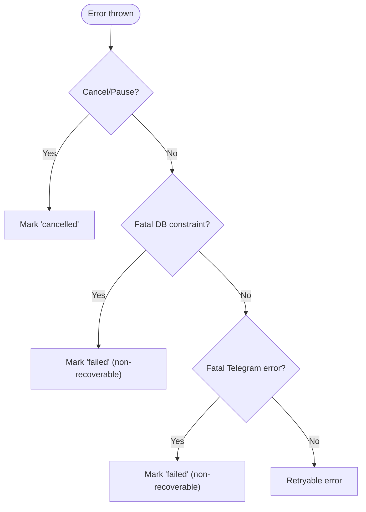
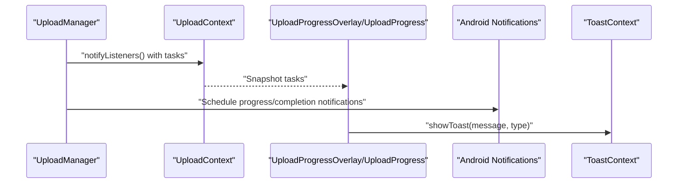
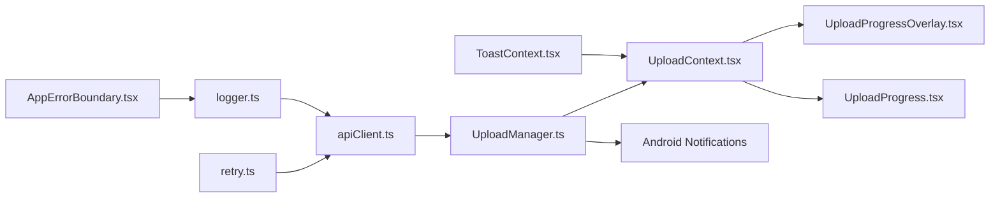

# Error Handling and Retry Logic

<cite>
**Referenced Files in This Document**
- [retry.ts](file://app/src/utils/retry.ts)
- [apiClient.ts](file://app/src/services/apiClient.ts)
- [UploadManager.ts](file://app/src/services/UploadManager.ts)
- [uploadService.ts](file://app/src/services/uploadService.ts)
- [UploadContext.tsx](file://app/src/context/UploadContext.tsx)
- [UploadProgressOverlay.tsx](file://app/src/components/UploadProgressOverlay.tsx)
- [UploadProgress.tsx](file://app/src/components/UploadProgress.tsx)
- [AppErrorBoundary.tsx](file://app/src/components/AppErrorBoundary.tsx)
- [logger.ts](file://app/src/utils/logger.ts)
- [ToastContext.tsx](file://app/src/context/ToastContext.tsx)
- [telegram.service.ts](file://server/src/services/telegram.service.ts)
</cite>

## Table of Contents
1. [Introduction](#introduction)
2. [Project Structure](#project-structure)
3. [Core Components](#core-components)
4. [Architecture Overview](#architecture-overview)
5. [Detailed Component Analysis](#detailed-component-analysis)
6. [Dependency Analysis](#dependency-analysis)
7. [Performance Considerations](#performance-considerations)
8. [Troubleshooting Guide](#troubleshooting-guide)
9. [Conclusion](#conclusion)

## Introduction
This document explains the error handling and retry mechanisms implemented in the upload pipeline. It covers:
- Exponential backoff strategy with a 2^n timing pattern and a 1-second base offset
- Maximum retry limits (5 attempts)
- Intelligent error classification for network failures, server errors, timeouts, and fatal conditions
- Cancellation handling via AbortController
- Graceful degradation for network failures
- Retry state machine transitions
- Error propagation to the UI and user notification strategies
- Examples of retry triggers, recovery scenarios, and troubleshooting steps

## Project Structure
The error handling and retry logic spans three layers:
- Frontend API client and utilities
- Upload orchestration and state management
- UI components for progress and notifications

**Diagram sources**
- [apiClient.ts](file://app/src/services/apiClient.ts#L1-L164)
- [retry.ts](file://app/src/utils/retry.ts#L1-L34)
- [UploadManager.ts](file://app/src/services/UploadManager.ts#L1-L992)
- [uploadService.ts](file://app/src/services/uploadService.ts#L1-L207)
- [UploadContext.tsx](file://app/src/context/UploadContext.tsx#L1-L123)
- [UploadProgressOverlay.tsx](file://app/src/components/UploadProgressOverlay.tsx#L1-L360)
- [UploadProgress.tsx](file://app/src/components/UploadProgress.tsx#L1-L250)
- [AppErrorBoundary.tsx](file://app/src/components/AppErrorBoundary.tsx#L1-L85)
- [logger.ts](file://app/src/utils/logger.ts#L1-L27)
- [ToastContext.tsx](file://app/src/context/ToastContext.tsx#L1-L143)
- [telegram.service.ts](file://server/src/services/telegram.service.ts#L1-L124)

**Section sources**
- [apiClient.ts](file://app/src/services/apiClient.ts#L1-L164)
- [retry.ts](file://app/src/utils/retry.ts#L1-L34)
- [UploadManager.ts](file://app/src/services/UploadManager.ts#L1-L992)
- [uploadService.ts](file://app/src/services/uploadService.ts#L1-L207)
- [UploadContext.tsx](file://app/src/context/UploadContext.tsx#L1-L123)
- [UploadProgressOverlay.tsx](file://app/src/components/UploadProgressOverlay.tsx#L1-L360)
- [UploadProgress.tsx](file://app/src/components/UploadProgress.tsx#L1-L250)
- [AppErrorBoundary.tsx](file://app/src/components/AppErrorBoundary.tsx#L1-L85)
- [logger.ts](file://app/src/utils/logger.ts#L1-L27)
- [ToastContext.tsx](file://app/src/context/ToastContext.tsx#L1-L143)
- [telegram.service.ts](file://server/src/services/telegram.service.ts#L1-L124)

## Core Components
- Exponential backoff and retry classifier:
  - [shouldRetry](file://app/src/utils/retry.ts#L14-L33) determines whether a failure should be retried based on network absence, server errors, or timeouts.
  - [sleep](file://app/src/utils/retry.ts#L6) provides a millisecond delay primitive.
- API client retry interceptor:
  - [apiClient.ts](file://app/src/services/apiClient.ts#L100-L132) implements exponential backoff with 2^n seconds and a 1-second base offset, capped by a configurable maximum.
- Upload orchestration and retry state machine:
  - [UploadManager.ts](file://app/src/services/UploadManager.ts#L126-L760) defines the retry state machine, fatal error detection, and exponential backoff with 5 maximum attempts.
- Standalone upload service:
  - [uploadService.ts](file://app/src/services/uploadService.ts#L67-L207) integrates AbortController for cancellation and handles Telegram polling with explicit fatal error detection.
- UI and notifications:
  - [UploadContext.tsx](file://app/src/context/UploadContext.tsx#L1-L123), [UploadProgressOverlay.tsx](file://app/src/components/UploadProgressOverlay.tsx#L1-L360), [UploadProgress.tsx](file://app/src/components/UploadProgress.tsx#L1-L250) propagate state and actions to users.
  - [ToastContext.tsx](file://app/src/context/ToastContext.tsx#L1-L143) provides transient user feedback.
- Logging and error boundary:
  - [logger.ts](file://app/src/utils/logger.ts#L1-L27) centralizes logging.
  - [AppErrorBoundary.tsx](file://app/src/components/AppErrorBoundary.tsx#L1-L85) surfaces unhandled frontend errors.

**Section sources**
- [retry.ts](file://app/src/utils/retry.ts#L1-L34)
- [apiClient.ts](file://app/src/services/apiClient.ts#L100-L132)
- [UploadManager.ts](file://app/src/services/UploadManager.ts#L126-L760)
- [uploadService.ts](file://app/src/services/uploadService.ts#L67-L207)
- [UploadContext.tsx](file://app/src/context/UploadContext.tsx#L1-L123)
- [UploadProgressOverlay.tsx](file://app/src/components/UploadProgressOverlay.tsx#L1-L360)
- [UploadProgress.tsx](file://app/src/components/UploadProgress.tsx#L1-L250)
- [ToastContext.tsx](file://app/src/context/ToastContext.tsx#L1-L143)
- [logger.ts](file://app/src/utils/logger.ts#L1-L27)
- [AppErrorBoundary.tsx](file://app/src/components/AppErrorBoundary.tsx#L1-L85)

## Architecture Overview
The system separates concerns across request-level retries and upload-level retries:
- Request-level retries (Axios interceptors) handle network/server errors with exponential backoff.
- Upload-level retries (UploadManager) manage the entire upload lifecycle with state transitions and exponential backoff.
- Cancellation is coordinated via AbortController across both layers.
- Fatal errors are detected and surfaced to the UI for user action.

**Diagram sources**
- [UploadManager.ts](file://app/src/services/UploadManager.ts#L676-L760)
- [UploadManager.ts](file://app/src/services/UploadManager.ts#L764-L981)
- [apiClient.ts](file://app/src/services/apiClient.ts#L100-L132)
- [uploadService.ts](file://app/src/services/uploadService.ts#L152-L206)

## Detailed Component Analysis

### Exponential Backoff and Retry Classifier
- Classification:
  - Network errors without response and client timeouts are retried.
  - Server 500–599 errors and 408 Request Timeout are retried.
- Backoff:
  - Request-level: 2^n seconds with 1-second base offset per attempt.
  - Upload-level: 2^n + 1 seconds with 1-second base offset, up to 5 attempts.

**Diagram sources**
- [retry.ts](file://app/src/utils/retry.ts#L14-L33)
- [apiClient.ts](file://app/src/services/apiClient.ts#L118-L127)
- [UploadManager.ts](file://app/src/services/UploadManager.ts#L724-L750)

**Section sources**
- [retry.ts](file://app/src/utils/retry.ts#L1-L34)
- [apiClient.ts](file://app/src/services/apiClient.ts#L100-L132)
- [UploadManager.ts](file://app/src/services/UploadManager.ts#L724-L750)

### Retry State Machine (UploadManager)
- States:
  - pending, queued, uploading, paused, waiting_retry, retrying, completed, failed, cancelled.
- Transitions:
  - Legal transitions are enforced by a transition matrix.
- Retry logic:
  - On failure, classify as fatal or retryable.
  - For retryable errors, increment retryCount and schedule a delayed retry with exponential backoff.
  - On reaching the maximum attempts, mark as failed.

**Diagram sources**
- [UploadManager.ts](file://app/src/services/UploadManager.ts#L154-L174)
- [UploadManager.ts](file://app/src/services/UploadManager.ts#L717-L750)

**Section sources**
- [UploadManager.ts](file://app/src/services/UploadManager.ts#L154-L174)
- [UploadManager.ts](file://app/src/services/UploadManager.ts#L717-L750)

### Cancellation Handling with AbortController
- Cancellation is supported at two levels:
  - API client requests use AbortController to cancel in-flight requests.
  - UploadManager maintains an AbortController per task and aborts during pause/cancel.
- Behavior:
  - Cancellation throws a “Cancelled” error, which UploadManager interprets as non-retryable.
  - Telegram polling also respects cancellation and aborts.

**Diagram sources**
- [UploadManager.ts](file://app/src/services/UploadManager.ts#L558-L601)
- [UploadManager.ts](file://app/src/services/UploadManager.ts#L764-L773)
- [uploadService.ts](file://app/src/services/uploadService.ts#L164-L202)

**Section sources**
- [UploadManager.ts](file://app/src/services/UploadManager.ts#L558-L601)
- [UploadManager.ts](file://app/src/services/UploadManager.ts#L764-L773)
- [uploadService.ts](file://app/src/services/uploadService.ts#L164-L202)

### Intelligent Error Classification
- Fatal database constraints:
  - UploadManager detects schema constraint violations and marks as failed without retry.
- Fatal Telegram errors:
  - UploadManager recognizes unrecoverable Telegram errors (e.g., invalid file parts, reference expiration, media empty, invalid file ID, or specific 400 errors excluding flood waits) and marks as failed without retry.
- Network/server errors:
  - Retried according to classification rules.

**Diagram sources**
- [UploadManager.ts](file://app/src/services/UploadManager.ts#L700-L722)

**Section sources**
- [UploadManager.ts](file://app/src/services/UploadManager.ts#L700-L722)

### Graceful Degradation for Network Failures
- API client interceptor:
  - Retries network-absent and server errors with exponential backoff.
  - Limits retries to a configured maximum.
- Upload polling:
  - Polls Telegram delivery status with a fixed interval and respects cancellation.
  - Treats 404/403 responses as fatal and stops retrying.

**Section sources**
- [apiClient.ts](file://app/src/services/apiClient.ts#L118-L132)
- [uploadService.ts](file://app/src/services/uploadService.ts#L191-L194)

### Error Propagation to UI and User Notifications
- Upload state:
  - UploadManager exposes tasks and aggregate stats via UploadContext.
  - UI components (UploadProgressOverlay, UploadProgress) render real-time progress and actions.
- Notifications:
  - Android progress notifications are scheduled while uploads are active.
  - Completion notifications summarize successes/failures.
- Toasts:
  - ToastContext provides transient feedback for user actions.
- Error boundary:
  - AppErrorBoundary catches unhandled frontend errors and offers a reload option.

**Diagram sources**
- [UploadContext.tsx](file://app/src/context/UploadContext.tsx#L54-L60)
- [UploadManager.ts](file://app/src/services/UploadManager.ts#L283-L310)
- [UploadManager.ts](file://app/src/services/UploadManager.ts#L449-L510)
- [UploadProgressOverlay.tsx](file://app/src/components/UploadProgressOverlay.tsx#L311-L323)
- [UploadProgress.tsx](file://app/src/components/UploadProgress.tsx#L42-L85)
- [ToastContext.tsx](file://app/src/context/ToastContext.tsx#L79-L86)
- [AppErrorBoundary.tsx](file://app/src/components/AppErrorBoundary.tsx#L20-L27)

**Section sources**
- [UploadContext.tsx](file://app/src/context/UploadContext.tsx#L54-L60)
- [UploadManager.ts](file://app/src/services/UploadManager.ts#L283-L310)
- [UploadManager.ts](file://app/src/services/UploadManager.ts#L449-L510)
- [UploadProgressOverlay.tsx](file://app/src/components/UploadProgressOverlay.tsx#L311-L323)
- [UploadProgress.tsx](file://app/src/components/UploadProgress.tsx#L42-L85)
- [ToastContext.tsx](file://app/src/context/ToastContext.tsx#L79-L86)
- [AppErrorBoundary.tsx](file://app/src/components/AppErrorBoundary.tsx#L20-L27)

### Standalone Upload Service (Web and Native)
- Uses AbortController for cancellation.
- Reads file chunks (native or fetch fallback) and uploads via uploadClient.
- Polls Telegram delivery status via apiClient with explicit fatal error detection for 404/403.

**Section sources**
- [uploadService.ts](file://app/src/services/uploadService.ts#L67-L207)

## Dependency Analysis
- UploadManager depends on:
  - apiClient/uploadClient for HTTP operations
  - AsyncStorage for persistence
  - Expo Notifications for progress/completion notifications
- API client depends on:
  - retry.ts for classification and delays
  - logger.ts for structured logs
- UI components depend on:
  - UploadContext for state
  - ToastContext for transient messages
  - AppErrorBoundary for crash protection

**Diagram sources**
- [retry.ts](file://app/src/utils/retry.ts#L1-L34)
- [apiClient.ts](file://app/src/services/apiClient.ts#L1-L164)
- [UploadManager.ts](file://app/src/services/UploadManager.ts#L1-L992)
- [UploadContext.tsx](file://app/src/context/UploadContext.tsx#L1-L123)
- [UploadProgressOverlay.tsx](file://app/src/components/UploadProgressOverlay.tsx#L1-L360)
- [UploadProgress.tsx](file://app/src/components/UploadProgress.tsx#L1-L250)
- [ToastContext.tsx](file://app/src/context/ToastContext.tsx#L1-L143)
- [AppErrorBoundary.tsx](file://app/src/components/AppErrorBoundary.tsx#L1-L85)
- [logger.ts](file://app/src/utils/logger.ts#L1-L27)

**Section sources**
- [retry.ts](file://app/src/utils/retry.ts#L1-L34)
- [apiClient.ts](file://app/src/services/apiClient.ts#L1-L164)
- [UploadManager.ts](file://app/src/services/UploadManager.ts#L1-L992)
- [UploadContext.tsx](file://app/src/context/UploadContext.tsx#L1-L123)
- [UploadProgressOverlay.tsx](file://app/src/components/UploadProgressOverlay.tsx#L1-L360)
- [UploadProgress.tsx](file://app/src/components/UploadProgress.tsx#L1-L250)
- [ToastContext.tsx](file://app/src/context/ToastContext.tsx#L1-L143)
- [AppErrorBoundary.tsx](file://app/src/components/AppErrorBoundary.tsx#L1-L85)
- [logger.ts](file://app/src/utils/logger.ts#L1-L27)

## Performance Considerations
- Concurrency: Up to 3 concurrent uploads to align with server capacity.
- Backoff: Exponential backoff reduces server load during transient failures.
- Progress accuracy: Byte-accurate progress computation and throttled notifications minimize UI churn.
- Polling: Fixed-interval polling for Telegram status avoids busy-waiting.

[No sources needed since this section provides general guidance]

## Troubleshooting Guide
Common retry triggers and recovery scenarios:
- Network errors or server timeouts:
  - Automatically retried up to 5 times with exponential backoff.
  - Verify connectivity and server health if failures persist.
- Telegram fatal errors:
  - Recognized by UploadManager and marked as failed without retry.
  - Requires manual intervention (e.g., re-upload after fixing the underlying issue).
- Database constraint violations:
  - Detected and treated as fatal; mark as failed without retry.
- Cancellations:
  - Cancel or pause uploads to free resources; resume later.
- Long-running uploads:
  - UploadManager enforces a generous timeout for upload operations; API client handles retries independently.

User notification strategies:
- Progress overlay displays overall progress, per-task status, and actions.
- Android notifications show progress and completion summaries.
- Toasts provide transient feedback for user actions.
- Error boundary surfaces unexpected frontend errors with a reload option.

**Section sources**
- [UploadManager.ts](file://app/src/services/UploadManager.ts#L700-L722)
- [UploadManager.ts](file://app/src/services/UploadManager.ts#L724-L750)
- [UploadProgressOverlay.tsx](file://app/src/components/UploadProgressOverlay.tsx#L311-L323)
- [UploadProgress.tsx](file://app/src/components/UploadProgress.tsx#L42-L85)
- [ToastContext.tsx](file://app/src/context/ToastContext.tsx#L79-L86)
- [AppErrorBoundary.tsx](file://app/src/components/AppErrorBoundary.tsx#L20-L27)

## Conclusion
The system implements a robust, layered error handling and retry strategy:
- Requests are retried intelligently with exponential backoff.
- Uploads are orchestrated with a strict state machine and maximum retry limit.
- Fatal errors (database constraints, Telegram unrecoverable errors) are detected and surfaced to users.
- Cancellation is fully supported via AbortController across layers.
- UI components provide comprehensive feedback and actionable controls.