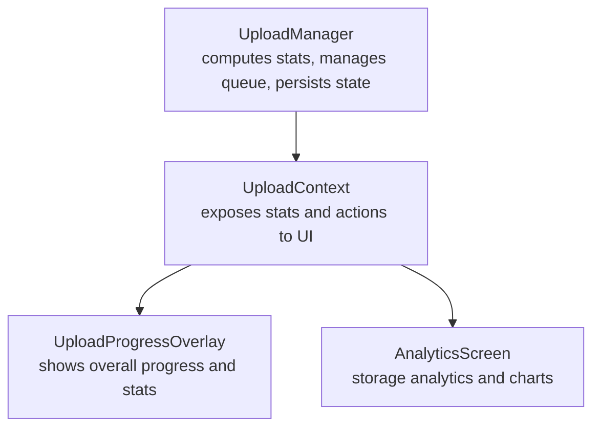
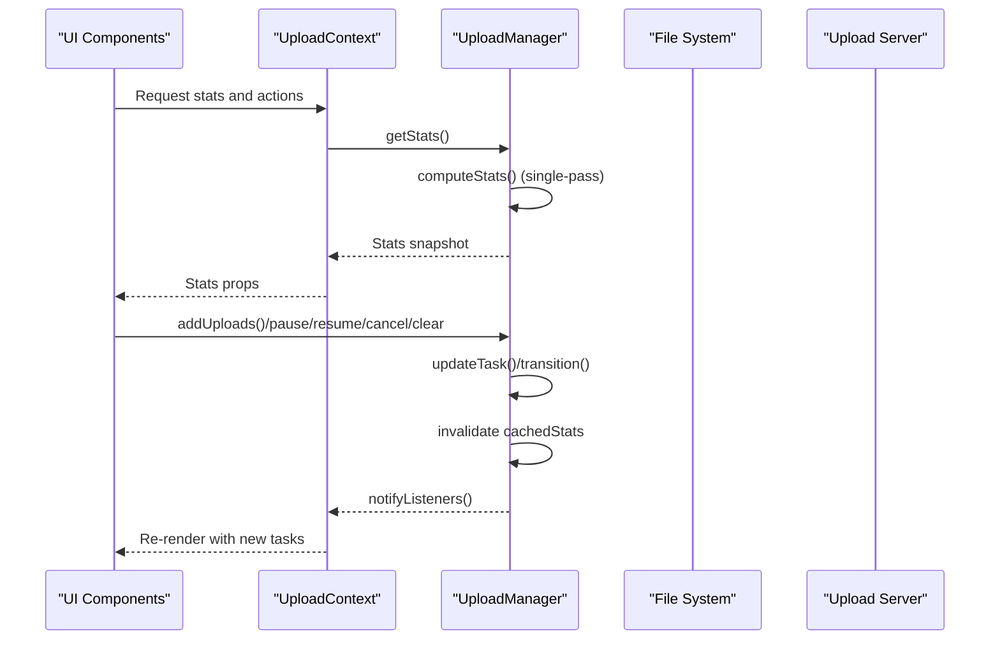
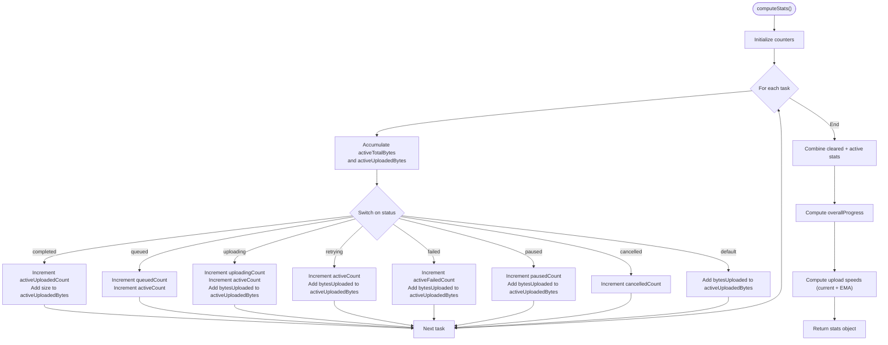
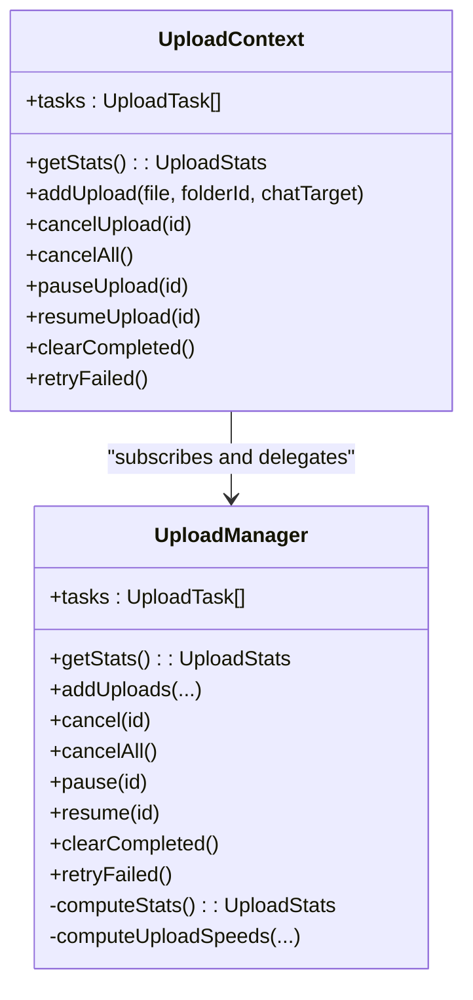
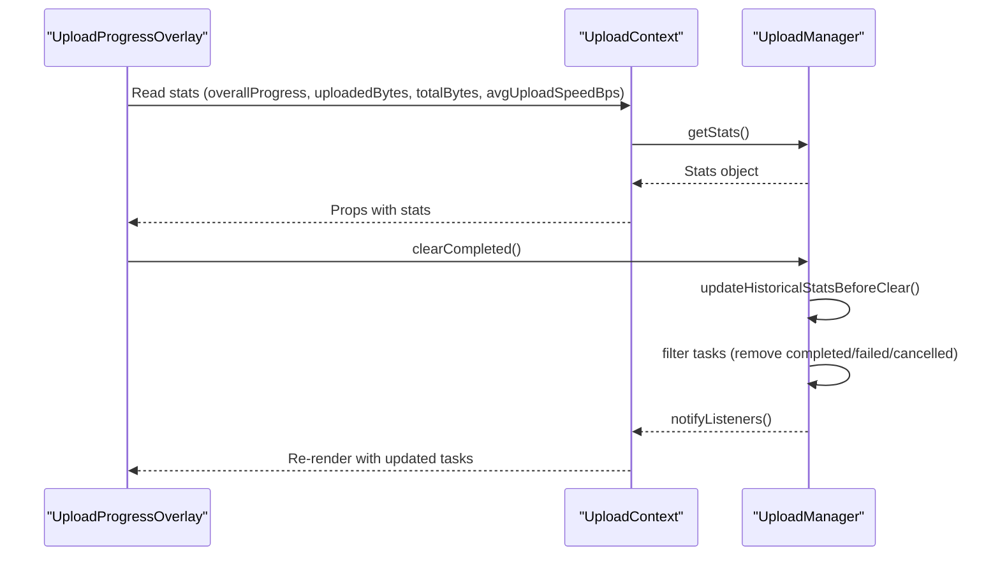
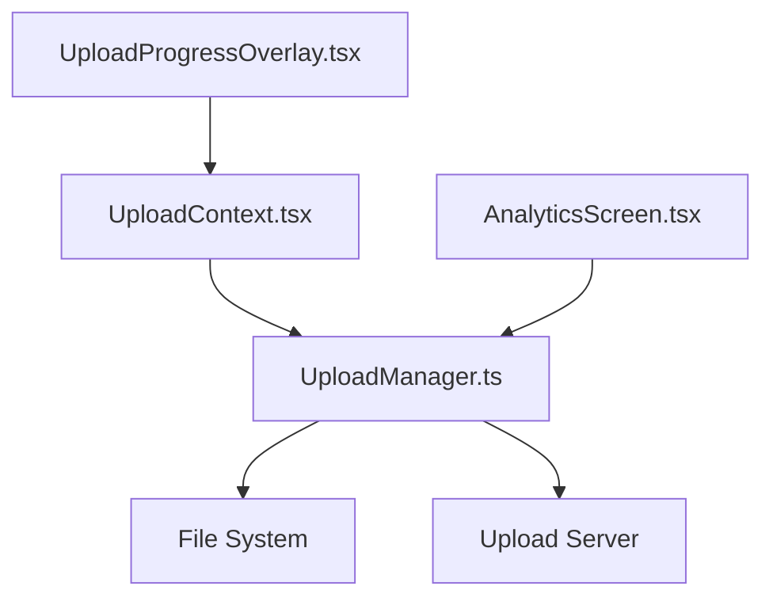

# Aggregate Statistics Tracking

<cite>
**Referenced Files in This Document**
- [UploadManager.ts](file://app/src/services/UploadManager.ts)
- [UploadContext.tsx](file://app/src/context/UploadContext.tsx)
- [UploadProgressOverlay.tsx](file://app/src/components/UploadProgressOverlay.tsx)
- [AnalyticsScreen.tsx](file://app/src/screens/AnalyticsScreen.tsx)
</cite>

## Table of Contents
1. [Introduction](#introduction)
2. [Project Structure](#project-structure)
3. [Core Components](#core-components)
4. [Architecture Overview](#architecture-overview)
5. [Detailed Component Analysis](#detailed-component-analysis)
6. [Dependency Analysis](#dependency-analysis)
7. [Performance Considerations](#performance-considerations)
8. [Troubleshooting Guide](#troubleshooting-guide)
9. [Conclusion](#conclusion)

## Introduction
This document explains the aggregate statistics tracking system that monitors overall upload performance across multiple files. It covers the single-pass statistics computation algorithm, real-time aggregation of active uploads, and historical statistics preservation. It documents the combined active and cleared statistics system, progress calculation methodology, and how the system maintains accurate overall progress percentages. Finally, it outlines performance implications and optimization strategies for large upload queues.

## Project Structure
The statistics tracking spans three primary areas:
- UploadManager: central service computing and caching aggregate stats, managing upload lifecycle, and maintaining historical counters.
- UploadContext: React context exposing derived stats and actions to UI components.
- UI components: overlays and analytics screens consuming stats for rendering progress and storage analytics.

**Diagram sources**
- [UploadManager.ts](file://app/src/services/UploadManager.ts#L126-L198)
- [UploadContext.tsx](file://app/src/context/UploadContext.tsx#L51-L114)
- [UploadProgressOverlay.tsx](file://app/src/components/UploadProgressOverlay.tsx#L29-L360)
- [AnalyticsScreen.tsx](file://app/src/screens/AnalyticsScreen.tsx#L72-L227)

**Section sources**
- [UploadManager.ts](file://app/src/services/UploadManager.ts#L126-L198)
- [UploadContext.tsx](file://app/src/context/UploadContext.tsx#L51-L114)

## Core Components
- UploadManager: Implements the single-pass statistics computation, real-time aggregation, historical preservation, and throttled notifications. It maintains cached stats and invalidates them on task changes to ensure correctness.
- UploadContext: Wraps UploadManager as a singleton provider, deriving aggregate stats from the latest task snapshot and exposing actions to the UI.
- UploadProgressOverlay: Renders overall progress and key metrics, including average upload speed and byte totals.
- AnalyticsScreen: Presents storage analytics and type breakdowns, complementing the upload progress view.

Key responsibilities:
- Single-pass stats: O(n) scan over the task list to compute counts, bytes, and progress.
- Combined active and cleared stats: Maintains historical counters for completed/failed/cleared tasks and merges them with active stats.
- Progress calculation: Byte-accurate overall progress computed as uploaded bytes divided by total bytes.
- Speed computation: Sliding-window current speed and exponential moving average (EMA) for stability.

**Section sources**
- [UploadManager.ts](file://app/src/services/UploadManager.ts#L314-L405)
- [UploadContext.tsx](file://app/src/context/UploadContext.tsx#L92-L109)
- [UploadProgressOverlay.tsx](file://app/src/components/UploadProgressOverlay.tsx#L29-L323)

## Architecture Overview
The system follows a publish-subscribe model:
- UploadManager computes stats and notifies subscribers whenever tasks change.
- UploadContext subscribes to UploadManager and exposes derived stats to React components.
- UI components render progress and analytics using the provided stats.

**Diagram sources**
- [UploadContext.tsx](file://app/src/context/UploadContext.tsx#L54-L60)
- [UploadManager.ts](file://app/src/services/UploadManager.ts#L176-L182)
- [UploadManager.ts](file://app/src/services/UploadManager.ts#L314-L318)

## Detailed Component Analysis

### UploadManager: Statistics Computation and Aggregation
- Single-pass statistics computation:
  - Iterates once over the task list, accumulating counts and bytes for each status category.
  - Uses a switch statement to classify tasks and sum activeTotalBytes and activeUploadedBytes.
  - Computes combined totals by adding cleared counters to active stats.
- Combined active and cleared statistics:
  - Historical counters track completed, failed, total files, and bytes.
  - On clearCompleted or scheduled task clearing, historical counters are updated before removing tasks.
- Progress calculation:
  - overallProgress = round(min((uploadedBytes / totalBytes) * 100, 100)).
  - Ensures 0% when totalBytes is 0 and caps at 100%.
- Speed computation:
  - Maintains a sliding window of speed samples over a fixed time window.
  - Computes current upload speed from the first and last samples in the window.
  - Applies exponential smoothing (alpha = 0.4) to derive a stable average speed.
- Throttled notifications:
  - Uses a throttle window to batch updates and reduce React re-renders.
  - Notifies listeners only when sufficient time has elapsed since the last notification.

**Diagram sources**
- [UploadManager.ts](file://app/src/services/UploadManager.ts#L324-L405)
- [UploadManager.ts](file://app/src/services/UploadManager.ts#L407-L445)

**Section sources**
- [UploadManager.ts](file://app/src/services/UploadManager.ts#L314-L405)
- [UploadManager.ts](file://app/src/services/UploadManager.ts#L407-L445)

### UploadContext: Derived Stats and Actions
- Subscribes to UploadManager and updates tasks whenever UploadManager notifies.
- Derives aggregate stats from the latest task snapshot using useMemo to avoid unnecessary recomputation.
- Exposes actions (add, cancel, pause, resume, retry, clear) that delegate to UploadManager.

**Diagram sources**
- [UploadContext.tsx](file://app/src/context/UploadContext.tsx#L51-L114)
- [UploadManager.ts](file://app/src/services/UploadManager.ts#L126-L198)

**Section sources**
- [UploadContext.tsx](file://app/src/context/UploadContext.tsx#L51-L114)

### UploadProgressOverlay: Rendering Overall Progress
- Displays the overall progress percentage and key metrics (uploaded, queued, failed, average speed).
- Uses the aggregated stats exposed by UploadContext to render the progress bar and summary cards.
- Provides a “Clear completed” action that invokes UploadManager.clearCompleted().

**Diagram sources**
- [UploadProgressOverlay.tsx](file://app/src/components/UploadProgressOverlay.tsx#L29-L323)
- [UploadManager.ts](file://app/src/services/UploadManager.ts#L616-L627)
- [UploadManager.ts](file://app/src/services/UploadManager.ts#L650-L660)

**Section sources**
- [UploadProgressOverlay.tsx](file://app/src/components/UploadProgressOverlay.tsx#L29-L323)
- [UploadManager.ts](file://app/src/services/UploadManager.ts#L616-L627)
- [UploadManager.ts](file://app/src/services/UploadManager.ts#L650-L660)

### AnalyticsScreen: Storage Analytics
- Fetches server-side storage statistics and renders storage usage and type breakdowns.
- While distinct from upload progress, it complements the upload system by providing long-term storage insights.

**Section sources**
- [AnalyticsScreen.tsx](file://app/src/screens/AnalyticsScreen.tsx#L72-L227)

## Dependency Analysis
- UploadContext depends on UploadManager for stats and actions.
- UploadManager depends on:
  - Task lifecycle transitions and persistence (AsyncStorage).
  - Speed sampling and EMA computation.
  - Throttled notifications to minimize UI churn.
- UI components depend on UploadContext for stats and actions.

**Diagram sources**
- [UploadContext.tsx](file://app/src/context/UploadContext.tsx#L51-L114)
- [UploadManager.ts](file://app/src/services/UploadManager.ts#L126-L198)
- [UploadProgressOverlay.tsx](file://app/src/components/UploadProgressOverlay.tsx#L29-L360)
- [AnalyticsScreen.tsx](file://app/src/screens/AnalyticsScreen.tsx#L72-L227)

**Section sources**
- [UploadContext.tsx](file://app/src/context/UploadContext.tsx#L51-L114)
- [UploadManager.ts](file://app/src/services/UploadManager.ts#L126-L198)

## Performance Considerations
- Single-pass statistics computation:
  - O(n) scan over the task list reduces overhead compared to multiple filter/map passes.
  - Minimizes allocations by updating counters in place.
- Caching and invalidation:
  - Cached stats are invalidated on every task update, ensuring correctness without recalculating unnecessarily.
- Throttled notifications:
  - A 200 ms throttle window prevents excessive React re-renders and keeps UI responsive.
- Speed computation:
  - Sliding window with EMA provides smooth speed readings while avoiding noisy spikes.
- Large upload queues:
  - The system scales linearly with the number of active tasks.
  - Consider limiting the number of concurrent uploads to balance throughput and resource usage.
  - For very large queues, consider pagination or virtualized lists in UI components to reduce rendering cost.

[No sources needed since this section provides general guidance]

## Troubleshooting Guide
- Incorrect overall progress:
  - Verify that totalBytes is greater than zero before computing overallProgress to avoid division by zero.
  - Ensure bytesUploaded reflects actual progress updates during chunk uploads and polling phases.
- Speed shows zero or unstable values:
  - Confirm that isActivelyUploading is true when computing speeds.
  - Check that the speed window contains at least two samples before calculating current speed.
- Stats not updating:
  - Ensure updateTask invalidates cachedStats and triggers notifyListeners.
  - Verify that UploadContext subscribes to UploadManager and re-renders on new snapshots.
- Historical stats missing:
  - Confirm that clearCompleted invokes updateHistoricalStatsBeforeClear for completed/failed/cancelled tasks.
  - Verify AsyncStorage persistence for @upload_stats_v2 and @upload_queue_v2 keys.

**Section sources**
- [UploadManager.ts](file://app/src/services/UploadManager.ts#L382-L384)
- [UploadManager.ts](file://app/src/services/UploadManager.ts#L411-L416)
- [UploadManager.ts](file://app/src/services/UploadManager.ts#L426-L432)
- [UploadManager.ts](file://app/src/services/UploadManager.ts#L180-L182)
- [UploadManager.ts](file://app/src/services/UploadManager.ts#L650-L660)

## Conclusion
The aggregate statistics tracking system provides accurate, real-time visibility into upload performance across multiple files. Its single-pass computation, combined active and cleared statistics, and throttled notifications deliver reliable progress percentages and smooth UI updates. By leveraging caching, sliding windows, and EMA smoothing, the system remains efficient and responsive even under heavy upload loads. For large queues, consider additional UI optimizations and controlled concurrency to maintain performance.