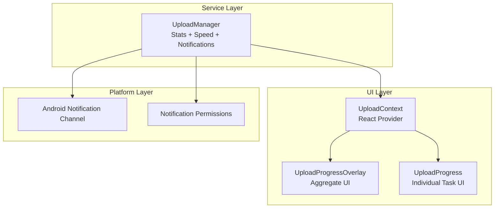
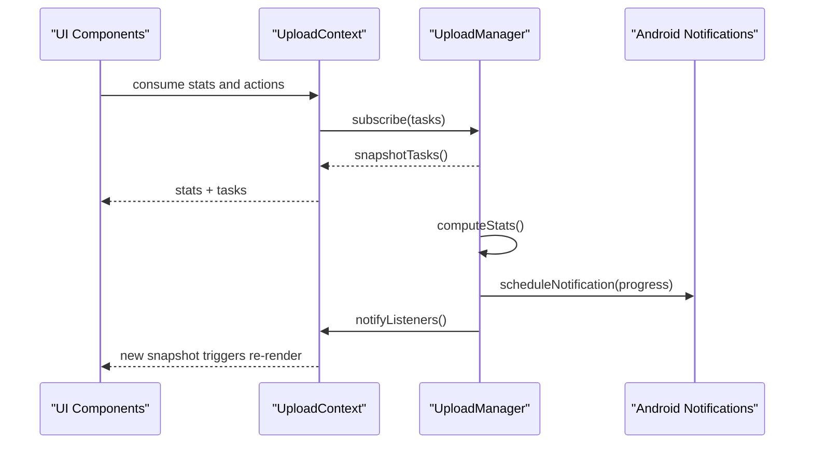
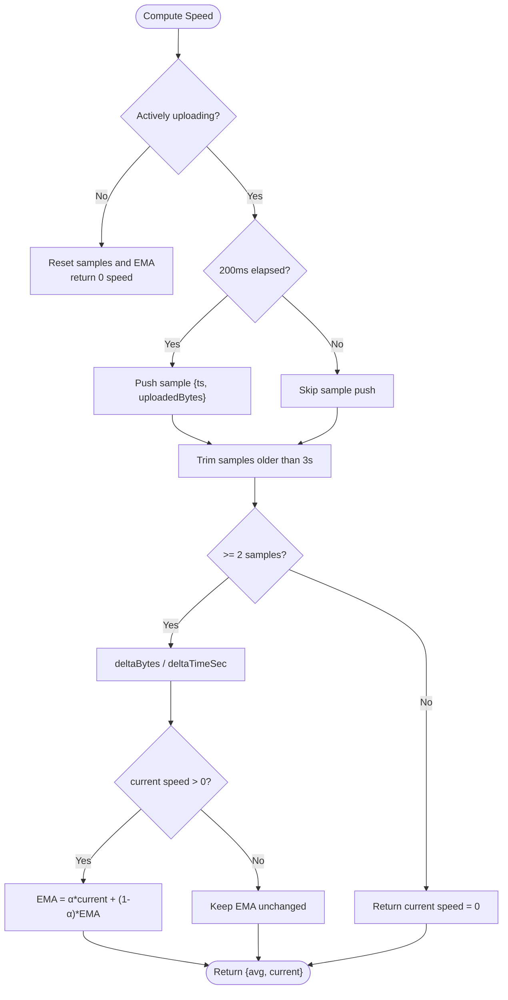
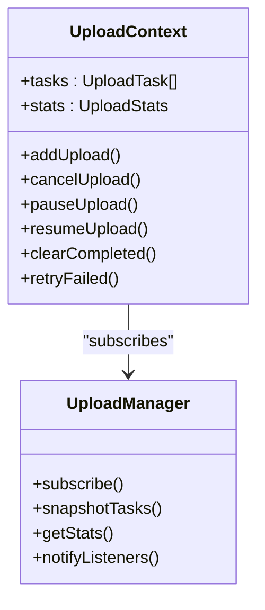
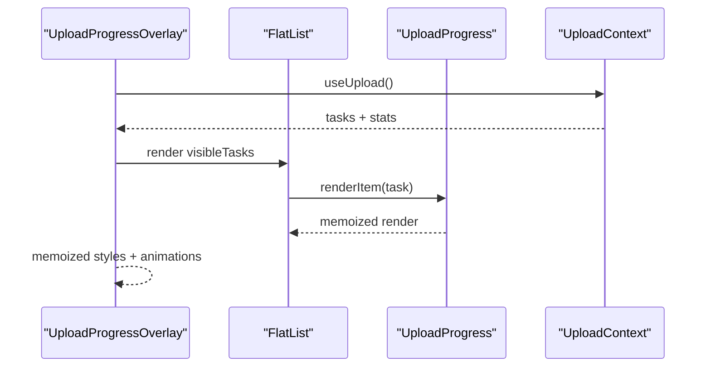
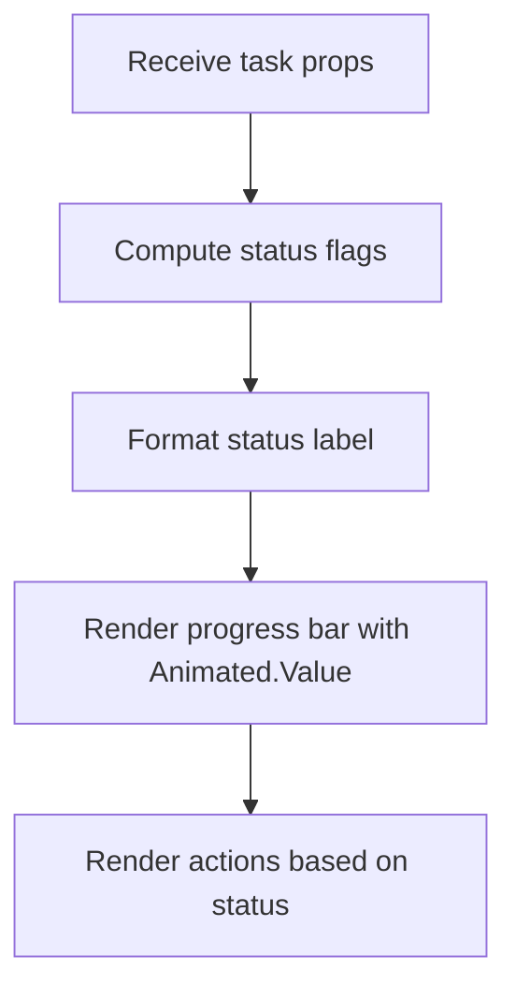
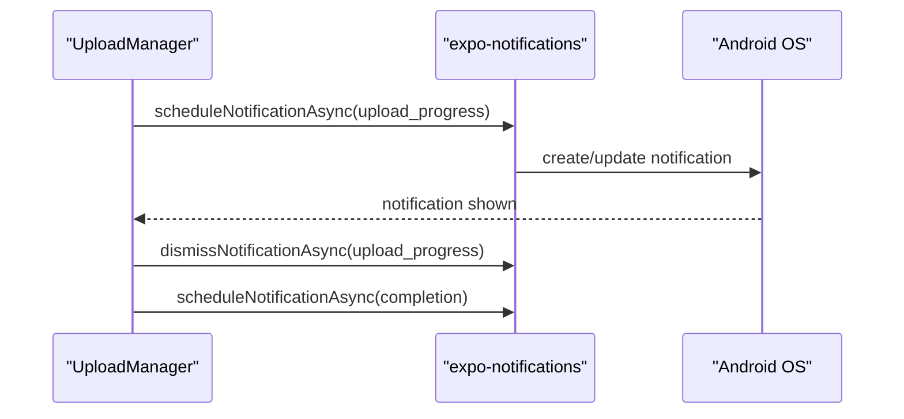
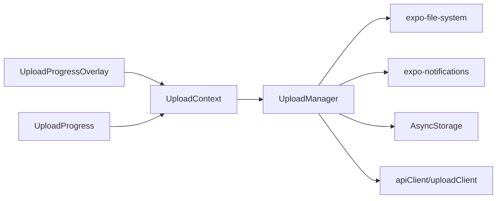

# Progress Tracking and Monitoring

<cite>
**Referenced Files in This Document**
- [UploadManager.ts](file://app/src/services/UploadManager.ts)
- [UploadContext.tsx](file://app/src/context/UploadContext.tsx)
- [UploadProgress.tsx](file://app/src/components/UploadProgress.tsx)
- [UploadProgressOverlay.tsx](file://app/src/components/UploadProgressOverlay.tsx)
- [App.tsx](file://app/App.tsx)
- [AndroidManifest.xml](file://app/android/app/src/main/AndroidManifest.xml)
</cite>

## Table of Contents
1. [Introduction](#introduction)
2. [Project Structure](#project-structure)
3. [Core Components](#core-components)
4. [Architecture Overview](#architecture-overview)
5. [Detailed Component Analysis](#detailed-component-analysis)
6. [Dependency Analysis](#dependency-analysis)
7. [Performance Considerations](#performance-considerations)
8. [Troubleshooting Guide](#troubleshooting-guide)
9. [Conclusion](#conclusion)

## Introduction
This document explains the progress tracking and monitoring system for uploads. It covers:
- Real-time progress calculation using uploadedBytes vs totalBytes
- Throttled notification system (200 ms intervals)
- Aggregate statistics computation
- Speed calculation algorithms including exponential moving average (EMA)
- Android progress notifications integration
- React state management with immutable updates
- Performance optimization techniques to prevent excessive re-renders

## Project Structure
The progress tracking system spans three layers:
- Service layer: centralized UploadManager orchestrates uploads, computes stats, and schedules notifications
- UI layer: UploadContext exposes stats to React components; UploadProgress and UploadProgressOverlay render progress
- Platform layer: Android notification channel and permissions configured in App.tsx and AndroidManifest.xml

**Diagram sources**
- [UploadManager.ts](file://app/src/services/UploadManager.ts#L126-L198)
- [UploadContext.tsx](file://app/src/context/UploadContext.tsx#L51-L114)
- [UploadProgressOverlay.tsx](file://app/src/components/UploadProgressOverlay.tsx#L29-L66)
- [UploadProgress.tsx](file://app/src/components/UploadProgress.tsx#L42-L186)
- [App.tsx](file://app/App.tsx#L217-L229)

**Section sources**
- [UploadManager.ts](file://app/src/services/UploadManager.ts#L126-L198)
- [UploadContext.tsx](file://app/src/context/UploadContext.tsx#L51-L114)
- [UploadProgressOverlay.tsx](file://app/src/components/UploadProgressOverlay.tsx#L29-L66)
- [UploadProgress.tsx](file://app/src/components/UploadProgress.tsx#L42-L186)
- [App.tsx](file://app/App.tsx#L217-L229)

## Core Components
- UploadManager: central service computing aggregate stats, throttled notifications, and EMA-based upload speeds
- UploadContext: React provider exposing stats and actions to UI
- UploadProgressOverlay: renders aggregate progress and task list with performance optimizations
- UploadProgress: renders individual task progress with animated bars and immutable updates

Key responsibilities:
- Real-time progress: uploadedBytes / totalBytes with byte-accurate rounding
- Throttling: 200 ms intervals for notifications and state updates
- Speed: current speed over a 3-second window and EMA smoothing
- Notifications: Android progress notifications with a dedicated channel

**Section sources**
- [UploadManager.ts](file://app/src/services/UploadManager.ts#L133-L136)
- [UploadManager.ts](file://app/src/services/UploadManager.ts#L314-L405)
- [UploadManager.ts](file://app/src/services/UploadManager.ts#L407-L445)
- [UploadManager.ts](file://app/src/services/UploadManager.ts#L449-L510)
- [UploadContext.tsx](file://app/src/context/UploadContext.tsx#L16-L31)
- [UploadProgressOverlay.tsx](file://app/src/components/UploadProgressOverlay.tsx#L29-L66)
- [UploadProgress.tsx](file://app/src/components/UploadProgress.tsx#L42-L186)

## Architecture Overview
The system follows a publish-subscribe model:
- UploadManager maintains tasks and publishes snapshots to subscribers
- UploadContext subscribes and exposes derived stats to React
- UI components render progress and aggregate stats
- UploadManager periodically updates Android notifications

**Diagram sources**
- [UploadContext.tsx](file://app/src/context/UploadContext.tsx#L51-L60)
- [UploadManager.ts](file://app/src/services/UploadManager.ts#L259-L310)
- [UploadManager.ts](file://app/src/services/UploadManager.ts#L449-L510)

## Detailed Component Analysis

### UploadManager: Progress, Speed, and Notifications
UploadManager centralizes progress tracking and speed computation:
- Real-time progress: overallProgress computed from uploadedBytes / totalBytes with byte-accurate rounding
- Throttled notifications: 200 ms throttle for both state updates and Android notifications
- Speed computation:
  - Current speed over a 3-second window using speedSamples
  - EMA smoothing with alpha 0.4 for avgUploadSpeedBps
- Aggregate stats: single-pass computation across statuses and sizes
- Android notifications: ongoing progress with channel and indeterminate state when progress is 0

**Diagram sources**
- [UploadManager.ts](file://app/src/services/UploadManager.ts#L407-L445)

**Section sources**
- [UploadManager.ts](file://app/src/services/UploadManager.ts#L133-L136)
- [UploadManager.ts](file://app/src/services/UploadManager.ts#L314-L405)
- [UploadManager.ts](file://app/src/services/UploadManager.ts#L407-L445)
- [UploadManager.ts](file://app/src/services/UploadManager.ts#L449-L510)

### UploadContext: React State Management with Immutable Updates
UploadContext provides:
- Stats derived from UploadManager.getStats()
- Actions that delegate to UploadManager
- Subscribes to UploadManager snapshots and updates React state
- Uses useMemo to compute stats from the task snapshot to keep them in sync

Immutable update strategy:
- UploadManager returns a new array snapshot on every change
- React detects changes via reference equality (===) and re-renders efficiently

**Diagram sources**
- [UploadContext.tsx](file://app/src/context/UploadContext.tsx#L16-L47)
- [UploadContext.tsx](file://app/src/context/UploadContext.tsx#L51-L114)
- [UploadManager.ts](file://app/src/services/UploadManager.ts#L259-L310)

**Section sources**
- [UploadContext.tsx](file://app/src/context/UploadContext.tsx#L51-L114)
- [UploadManager.ts](file://app/src/services/UploadManager.ts#L267-L277)
- [UploadManager.ts](file://app/src/services/UploadManager.ts#L283-L310)

### UploadProgressOverlay: Aggregate UI with Performance Optimizations
UploadProgressOverlay renders:
- Overall progress bar and aggregate stats
- Task list with FlatList optimizations
- Animated expansion/collapse with memoized styles
- Auto-dismiss on perfect success

Performance optimizations:
- React.memo on component and StatPill
- FlatList with removeClippedSubviews, initialNumToRender, maxToRenderPerBatch, windowSize
- useMemo for filtered visibleTasks
- Animated.Value for smooth transitions

**Diagram sources**
- [UploadProgressOverlay.tsx](file://app/src/components/UploadProgressOverlay.tsx#L29-L66)
- [UploadProgressOverlay.tsx](file://app/src/components/UploadProgressOverlay.tsx#L327-L346)
- [UploadProgress.tsx](file://app/src/components/UploadProgress.tsx#L247-L249)

**Section sources**
- [UploadProgressOverlay.tsx](file://app/src/components/UploadProgressOverlay.tsx#L29-L66)
- [UploadProgressOverlay.tsx](file://app/src/components/UploadProgressOverlay.tsx#L327-L346)
- [UploadProgressOverlay.tsx](file://app/src/components/UploadProgressOverlay.tsx#L263-L274)
- [UploadProgress.tsx](file://app/src/components/UploadProgress.tsx#L247-L249)

### UploadProgress: Individual Task Rendering
UploadProgress displays:
- Animated progress bar synchronized with task.progress
- Status indicators and actions (pause/resume/retry/cancel)
- Byte-accurate status text using formatFileSize

**Diagram sources**
- [UploadProgress.tsx](file://app/src/components/UploadProgress.tsx#L42-L186)

**Section sources**
- [UploadProgress.tsx](file://app/src/components/UploadProgress.tsx#L42-L186)

### Android Progress Notifications Integration
UploadManager integrates with Android notifications:
- Creates a dedicated channel "upload_channel" with LOW importance
- Schedules ongoing progress notifications with progress bar
- Dismisses progress notification when no active uploads remain
- Shows completion notification with counts and colors

**Diagram sources**
- [UploadManager.ts](file://app/src/services/UploadManager.ts#L449-L510)
- [App.tsx](file://app/App.tsx#L217-L229)
- [AndroidManifest.xml](file://app/android/app/src/main/AndroidManifest.xml#L1-L36)

**Section sources**
- [UploadManager.ts](file://app/src/services/UploadManager.ts#L449-L510)
- [App.tsx](file://app/App.tsx#L217-L229)
- [AndroidManifest.xml](file://app/android/app/src/main/AndroidManifest.xml#L1-L36)

## Dependency Analysis
- UploadContext depends on UploadManager for subscriptions and stats
- UploadProgressOverlay depends on UploadContext for stats and actions
- UploadProgress depends on UploadContext for actions and theme
- UploadManager depends on:
  - expo-file-system for chunked reads
  - expo-notifications for Android progress notifications
  - AsyncStorage for persistence and historical stats
  - uploadClient/apiClient for server communication

**Diagram sources**
- [UploadManager.ts](file://app/src/services/UploadManager.ts#L20-L26)
- [UploadContext.tsx](file://app/src/context/UploadContext.tsx#L12-L14)
- [UploadProgressOverlay.tsx](file://app/src/components/UploadProgressOverlay.tsx#L9-L12)
- [UploadProgress.tsx](file://app/src/components/UploadProgress.tsx#L17-L19)

**Section sources**
- [UploadManager.ts](file://app/src/services/UploadManager.ts#L20-L26)
- [UploadContext.tsx](file://app/src/context/UploadContext.tsx#L12-L14)
- [UploadProgressOverlay.tsx](file://app/src/components/UploadProgressOverlay.tsx#L9-L12)
- [UploadProgress.tsx](file://app/src/components/UploadProgress.tsx#L17-L19)

## Performance Considerations
- Throttled updates: 200 ms throttle prevents excessive React re-renders during rapid chunk uploads
- Immutable snapshots: UploadManager returns new arrays on every change; React detects differences via reference equality
- Single-pass aggregation: computeStats iterates once over tasks to compute totals and counts
- FlatList optimizations: removeClippedSubviews, initialNumToRender, maxToRenderPerBatch, windowSize reduce rendering overhead
- Memoization: React.memo on components and StatPill minimizes unnecessary re-renders
- EMA smoothing: reduces jitter in speed display while maintaining responsiveness

[No sources needed since this section provides general guidance]

## Troubleshooting Guide
Common issues and remedies:
- Notifications not appearing on Android:
  - Verify notification channel creation and permissions in App.tsx
  - Confirm AndroidManifest.xml meta-data for notification icons/colors
- Excessive re-renders:
  - Ensure UploadManager.notifyListeners is throttled (200 ms)
  - Confirm UploadProgress and UploadProgressOverlay are wrapped with React.memo
  - Use useMemo for derived values like visibleTasks
- Incorrect progress percentages:
  - Verify overallProgress uses byte-accurate division and rounding
  - Ensure uploadedBytes and totalBytes include historical stats for cleared tasks
- Speed spikes or drops:
  - Confirm speedSamples trimming to 3 seconds and EMA alpha 0.4
  - Check that current speed is only computed when actively uploading

**Section sources**
- [App.tsx](file://app/App.tsx#L217-L229)
- [AndroidManifest.xml](file://app/android/app/src/main/AndroidManifest.xml#L20-L23)
- [UploadManager.ts](file://app/src/services/UploadManager.ts#L283-L310)
- [UploadProgress.tsx](file://app/src/components/UploadProgress.tsx#L247-L249)
- [UploadProgressOverlay.tsx](file://app/src/components/UploadProgressOverlay.tsx#L327-L346)
- [UploadManager.ts](file://app/src/services/UploadManager.ts#L382-L384)
- [UploadManager.ts](file://app/src/services/UploadManager.ts#L423-L424)
- [UploadManager.ts](file://app/src/services/UploadManager.ts#L434-L439)

## Conclusion
The progress tracking and monitoring system combines precise byte-accurate progress, throttled updates, and EMA-based speed metrics to deliver responsive and reliable feedback. React’s immutable update model and extensive memoization minimize re-renders, while Android notifications provide persistent progress visibility. The design balances accuracy, performance, and user experience across platforms.