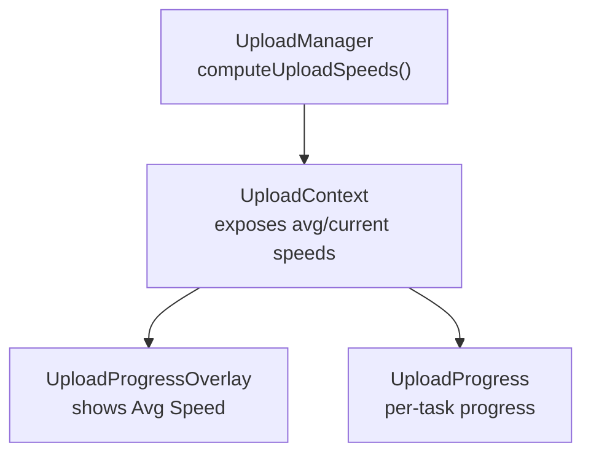
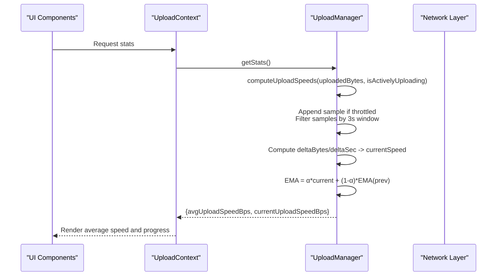
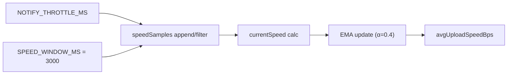

# Speed Calculation Algorithms

<cite>
**Referenced Files in This Document**
- [UploadManager.ts](file://app/src/services/UploadManager.ts)
- [UploadProgressOverlay.tsx](file://app/src/components/UploadProgressOverlay.tsx)
- [UploadProgress.tsx](file://app/src/components/UploadProgress.tsx)
- [UploadContext.tsx](file://app/src/context/UploadContext.tsx)
- [format.ts](file://app/src/utils/format.ts)
</cite>

## Table of Contents
1. [Introduction](#introduction)
2. [Project Structure](#project-structure)
3. [Core Components](#core-components)
4. [Architecture Overview](#architecture-overview)
5. [Detailed Component Analysis](#detailed-component-analysis)
6. [Dependency Analysis](#dependency-analysis)
7. [Performance Considerations](#performance-considerations)
8. [Troubleshooting Guide](#troubleshooting-guide)
9. [Conclusion](#conclusion)

## Introduction
This document explains the dual-speed calculation system used in progress tracking for uploads. It covers:
- Current upload speed computed as delta bytes over delta time within a 3-second sliding window
- Exponential moving average (EMA) applied to smooth the speed display
- How speed samples are collected, filtered, and updated
- Edge cases and safeguards against unrealistic spikes
- Performance optimizations and practical examples

## Project Structure
The speed calculation resides in the upload manager and is surfaced to UI components via a React context. The overlay displays aggregate stats including average upload speed.

**Diagram sources**
- [UploadManager.ts](file://app/src/services/UploadManager.ts#L407-L445)
- [UploadContext.tsx](file://app/src/context/UploadContext.tsx#L16-L31)
- [UploadProgressOverlay.tsx](file://app/src/components/UploadProgressOverlay.tsx#L315-L315)

**Section sources**
- [UploadManager.ts](file://app/src/services/UploadManager.ts#L126-L150)
- [UploadContext.tsx](file://app/src/context/UploadContext.tsx#L16-L31)

## Core Components
- UploadManager: Maintains a sliding window of speed samples, computes current and EMA speeds, and exposes aggregate stats.
- UploadContext: Provides derived stats (including average and current upload speeds) to the UI.
- UploadProgressOverlay: Displays the average upload speed alongside overall progress and counts.

Key constants and fields:
- Sliding window duration: 3 seconds
- Sampling interval: throttled to at least the notify throttle period
- EMA coefficient (alpha): 0.4

**Section sources**
- [UploadManager.ts](file://app/src/services/UploadManager.ts#L135-L135)
- [UploadManager.ts](file://app/src/services/UploadManager.ts#L134-L134)
- [UploadManager.ts](file://app/src/services/UploadManager.ts#L435-L435)
- [UploadContext.tsx](file://app/src/context/UploadContext.tsx#L27-L28)

## Architecture Overview
The speed computation pipeline integrates with the upload lifecycle and notification system. Samples are appended at intervals, filtered by the sliding window, and smoothed via EMA.

**Diagram sources**
- [UploadManager.ts](file://app/src/services/UploadManager.ts#L407-L445)
- [UploadContext.tsx](file://app/src/context/UploadContext.tsx#L95-L95)

## Detailed Component Analysis

### Dual-Speed Calculation System
The system maintains two complementary metrics:
- Current upload speed: instantaneous rate over the sliding window
- Average upload speed (EMA): smoothed rate using exponential smoothing

Implementation highlights:
- Sliding window: retains samples within the last 3 seconds
- Sampling cadence: limited by the notify throttle to avoid excessive updates
- Current speed: delta bytes divided by delta seconds; minimum time window enforced
- EMA smoothing: alpha = 0.4; initialized to the first valid current speed

Edge cases handled:
- No actively uploading tasks: resets samples and returns zeros
- Insufficient samples: avoids division by near-zero deltas
- First valid speed: initializes EMA to current speed

Performance characteristics:
- O(n) filtering per stats computation where n is number of samples within the window
- Constant-time per sample append and EMA update
- Throttled sampling reduces render and computation overhead

**Section sources**
- [UploadManager.ts](file://app/src/services/UploadManager.ts#L407-L445)
- [UploadManager.ts](file://app/src/services/UploadManager.ts#L134-L135)
- [UploadManager.ts](file://app/src/services/UploadManager.ts#L135-L135)

### Mathematical Formulas
Current speed (within 3-second window):
- Let S = speedSamples, sorted by timestamp
- If |S| ≥ 2:
  - first = S[0], last = S[|S|-1]
  - deltaBytes = max(last.uploadedBytes - first.uploadedBytes, 0)
  - deltaTimeSec = max((last.ts - first.ts)/1000, 0.001)
  - currentSpeed = deltaBytes / deltaTimeSec
- Else: currentSpeed = 0

Exponential moving average (alpha = 0.4):
- If currentSpeed > 0:
  - ema = currentSpeed if ema was 0
  - ema = 0.4 * currentSpeed + 0.6 * ema_previous otherwise
- Else: ema remains unchanged (non-positive guard)

Aggregate stats exposure:
- avgUploadSpeedBps = ema
- currentUploadSpeedBps = currentSpeed

**Section sources**
- [UploadManager.ts](file://app/src/services/UploadManager.ts#L426-L432)
- [UploadManager.ts](file://app/src/services/UploadManager.ts#L434-L439)
- [UploadManager.ts](file://app/src/services/UploadManager.ts#L441-L444)

### Speed Sample Collection and Filtering
Collection:
- Samples are appended when the elapsed time since last sample equals or exceeds the notify throttle
- Each sample records the current timestamp and cumulative uploaded bytes

Filtering:
- Retain only samples with timestamps within the last 3 seconds
- Ensures current speed reflects recent activity and prevents stale data from skewing results

Throttling:
- Prevents excessive updates and keeps UI responsive
- Balances accuracy with performance

**Section sources**
- [UploadManager.ts](file://app/src/services/UploadManager.ts#L418-L421)
- [UploadManager.ts](file://app/src/services/UploadManager.ts#L423-L424)
- [UploadManager.ts](file://app/src/services/UploadManager.ts#L134-L135)
- [UploadManager.ts](file://app/src/services/UploadManager.ts#L135-L135)

### Smoothness and Spike Prevention
Smoothness:
- EMA with alpha = 0.4 reduces jitter by blending recent current speed with prior smoothed value
- Initial EMA equals the first valid current speed to avoid sudden jumps

Spike prevention:
- Minimum time delta enforced to avoid extreme spikes when samples are too close
- Sliding window ensures only recent data influences current speed
- Throttled sampling limits bursty updates

**Section sources**
- [UploadManager.ts](file://app/src/services/UploadManager.ts#L434-L439)
- [UploadManager.ts](file://app/src/services/UploadManager.ts#L430-L431)
- [UploadManager.ts](file://app/src/services/UploadManager.ts#L423-L424)

### UI Integration and Display
- UploadContext exposes avgUploadSpeedBps and currentUploadSpeedBps
- UploadProgressOverlay formats and displays average speed
- UploadProgress renders per-task progress and status

Formatting:
- Speed formatting uses a shared utility to convert bytes per second into human-readable units

**Section sources**
- [UploadContext.tsx](file://app/src/context/UploadContext.tsx#L27-L28)
- [UploadProgressOverlay.tsx](file://app/src/components/UploadProgressOverlay.tsx#L315-L315)
- [format.ts](file://app/src/utils/format.ts#L4-L10)

## Dependency Analysis
The speed calculation depends on:
- UploadManager’s internal state (samples, EMA, last sample timestamp)
- Notify throttle timing to control sampling frequency
- Sliding window constant to constrain the observation period

**Diagram sources**
- [UploadManager.ts](file://app/src/services/UploadManager.ts#L134-L135)
- [UploadManager.ts](file://app/src/services/UploadManager.ts#L135-L135)
- [UploadManager.ts](file://app/src/services/UploadManager.ts#L418-L424)
- [UploadManager.ts](file://app/src/services/UploadManager.ts#L426-L439)

**Section sources**
- [UploadManager.ts](file://app/src/services/UploadManager.ts#L134-L135)
- [UploadManager.ts](file://app/src/services/UploadManager.ts#L135-L135)
- [UploadManager.ts](file://app/src/services/UploadManager.ts#L418-L439)

## Performance Considerations
- Sampling cadence: controlled by notify throttle to reduce CPU and render pressure
- Window filtering: O(n) pass over samples; acceptable given typical sample counts
- EMA update: constant-time operation per stats computation
- UI rendering: throttled notifications minimize frequent re-renders

Recommendations:
- Keep notify throttle aligned with UI refresh needs
- Monitor sample count growth; consider periodic cleanup if needed
- Ensure network progress callbacks are not overly frequent to avoid redundant computations

[No sources needed since this section provides general guidance]

## Troubleshooting Guide
Common issues and mitigations:
- Speed shows zero or fluctuates wildly
  - Verify that samples are being appended (check notify throttle and active uploads)
  - Confirm sufficient samples exist in the 3-second window
- EMA does not change
  - Ensure current speed is positive; EMA only updates when current speed > 0
- UI speed appears inconsistent
  - Check that the overlay uses avgUploadSpeedBps from the context
  - Confirm formatting utility is applied consistently

**Section sources**
- [UploadManager.ts](file://app/src/services/UploadManager.ts#L411-L416)
- [UploadManager.ts](file://app/src/services/UploadManager.ts#L434-L439)
- [UploadProgressOverlay.tsx](file://app/src/components/UploadProgressOverlay.tsx#L315-L315)

## Conclusion
The dual-speed system combines a 3-second sliding window current speed with EMA smoothing to deliver accurate and visually stable upload throughput. Its design balances responsiveness with stability, leveraging throttled sampling and window filtering to maintain performance while preventing unrealistic spikes.