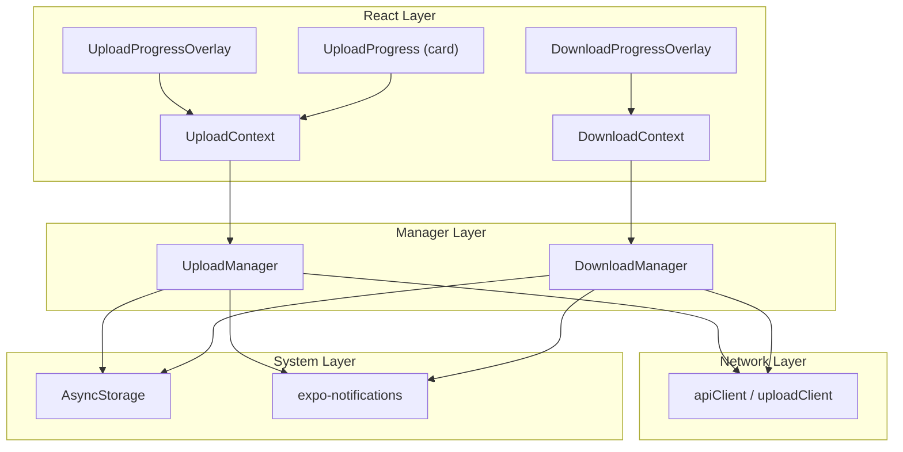
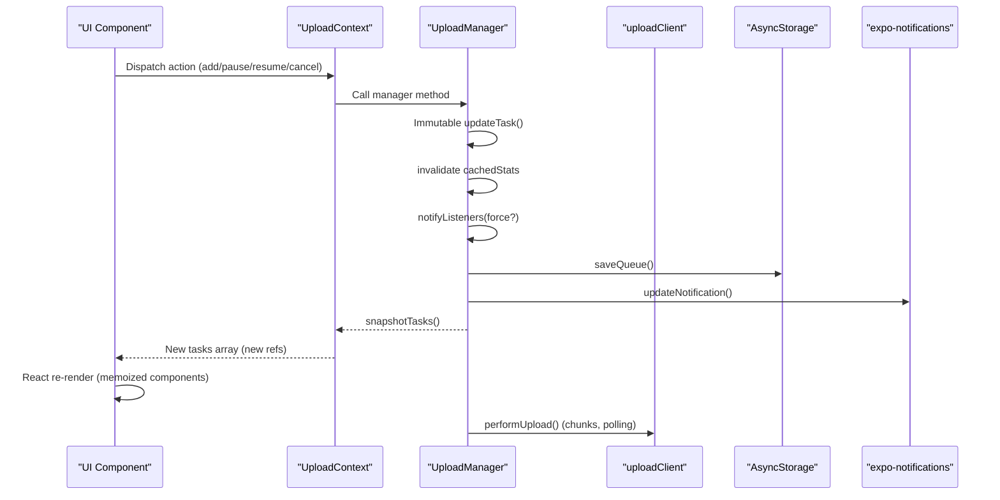
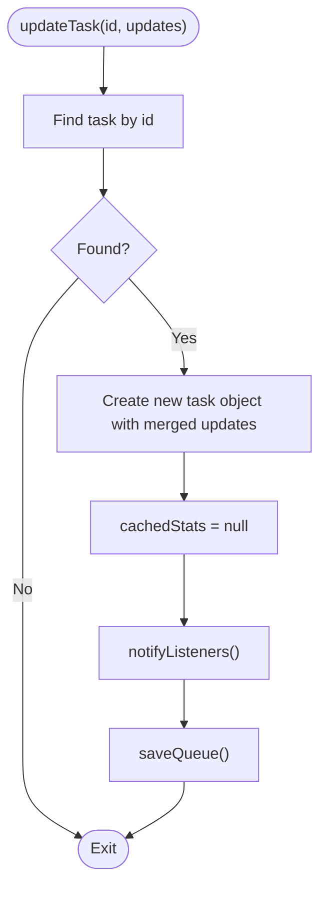
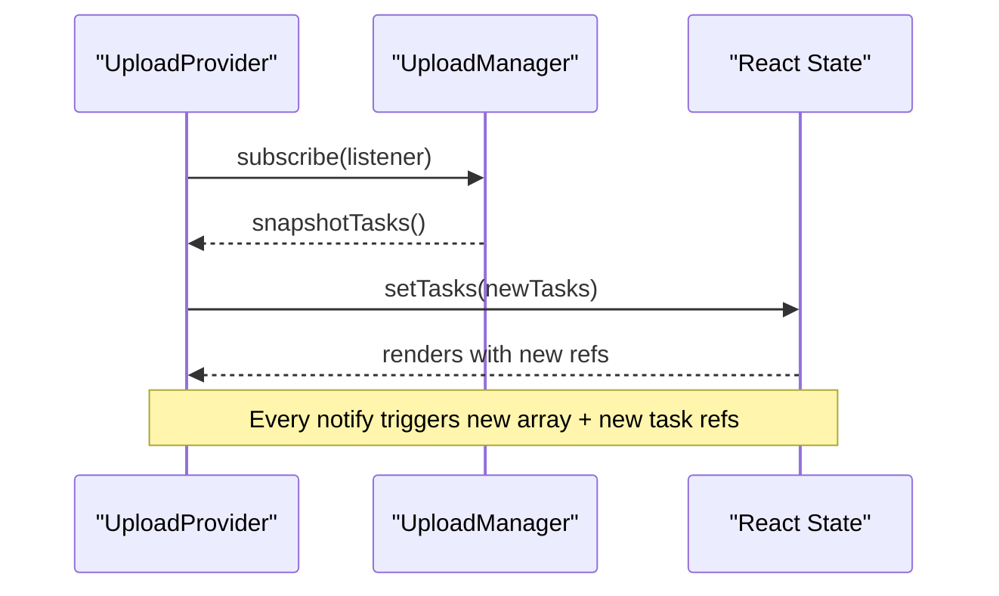
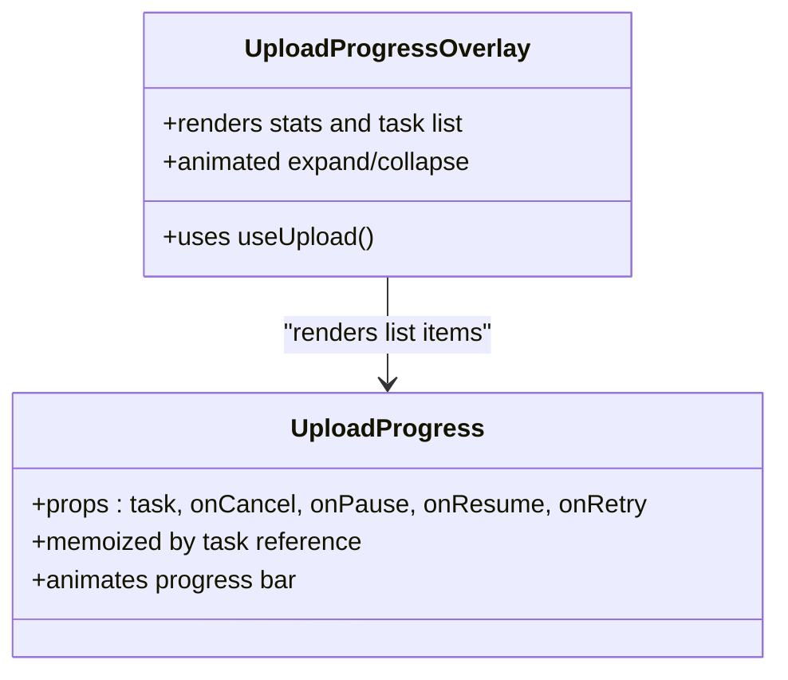
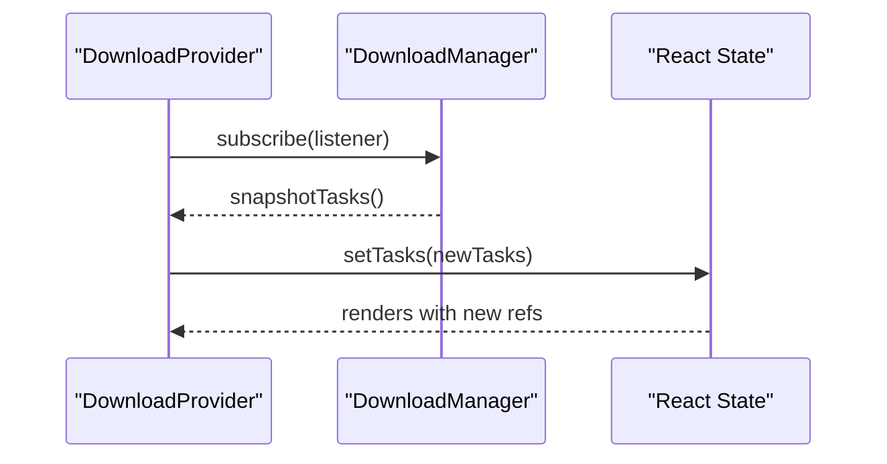
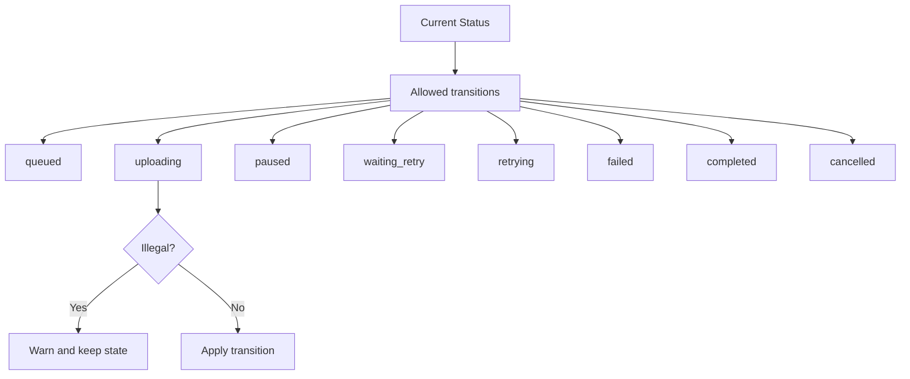
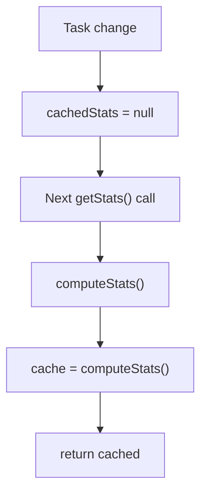
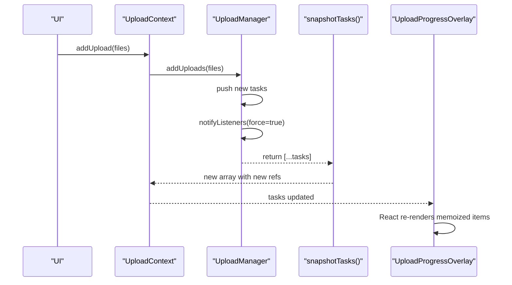
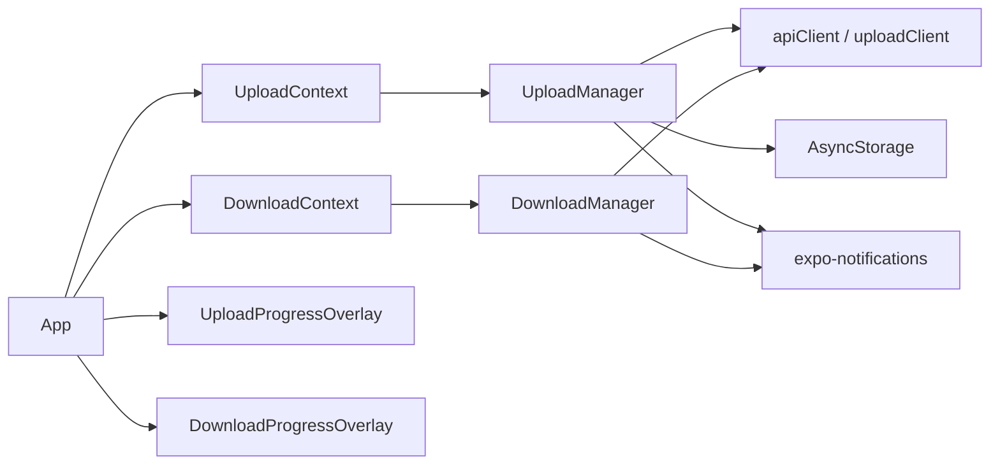

# State Management Patterns

<cite>
**Referenced Files in This Document**
- [UploadManager.ts](file://app/src/services/UploadManager.ts)
- [UploadContext.tsx](file://app/src/context/UploadContext.tsx)
- [UploadProgress.tsx](file://app/src/components/UploadProgress.tsx)
- [UploadProgressOverlay.tsx](file://app/src/components/UploadProgressOverlay.tsx)
- [DownloadManager.ts](file://app/src/services/DownloadManager.ts)
- [DownloadContext.tsx](file://app/src/context/DownloadContext.tsx)
- [DownloadProgressOverlay.tsx](file://app/src/components/DownloadProgressOverlay.tsx)
- [App.tsx](file://app/App.tsx)
- [apiClient.ts](file://app/src/services/apiClient.ts)
- [ServerStatusContext.tsx](file://app/src/context/ServerStatusContext.tsx)
- [ServerWakingOverlay.tsx](file://app/src/components/ServerWakingOverlay.tsx)
</cite>

## Table of Contents
1. [Introduction](#introduction)
2. [Project Structure](#project-structure)
3. [Core Components](#core-components)
4. [Architecture Overview](#architecture-overview)
5. [Detailed Component Analysis](#detailed-component-analysis)
6. [Dependency Analysis](#dependency-analysis)
7. [Performance Considerations](#performance-considerations)
8. [Troubleshooting Guide](#troubleshooting-guide)
9. [Conclusion](#conclusion)

## Introduction
This document explains the state management patterns used for progress tracking and monitoring in the upload and download subsystems. It covers immutable task object updates, the snapshot pattern for React compatibility, how new task references trigger component re-renders, the subscription-based listener system, task status transitions, race condition prevention, statistics caching and invalidation, performance optimizations for large queues, and practical examples of state update flows and React integration patterns.

## Project Structure
The state management spans three layers:
- Managers: Centralized, singleton managers for uploads and downloads that encapsulate all state, transitions, persistence, and notifications.
- Contexts: React providers that expose derived stats and actions to components and subscribe to manager snapshots.
- Components: UI overlays and cards that render progress, stats, and controls, leveraging memoization and efficient list rendering.

**Diagram sources**
- [UploadContext.tsx](file://app/src/context/UploadContext.tsx#L51-L114)
- [DownloadContext.tsx](file://app/src/context/DownloadContext.tsx#L29-L84)
- [UploadManager.ts](file://app/src/services/UploadManager.ts#L126-L198)
- [DownloadManager.ts](file://app/src/services/DownloadManager.ts#L42-L78)
- [apiClient.ts](file://app/src/services/apiClient.ts#L31-L42)

**Section sources**
- [UploadContext.tsx](file://app/src/context/UploadContext.tsx#L1-L123)
- [DownloadContext.tsx](file://app/src/context/DownloadContext.tsx#L1-L94)
- [UploadManager.ts](file://app/src/services/UploadManager.ts#L1-L18)
- [DownloadManager.ts](file://app/src/services/DownloadManager.ts#L1-L16)

## Core Components
- UploadManager: Immutable task updates, snapshot creation, throttled notifications, statistics caching, persistence, and retry/backoff logic.
- DownloadManager: Immutable task snapshots, progress computation, notifications, and concurrency control.
- UploadContext and DownloadContext: React providers that subscribe to managers, derive aggregate stats, and expose actions.
- UploadProgress and UploadProgressOverlay: Memoized UI components that render individual tasks and the global overlay.
- DownloadProgressOverlay: Memoized UI component for download progress and controls.
- apiClient and uploadClient: Axios instances with interceptors, timeouts, and retry logic.
- ServerStatusContext and ServerWakingOverlay: Global server status bridge and UI indicator.

**Section sources**
- [UploadManager.ts](file://app/src/services/UploadManager.ts#L126-L318)
- [DownloadManager.ts](file://app/src/services/DownloadManager.ts#L42-L141)
- [UploadContext.tsx](file://app/src/context/UploadContext.tsx#L12-L122)
- [DownloadContext.tsx](file://app/src/context/DownloadContext.tsx#L8-L93)
- [UploadProgress.tsx](file://app/src/components/UploadProgress.tsx#L42-L186)
- [UploadProgressOverlay.tsx](file://app/src/components/UploadProgressOverlay.tsx#L29-L357)
- [DownloadProgressOverlay.tsx](file://app/src/components/DownloadProgressOverlay.tsx#L85-L284)
- [apiClient.ts](file://app/src/services/apiClient.ts#L31-L42)
- [ServerStatusContext.tsx](file://app/src/context/ServerStatusContext.tsx#L16-L36)
- [ServerWakingOverlay.tsx](file://app/src/components/ServerWakingOverlay.tsx#L6-L39)

## Architecture Overview
The system follows a unidirectional data flow:
- Managers own internal state and emit snapshots via a subscription model.
- Contexts subscribe to managers and expose derived stats and actions to components.
- Components render UI based on snapshots and trigger actions that mutate manager state.
- Managers persist state and update platform notifications.

**Diagram sources**
- [UploadContext.tsx](file://app/src/context/UploadContext.tsx#L54-L60)
- [UploadManager.ts](file://app/src/services/UploadManager.ts#L176-L182)
- [UploadManager.ts](file://app/src/services/UploadManager.ts#L283-L310)
- [UploadManager.ts](file://app/src/services/UploadManager.ts#L241-L255)
- [UploadManager.ts](file://app/src/services/UploadManager.ts#L449-L510)
- [UploadManager.ts](file://app/src/services/UploadManager.ts#L764-L981)

## Detailed Component Analysis

### UploadManager: Immutable Updates, Snapshot Pattern, and Statistics Caching
- Immutable updates: Tasks are updated immutably via a dedicated updater that merges partial updates into a new object and invalidates cached stats. This ensures React can detect changes by reference equality.
- Snapshot pattern: The manager returns a new array of task objects on every snapshot, guaranteeing new references for React’s shallow comparison.
- Throttled notifications: A throttle mechanism batches frequent updates to avoid excessive React re-renders while preserving responsiveness.
- Statistics caching: Stats are computed lazily and invalidated on every notify, then cached until the next change.
- Speed computation: Moving-window samples and EMA smooth current and average speeds.
- Persistence: Queue and historical stats are persisted to AsyncStorage and restored on startup.
- Race condition prevention: Active upload counters and transition checks prevent illegal state changes; AbortController signals ensure cooperative cancellation.

**Diagram sources**
- [UploadManager.ts](file://app/src/services/UploadManager.ts#L176-L182)
- [UploadManager.ts](file://app/src/services/UploadManager.ts#L283-L310)
- [UploadManager.ts](file://app/src/services/UploadManager.ts#L314-L405)

**Section sources**
- [UploadManager.ts](file://app/src/services/UploadManager.ts#L176-L182)
- [UploadManager.ts](file://app/src/services/UploadManager.ts#L272-L277)
- [UploadManager.ts](file://app/src/services/UploadManager.ts#L283-L310)
- [UploadManager.ts](file://app/src/services/UploadManager.ts#L314-L405)
- [UploadManager.ts](file://app/src/services/UploadManager.ts#L407-L445)
- [UploadManager.ts](file://app/src/services/UploadManager.ts#L202-L239)
- [UploadManager.ts](file://app/src/services/UploadManager.ts#L154-L174)

### UploadContext: Subscription-Based Listener System and Derived Stats
- Subscribes to UploadManager and replaces state with new arrays on every snapshot.
- Exposes actions that delegate to UploadManager and derived stats computed from the snapshot.
- Integrates with AppState to resume uploads when the app becomes active.

**Diagram sources**
- [UploadContext.tsx](file://app/src/context/UploadContext.tsx#L54-L60)
- [UploadContext.tsx](file://app/src/context/UploadContext.tsx#L95-L96)

**Section sources**
- [UploadContext.tsx](file://app/src/context/UploadContext.tsx#L51-L114)

### UploadProgress and UploadProgressOverlay: React Integration and Performance
- UploadProgress is memoized with a strict reference equality check to avoid unnecessary re-renders for the same task object.
- UploadProgressOverlay renders aggregated stats and a list of tasks, using FlatList with batching and clipping for large lists.
- Animations update progress bars smoothly without causing layout thrashing.

**Diagram sources**
- [UploadProgress.tsx](file://app/src/components/UploadProgress.tsx#L247-L250)
- [UploadProgressOverlay.tsx](file://app/src/components/UploadProgressOverlay.tsx#L325-L352)

**Section sources**
- [UploadProgress.tsx](file://app/src/components/UploadProgress.tsx#L42-L186)
- [UploadProgressOverlay.tsx](file://app/src/components/UploadProgressOverlay.tsx#L29-L357)

### DownloadManager and DownloadContext: Similar Patterns for Downloads
- DownloadManager mirrors UploadManager’s patterns: immutable snapshots, subscription, notifications, and concurrency control.
- DownloadContext exposes derived helpers like activeCount, overallProgress, and hasActive.

**Diagram sources**
- [DownloadContext.tsx](file://app/src/context/DownloadContext.tsx#L32-L37)
- [DownloadContext.tsx](file://app/src/context/DownloadContext.tsx#L53-L67)

**Section sources**
- [DownloadManager.ts](file://app/src/services/DownloadManager.ts#L42-L141)
- [DownloadContext.tsx](file://app/src/context/DownloadContext.tsx#L29-L84)

### DownloadProgressOverlay: Animated Expansion and Batch Rendering
- Uses Animated springs/timing for smooth UI transitions.
- Renders a FlatList with initialNumToRender, maxToRenderPerBatch, and windowSize tuned for performance.
- Provides “Cancel All” confirmation modal and auto-dismiss behavior.

**Section sources**
- [DownloadProgressOverlay.tsx](file://app/src/components/DownloadProgressOverlay.tsx#L85-L284)

### Task Status Transitions and Race Condition Prevention
- UploadManager defines explicit allowed transitions per status to prevent illegal state changes.
- Transition checks occur before state mutations; AbortController signals ensure cooperative cancellation.
- Concurrency gates use active upload counts rather than boolean locks to avoid race conditions.

**Diagram sources**
- [UploadManager.ts](file://app/src/services/UploadManager.ts#L154-L174)

**Section sources**
- [UploadManager.ts](file://app/src/services/UploadManager.ts#L154-L174)
- [UploadManager.ts](file://app/src/services/UploadManager.ts#L676-L760)

### Statistics Caching Mechanism and Cache Invalidation Strategy
- Stats are computed in a single pass over tasks and cached until invalidated.
- Invalidation occurs on every notify, after persistence, and after task changes.
- Speed computation uses a moving window and EMA to smooth instantaneous values.

**Diagram sources**
- [UploadManager.ts](file://app/src/services/UploadManager.ts#L314-L318)
- [UploadManager.ts](file://app/src/services/UploadManager.ts#L324-L405)
- [UploadManager.ts](file://app/src/services/UploadManager.ts#L407-L445)

**Section sources**
- [UploadManager.ts](file://app/src/services/UploadManager.ts#L144-L148)
- [UploadManager.ts](file://app/src/services/UploadManager.ts#L285-L285)
- [UploadManager.ts](file://app/src/services/UploadManager.ts#L314-L405)

### Performance Optimizations for Large Upload Queues
- Throttled notifications (~200 ms) reduce React re-renders during rapid progress updates.
- Immutable snapshots avoid deep cloning; shallow copies suffice because tasks are already new objects.
- Memoized components prevent re-rendering for unchanged tasks.
- FlatList batching and clipping limit DOM nodes and layout work.
- Speed sampling window and EMA smooth noisy measurements.

**Section sources**
- [UploadManager.ts](file://app/src/services/UploadManager.ts#L133-L136)
- [UploadManager.ts](file://app/src/services/UploadManager.ts#L272-L277)
- [UploadProgressOverlay.tsx](file://app/src/components/UploadProgressOverlay.tsx#L327-L346)
- [UploadProgress.tsx](file://app/src/components/UploadProgress.tsx#L247-L250)

### Example State Update Flows and React Integration Patterns
- Adding uploads: UploadContext delegates to UploadManager, which deduplicates, pushes new tasks, notifies, and seeds concurrency.
- Pausing/resuming: UploadManager transitions tasks, aborts in-flight operations, clears server sessions, and reprocesses the queue.
- Cancelling: UploadManager cancels tasks, informs the server, and schedules auto-clearing of completed/duplicate/cancelled tasks.
- Progress updates: UploadManager updates bytesUploaded and progress, throttles notifications, and computes stats on demand.

**Diagram sources**
- [UploadContext.tsx](file://app/src/context/UploadContext.tsx#L76-L83)
- [UploadManager.ts](file://app/src/services/UploadManager.ts#L514-L556)
- [UploadManager.ts](file://app/src/services/UploadManager.ts#L283-L310)
- [UploadManager.ts](file://app/src/services/UploadManager.ts#L272-L277)

**Section sources**
- [UploadContext.tsx](file://app/src/context/UploadContext.tsx#L74-L91)
- [UploadManager.ts](file://app/src/services/UploadManager.ts#L514-L556)
- [UploadManager.ts](file://app/src/services/UploadManager.ts#L558-L585)
- [UploadManager.ts](file://app/src/services/UploadManager.ts#L587-L601)
- [UploadManager.ts](file://app/src/services/UploadManager.ts#L616-L627)

## Dependency Analysis
- UploadManager depends on:
  - apiClient and uploadClient for network requests.
  - AsyncStorage for persistence.
  - expo-notifications for progress and completion notifications.
  - AbortController for cooperative cancellation.
- DownloadManager depends on:
  - expo-file-system legacy DownloadResumable for downloads.
  - expo-notifications for progress and completion notifications.
- Contexts depend on their respective managers and expose actions and derived stats to components.
- App integrates providers and overlays globally.

**Diagram sources**
- [UploadManager.ts](file://app/src/services/UploadManager.ts#L20-L25)
- [DownloadManager.ts](file://app/src/services/DownloadManager.ts#L11-L16)
- [apiClient.ts](file://app/src/services/apiClient.ts#L31-L42)
- [App.tsx](file://app/App.tsx#L16-L39)

**Section sources**
- [App.tsx](file://app/App.tsx#L16-L39)
- [apiClient.ts](file://app/src/services/apiClient.ts#L31-L42)

## Performance Considerations
- Prefer immutable updates and shallow snapshots to minimize React re-renders.
- Use throttled notifications to balance UI responsiveness and render frequency.
- Compute stats in a single pass and cache results until invalidated.
- Use memoized components and FlatList batching for large lists.
- Avoid deep cloning; rely on new object references for change detection.
- Use AbortController to cooperatively cancel long-running operations.

[No sources needed since this section provides general guidance]

## Troubleshooting Guide
- Duplicate uploads: The manager deduplicates by fingerprint; if duplicates appear, verify fingerprint logic and queue restoration.
- Stalled uploads: uploadClient has a generous timeout; UploadManager retries via exponential backoff; check server logs and network connectivity.
- Notifications not updating: Verify notification channel creation and permissions; ensure notifyListeners is invoked after state changes.
- Stats discrepancies: Confirm cachedStats invalidation on every notify and that computeStats runs after changes.
- Background resumes: AppState listener triggers resumeAllBackground; ensure the queue is restored and processing resumes.

**Section sources**
- [UploadManager.ts](file://app/src/services/UploadManager.ts#L74-L77)
- [UploadManager.ts](file://app/src/services/UploadManager.ts#L202-L239)
- [UploadManager.ts](file://app/src/services/UploadManager.ts#L283-L310)
- [UploadManager.ts](file://app/src/services/UploadManager.ts#L314-L405)
- [App.tsx](file://app/App.tsx#L217-L229)

## Conclusion
The upload and download subsystems implement robust, React-friendly state management:
- Immutable updates and snapshot patterns ensure predictable re-renders.
- Subscription-based listeners decouple UI from state internals.
- Throttling, caching, and memoization optimize performance for large queues.
- Clear status transitions and cooperative cancellation prevent race conditions.
- Persistence and notifications integrate seamlessly with the React ecosystem.

[No sources needed since this section summarizes without analyzing specific files]