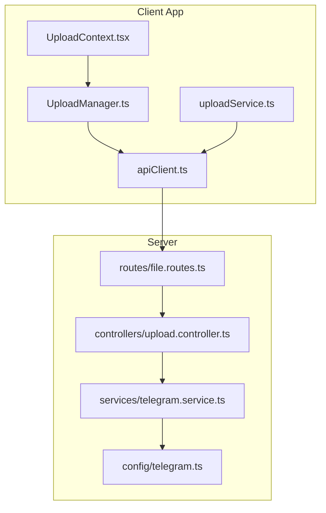
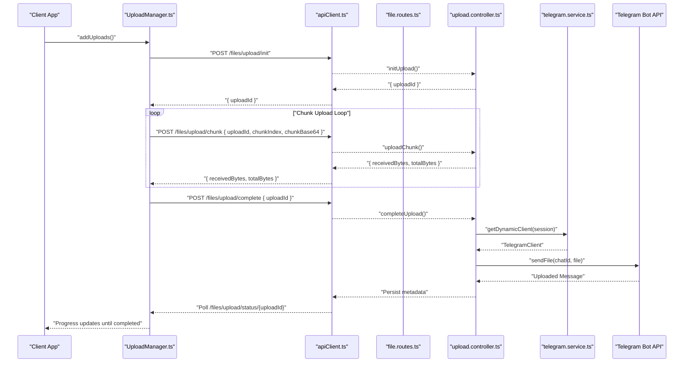
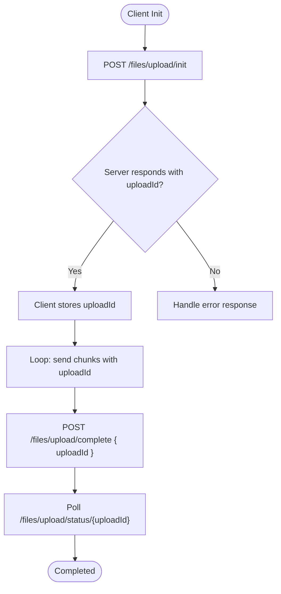
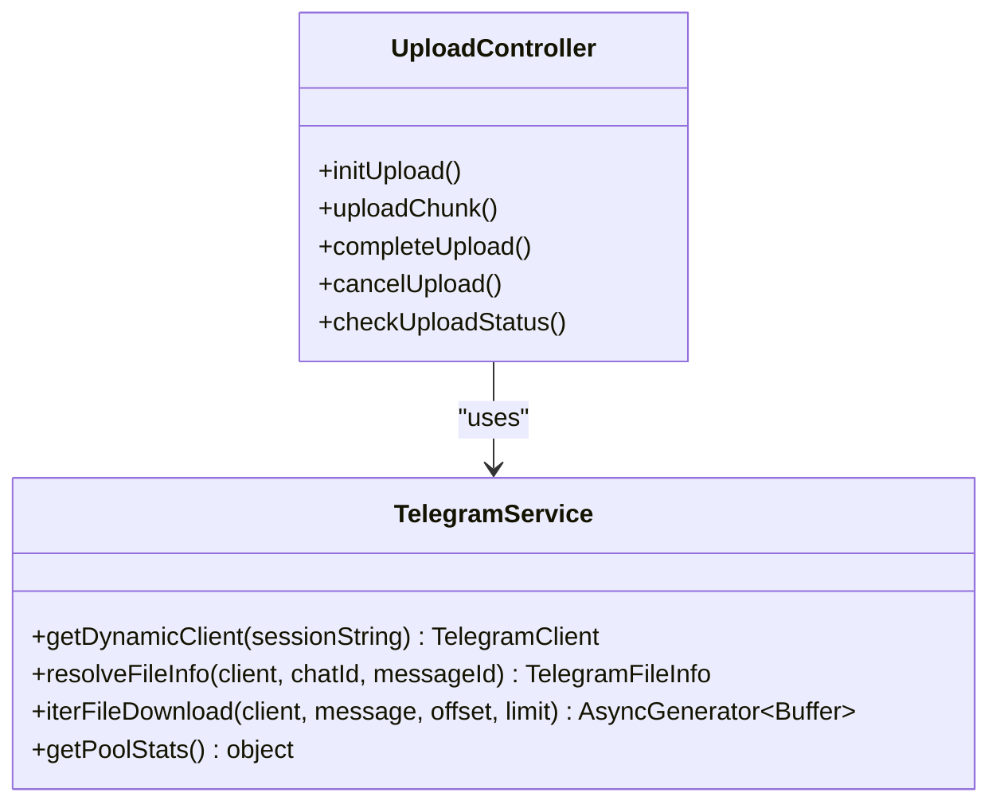
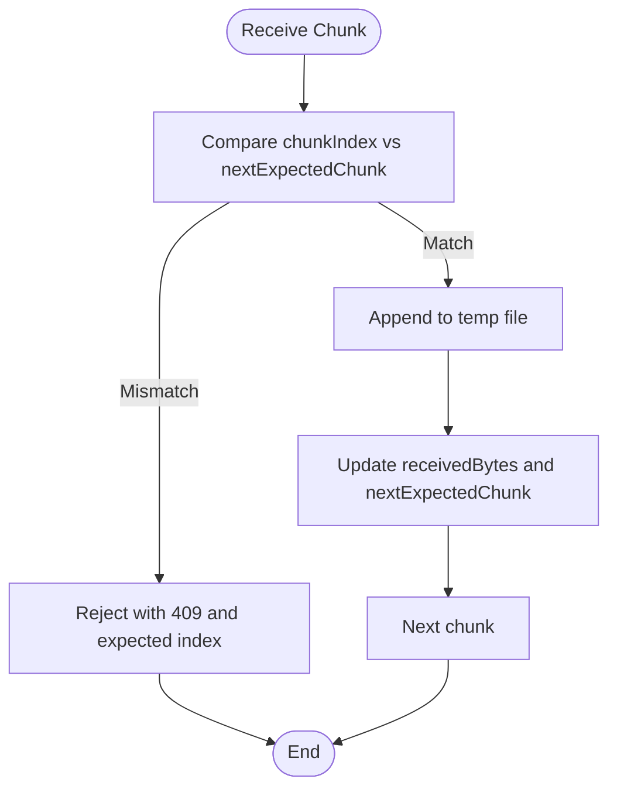
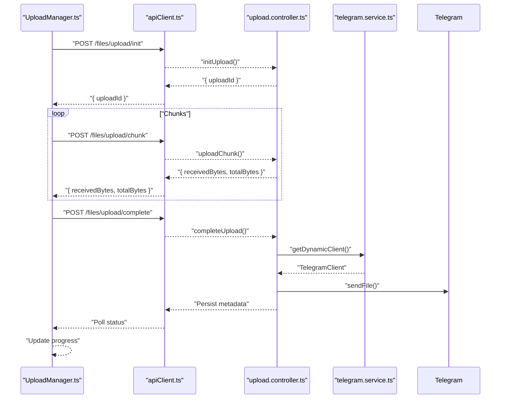
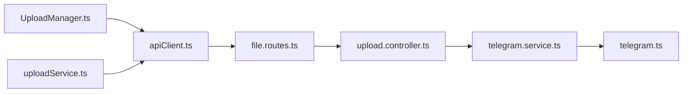

# Telegram API Integration

<cite>
**Referenced Files in This Document**
- [UploadManager.ts](file://app/src/services/UploadManager.ts)
- [uploadService.ts](file://app/src/services/uploadService.ts)
- [apiClient.ts](file://app/src/services/apiClient.ts)
- [UploadContext.tsx](file://app/src/context/UploadContext.tsx)
- [upload.controller.ts](file://server/src/controllers/upload.controller.ts)
- [telegram.service.ts](file://server/src/services/telegram.service.ts)
- [telegram.ts](file://server/src/config/telegram.ts)
- [file.routes.ts](file://server/src/routes/file.routes.ts)
</cite>

## Table of Contents
1. [Introduction](#introduction)
2. [Project Structure](#project-structure)
3. [Core Components](#core-components)
4. [Architecture Overview](#architecture-overview)
5. [Detailed Component Analysis](#detailed-component-analysis)
6. [Dependency Analysis](#dependency-analysis)
7. [Performance Considerations](#performance-considerations)
8. [Troubleshooting Guide](#troubleshooting-guide)
9. [Conclusion](#conclusion)

## Introduction
This document explains the Telegram API integration within the upload system. It covers upload session management, server-assigned upload IDs, Telegram bot API communication patterns, file part validation, chunk validation errors (FILE_PARTS_INVALID), reference expiration handling (FILE_REFERENCE_EXPIRED), and the integration between the client-side UploadManager and server-side upload controller. It also documents session cancellation, progress synchronization, error propagation, and practical troubleshooting steps for Telegram-specific upload issues.

## Project Structure
The upload system spans two primary areas:
- Client-side (React Native): UploadManager orchestrates chunked uploads, progress tracking, retries, and cancellation. It communicates with the backend via axios instances.
- Server-side (Node.js + Express): The upload controller manages upload sessions, validates chunks, performs deduplication, and uploads files to Telegram via a dynamic client pool.

**Diagram sources**
- [UploadManager.ts](file://app/src/services/UploadManager.ts#L126-L992)
- [uploadService.ts](file://app/src/services/uploadService.ts#L67-L207)
- [apiClient.ts](file://app/src/services/apiClient.ts#L31-L164)
- [UploadContext.tsx](file://app/src/context/UploadContext.tsx#L51-L123)
- [file.routes.ts](file://server/src/routes/file.routes.ts#L57-L88)
- [upload.controller.ts](file://server/src/controllers/upload.controller.ts#L134-L546)
- [telegram.service.ts](file://server/src/services/telegram.service.ts#L57-L97)
- [telegram.ts](file://server/src/config/telegram.ts#L12-L29)

**Section sources**
- [UploadManager.ts](file://app/src/services/UploadManager.ts#L126-L992)
- [uploadService.ts](file://app/src/services/uploadService.ts#L67-L207)
- [apiClient.ts](file://app/src/services/apiClient.ts#L31-L164)
- [UploadContext.tsx](file://app/src/context/UploadContext.tsx#L51-L123)
- [file.routes.ts](file://server/src/routes/file.routes.ts#L57-L88)
- [upload.controller.ts](file://server/src/controllers/upload.controller.ts#L134-L546)
- [telegram.service.ts](file://server/src/services/telegram.service.ts#L57-L97)
- [telegram.ts](file://server/src/config/telegram.ts#L12-L29)

## Core Components
- Client UploadManager: Manages upload queues, chunked uploads, progress, retries, cancellation, and persistence. It enforces chunk ordering and deduplicates uploads by fingerprint.
- uploadService: Provides a standalone upload helper for single-file uploads with progress callbacks and cancellation support.
- Server Upload Controller: Initializes upload sessions, validates and writes chunks, deduplicates, and uploads to Telegram asynchronously with a semaphore and retry logic.
- Telegram Service: Manages a persistent client pool keyed by session fingerprints, reconnects on demand, and exposes helpers for file resolution and progressive downloads.

**Section sources**
- [UploadManager.ts](file://app/src/services/UploadManager.ts#L126-L992)
- [uploadService.ts](file://app/src/services/uploadService.ts#L67-L207)
- [upload.controller.ts](file://server/src/controllers/upload.controller.ts#L134-L546)
- [telegram.service.ts](file://server/src/services/telegram.service.ts#L57-L97)

## Architecture Overview
The upload pipeline is split into client and server phases:
- Client: Initiates upload, sends chunks, and polls for Telegram delivery status.
- Server: Validates chunks, persists partial data, and performs asynchronous Telegram uploads with retries and deduplication.
- Telegram: Receives files via the TelegramClient and stores them in the configured chat/channel.

**Diagram sources**
- [UploadManager.ts](file://app/src/services/UploadManager.ts#L764-L992)
- [uploadService.ts](file://app/src/services/uploadService.ts#L67-L207)
- [apiClient.ts](file://app/src/services/apiClient.ts#L31-L164)
- [file.routes.ts](file://server/src/routes/file.routes.ts#L84-L88)
- [upload.controller.ts](file://server/src/controllers/upload.controller.ts#L134-L546)
- [telegram.service.ts](file://server/src/services/telegram.service.ts#L57-L97)

## Detailed Component Analysis

### Upload Session Management and Server-Assigned Upload IDs
- Client initiates upload with metadata and receives an uploadId from the server.
- The server creates a temporary directory and a session state keyed by uploadId, tracking received bytes, expected chunk index, and progress.
- The uploadId is used across all subsequent chunk and completion requests.

**Diagram sources**
- [upload.controller.ts](file://server/src/controllers/upload.controller.ts#L134-L274)
- [UploadManager.ts](file://app/src/services/UploadManager.ts#L764-L992)
- [uploadService.ts](file://app/src/services/uploadService.ts#L67-L207)

**Section sources**
- [upload.controller.ts](file://server/src/controllers/upload.controller.ts#L134-L274)
- [UploadManager.ts](file://app/src/services/UploadManager.ts#L764-L992)
- [uploadService.ts](file://app/src/services/uploadService.ts#L67-L207)

### Telegram Bot API Communication Patterns
- The server maintains a persistent TelegramClient pool keyed by a session fingerprint. On-demand, it retrieves or creates a client, connects if needed, and uploads files to the configured chat/channel.
- Uploads to Telegram are retried with exponential backoff and include special handling for FLOOD_WAIT.
- Deduplication is performed against Telegram’s file identifiers before uploading.

**Diagram sources**
- [telegram.service.ts](file://server/src/services/telegram.service.ts#L57-L97)
- [upload.controller.ts](file://server/src/controllers/upload.controller.ts#L38-L71)

**Section sources**
- [telegram.service.ts](file://server/src/services/telegram.service.ts#L57-L97)
- [upload.controller.ts](file://server/src/controllers/upload.controller.ts#L38-L71)

### File Part Validation and Chunk Ordering
- The server validates that chunks arrive in strict order by checking the expected chunk index and rejecting out-of-order chunks.
- The client ensures chunk ordering by sending chunks sequentially and aborting on mismatch.
- The server rejects zero-byte uploads to prevent FILE_PARTS_INVALID errors.

**Diagram sources**
- [upload.controller.ts](file://server/src/controllers/upload.controller.ts#L276-L320)
- [UploadManager.ts](file://app/src/services/UploadManager.ts#L764-L992)

**Section sources**
- [upload.controller.ts](file://server/src/controllers/upload.controller.ts#L276-L320)
- [UploadManager.ts](file://app/src/services/UploadManager.ts#L764-L992)

### Chunk Validation Errors: FILE_PARTS_INVALID
- Causes:
  - Out-of-order chunks
  - Zero-byte uploads
  - Missing or invalid chunk data
- Server behavior:
  - Rejects out-of-order chunks with a 409 and expected index.
  - Rejects zero-byte uploads with a 400 and marks the session as error.
- Client behavior:
  - Treats specific Telegram-related fatal errors as non-recoverable and transitions tasks to failed without retry.

**Section sources**
- [upload.controller.ts](file://server/src/controllers/upload.controller.ts#L291-L343)
- [UploadManager.ts](file://app/src/services/UploadManager.ts#L703-L707)

### Reference Expiration Handling: FILE_REFERENCE_EXPIRED
- The server detects expired Telegram sessions by attempting to reconnect and throws a clear error when sessions are expired or revoked.
- The client treats Telegram-related fatal errors as non-recoverable and stops retrying.

**Section sources**
- [telegram.service.ts](file://server/src/services/telegram.service.ts#L64-L77)
- [UploadManager.ts](file://app/src/services/UploadManager.ts#L703-L707)

### Integration Between Client-Side UploadManager and Server-Side Upload Controller
- Client:
  - Adds uploads to the queue, deduplicates by fingerprint, and enforces concurrency limits.
  - Sends chunks with base64-encoded payloads and tracks progress.
  - Polls the server for Telegram delivery status and updates progress accordingly.
  - Supports pause/resume/cancel with cancellation signals and server-side cancellation.
- Server:
  - Initializes sessions, validates chunks, and persists partial data.
  - Performs asynchronous Telegram uploads with retries and deduplication.
  - Exposes status polling for progress and completion.

**Diagram sources**
- [UploadManager.ts](file://app/src/services/UploadManager.ts#L764-L992)
- [uploadService.ts](file://app/src/services/uploadService.ts#L67-L207)
- [apiClient.ts](file://app/src/services/apiClient.ts#L31-L164)
- [upload.controller.ts](file://server/src/controllers/upload.controller.ts#L134-L546)
- [telegram.service.ts](file://server/src/services/telegram.service.ts#L57-L97)

**Section sources**
- [UploadManager.ts](file://app/src/services/UploadManager.ts#L764-L992)
- [uploadService.ts](file://app/src/services/uploadService.ts#L67-L207)
- [apiClient.ts](file://app/src/services/apiClient.ts#L31-L164)
- [upload.controller.ts](file://server/src/controllers/upload.controller.ts#L134-L546)
- [telegram.service.ts](file://server/src/services/telegram.service.ts#L57-L97)

### Session Cancellation, Progress Synchronization, and Error Propagation
- Cancellation:
  - Client cancels by transitioning tasks to cancelled, aborting the underlying request, and notifying the server to cancel the session.
  - Server marks the session as cancelled and cleans up temporary files.
- Progress:
  - Client computes progress based on bytes uploaded and updates the UI.
  - Server updates progress during Telegram upload and the client polls for incremental updates.
- Error propagation:
  - Fatal Telegram errors are treated as non-recoverable and surfaced to the client.
  - Non-fatal transient errors are retried with exponential backoff.

**Section sources**
- [UploadManager.ts](file://app/src/services/UploadManager.ts#L587-L614)
- [upload.controller.ts](file://server/src/controllers/upload.controller.ts#L499-L520)
- [upload.controller.ts](file://server/src/controllers/upload.controller.ts#L522-L545)

### Upload Session Lifecycle Examples
- Successful upload:
  - Init -> Chunks -> Complete -> Telegram upload -> Persist metadata -> Poll until completed -> Cleanup.
- Failed upload:
  - Init -> Chunk -> Complete -> Telegram upload fails -> Error state -> Client retries or marks failed.
- Cancelled upload:
  - Init -> Chunk -> Cancel -> Server cleans up -> Client marks cancelled.

**Section sources**
- [upload.controller.ts](file://server/src/controllers/upload.controller.ts#L134-L274)
- [upload.controller.ts](file://server/src/controllers/upload.controller.ts#L276-L320)
- [upload.controller.ts](file://server/src/controllers/upload.controller.ts#L322-L488)
- [UploadManager.ts](file://app/src/services/UploadManager.ts#L687-L760)

## Dependency Analysis
- Client depends on apiClient for HTTP communication and UploadManager for orchestration.
- Server routes depend on the upload controller, which depends on the Telegram service and database.
- Telegram service depends on environment variables for API credentials and maintains a client pool.

**Diagram sources**
- [UploadManager.ts](file://app/src/services/UploadManager.ts#L126-L992)
- [uploadService.ts](file://app/src/services/uploadService.ts#L67-L207)
- [apiClient.ts](file://app/src/services/apiClient.ts#L31-L164)
- [file.routes.ts](file://server/src/routes/file.routes.ts#L57-L88)
- [upload.controller.ts](file://server/src/controllers/upload.controller.ts#L134-L546)
- [telegram.service.ts](file://server/src/services/telegram.service.ts#L57-L97)
- [telegram.ts](file://server/src/config/telegram.ts#L12-L29)

**Section sources**
- [file.routes.ts](file://server/src/routes/file.routes.ts#L57-L88)
- [upload.controller.ts](file://server/src/controllers/upload.controller.ts#L134-L546)
- [telegram.service.ts](file://server/src/services/telegram.service.ts#L57-L97)

## Performance Considerations
- Concurrency control: The server limits concurrent Telegram uploads to 3 via a semaphore to prevent resource exhaustion.
- Chunk size: 5 MB chunks balance throughput and reliability.
- Retries: Exponential backoff with FLOOD_WAIT handling reduces server load and improves success rates.
- Progress computation: Client-side and server-side progress updates are synchronized to provide smooth UI feedback.

[No sources needed since this section provides general guidance]

## Troubleshooting Guide
Common Telegram-specific upload issues and resolutions:
- FILE_PARTS_INVALID:
  - Cause: Out-of-order chunks or zero-byte uploads.
  - Resolution: Ensure chunks are sent in order and the file has a positive size. The server rejects zero-byte uploads to prevent this error.
- FILE_REFERENCE_EXPIRED:
  - Cause: Expired or revoked Telegram session.
  - Resolution: Re-authenticate the Telegram session and ensure the session string is valid.
- MEDIA_EMPTY or FILE_ID_INVALID:
  - Cause: Invalid file metadata or corrupted upload.
  - Resolution: Retry the upload with a valid file and ensure the Telegram client is connected.
- FLOOD_WAIT:
  - Cause: Rate limiting by Telegram.
  - Resolution: The server waits for the specified time and retries automatically.
- Upload stuck or slow:
  - Resolution: Check network connectivity, reduce concurrent uploads, and verify Telegram client pool health.

**Section sources**
- [upload.controller.ts](file://server/src/controllers/upload.controller.ts#L38-L71)
- [upload.controller.ts](file://server/src/controllers/upload.controller.ts#L338-L343)
- [UploadManager.ts](file://app/src/services/UploadManager.ts#L703-L707)
- [telegram.service.ts](file://server/src/services/telegram.service.ts#L64-L77)

## Conclusion
The Telegram API integration in the upload system is designed for reliability and scalability. The client manages robust chunked uploads with progress and cancellation, while the server enforces strict chunk ordering, deduplication, and asynchronous Telegram uploads with retries and session management. Together, they provide a resilient pipeline for storing files in Telegram while maintaining accurate progress and error handling.