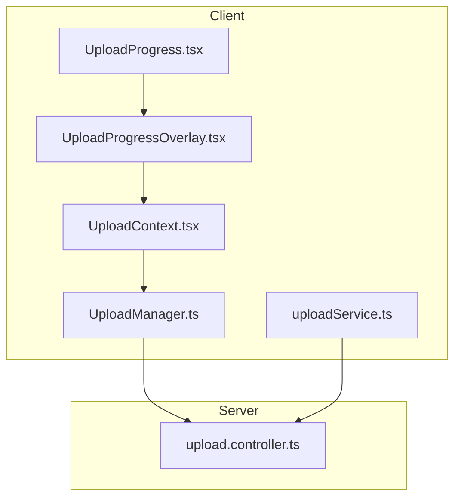
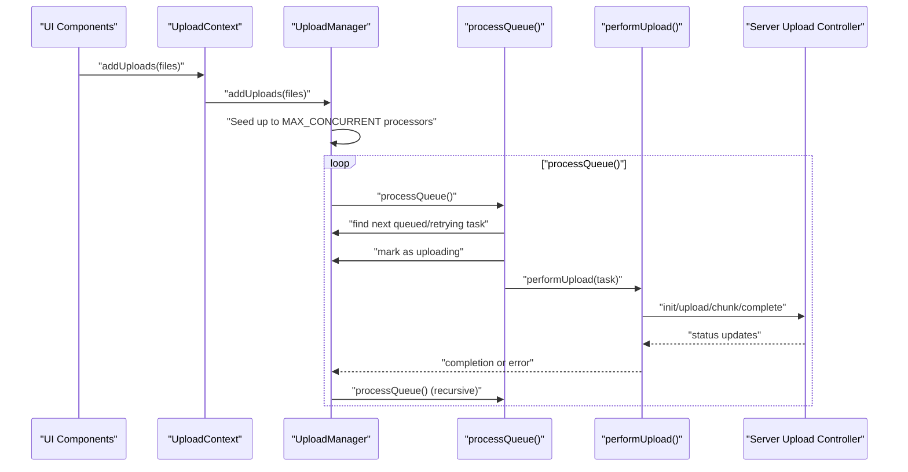
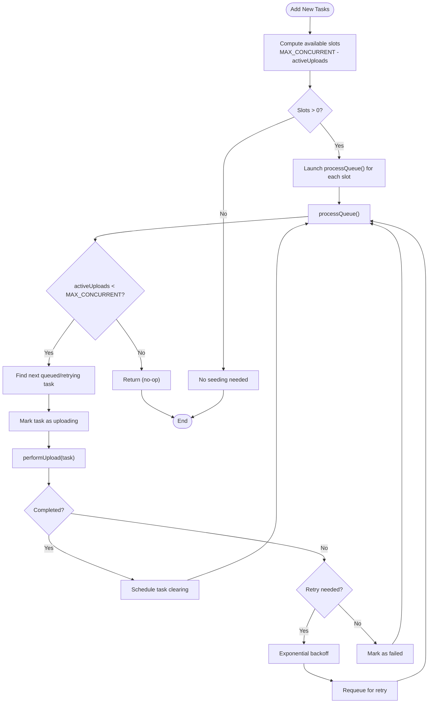
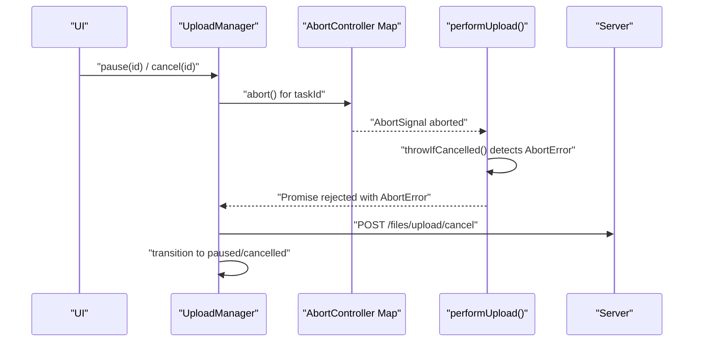
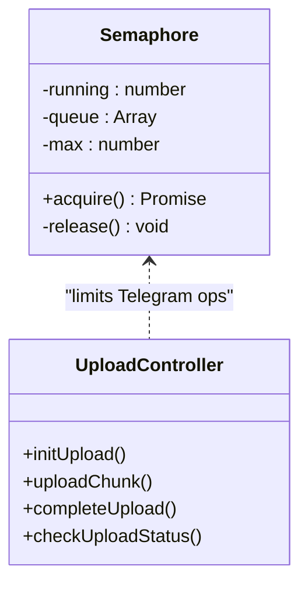
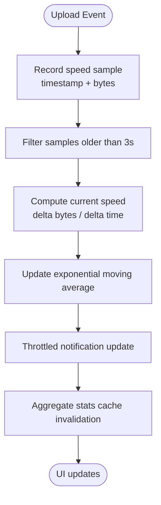
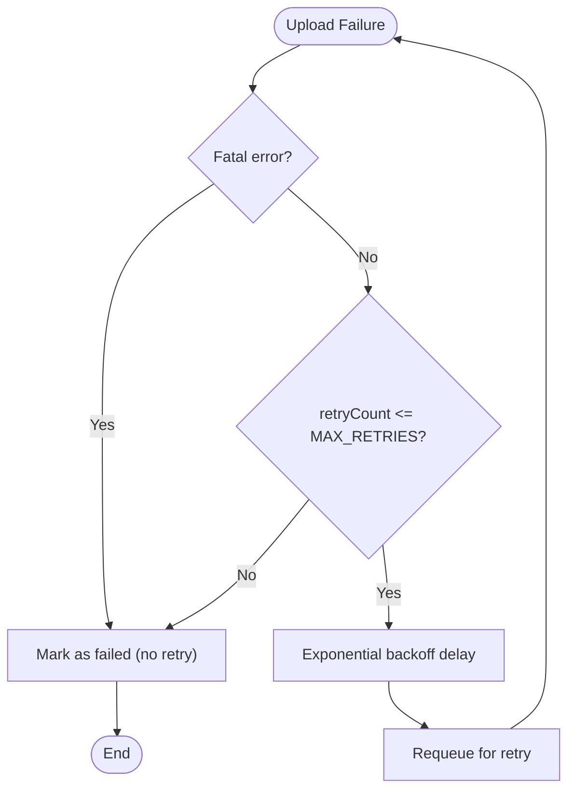
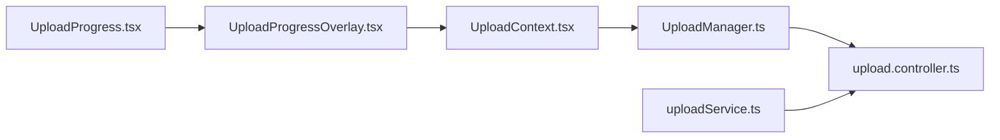

# Concurrent Upload Control

<cite>
**Referenced Files in This Document**
- [UploadManager.ts](file://app/src/services/UploadManager.ts)
- [UploadContext.tsx](file://app/src/context/UploadContext.tsx)
- [uploadService.ts](file://app/src/services/uploadService.ts)
- [UploadProgress.tsx](file://app/src/components/UploadProgress.tsx)
- [UploadProgressOverlay.tsx](file://app/src/components/UploadProgressOverlay.tsx)
- [upload.controller.ts](file://server/src/controllers/upload.controller.ts)
</cite>

## Table of Contents
1. [Introduction](#introduction)
2. [Project Structure](#project-structure)
3. [Core Components](#core-components)
4. [Architecture Overview](#architecture-overview)
5. [Detailed Component Analysis](#detailed-component-analysis)
6. [Dependency Analysis](#dependency-analysis)
7. [Performance Considerations](#performance-considerations)
8. [Troubleshooting Guide](#troubleshooting-guide)
9. [Conclusion](#conclusion)

## Introduction
This document explains the concurrent upload control system that manages up to three simultaneous uploads with robust concurrency control, graceful cancellation, and adaptive performance handling. It covers the MAX_CONCURRENT limit, the activeUploads getter, the processQueue() method, the seed mechanism, abort controller system, and how the system adapts to varying network conditions and upload speeds.

## Project Structure
The upload control system spans the client-side UploadManager and related UI components, plus the server-side upload controller that enforces its own concurrency limit.

**Diagram sources**
- [UploadManager.ts](file://app/src/services/UploadManager.ts#L126-L992)
- [UploadContext.tsx](file://app/src/context/UploadContext.tsx#L12-L123)
- [uploadService.ts](file://app/src/services/uploadService.ts#L1-L207)
- [UploadProgress.tsx](file://app/src/components/UploadProgress.tsx#L1-L250)
- [UploadProgressOverlay.tsx](file://app/src/components/UploadProgressOverlay.tsx#L1-L360)
- [upload.controller.ts](file://server/src/controllers/upload.controller.ts#L1-L546)

**Section sources**
- [UploadManager.ts](file://app/src/services/UploadManager.ts#L126-L198)
- [UploadContext.tsx](file://app/src/context/UploadContext.tsx#L12-L123)
- [upload.controller.ts](file://server/src/controllers/upload.controller.ts#L76-L100)

## Core Components
- UploadManager: Central orchestrator for upload tasks, concurrency control, persistence, notifications, and statistics.
- UploadContext: React provider exposing upload actions and aggregate stats to UI.
- uploadService: Standalone helper for single-file uploads with cancellation support.
- Server upload controller: Enforces its own concurrency limit and deduplication.

Key constants and behaviors:
- MAX_CONCURRENT: 3 simultaneous uploads
- activeUploads getter: Counts tasks with status "uploading"
- processQueue(): Manages concurrency without race conditions
- Seed mechanism: Launches up to MAX_CONCURRENT processors for new tasks
- AbortController system: Graceful cancellation for each task
- Recursive processQueue() calls: Maintain optimal concurrency

**Section sources**
- [UploadManager.ts](file://app/src/services/UploadManager.ts#L128-L135)
- [UploadManager.ts](file://app/src/services/UploadManager.ts#L150-L152)
- [UploadManager.ts](file://app/src/services/UploadManager.ts#L676-L760)
- [UploadManager.ts](file://app/src/services/UploadManager.ts#L551-L555)
- [UploadManager.ts](file://app/src/services/UploadManager.ts#L186-L190)
- [UploadManager.ts](file://app/src/services/UploadManager.ts#L764-L981)
- [upload.controller.ts](file://server/src/controllers/upload.controller.ts#L76-L100)

## Architecture Overview
The system uses a producer-consumer model with a seeded queue processor. Each upload is processed through a multi-stage pipeline with cancellation and retry support.

**Diagram sources**
- [UploadManager.ts](file://app/src/services/UploadManager.ts#L514-L556)
- [UploadManager.ts](file://app/src/services/UploadManager.ts#L676-L760)
- [UploadManager.ts](file://app/src/services/UploadManager.ts#L764-L981)
- [upload.controller.ts](file://server/src/controllers/upload.controller.ts#L134-L488)

## Detailed Component Analysis

### UploadManager Concurrency Control
UploadManager enforces a strict concurrency cap of 3 using:
- MAX_CONCURRENT constant set to 3
- activeUploads getter that counts tasks with status "uploading"
- processQueue() that checks activeUploads against MAX_CONCURRENT before proceeding
- Immediate status transition to "uploading" to prevent race conditions

The seed mechanism ensures new tasks launch up to 3 concurrent processors:
- After adding new tasks, the system computes available slots as MAX_CONCURRENT - activeUploads
- It triggers processQueue() that many times to seed processors

**Diagram sources**
- [UploadManager.ts](file://app/src/services/UploadManager.ts#L551-L555)
- [UploadManager.ts](file://app/src/services/UploadManager.ts#L676-L760)
- [UploadManager.ts](file://app/src/services/UploadManager.ts#L697-L751)

**Section sources**
- [UploadManager.ts](file://app/src/services/UploadManager.ts#L128-L135)
- [UploadManager.ts](file://app/src/services/UploadManager.ts#L150-L152)
- [UploadManager.ts](file://app/src/services/UploadManager.ts#L551-L555)
- [UploadManager.ts](file://app/src/services/UploadManager.ts#L676-L760)

### Abort Controller System
Each upload task maintains an AbortController for graceful cancellation:
- A Map<string, AbortController> tracks controllers by taskId
- performUpload() creates a new AbortController per task
- pause(), cancel(), and cancelAll() abort running tasks and signal performUpload() to stop
- Server-side cancellation is coordinated via uploadClient.post('/files/upload/cancel')

**Diagram sources**
- [UploadManager.ts](file://app/src/services/UploadManager.ts#L186-L190)
- [UploadManager.ts](file://app/src/services/UploadManager.ts#L558-L601)
- [UploadManager.ts](file://app/src/services/UploadManager.ts#L764-L773)
- [UploadManager.ts](file://app/src/services/UploadManager.ts#L752-L758)

**Section sources**
- [UploadManager.ts](file://app/src/services/UploadManager.ts#L186-L190)
- [UploadManager.ts](file://app/src/services/UploadManager.ts#L558-L601)
- [UploadManager.ts](file://app/src/services/UploadManager.ts#L764-L773)

### Server-Side Concurrency Alignment
The server enforces its own 3-way concurrency limit via a Semaphore to prevent resource exhaustion:
- telegramSemaphore with max 3 concurrent Telegram operations
- Acquire/release pattern around uploadToTelegramWithRetry
- Ensures stability even when clients exceed server limits

**Diagram sources**
- [upload.controller.ts](file://server/src/controllers/upload.controller.ts#L76-L100)
- [upload.controller.ts](file://server/src/controllers/upload.controller.ts#L349-L488)

**Section sources**
- [upload.controller.ts](file://server/src/controllers/upload.controller.ts#L76-L100)
- [upload.controller.ts](file://server/src/controllers/upload.controller.ts#L349-L488)

### Performance and Resource Management
UploadManager tracks and exposes upload performance metrics:
- Speed sampling window of 3 seconds with exponential moving average
- Throttled notifications (200ms) to reduce React re-renders
- Byte-accurate overallProgress calculation
- Historical stats for completed/failed tasks

**Diagram sources**
- [UploadManager.ts](file://app/src/services/UploadManager.ts#L407-L445)
- [UploadManager.ts](file://app/src/services/UploadManager.ts#L283-L310)

**Section sources**
- [UploadManager.ts](file://app/src/services/UploadManager.ts#L135-L136)
- [UploadManager.ts](file://app/src/services/UploadManager.ts#L407-L445)
- [UploadManager.ts](file://app/src/services/UploadManager.ts#L283-L310)

### Retry and Error Handling
The system implements exponential backoff with up to 5 retries:
- Waiting retry phase transitions to retrying after delay
- Fatal errors (schema constraint, Telegram fatal) are not retried
- Abort errors and pause/cancel states terminate gracefully
- Server-side deduplication prevents duplicate uploads

**Diagram sources**
- [UploadManager.ts](file://app/src/services/UploadManager.ts#L697-L751)

**Section sources**
- [UploadManager.ts](file://app/src/services/UploadManager.ts#L131-L132)
- [UploadManager.ts](file://app/src/services/UploadManager.ts#L717-L723)
- [UploadManager.ts](file://app/src/services/UploadManager.ts#L730-L744)

## Dependency Analysis
The upload system exhibits clear separation of concerns:
- Client-side UploadManager depends on React Native APIs, AsyncStorage, and server upload endpoints
- Server-side upload controller depends on Telegram client, database, and filesystem
- UI components depend on UploadContext for state and actions

**Diagram sources**
- [UploadProgressOverlay.tsx](file://app/src/components/UploadProgressOverlay.tsx#L1-L360)
- [UploadProgress.tsx](file://app/src/components/UploadProgress.tsx#L1-L250)
- [UploadContext.tsx](file://app/src/context/UploadContext.tsx#L1-L123)
- [UploadManager.ts](file://app/src/services/UploadManager.ts#L1-L992)
- [upload.controller.ts](file://server/src/controllers/upload.controller.ts#L1-L546)
- [uploadService.ts](file://app/src/services/uploadService.ts#L1-L207)

**Section sources**
- [UploadProgressOverlay.tsx](file://app/src/components/UploadProgressOverlay.tsx#L1-L360)
- [UploadProgress.tsx](file://app/src/components/UploadProgress.tsx#L1-L250)
- [UploadContext.tsx](file://app/src/context/UploadContext.tsx#L1-L123)
- [UploadManager.ts](file://app/src/services/UploadManager.ts#L1-L992)
- [upload.controller.ts](file://server/src/controllers/upload.controller.ts#L1-L546)
- [uploadService.ts](file://app/src/services/uploadService.ts#L1-L207)

## Performance Considerations
- Concurrency: Both client and server enforce 3-way concurrency to balance throughput and resource usage.
- Network adaptivity: Exponential backoff and speed sampling enable responsive throttling under poor network conditions.
- Memory: Speed samples are windowed to 3 seconds; server state evicts completed sessions after 1 hour.
- UI responsiveness: Notifications are throttled to 200ms to minimize React re-renders during fast chunk uploads.
- Deduplication: Client-side fingerprinting and server-side hash checks prevent redundant transfers.

[No sources needed since this section provides general guidance]

## Troubleshooting Guide
Common scenarios and resolutions:
- Upload stuck at 0%: Verify file size resolution and chunk reading fallbacks.
- Frequent retries: Inspect network stability and Telegram flood waits; adjust expectations.
- Cancellation not taking effect: Ensure AbortController is present and performUpload() checks isCancelled().
- Server-side failures: Review server logs for Telegram upload errors and semaphore contention.

**Section sources**
- [UploadManager.ts](file://app/src/services/UploadManager.ts#L778-L788)
- [UploadManager.ts](file://app/src/services/UploadManager.ts#L768-L773)
- [UploadManager.ts](file://app/src/services/UploadManager.ts#L700-L707)
- [upload.controller.ts](file://server/src/controllers/upload.controller.ts#L39-L71)

## Conclusion
The concurrent upload control system provides robust, race-condition-free concurrency with graceful cancellation, adaptive retry, and precise performance monitoring. The client enforces 3-way concurrency aligned with the server’s semaphore, while the abort controller system ensures clean termination. Together with deduplication and throttled notifications, the system delivers reliable uploads across varying network conditions.