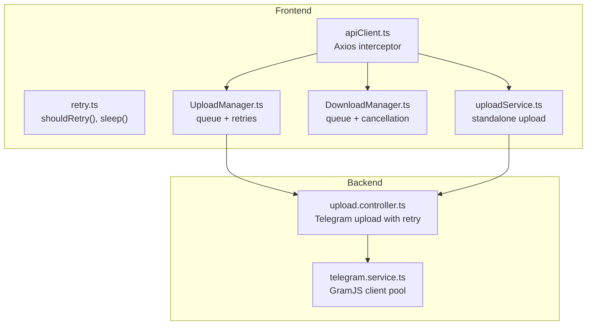
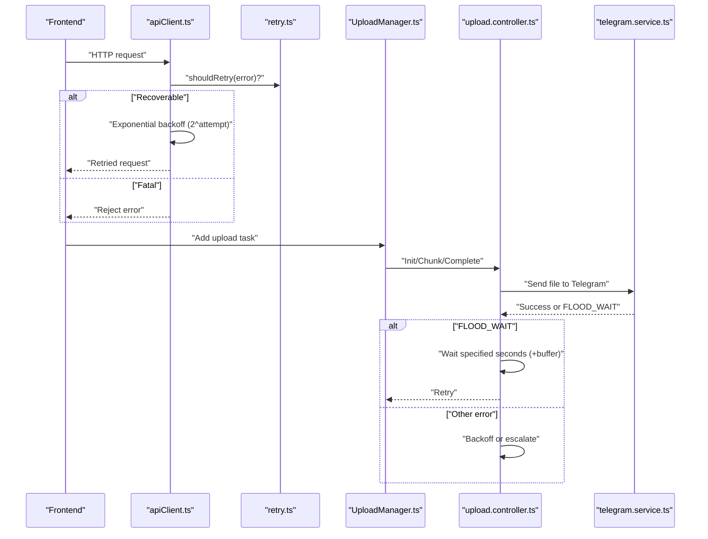
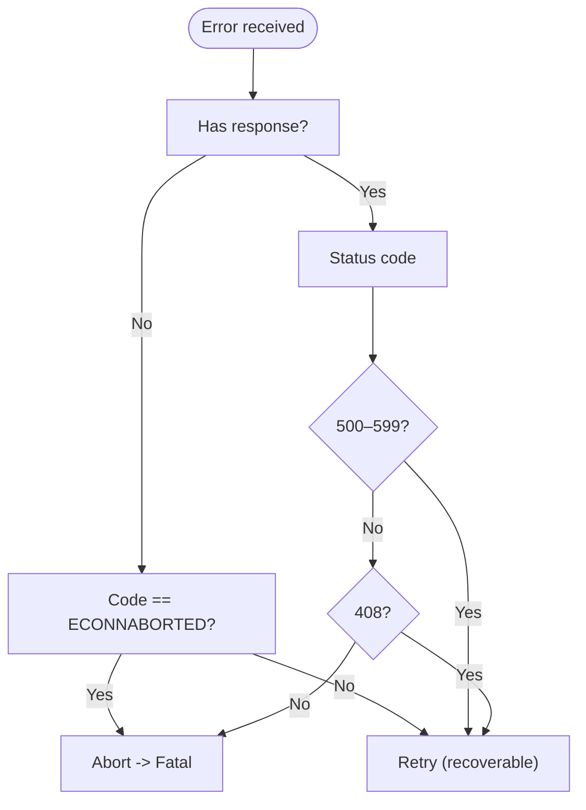
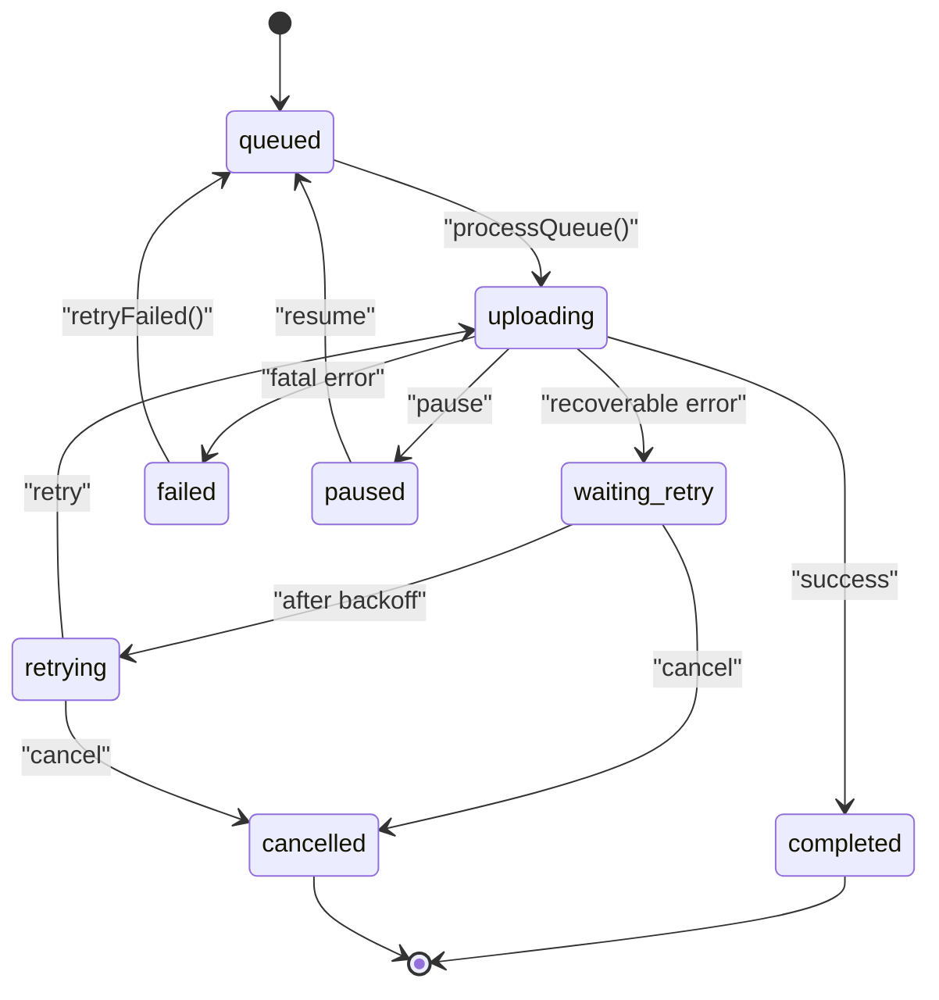
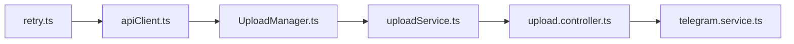

# Error Handling and Retry Logic

<cite>
**Referenced Files in This Document**
- [retry.ts](file://app/src/utils/retry.ts)
- [apiClient.ts](file://app/src/services/apiClient.ts)
- [UploadManager.ts](file://app/src/services/UploadManager.ts)
- [DownloadManager.ts](file://app/src/services/DownloadManager.ts)
- [uploadService.ts](file://app/src/services/uploadService.ts)
- [telegram.service.ts](file://server/src/services/telegram.service.ts)
- [upload.controller.ts](file://server/src/controllers/upload.controller.ts)
- [AppErrorBoundary.tsx](file://app/src/components/AppErrorBoundary.tsx)
</cite>

## Table of Contents
1. [Introduction](#introduction)
2. [Project Structure](#project-structure)
3. [Core Components](#core-components)
4. [Architecture Overview](#architecture-overview)
5. [Detailed Component Analysis](#detailed-component-analysis)
6. [Dependency Analysis](#dependency-analysis)
7. [Performance Considerations](#performance-considerations)
8. [Troubleshooting Guide](#troubleshooting-guide)
9. [Conclusion](#conclusion)

## Introduction
This document explains the error handling and retry logic system across the frontend and backend. It covers:
- MAX_RETRIES limits and exponential backoff behavior
- Classification of recoverable vs. fatal errors
- Distinctions among Telegram API errors, database constraint violations, and network failures
- The waiting_retry and retrying states and automatic scheduling
- Graceful cancellation via abort signals
- Examples of common scenarios, retry timing calculations, and escalation to failed state

## Project Structure
The error handling and retry logic spans three layers:
- Frontend HTTP client and interceptors
- Frontend upload/download managers
- Backend Telegram integration and upload controller

**Diagram sources**
- [apiClient.ts](file://app/src/services/apiClient.ts#L1-L164)
- [retry.ts](file://app/src/utils/retry.ts#L1-L34)
- [UploadManager.ts](file://app/src/services/UploadManager.ts#L1-L992)
- [DownloadManager.ts](file://app/src/services/DownloadManager.ts#L1-L323)
- [uploadService.ts](file://app/src/services/uploadService.ts#L1-L207)
- [telegram.service.ts](file://server/src/services/telegram.service.ts#L1-L260)
- [upload.controller.ts](file://server/src/controllers/upload.controller.ts#L31-L66)

**Section sources**
- [apiClient.ts](file://app/src/services/apiClient.ts#L1-L164)
- [retry.ts](file://app/src/utils/retry.ts#L1-L34)
- [UploadManager.ts](file://app/src/services/UploadManager.ts#L1-L992)
- [DownloadManager.ts](file://app/src/services/DownloadManager.ts#L1-L323)
- [uploadService.ts](file://app/src/services/uploadService.ts#L1-L207)
- [telegram.service.ts](file://server/src/services/telegram.service.ts#L1-L260)
- [upload.controller.ts](file://server/src/controllers/upload.controller.ts#L31-L66)

## Core Components
- Frontend HTTP retry policy and exponential backoff
- Upload queue with explicit MAX_RETRIES and state transitions
- Download queue with cancellation via AbortController
- Backend Telegram client pool and upload controller with anti-FLOOD strategies
- Frontend error boundary for unhandled render errors

**Section sources**
- [retry.ts](file://app/src/utils/retry.ts#L1-L34)
- [apiClient.ts](file://app/src/services/apiClient.ts#L100-L132)
- [UploadManager.ts](file://app/src/services/UploadManager.ts#L126-L131)
- [UploadManager.ts](file://app/src/services/UploadManager.ts#L154-L164)
- [UploadManager.ts](file://app/src/services/UploadManager.ts#L700-L751)
- [DownloadManager.ts](file://app/src/services/DownloadManager.ts#L19-L25)
- [telegram.service.ts](file://server/src/services/telegram.service.ts#L57-L97)
- [upload.controller.ts](file://server/src/controllers/upload.controller.ts#L38-L66)
- [AppErrorBoundary.tsx](file://app/src/components/AppErrorBoundary.tsx#L1-L85)

## Architecture Overview
The system applies layered retry and error classification:
- HTTP layer: exponential backoff with MAX_RETRIES per request
- Upload layer: explicit queue with waiting_retry/ retrying states and MAX_RETRIES=5
- Download layer: cancellation via AbortController
- Backend Telegram layer: client pool with anti-FLOOD and retry strategies

**Diagram sources**
- [apiClient.ts](file://app/src/services/apiClient.ts#L100-L132)
- [retry.ts](file://app/src/utils/retry.ts#L14-L33)
- [UploadManager.ts](file://app/src/services/UploadManager.ts#L700-L751)
- [upload.controller.ts](file://server/src/controllers/upload.controller.ts#L38-L66)
- [telegram.service.ts](file://server/src/services/telegram.service.ts#L57-L97)

## Detailed Component Analysis

### HTTP Layer: Exponential Backoff and Recoverable Errors
- Recoverable conditions:
  - No response from server (network error)
  - 500–599 gateway/server errors
  - 408 Request Timeout
  - Client-side timeout (ECONNABORTED)
- Non-recoverable:
  - Explicit aborts (AbortError/Canceled)
- Backoff formula:
  - Delay = 2^(retryCount) × 1000 ms
- Max retries:
  - Default per request is 3 (configurable per request via interceptor)

**Diagram sources**
- [retry.ts](file://app/src/utils/retry.ts#L14-L33)
- [apiClient.ts](file://app/src/services/apiClient.ts#L118-L127)

**Section sources**
- [retry.ts](file://app/src/utils/retry.ts#L1-L34)
- [apiClient.ts](file://app/src/services/apiClient.ts#L100-L132)

### Upload Manager: States, Retries, and Cancellation
- States:
  - queued, uploading, paused, waiting_retry, retrying, completed, failed, cancelled
- Transitions:
  - Legal transitions constrained by a state map
- Retry logic:
  - MAX_RETRIES = 5
  - waiting_retry → retrying after delay
  - Backoff: (2^attempt + 1) × 1000 ms
- Fatal error classification:
  - Database constraint violations (schema errors)
  - Telegram fatal errors (e.g., FILE_PARTS_INVALID, FILE_REFERENCE_EXPIRED, MEDIA_EMPTY, FILE_ID_INVALID, certain 400 errors)
- Cancellation:
  - AbortController per task
  - Cancel server-side upload session when applicable

**Diagram sources**
- [UploadManager.ts](file://app/src/services/UploadManager.ts#L154-L164)
- [UploadManager.ts](file://app/src/services/UploadManager.ts#L700-L751)

**Section sources**
- [UploadManager.ts](file://app/src/services/UploadManager.ts#L126-L131)
- [UploadManager.ts](file://app/src/services/UploadManager.ts#L154-L164)
- [UploadManager.ts](file://app/src/services/UploadManager.ts#L700-L751)

### Download Manager: Cancellation and Failure
- Cancellation:
  - Per-task AbortController
  - Transport-level cancellation via DownloadResumable
- Failure:
  - Non-cancel errors set status to failed

**Section sources**
- [DownloadManager.ts](file://app/src/services/DownloadManager.ts#L19-L25)
- [DownloadManager.ts](file://app/src/services/DownloadManager.ts#L179-L212)
- [DownloadManager.ts](file://app/src/services/DownloadManager.ts#L247-L258)

### Backend Telegram Integration: Client Pool and Anti-FLOOD
- Client pool with TTL and auto-reconnect
- Upload controller retries with:
  - Anti-429 random delay
  - FLOOD_WAIT parsing and explicit wait
  - Fixed backoff sequence for other errors

**Section sources**
- [telegram.service.ts](file://server/src/services/telegram.service.ts#L57-L97)
- [upload.controller.ts](file://server/src/controllers/upload.controller.ts#L38-L66)

### Frontend Error Boundary
- Catches unhandled render errors and logs them
- Provides a simple UI to reload

**Section sources**
- [AppErrorBoundary.tsx](file://app/src/components/AppErrorBoundary.tsx#L1-L85)

## Dependency Analysis
- apiClient.ts depends on retry.ts for shouldRetry and sleep
- UploadManager.ts orchestrates retries and state transitions, interacting with uploadService.ts and the backend
- uploadService.ts performs standalone uploads with polling and abort support
- Backend relies on telegram.service.ts for client management and upload.controller.ts for Telegram-specific retry logic

**Diagram sources**
- [retry.ts](file://app/src/utils/retry.ts#L1-L34)
- [apiClient.ts](file://app/src/services/apiClient.ts#L1-L164)
- [UploadManager.ts](file://app/src/services/UploadManager.ts#L1-L992)
- [uploadService.ts](file://app/src/services/uploadService.ts#L1-L207)
- [upload.controller.ts](file://server/src/controllers/upload.controller.ts#L31-L66)
- [telegram.service.ts](file://server/src/services/telegram.service.ts#L1-L260)

**Section sources**
- [retry.ts](file://app/src/utils/retry.ts#L1-L34)
- [apiClient.ts](file://app/src/services/apiClient.ts#L1-L164)
- [UploadManager.ts](file://app/src/services/UploadManager.ts#L1-L992)
- [uploadService.ts](file://app/src/services/uploadService.ts#L1-L207)
- [upload.controller.ts](file://server/src/controllers/upload.controller.ts#L31-L66)
- [telegram.service.ts](file://server/src/services/telegram.service.ts#L1-L260)

## Performance Considerations
- Exponential backoff reduces thundering herd and allows cold starts to warm up
- Frontend HTTP backoff uses 2^attempt; UploadManager uses (2^attempt + 1) to add jitter-like margin
- Backend Telegram anti-FLOOD waits align with Telegram’s reported wait times
- Minimizing UI updates via throttling and avoiding redundant retries improves responsiveness

## Troubleshooting Guide
Common scenarios and resolutions:
- Network blips or server cold starts:
  - HTTP interceptor retries with exponential backoff until max retries reached
- 500–599 or 408 errors:
  - Treat as recoverable; retry with backoff
- Abort or pause:
  - Stop retrying; move to cancelled or paused state
- Database constraint violation:
  - Mark as fatal; do not retry
- Telegram fatal errors:
  - FILE_PARTS_INVALID, FILE_REFERENCE_EXPIRED, MEDIA_EMPTY, FILE_ID_INVALID, certain 400 errors without flood hints
  - Escalate to failed state
- Upload stuck in waiting_retry:
  - Wait for scheduled retry; cancel to stop

Retry timing examples:
- HTTP layer (2^attempt × 1000 ms):
  - Attempt 1: 2 s
  - Attempt 2: 4 s
  - Attempt 3: 8 s
- Upload layer ((2^attempt + 1) × 1000 ms):
  - Attempt 1: 3 s
  - Attempt 2: 5 s
  - Attempt 3: 9 s
  - Attempt 4: 17 s
  - Attempt 5: 33 s

Escalation criteria:
- If retryCount exceeds MAX_RETRIES, or error is classified as fatal (schema or Telegram fatal), move to failed state
- Abort/cancel errors are not retried and lead to cancelled state

**Section sources**
- [retry.ts](file://app/src/utils/retry.ts#L14-L33)
- [apiClient.ts](file://app/src/services/apiClient.ts#L118-L127)
- [UploadManager.ts](file://app/src/services/UploadManager.ts#L700-L751)

## Conclusion
The system combines layered retry strategies with explicit error classification:
- HTTP interceptor handles transient network/server errors with exponential backoff
- UploadManager enforces a strict MAX_RETRIES=5 and clear state transitions
- Backend Telegram integration includes anti-FLOOD and explicit wait handling
- Abort signals enable graceful cancellation across queues
- Fatal errors are distinguished and escalated appropriately to avoid wasted retries