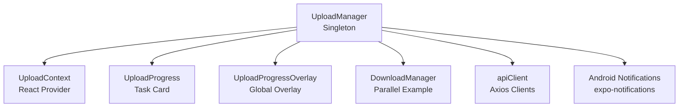
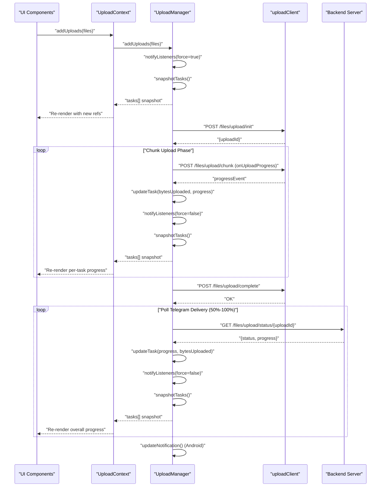
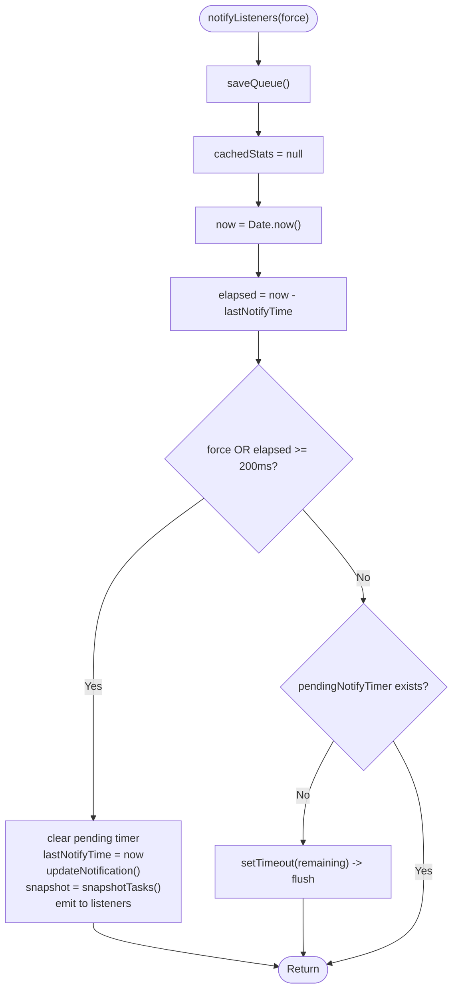
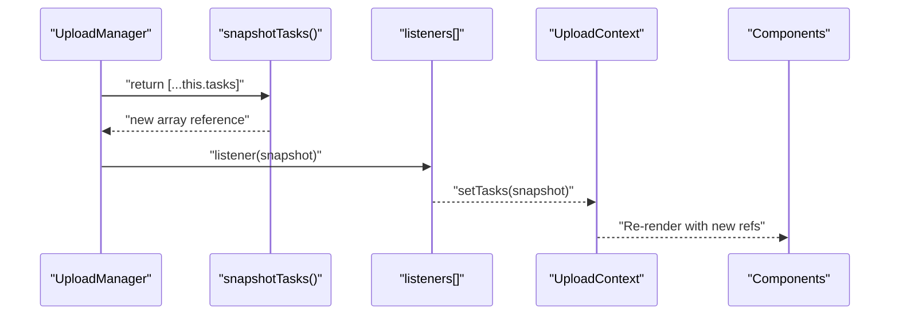
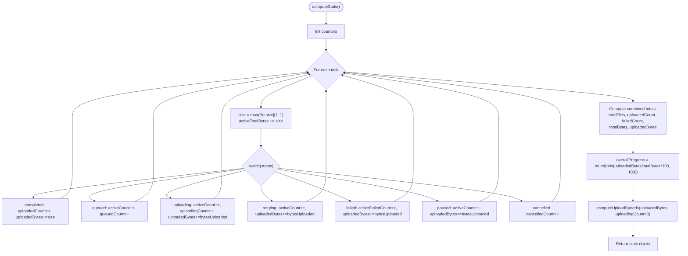
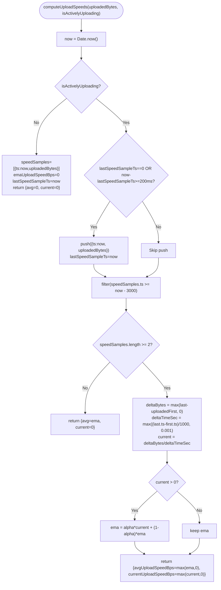
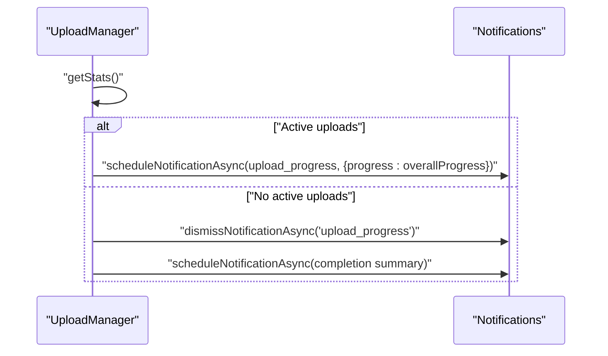
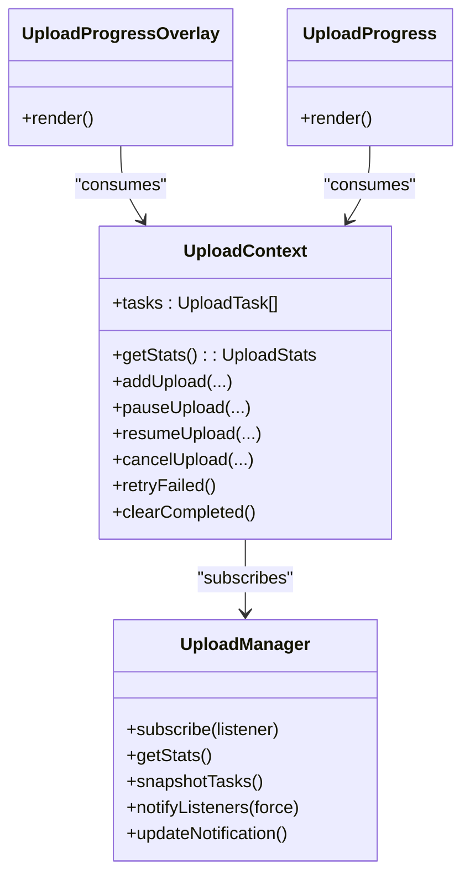
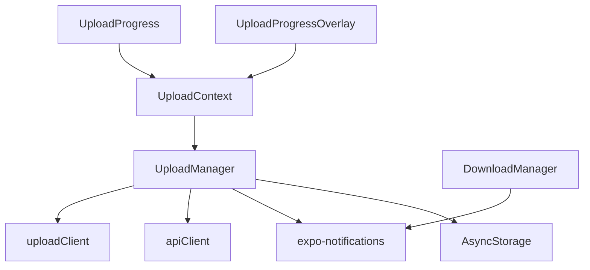

# Progress Tracking and Statistics

<cite>
**Referenced Files in This Document**
- [UploadManager.ts](file://app/src/services/UploadManager.ts)
- [UploadContext.tsx](file://app/src/context/UploadContext.tsx)
- [UploadProgress.tsx](file://app/src/components/UploadProgress.tsx)
- [UploadProgressOverlay.tsx](file://app/src/components/UploadProgressOverlay.tsx)
- [DownloadManager.ts](file://app/src/services/DownloadManager.ts)
- [apiClient.ts](file://app/src/services/apiClient.ts)
</cite>

## Table of Contents
1. [Introduction](#introduction)
2. [Project Structure](#project-structure)
3. [Core Components](#core-components)
4. [Architecture Overview](#architecture-overview)
5. [Detailed Component Analysis](#detailed-component-analysis)
6. [Dependency Analysis](#dependency-analysis)
7. [Performance Considerations](#performance-considerations)
8. [Troubleshooting Guide](#troubleshooting-guide)
9. [Conclusion](#conclusion)

## Introduction
This document explains the progress tracking and statistics system used by the upload subsystem. It covers the throttled notification mechanism, aggregate statistics computation, upload speed estimation using exponential moving averages, byte-accurate overall progress calculation, and React re-render guarantees via immutable snapshots. It also documents historical statistics tracking, speed window calculations, and Android progress notifications.

## Project Structure
The progress tracking system centers around a singleton upload manager that orchestrates uploads, computes statistics, and notifies React components and Android notifications. The context exposes derived stats to UI components, which render progress overlays and per-task cards.

**Diagram sources**
- [UploadManager.ts](file://app/src/services/UploadManager.ts#L126-L198)
- [UploadContext.tsx](file://app/src/context/UploadContext.tsx#L51-L114)
- [UploadProgress.tsx](file://app/src/components/UploadProgress.tsx#L42-L186)
- [UploadProgressOverlay.tsx](file://app/src/components/UploadProgressOverlay.tsx#L29-L360)
- [DownloadManager.ts](file://app/src/services/DownloadManager.ts#L42-L141)
- [apiClient.ts](file://app/src/services/apiClient.ts#L31-L42)

**Section sources**
- [UploadManager.ts](file://app/src/services/UploadManager.ts#L1-L18)
- [UploadContext.tsx](file://app/src/context/UploadContext.tsx#L1-L123)

## Core Components
- UploadManager: Central orchestrator for uploads, throttled notifications, statistics caching, speed sampling, and Android progress notifications.
- UploadContext: React provider exposing aggregate stats and actions to the UI.
- UploadProgress and UploadProgressOverlay: UI components rendering per-task and global progress.
- DownloadManager: Reference implementation of a similar progress/notification system for downloads.

Key constants and behaviors:
- Throttle interval: 200 ms for notifications to avoid excessive React re-renders.
- Speed window: 3000 ms for computing upload speeds.
- Byte-accurate overallProgress: computed as uploadedBytes / totalBytes * 100.
- Immutable snapshots: new task arrays are created on every notify to trigger React re-renders.

**Section sources**
- [UploadManager.ts](file://app/src/services/UploadManager.ts#L133-L135)
- [UploadManager.ts](file://app/src/services/UploadManager.ts#L382-L384)
- [UploadContext.tsx](file://app/src/context/UploadContext.tsx#L8-L9)

## Architecture Overview
The upload pipeline integrates with the backend via two axios clients, tracks progress through chunk uploads and server polling, and maintains statistics for display and notifications.

**Diagram sources**
- [UploadManager.ts](file://app/src/services/UploadManager.ts#L514-L556)
- [UploadManager.ts](file://app/src/services/UploadManager.ts#L805-L981)
- [UploadManager.ts](file://app/src/services/UploadManager.ts#L283-L310)
- [UploadManager.ts](file://app/src/services/UploadManager.ts#L449-L510)
- [apiClient.ts](file://app/src/services/apiClient.ts#L36-L42)

## Detailed Component Analysis

### Throttled Notification System (NOTIFY_THROTTLE_MS = 200 ms)
The UploadManager throttles state notifications to reduce React re-renders during rapid chunk uploads. It uses a trailing flush pattern:
- Immediate flush if force=true or if the throttle interval has elapsed.
- Otherwise, schedules a trailing flush to occur after remaining time.
- On flush, it invalidates cached stats, persists the queue, updates Android notifications, and emits a new snapshot to subscribers.

**Diagram sources**
- [UploadManager.ts](file://app/src/services/UploadManager.ts#L283-L310)

**Section sources**
- [UploadManager.ts](file://app/src/services/UploadManager.ts#L133-L134)
- [UploadManager.ts](file://app/src/services/UploadManager.ts#L283-L310)

### Snapshot Tasks and React Re-render Guarantees
To ensure React detects changes inside task objects, the UploadManager returns a new array reference on every notify. The snapshot function returns a shallow copy of the current tasks array, which is sufficient because tasks are updated immutably.

**Diagram sources**
- [UploadManager.ts](file://app/src/services/UploadManager.ts#L272-L277)
- [UploadContext.tsx](file://app/src/context/UploadContext.tsx#L54-L60)

**Section sources**
- [UploadManager.ts](file://app/src/services/UploadManager.ts#L272-L277)
- [UploadContext.tsx](file://app/src/context/UploadContext.tsx#L54-L60)

### Aggregate Statistics: computeStats()
The computeStats() method performs a single pass over tasks to compute:
- Count and byte totals for active, queued, uploading, paused, failed, cancelled, and completed tasks.
- Combined historical and active stats (cleared counters plus current).
- overallProgress as a byte-accurate percentage.
- Upload speeds via computeUploadSpeeds().

**Diagram sources**
- [UploadManager.ts](file://app/src/services/UploadManager.ts#L324-L405)

**Section sources**
- [UploadManager.ts](file://app/src/services/UploadManager.ts#L324-L405)

### Byte-Accurate Overall Progress
Overall progress is calculated as:
- overallProgress = min(round(uploadedBytes / totalBytes * 100), 100)
- This ensures correctness across all statuses and prevents overshoot.

**Section sources**
- [UploadManager.ts](file://app/src/services/UploadManager.ts#L382-L384)

### Upload Speed Estimation: computeUploadSpeeds() and EMA
The speed estimator maintains a sliding window of samples and applies exponential smoothing:
- Sampling occurs when the throttle interval has elapsed or when uploads stop/start.
- Speed window is 3000 ms; samples older than this are filtered out.
- Current speed is deltaBytes / deltaTimeSeconds.
- Exponential moving average (EMA) with alpha = 0.4 is maintained for a smoothed average.

**Diagram sources**
- [UploadManager.ts](file://app/src/services/UploadManager.ts#L407-L445)

**Section sources**
- [UploadManager.ts](file://app/src/services/UploadManager.ts#L135-L136)
- [UploadManager.ts](file://app/src/services/UploadManager.ts#L407-L445)

### Historical Statistics Tracking
The UploadManager maintains cleared counters to track completed, failed, and total bytes across cleared tasks. These are persisted to AsyncStorage and combined with active stats to present long-term aggregates.

- Cleared counters: clearedCompletedCount, clearedFailedCount, clearedTotalBytes, clearedUploadedBytes, clearedTotalFiles.
- Combined stats: totalFiles = clearedTotalFiles + activeTasks.length, and similarly for counts and bytes.
- Persistence: saved alongside the queue.

**Section sources**
- [UploadManager.ts](file://app/src/services/UploadManager.ts#L137-L142)
- [UploadManager.ts](file://app/src/services/UploadManager.ts#L218-L227)
- [UploadManager.ts](file://app/src/services/UploadManager.ts#L247-L254)
- [UploadManager.ts](file://app/src/services/UploadManager.ts#L375-L380)
- [UploadManager.ts](file://app/src/services/UploadManager.ts#L650-L660)

### Android Progress Notifications Integration
The UploadManager updates Android progress notifications using expo-notifications:
- Ongoing progress with max=100 and current=overallProgress.
- Channel reuse with a low-priority channel for ongoing uploads.
- Completion notifications summarize successes/failures.

**Diagram sources**
- [UploadManager.ts](file://app/src/services/UploadManager.ts#L449-L510)

**Section sources**
- [UploadManager.ts](file://app/src/services/UploadManager.ts#L449-L510)

### UI Integration and Rendering
- UploadContext subscribes to UploadManager and exposes derived stats to consumers.
- UploadProgressOverlay renders global stats, overall progress bar, and a list of tasks.
- UploadProgress renders per-task progress with animated bars and status indicators.

**Diagram sources**
- [UploadContext.tsx](file://app/src/context/UploadContext.tsx#L51-L114)
- [UploadProgressOverlay.tsx](file://app/src/components/UploadProgressOverlay.tsx#L29-L360)
- [UploadProgress.tsx](file://app/src/components/UploadProgress.tsx#L42-L186)
- [UploadManager.ts](file://app/src/services/UploadManager.ts#L259-L265)

**Section sources**
- [UploadContext.tsx](file://app/src/context/UploadContext.tsx#L51-L114)
- [UploadProgressOverlay.tsx](file://app/src/components/UploadProgressOverlay.tsx#L29-L360)
- [UploadProgress.tsx](file://app/src/components/UploadProgress.tsx#L42-L186)

## Dependency Analysis
- UploadManager depends on:
  - AsyncStorage for persistence of queue and historical stats.
  - expo-notifications for Android progress notifications.
  - Two axios clients: apiClient for general requests and uploadClient for uploads with higher timeouts.
- UploadContext depends on UploadManager for state and actions.
- DownloadManager provides a similar pattern for downloads, including notifications.

**Diagram sources**
- [UploadManager.ts](file://app/src/services/UploadManager.ts#L20-L25)
- [UploadManager.ts](file://app/src/services/UploadManager.ts#L202-L255)
- [UploadManager.ts](file://app/src/services/UploadManager.ts#L449-L510)
- [apiClient.ts](file://app/src/services/apiClient.ts#L31-L42)
- [DownloadManager.ts](file://app/src/services/DownloadManager.ts#L82-L141)

**Section sources**
- [UploadManager.ts](file://app/src/services/UploadManager.ts#L20-L25)
- [apiClient.ts](file://app/src/services/apiClient.ts#L31-L42)
- [DownloadManager.ts](file://app/src/services/DownloadManager.ts#L82-L141)

## Performance Considerations
- Throttling: 200 ms throttle reduces React re-renders during rapid chunk uploads.
- Single-pass aggregation: computeStats() iterates tasks once to compute all counts and totals.
- Speed window: 3000 ms balances responsiveness and stability for speed estimates.
- EMA smoothing: alpha=0.4 stabilizes perceived speed while remaining responsive.
- Immutable snapshots: ensure React efficiently detects changes without deep comparisons.
- Persistence: queue and stats are persisted to disk to survive app restarts.

[No sources needed since this section provides general guidance]

## Troubleshooting Guide
Common issues and remedies:
- Excessive re-renders: Verify that notifyListeners is throttled and that snapshotTasks returns new references.
- Incorrect overallProgress: Ensure uploadedBytes and totalBytes are populated for all statuses and that division guards are in place.
- Zero or unstable speeds: Confirm that speed samples are pushed at least every 200 ms and that the speed window filters out stale entries.
- Android notification not updating: Check that updateNotification is invoked on every notify and that the channel and progress fields are set correctly.
- Historical stats not persisting: Verify AsyncStorage keys and that saveQueue also persists stats.

**Section sources**
- [UploadManager.ts](file://app/src/services/UploadManager.ts#L283-L310)
- [UploadManager.ts](file://app/src/services/UploadManager.ts#L382-L384)
- [UploadManager.ts](file://app/src/services/UploadManager.ts#L407-L445)
- [UploadManager.ts](file://app/src/services/UploadManager.ts#L449-L510)
- [UploadManager.ts](file://app/src/services/UploadManager.ts#L202-L255)

## Conclusion
The progress tracking and statistics system combines a throttled notification mechanism, efficient single-pass aggregation, and exponential moving average speed estimation to deliver smooth, accurate, and performant upload progress reporting. Immutable snapshots guarantee React re-renders, while Android notifications provide system-level feedback. Historical statistics and persistence ensure continuity across app sessions.