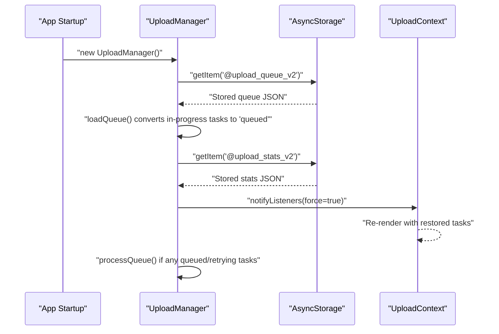
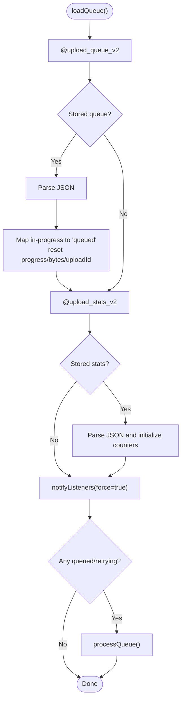
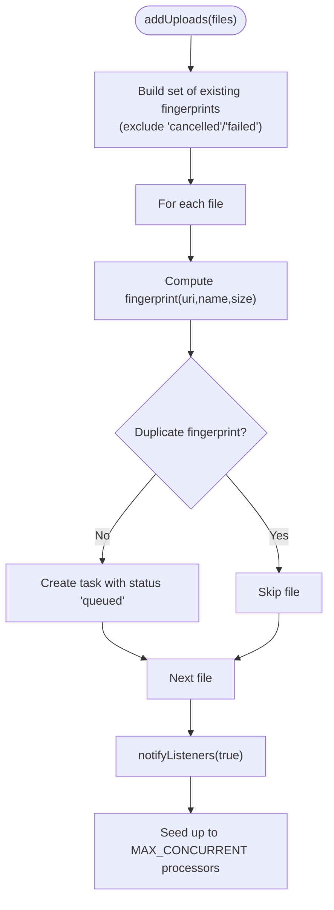
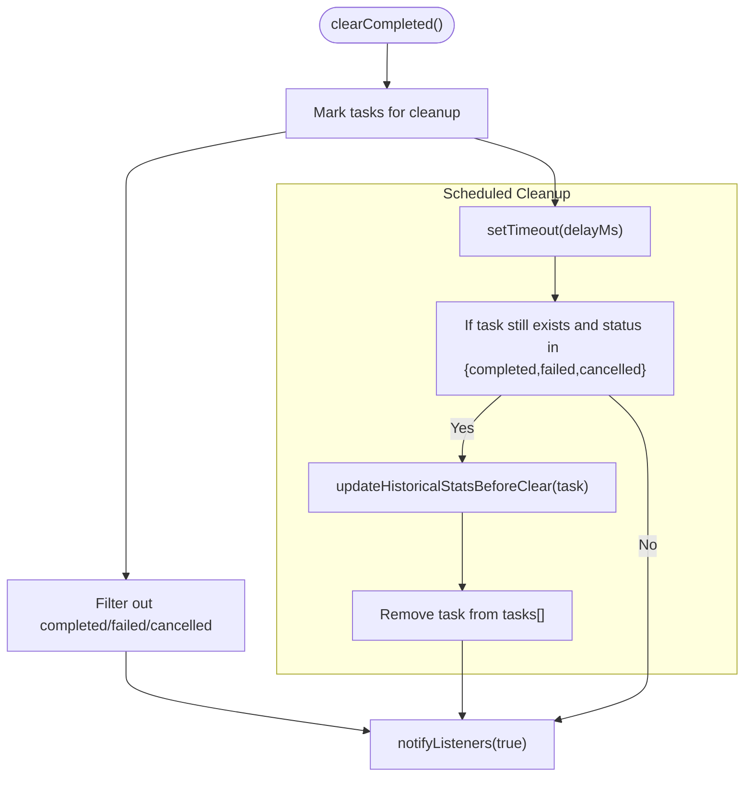
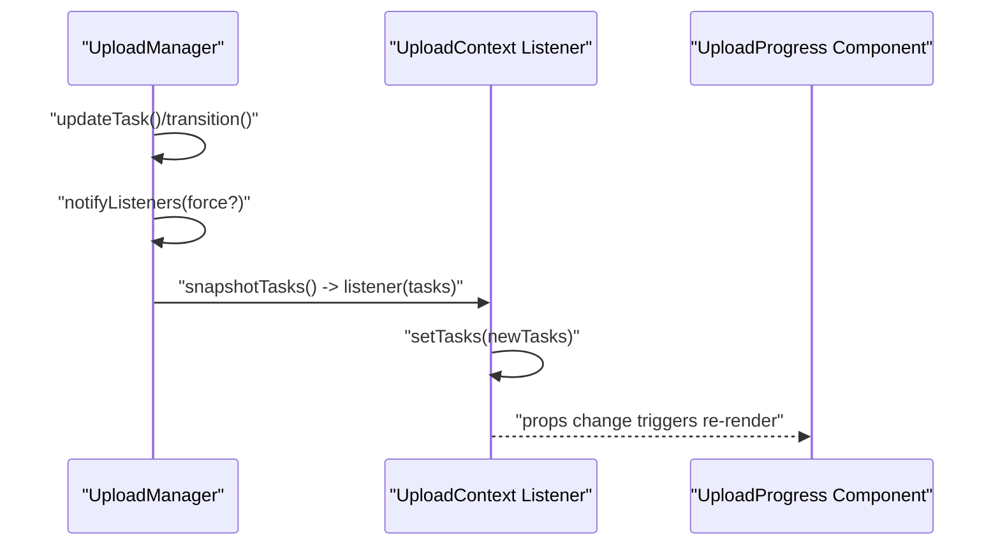
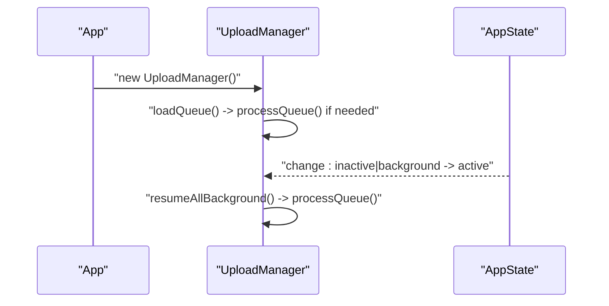
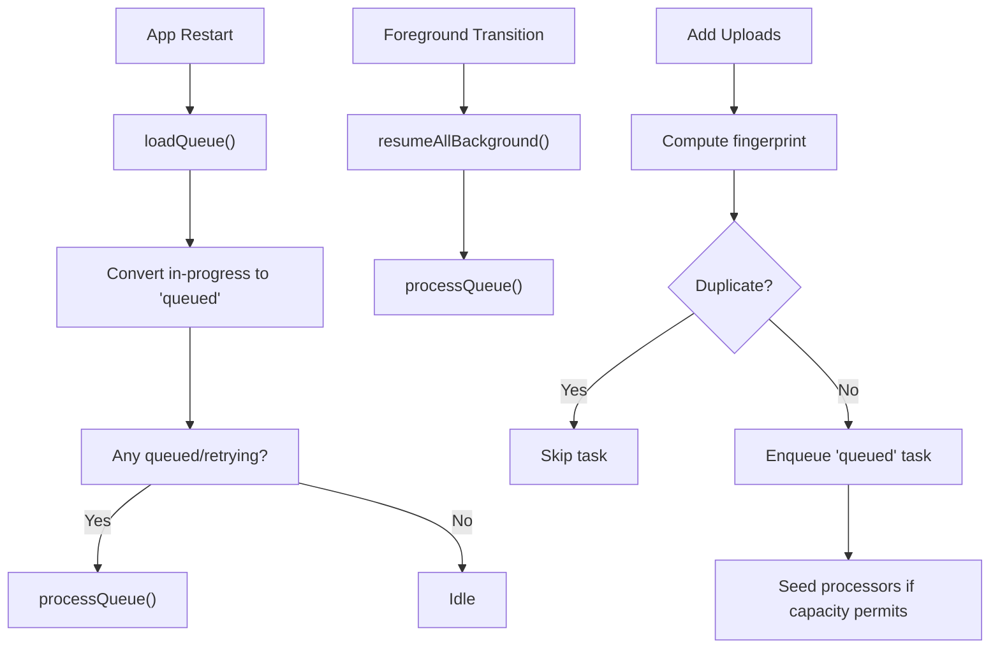
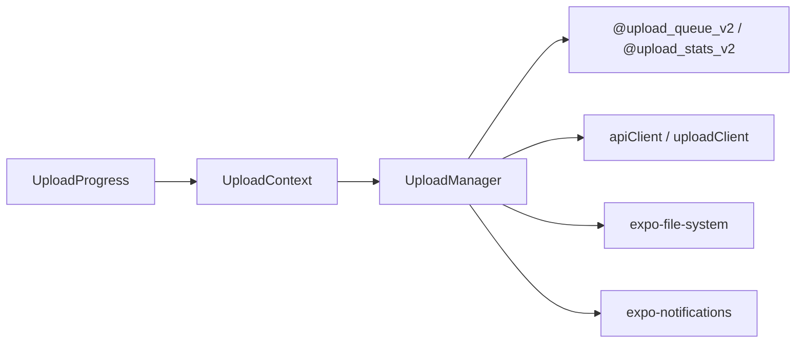

# Queue Persistence and Recovery

<cite>
**Referenced Files in This Document**
- [UploadManager.ts](file://app/src/services/UploadManager.ts)
- [UploadContext.tsx](file://app/src/context/UploadContext.tsx)
- [UploadProgress.tsx](file://app/src/components/UploadProgress.tsx)
- [apiClient.ts](file://app/src/services/apiClient.ts)
- [uploadService.ts](file://app/src/services/uploadService.ts)
</cite>

## Table of Contents
1. [Introduction](#introduction)
2. [Project Structure](#project-structure)
3. [Core Components](#core-components)
4. [Architecture Overview](#architecture-overview)
5. [Detailed Component Analysis](#detailed-component-analysis)
6. [Dependency Analysis](#dependency-analysis)
7. [Performance Considerations](#performance-considerations)
8. [Troubleshooting Guide](#troubleshooting-guide)
9. [Conclusion](#conclusion)

## Introduction
This document explains the queue persistence and recovery system for uploads. It covers AsyncStorage-backed storage using dedicated keys, automatic recovery after app restarts and background transitions, the loadQueue() method’s conversion of in-progress tasks to queued state, the saveQueue() method that filters out completed and cancelled tasks, historical statistics persistence, deduplication via fingerprints, task cleanup mechanisms, and the subscription pattern used to propagate UI updates.

## Project Structure
The upload persistence and recovery logic centers around a singleton UploadManager service, a React provider that subscribes to its updates, and supporting UI components that render task states.

```mermaid
graph TB
subgraph "Persistence Layer"
AS["AsyncStorage<br/>Keys: @upload_queue_v2, @upload_stats_v2"]
end
subgraph "Service Layer"
UM["UploadManager<br/>Singleton"]
AC["apiClient / uploadClient"]
end
subgraph "UI Layer"
UCtx["UploadContext Provider"]
UComp["UploadProgress Card"]
end
AS <- --> UM
UM --> AC
UCtx <- --> UM
UComp --> UCtx
```

**Diagram sources**
- [UploadManager.ts](file://app/src/services/UploadManager.ts#L202-L255)
- [UploadContext.tsx](file://app/src/context/UploadContext.tsx#L54-L60)
- [apiClient.ts](file://app/src/services/apiClient.ts#L31-L42)

**Section sources**
- [UploadManager.ts](file://app/src/services/UploadManager.ts#L196-L255)
- [UploadContext.tsx](file://app/src/context/UploadContext.tsx#L51-L114)

## Core Components
- UploadManager: Singleton responsible for queue lifecycle, persistence, deduplication, retries, and UI notifications.
- UploadContext: React provider that subscribes to UploadManager and exposes derived stats and actions to UI.
- UploadProgress: UI component rendering individual task state and actions.

Key responsibilities:
- Persistence: loadQueue() and saveQueue() manage AsyncStorage-backed queues and historical stats.
- Recovery: Automatic recovery on app startup and foreground transitions.
- Deduplication: Fingerprints prevent adding duplicate uploads.
- Cleanup: Scheduled removal of completed/duplicate/failed tasks after a delay.
- Notifications: Android progress notifications via expo-notifications.

**Section sources**
- [UploadManager.ts](file://app/src/services/UploadManager.ts#L126-L198)
- [UploadContext.tsx](file://app/src/context/UploadContext.tsx#L12-L123)
- [UploadProgress.tsx](file://app/src/components/UploadProgress.tsx#L1-L250)

## Architecture Overview
The system uses a single source of truth (UploadManager) with a publish/subscribe model to drive UI updates. Persistence is handled via AsyncStorage keys. The queue is restored on initialization and resumes processing automatically.



**Diagram sources**
- [UploadManager.ts](file://app/src/services/UploadManager.ts#L202-L239)
- [UploadContext.tsx](file://app/src/context/UploadContext.tsx#L54-L60)

## Detailed Component Analysis

### Persistence Keys and Lifecycle
- Queue storage key: @upload_queue_v2
- Stats storage key: @upload_stats_v2
- Both are persisted via saveQueue() and loaded via loadQueue().

Behavior highlights:
- loadQueue():
  - Reads @upload_queue_v2 and parses JSON.
  - Converts in-progress statuses to queued, resets progress and bytesUploaded, clears uploadId.
  - Loads @upload_stats_v2 and initializes historical counters.
  - Emits initial snapshot (force=true) and triggers processQueue() if any queued/retrying tasks remain.
- saveQueue():
  - Filters out completed and cancelled tasks before persisting.
  - Persists historical stats alongside the queue.



**Diagram sources**
- [UploadManager.ts](file://app/src/services/UploadManager.ts#L202-L239)

**Section sources**
- [UploadManager.ts](file://app/src/services/UploadManager.ts#L202-L255)

### Deduplication Strategy (Fingerprints)
- A fingerprint is computed from file URI, name, and size.
- During addUploads(), existing fingerprints are tracked to skip duplicates.
- This ensures only one task per unique file is enqueued.



**Diagram sources**
- [UploadManager.ts](file://app/src/services/UploadManager.ts#L514-L556)

**Section sources**
- [UploadManager.ts](file://app/src/services/UploadManager.ts#L74-L77)
- [UploadManager.ts](file://app/src/services/UploadManager.ts#L514-L556)

### Task Cleanup Mechanisms
- Immediate filtering: saveQueue() excludes completed and cancelled tasks.
- Scheduled cleanup: completed, failed, or cancelled tasks are removed after a short delay to preserve historical stats.
- Historical stats accumulation: updateHistoricalStatsBeforeClear() increments counters for completed/duplicate/failed tasks.



**Diagram sources**
- [UploadManager.ts](file://app/src/services/UploadManager.ts#L616-L627)
- [UploadManager.ts](file://app/src/services/UploadManager.ts#L662-L674)
- [UploadManager.ts](file://app/src/services/UploadManager.ts#L650-L660)

**Section sources**
- [UploadManager.ts](file://app/src/services/UploadManager.ts#L241-L255)
- [UploadManager.ts](file://app/src/services/UploadManager.ts#L616-L627)
- [UploadManager.ts](file://app/src/services/UploadManager.ts#L650-L674)

### Subscription Pattern for UI Updates
- UploadManager maintains a listeners array and a throttled notify mechanism.
- UploadContext subscribes on mount and receives snapshots of tasks.
- React components re-render only when task object references change (snapshotTasks() ensures new arrays and objects).



**Diagram sources**
- [UploadManager.ts](file://app/src/services/UploadManager.ts#L259-L310)
- [UploadContext.tsx](file://app/src/context/UploadContext.tsx#L54-L60)
- [UploadProgress.tsx](file://app/src/components/UploadProgress.tsx#L247-L250)

**Section sources**
- [UploadManager.ts](file://app/src/services/UploadManager.ts#L259-L310)
- [UploadContext.tsx](file://app/src/context/UploadContext.tsx#L54-L60)
- [UploadProgress.tsx](file://app/src/components/UploadProgress.tsx#L247-L250)

### Automatic Queue Processing on Startup and Background
- Constructor calls loadQueue(), which triggers processQueue() if queued or retrying tasks remain.
- AppState foreground detection triggers resumeAllBackground(), which calls processQueue() to resume processing.



**Diagram sources**
- [UploadManager.ts](file://app/src/services/UploadManager.ts#L196-L198)
- [UploadManager.ts](file://app/src/services/UploadManager.ts#L232-L235)
- [UploadManager.ts](file://app/src/services/UploadManager.ts#L985-L987)
- [UploadContext.tsx](file://app/src/context/UploadContext.tsx#L62-L72)

**Section sources**
- [UploadManager.ts](file://app/src/services/UploadManager.ts#L196-L198)
- [UploadManager.ts](file://app/src/services/UploadManager.ts#L232-L235)
- [UploadManager.ts](file://app/src/services/UploadManager.ts#L985-L987)
- [UploadContext.tsx](file://app/src/context/UploadContext.tsx#L62-L72)

### Persistence Scenarios and Recovery Workflows
- Scenario A: App restart with in-progress tasks
  - loadQueue() restores queue, converts in-progress to queued, resets progress and bytesUploaded, clears uploadId.
  - If any queued/retrying tasks exist, processQueue() resumes work.
- Scenario B: Background-to-foreground transition
  - AppState listener calls resumeAllBackground(), which calls processQueue() to continue uploads.
- Scenario C: Completed/duplicate/failed task cleanup
  - After a delay, tasks in terminal states are removed and historical stats are updated.
- Scenario D: Deduplication on add
  - New uploads are skipped if a matching fingerprint exists (excluding cancelled/failed).



**Diagram sources**
- [UploadManager.ts](file://app/src/services/UploadManager.ts#L202-L239)
- [UploadManager.ts](file://app/src/services/UploadManager.ts#L514-L556)
- [UploadManager.ts](file://app/src/services/UploadManager.ts#L985-L987)

**Section sources**
- [UploadManager.ts](file://app/src/services/UploadManager.ts#L202-L239)
- [UploadManager.ts](file://app/src/services/UploadManager.ts#L514-L556)
- [UploadManager.ts](file://app/src/services/UploadManager.ts#L985-L987)

## Dependency Analysis
- UploadManager depends on:
  - AsyncStorage for persistence (@upload_queue_v2, @upload_stats_v2)
  - apiClient and uploadClient for server interactions
  - expo-notifications for Android progress notifications
  - expo-file-system for chunked reads and MD5 hashing
- UploadContext depends on UploadManager for state and actions.
- UploadProgress depends on UploadContext for task data and actions.



**Diagram sources**
- [UploadManager.ts](file://app/src/services/UploadManager.ts#L20-L25)
- [apiClient.ts](file://app/src/services/apiClient.ts#L31-L42)
- [UploadContext.tsx](file://app/src/context/UploadContext.tsx#L12-L14)
- [UploadProgress.tsx](file://app/src/components/UploadProgress.tsx#L17-L19)

**Section sources**
- [UploadManager.ts](file://app/src/services/UploadManager.ts#L20-L25)
- [apiClient.ts](file://app/src/services/apiClient.ts#L31-L42)
- [UploadContext.tsx](file://app/src/context/UploadContext.tsx#L12-L14)
- [UploadProgress.tsx](file://app/src/components/UploadProgress.tsx#L17-L19)

## Performance Considerations
- Throttled UI updates: notifyListeners() batches frequent updates to reduce React re-renders.
- Speed computation: sliding window EMA tracks average and current upload speeds.
- Concurrency: activeUploads gating prevents oversubscription; MAX_CONCURRENT controls parallelism.
- Chunked uploads: 5 MB chunks balance throughput and memory usage.
- Deduplication: fingerprint checks avoid redundant work and network usage.

[No sources needed since this section provides general guidance]

## Troubleshooting Guide
Common issues and resolutions:
- Queue not restoring after restart
  - Verify AsyncStorage keys exist and are readable.
  - Confirm loadQueue() runs during constructor and processQueue() is triggered when needed.
- Tasks stuck in in-progress or retrying
  - loadQueue() converts in-progress to queued; check that conversion occurs and processQueue() is invoked.
- Completed tasks not disappearing
  - Ensure scheduled cleanup executes and clearCompleted() filters out terminal states.
- Duplicate uploads appearing
  - Confirm fingerprint computation and existing fingerprint set logic.
- UI not updating
  - Ensure notifyListeners() is called and UploadContext subscribers receive snapshots.

**Section sources**
- [UploadManager.ts](file://app/src/services/UploadManager.ts#L202-L239)
- [UploadManager.ts](file://app/src/services/UploadManager.ts#L283-L310)
- [UploadManager.ts](file://app/src/services/UploadManager.ts#L616-L627)
- [UploadManager.ts](file://app/src/services/UploadManager.ts#L662-L674)
- [UploadContext.tsx](file://app/src/context/UploadContext.tsx#L54-L60)

## Conclusion
The queue persistence and recovery system leverages AsyncStorage-backed keys to ensure uploads survive app restarts and background transitions. The UploadManager orchestrates recovery, deduplication, retries, and cleanup, while the subscription pattern keeps the UI synchronized. Together, these mechanisms deliver robust, user-friendly upload management with accurate progress and reliable persistence.