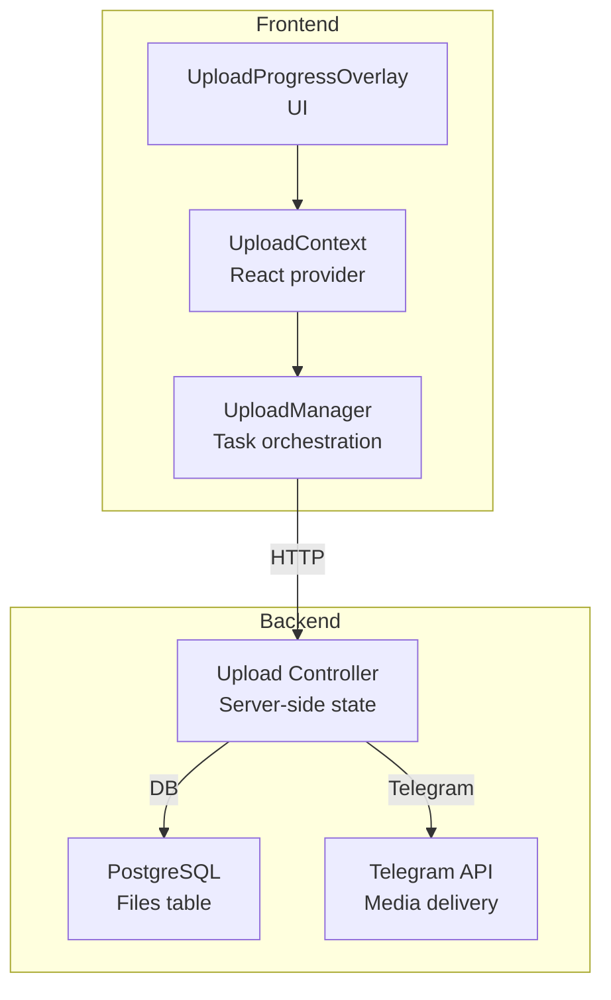
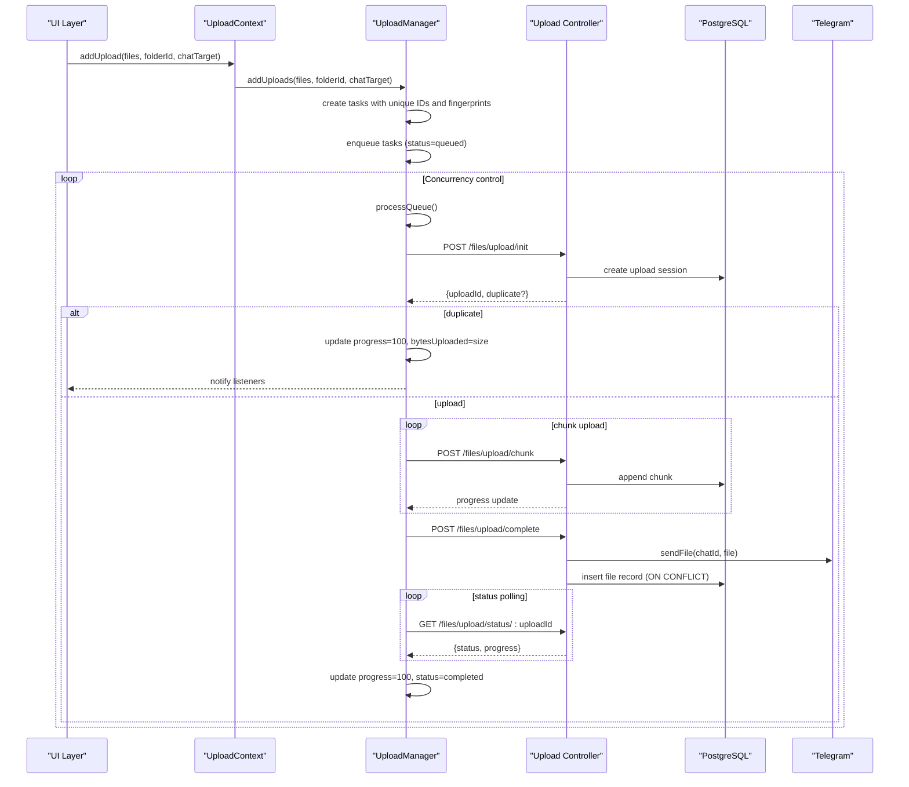
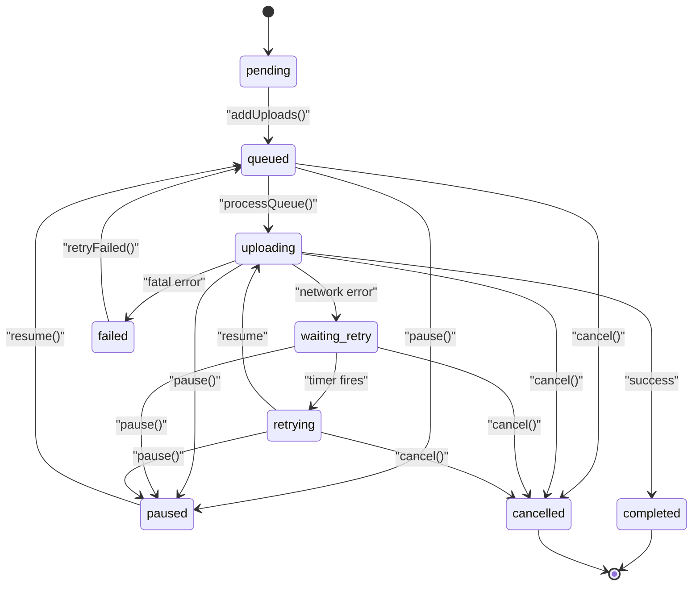
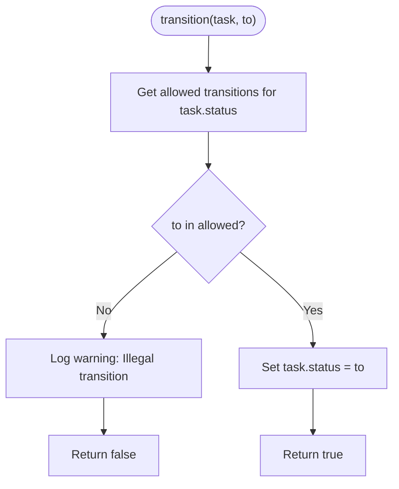
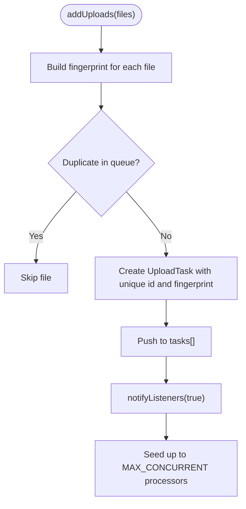
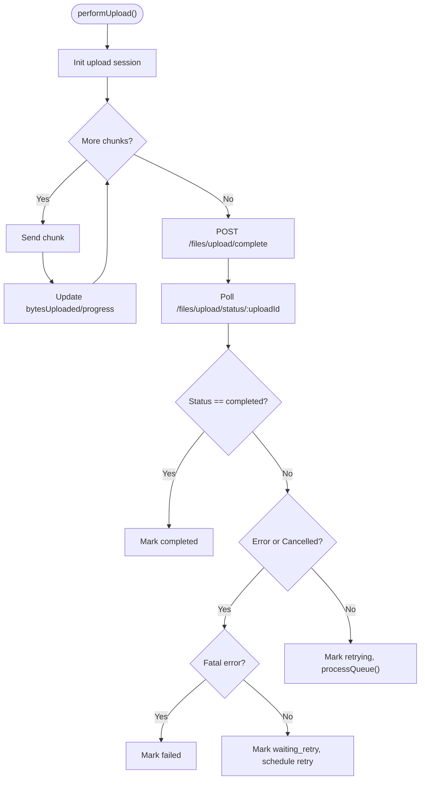
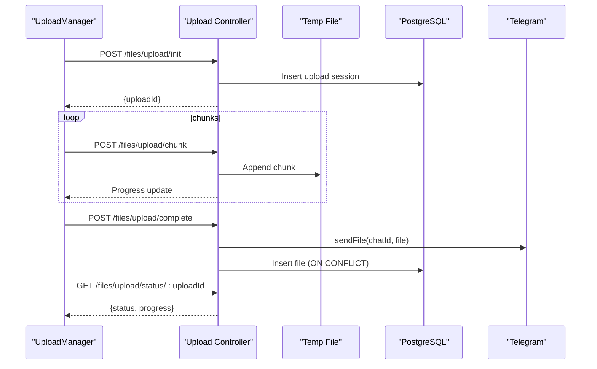
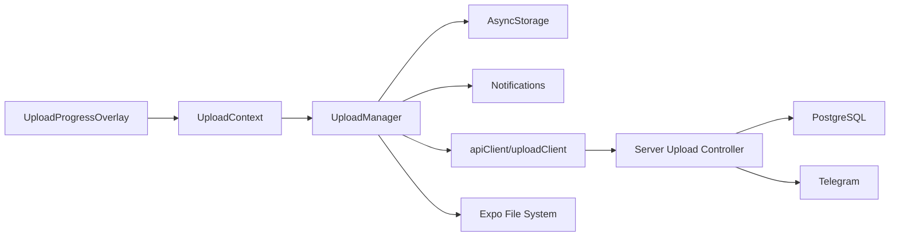

# Task Lifecycle Management

<cite>
**Referenced Files in This Document**
- [UploadManager.ts](file://app/src/services/UploadManager.ts)
- [UploadContext.tsx](file://app/src/context/UploadContext.tsx)
- [uploadService.ts](file://app/src/services/uploadService.ts)
- [upload.controller.ts](file://server/src/controllers/upload.controller.ts)
- [apiClient.ts](file://app/src/services/apiClient.ts)
- [retry.ts](file://app/src/utils/retry.ts)
- [UploadProgressOverlay.tsx](file://app/src/components/UploadProgressOverlay.tsx)
</cite>

## Table of Contents
1. [Introduction](#introduction)
2. [Project Structure](#project-structure)
3. [Core Components](#core-components)
4. [Architecture Overview](#architecture-overview)
5. [Detailed Component Analysis](#detailed-component-analysis)
6. [Dependency Analysis](#dependency-analysis)
7. [Performance Considerations](#performance-considerations)
8. [Troubleshooting Guide](#troubleshooting-guide)
9. [Conclusion](#conclusion)

## Introduction
This document explains the upload task lifecycle management system used by the application. It focuses on the UploadTask interface, the state machine with all valid transitions, illegal transition detection, automatic recovery mechanisms, task creation with unique IDs and deduplication fingerprints, and the transition() method. It also covers common state sequences such as normal upload flow, pause/resume cycles, and retry scenarios with exponential backoff timing.

## Project Structure
The upload lifecycle spans the frontend React application and the backend server:
- Frontend: UploadManager orchestrates task creation, state transitions, persistence, notifications, and retry logic.
- Backend: Upload controller manages server-side upload sessions, deduplication, chunk ordering, Telegram delivery, and status polling.

**Diagram sources**
- [UploadManager.ts](file://app/src/services/UploadManager.ts#L126-L992)
- [UploadContext.tsx](file://app/src/context/UploadContext.tsx#L12-L123)
- [upload.controller.ts](file://server/src/controllers/upload.controller.ts#L134-L546)

**Section sources**
- [UploadManager.ts](file://app/src/services/UploadManager.ts#L1-L18)
- [UploadContext.tsx](file://app/src/context/UploadContext.tsx#L1-L123)
- [upload.controller.ts](file://server/src/controllers/upload.controller.ts#L1-L118)

## Core Components
- UploadTask interface defines the task model with status, progress, retry count, and deduplication fingerprint.
- UploadManager implements the state machine, persistence, notifications, and automatic recovery.
- UploadContext exposes a React provider that subscribes to UploadManager and renders UI updates.
- Server-side upload controller manages upload sessions, deduplication, chunk ordering, and Telegram delivery.

Key responsibilities:
- Task creation: unique IDs, fingerprint generation, initial queued state.
- State transitions: validated by a transition table with illegal transitions blocked.
- Automatic recovery: exponential backoff, pause/resume, and retry logic.
- Persistence: AsyncStorage-backed queue and historical stats.
- Notifications: Android progress notifications and completion summaries.

**Section sources**
- [UploadManager.ts](file://app/src/services/UploadManager.ts#L36-L65)
- [UploadManager.ts](file://app/src/services/UploadManager.ts#L154-L174)
- [UploadManager.ts](file://app/src/services/UploadManager.ts#L514-L556)
- [UploadContext.tsx](file://app/src/context/UploadContext.tsx#L12-L123)
- [upload.controller.ts](file://server/src/controllers/upload.controller.ts#L134-L274)

## Architecture Overview
The system follows a producer-consumer model:
- Producer: UI triggers addUploads, which create tasks with unique IDs and deduplication fingerprints.
- Orchestrator: UploadManager maintains a queue, enforces state transitions, and schedules concurrent uploads.
- Consumers: Server upload controller processes chunks, performs deduplication, and delivers media to Telegram.
- Feedback: Server status polling updates task progress until completion.

**Diagram sources**
- [UploadManager.ts](file://app/src/services/UploadManager.ts#L514-L981)
- [upload.controller.ts](file://server/src/controllers/upload.controller.ts#L134-L546)

## Detailed Component Analysis

### UploadTask Interface and States
The UploadTask interface defines the task model with the following fields:
- id: Unique task identifier.
- file: FileAsset with uri, name, size, and optional mimeType.
- folderId: Target folder identifier or null.
- chatTarget: Telegram chat identifier (default me).
- progress: Percentage 0–100.
- bytesUploaded: Bytes successfully sent so far.
- status: Current state among pending, queued, uploading, paused, waiting_retry, retrying, completed, failed, cancelled.
- error: Optional error message for failed tasks.
- retryCount: Number of retries performed.
- uploadId: Server-assigned upload session ID.
- fingerprint: Deduplication key built from uri|name|size.
- duplicate: Flag indicating server detected existing file.

States and valid transitions are defined by a transition table. The transition() method enforces these rules and logs illegal transitions.

**Diagram sources**
- [UploadManager.ts](file://app/src/services/UploadManager.ts#L154-L164)
- [UploadManager.ts](file://app/src/services/UploadManager.ts#L166-L174)

**Section sources**
- [UploadManager.ts](file://app/src/services/UploadManager.ts#L36-L65)
- [UploadManager.ts](file://app/src/services/UploadManager.ts#L154-L174)

### State Machine Logic and Transition Validation
- VALID_TRANSITIONS: Defines allowed transitions per state.
- transition(task, to): Validates target state against allowed transitions and logs illegal attempts.
- Illegal transitions are blocked and logged; the system remains in the current state.

**Diagram sources**
- [UploadManager.ts](file://app/src/services/UploadManager.ts#L154-L174)

**Section sources**
- [UploadManager.ts](file://app/src/services/UploadManager.ts#L154-L174)

### Task Creation, Unique IDs, and Deduplication
- Unique IDs: Generated using timestamp plus random suffix.
- Deduplication fingerprint: Built from uri|name|size.
- addUploads(): Skips duplicates already in the queue; creates new tasks with status queued.

**Diagram sources**
- [UploadManager.ts](file://app/src/services/UploadManager.ts#L514-L556)

**Section sources**
- [UploadManager.ts](file://app/src/services/UploadManager.ts#L514-L556)
- [UploadManager.ts](file://app/src/services/UploadManager.ts#L74-L77)

### Automatic Recovery Mechanisms
- Exponential backoff: waiting_retry -> retrying with delays 2^retry + 1 seconds.
- Fatal error detection: schema/Telegram fatal errors are not retried.
- Pause/resume: Cancels server session before resuming; resets progress and retry count.
- Cancel: Aborts in-flight operations and cancels server session.

**Diagram sources**
- [UploadManager.ts](file://app/src/services/UploadManager.ts#L676-L760)
- [UploadManager.ts](file://app/src/services/UploadManager.ts#L764-L981)

**Section sources**
- [UploadManager.ts](file://app/src/services/UploadManager.ts#L676-L760)
- [UploadManager.ts](file://app/src/services/UploadManager.ts#L764-L981)

### Server-Side Upload Session Management
- initUpload: Deduplicates by hash, creates upload session, and returns uploadId.
- uploadChunk: Validates chunk ordering, appends to temporary file, tracks received bytes.
- completeUpload: Marks as uploading_to_telegram, then asynchronously uploads to Telegram with semaphore and deduplication.
- cancelUpload: Marks session as cancelled and cleans up.
- checkUploadStatus: Returns progress and status for polling.

**Diagram sources**
- [upload.controller.ts](file://server/src/controllers/upload.controller.ts#L134-L546)

**Section sources**
- [upload.controller.ts](file://server/src/controllers/upload.controller.ts#L134-L274)
- [upload.controller.ts](file://server/src/controllers/upload.controller.ts#L276-L320)
- [upload.controller.ts](file://server/src/controllers/upload.controller.ts#L322-L488)
- [upload.controller.ts](file://server/src/controllers/upload.controller.ts#L499-L546)

### Common State Sequences

#### Normal Upload Flow
- pending → queued → uploading → completed
- Progress: 0–50% during chunk upload, 50–100% during Telegram delivery polling.

#### Pause/Resume Cycle
- queued → paused → queued → uploading → completed
- On resume, server session is cancelled and recreated; progress and retry count reset.

#### Retry Scenario with Exponential Backoff
- uploading → waiting_retry (network error) → retrying → uploading → completed
- Delay = (2^retry + 1) seconds; maximum 5 retries.

**Section sources**
- [UploadManager.ts](file://app/src/services/UploadManager.ts#L558-L585)
- [UploadManager.ts](file://app/src/services/UploadManager.ts#L676-L760)
- [UploadManager.ts](file://app/src/services/UploadManager.ts#L724-L751)

## Dependency Analysis
- UploadManager depends on:
  - AsyncStorage for persistence.
  - Notifications for Android progress.
  - apiClient/uploadClient for HTTP requests.
  - Expo File System for chunk reading and MD5 hashing.
- UploadContext provides a React provider that subscribes to UploadManager and renders UI updates.
- Server-side controller depends on PostgreSQL for file records and Telegram service for media delivery.

**Diagram sources**
- [UploadManager.ts](file://app/src/services/UploadManager.ts#L20-L26)
- [UploadContext.tsx](file://app/src/context/UploadContext.tsx#L12-L123)
- [apiClient.ts](file://app/src/services/apiClient.ts#L31-L42)
- [upload.controller.ts](file://server/src/controllers/upload.controller.ts#L1-L11)

**Section sources**
- [UploadManager.ts](file://app/src/services/UploadManager.ts#L20-L26)
- [UploadContext.tsx](file://app/src/context/UploadContext.tsx#L12-L123)
- [apiClient.ts](file://app/src/services/apiClient.ts#L31-L42)
- [upload.controller.ts](file://server/src/controllers/upload.controller.ts#L1-L11)

## Performance Considerations
- Concurrency: Up to 3 simultaneous uploads to match server semaphore and avoid resource exhaustion.
- Chunk size: 5 MB for efficient throughput and reduced overhead.
- Progress accuracy: Real-time progress via onUploadProgress and polling ensures precise byte-accurate progress.
- Throttling: Notification throttling reduces React re-renders during rapid updates.
- Speed computation: Sliding window EMA for upload speed estimation.

**Section sources**
- [UploadManager.ts](file://app/src/services/UploadManager.ts#L128-L136)
- [UploadManager.ts](file://app/src/services/UploadManager.ts#L132-L135)
- [UploadManager.ts](file://app/src/services/UploadManager.ts#L283-L310)
- [UploadManager.ts](file://app/src/services/UploadManager.ts#L407-L445)

## Troubleshooting Guide
Common issues and remedies:
- Illegal state transitions: Detected and logged; ensure UI actions follow allowed transitions.
- Duplicate uploads: Fingerprint-based deduplication prevents redundant uploads.
- Fatal Telegram errors: Non-recoverable errors are marked as failed; do not retry.
- Network timeouts: UploadManager retries with exponential backoff; API client also retries on transient errors.
- Paused/resumed tasks: Server session is cancelled before resuming; progress and retry count reset.
- Cancelled tasks: Aborted operations and server session cancellation handled; task cleared after delay.

**Section sources**
- [UploadManager.ts](file://app/src/services/UploadManager.ts#L166-L174)
- [UploadManager.ts](file://app/src/services/UploadManager.ts#L514-L556)
- [UploadManager.ts](file://app/src/services/UploadManager.ts#L717-L723)
- [UploadManager.ts](file://app/src/services/UploadManager.ts#L724-L751)
- [UploadManager.ts](file://app/src/services/UploadManager.ts#L558-L585)
- [UploadManager.ts](file://app/src/services/UploadManager.ts#L587-L601)
- [UploadManager.ts](file://app/src/services/UploadManager.ts#L648-L674)

## Conclusion
The upload task lifecycle management system provides a robust, stateful, and resilient mechanism for handling uploads. It enforces strict state transitions, supports pause/resume and retry with exponential backoff, prevents duplicates, and integrates tightly with server-side upload sessions and Telegram delivery. The combination of frontend orchestration and backend safeguards ensures reliable progress tracking and recovery across various failure modes.