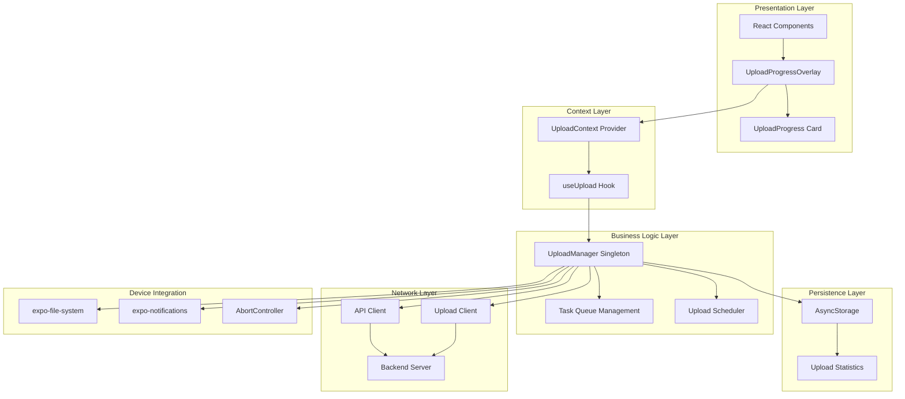
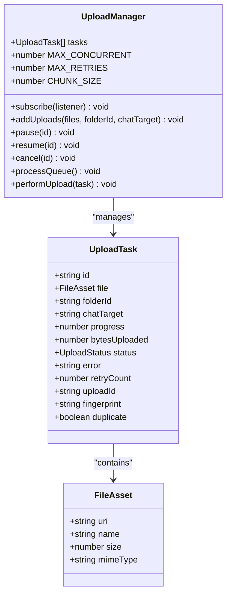
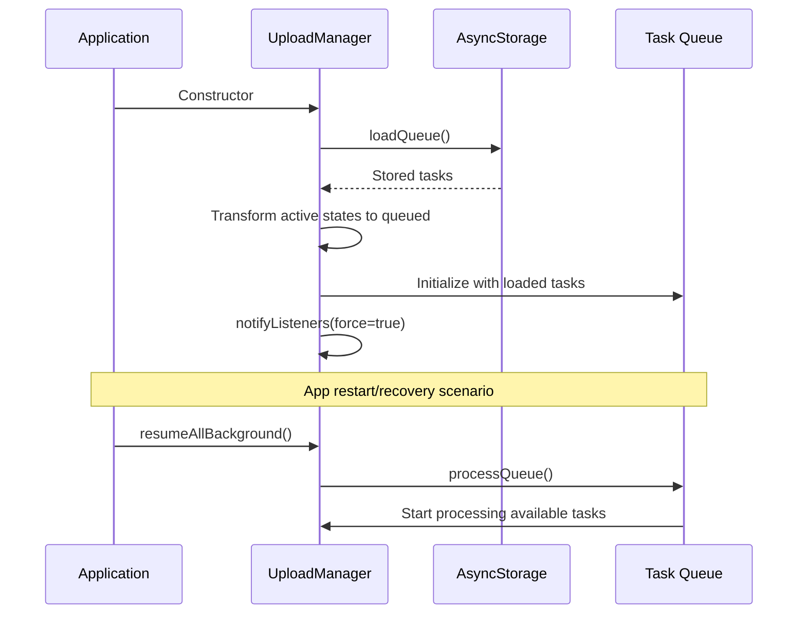
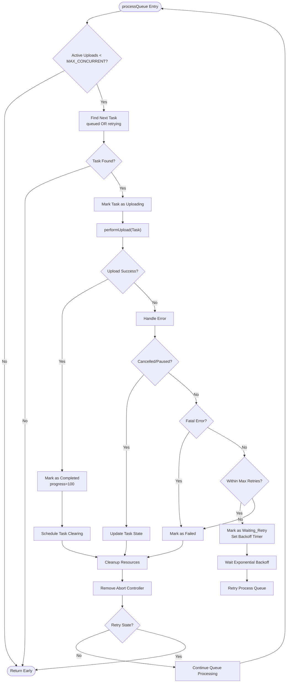
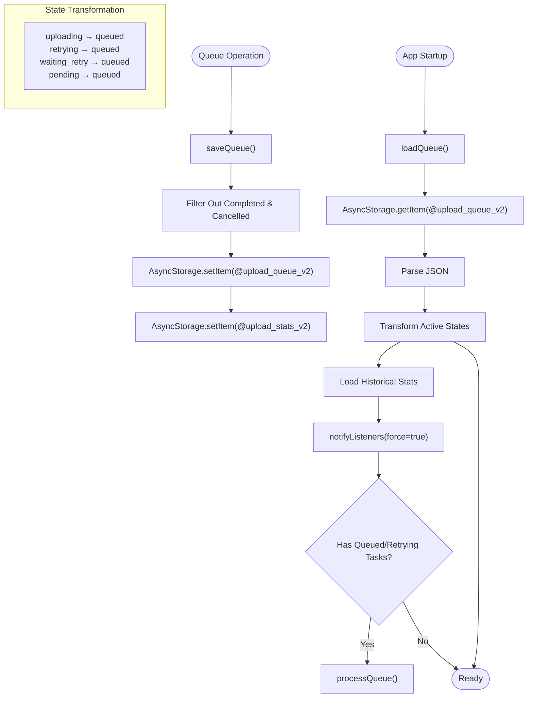
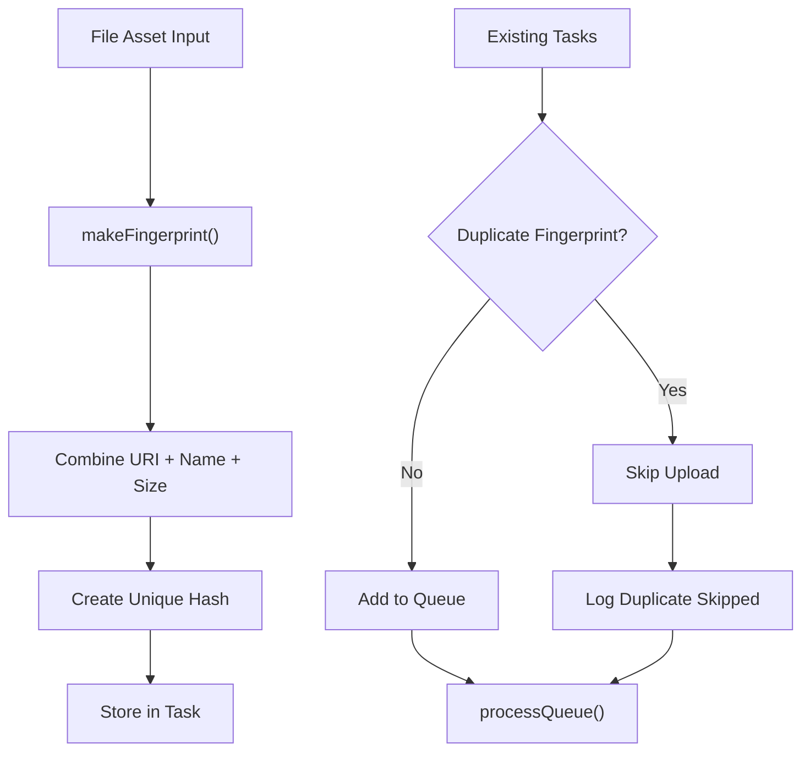
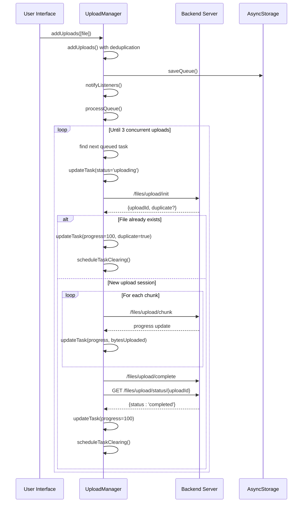
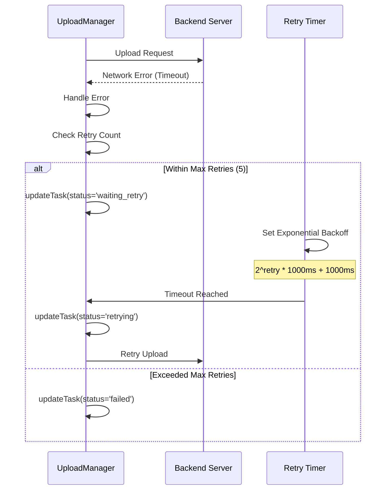
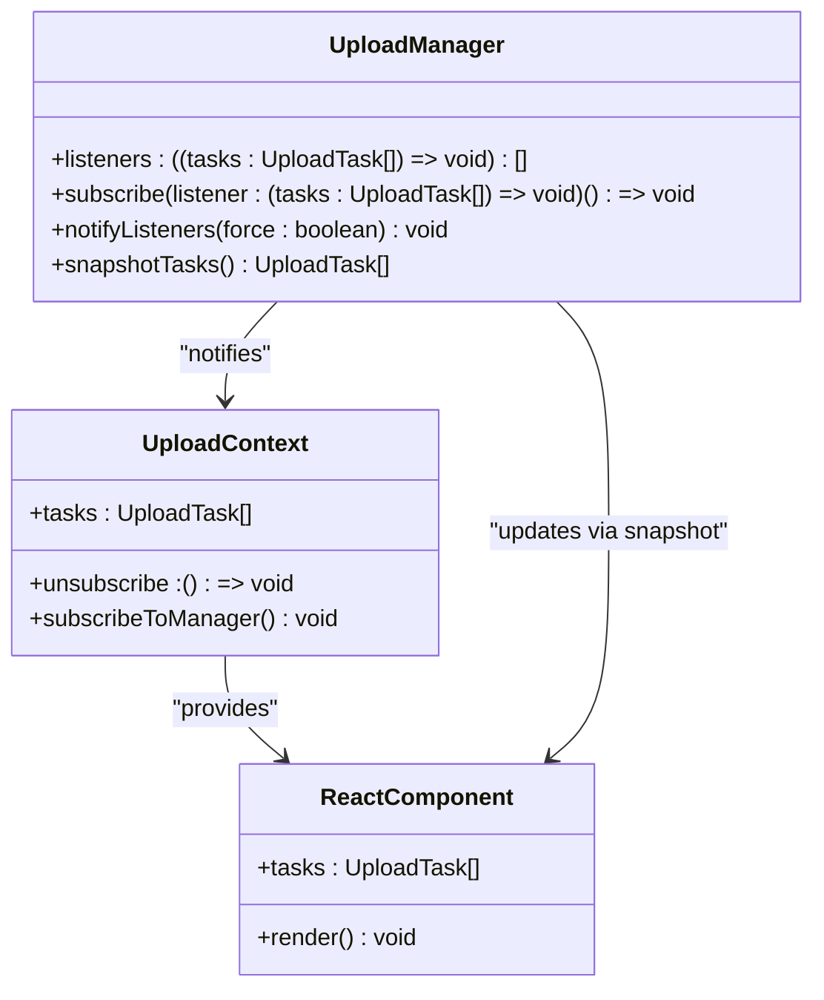
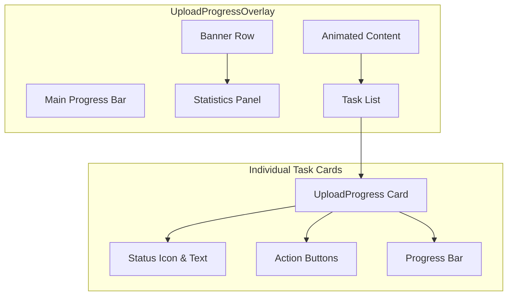

# Upload Queue Management

<cite>
**Referenced Files in This Document**
- [UploadManager.ts](file://app/src/services/UploadManager.ts)
- [UploadContext.tsx](file://app/src/context/UploadContext.tsx)
- [uploadService.ts](file://app/src/services/uploadService.ts)
- [UploadProgress.tsx](file://app/src/components/UploadProgress.tsx)
- [UploadProgressOverlay.tsx](file://app/src/components/UploadProgressOverlay.tsx)
- [apiClient.ts](file://app/src/services/apiClient.ts)
- [sharedSpaceApi.ts](file://app/src/services/sharedSpaceApi.ts)
- [App.tsx](file://app/App.tsx)
</cite>

## Table of Contents
1. [Introduction](#introduction)
2. [System Architecture](#system-architecture)
3. [Core Components](#core-components)
4. [Upload Manager Class](#upload-manager-class)
5. [Task Lifecycle Management](#task-lifecycle-management)
6. [Concurrent Upload Limits](#concurrent-upload-limits)
7. [Queue Persistence](#queue-persistence)
8. [Task Deduplication](#task-deduplication)
9. [State Transition Examples](#state-transition-examples)
10. [Queue Manipulation Methods](#queue-manipulation-methods)
11. [Subscription Pattern](#subscription-pattern)
12. [UI Integration](#ui-integration)
13. [Performance Considerations](#performance-considerations)
14. [Troubleshooting Guide](#troubleshooting-guide)
15. [Conclusion](#conclusion)

## Introduction

The Upload Queue Management system is a production-grade solution designed to handle file uploads with robust queuing, concurrency control, persistence, and real-time progress tracking. Built with React Native and TypeScript, this system provides a comprehensive upload management solution with automatic recovery, deduplication, and comprehensive state management.

The system consists of a singleton UploadManager class that orchestrates upload operations, manages task states, handles persistence, and provides a reactive subscription pattern for UI updates. It integrates seamlessly with the application's React context system and provides real-time progress notifications.

## System Architecture

The upload queue management system follows a layered architecture pattern with clear separation of concerns:



**Diagram sources**
- [UploadManager.ts](file://app/src/services/UploadManager.ts#L126-L198)
- [UploadContext.tsx](file://app/src/context/UploadContext.tsx#L51-L114)
- [apiClient.ts](file://app/src/services/apiClient.ts#L31-L42)

## Core Components

### UploadManager Singleton

The UploadManager serves as the central orchestrator for all upload operations. It maintains the task queue, manages concurrent uploads, handles persistence, and provides the reactive subscription pattern for UI updates.

Key responsibilities include:
- Task lifecycle management and state transitions
- Concurrent upload control (3 simultaneous uploads)
- Queue persistence using AsyncStorage
- Progress tracking and statistics computation
- Automatic recovery after app restart
- Deduplication via fingerprinting
- Real-time notifications

### UploadTask Interface

The UploadTask interface defines the structure for individual upload operations with comprehensive status tracking and metadata:



**Diagram sources**
- [UploadManager.ts](file://app/src/services/UploadManager.ts#L47-L65)
- [UploadManager.ts](file://app/src/services/UploadManager.ts#L126-L198)

**Section sources**
- [UploadManager.ts](file://app/src/services/UploadManager.ts#L29-L65)
- [UploadManager.ts](file://app/src/services/UploadManager.ts#L126-L198)

## Upload Manager Class

The UploadManager class implements a comprehensive upload queue management system with the following key characteristics:

### Class Structure and Dependencies

The class utilizes modern React Native APIs and follows best practices for concurrent operations:

- **Concurrency Control**: Enforces exactly 3 simultaneous uploads
- **Persistence**: Uses AsyncStorage for queue and statistics persistence
- **Progress Tracking**: Provides real-time progress updates with throttling
- **Error Handling**: Implements exponential backoff retry logic
- **Cancellation Support**: Full AbortController integration for graceful cancellation

### Initialization and Recovery

The UploadManager automatically handles app lifecycle events and recovery:



**Diagram sources**
- [UploadManager.ts](file://app/src/services/UploadManager.ts#L196-L239)
- [UploadManager.ts](file://app/src/services/UploadManager.ts#L985-L987)

**Section sources**
- [UploadManager.ts](file://app/src/services/UploadManager.ts#L126-L198)
- [UploadManager.ts](file://app/src/services/UploadManager.ts#L202-L239)

## Task Lifecycle Management

The UploadManager implements a comprehensive state machine for task lifecycle management with strict validation and transition rules.

### State Machine Definition

```mermaid
stateDiagram-v2
[*] --> Pending
Pending --> Queued : addUploads()
state Queued {
[*] --> Waiting
Waiting --> Uploading : processQueue()
Waiting --> Paused : pause()
Waiting --> Cancelled : cancel()
}
state Uploading {
[*] --> Active
Active --> Completed : successful upload
Active --> Waiting_Retry : network error
Active --> Failed : fatal error
Active --> Paused : pause()
Active --> Cancelled : cancel()
}
state Waiting_Retry {
[*] --> Backoff
Backoff --> Retrying : timeout reached
Backoff --> Cancelled : cancel()
Backoff --> Paused : pause()
}
state Retrying {
[*] --> Uploading : retry
Retrying --> Cancelled : cancel()
Retrying --> Paused : pause()
}
state Paused {
[*] --> Resuming
Resuming --> Queued : resume()
}
state Failed {
[*] --> Retrying : retryFailed()
Failed --> Queued : manual retry
}
state Cancelled {
[*] --> [*]
}
state Completed {
[*] --> [*]
}
```

**Diagram sources**
- [UploadManager.ts](file://app/src/services/UploadManager.ts#L154-L164)

### Validation Rules

The system enforces strict state transition validation through the `transition` method:

| Current State | Allowed Next States |
|---------------|---------------------|
| pending | queued |
| queued | uploading, paused, cancelled |
| uploading | completed, waiting_retry, failed, paused, cancelled |
| waiting_retry | retrying, cancelled, paused |
| retrying | uploading, cancelled, paused |
| paused | queued |
| failed | queued |
| completed | (terminal) |

**Section sources**
- [UploadManager.ts](file://app/src/services/UploadManager.ts#L154-L174)

## Concurrent Upload Limits

The system implements a sophisticated concurrency control mechanism that ensures optimal resource utilization while maintaining stability.

### Concurrency Control Mechanism



**Diagram sources**
- [UploadManager.ts](file://app/src/services/UploadManager.ts#L676-L760)

### Resource Management

The system employs several mechanisms to ensure efficient resource utilization:

- **AbortController Management**: Each active upload maintains its own AbortController for precise cancellation control
- **Memory Cleanup**: Automatic cleanup of completed, failed, and cancelled tasks after a 3-second delay
- **Progress Throttling**: 200ms throttle interval to prevent excessive React re-renders
- **Speed Calculation**: Exponential moving average calculation for upload speed monitoring

**Section sources**
- [UploadManager.ts](file://app/src/services/UploadManager.ts#L128-L135)
- [UploadManager.ts](file://app/src/services/UploadManager.ts#L184-L190)
- [UploadManager.ts](file://app/src/services/UploadManager.ts#L676-L760)

## Queue Persistence

The system implements comprehensive persistence using AsyncStorage to ensure uploads survive app restarts and device reboots.

### Persistence Strategy



**Diagram sources**
- [UploadManager.ts](file://app/src/services/UploadManager.ts#L202-L239)
- [UploadManager.ts](file://app/src/services/UploadManager.ts#L241-L255)

### Data Structure

The persisted queue stores only relevant tasks (excluding completed and cancelled) to optimize storage usage:

| Field | Type | Description |
|-------|------|-------------|
| id | string | Unique task identifier |
| file | FileAsset | File metadata (uri, name, size, mimeType) |
| folderId | string/null | Target folder identifier |
| chatTarget | string | Telegram chat target |
| progress | number | 0-100 progress percentage |
| bytesUploaded | number | Bytes successfully uploaded |
| status | UploadStatus | Current task status |
| retryCount | number | Number of retry attempts |
| uploadId | string | Server-assigned upload session ID |
| fingerprint | string | Deduplication fingerprint |
| duplicate | boolean | Whether file already exists |

**Section sources**
- [UploadManager.ts](file://app/src/services/UploadManager.ts#L202-L255)

## Task Deduplication

The system implements intelligent deduplication to prevent duplicate uploads of the same file.

### Fingerprint Generation



**Diagram sources**
- [UploadManager.ts](file://app/src/services/UploadManager.ts#L74-L77)
- [UploadManager.ts](file://app/src/services/UploadManager.ts#L518-L545)

### Deduplication Logic

The deduplication system uses a composite fingerprint based on:
- **File URI**: Ensures unique identification per file location
- **File Name**: Prevents uploads of files with same content but different names
- **File Size**: Handles edge cases where identical content has different sizes

The system maintains a Set of existing fingerprints during batch upload operations to efficiently detect duplicates before adding new tasks.

**Section sources**
- [UploadManager.ts](file://app/src/services/UploadManager.ts#L74-L77)
- [UploadManager.ts](file://app/src/services/UploadManager.ts#L518-L545)

## State Transition Examples

### Example 1: Successful Upload Flow



**Diagram sources**
- [UploadManager.ts](file://app/src/services/UploadManager.ts#L514-L556)
- [UploadManager.ts](file://app/src/services/UploadManager.ts#L676-L760)
- [UploadManager.ts](file://app/src/services/UploadManager.ts#L805-L981)

### Example 2: Network Error with Retry



**Diagram sources**
- [UploadManager.ts](file://app/src/services/UploadManager.ts#L723-L751)

## Queue Manipulation Methods

The UploadManager provides comprehensive methods for managing the upload queue:

### Public API Methods

| Method | Parameters | Description |
|--------|------------|-------------|
| `addUploads` | files: FileAsset[], folderId: string \| null, chatTarget: string | Adds multiple files to the upload queue with deduplication |
| `pause` | id: string | Pauses a running or queued upload |
| `resume` | id: string | Resumes a paused or failed upload |
| `cancel` | id: string | Cancels an active or queued upload |
| `cancelAll` | - | Cancels all active and queued uploads |
| `clearCompleted` | - | Removes completed, failed, and cancelled tasks |
| `retryFailed` | - | Retries all failed uploads |

### Implementation Details

Each method follows a consistent pattern:
1. **Validation**: Find and validate the target task
2. **State Transition**: Use the `transition` method for state validation
3. **Resource Management**: Handle AbortController cleanup and server communication
4. **Persistence**: Update AsyncStorage with current queue state
5. **Notification**: Trigger UI updates via the subscription pattern

**Section sources**
- [UploadManager.ts](file://app/src/services/UploadManager.ts#L514-L646)

## Subscription Pattern

The UploadManager implements a reactive subscription pattern that enables real-time UI updates without manual polling.

### Subscription Architecture



**Diagram sources**
- [UploadManager.ts](file://app/src/services/UploadManager.ts#L258-L277)
- [UploadContext.tsx](file://app/src/context/UploadContext.tsx#L51-L60)

### Throttled Notifications

The system implements intelligent throttling to balance responsiveness with performance:

- **Default Throttle**: 200ms minimum interval between notifications
- **Force Notifications**: Immediate delivery for critical state changes
- **Pending Notification Queue**: Debounces rapid state changes
- **Snapshot Creation**: Creates new array references to trigger React re-renders

### React Integration

The UploadContext provides a convenient hook-based interface:

```typescript
const { tasks, addUpload, cancelUpload, pauseUpload, resumeUpload } = useUpload();
```

The context automatically handles:
- Subscription to UploadManager updates
- State synchronization with React components
- Cleanup of subscriptions on component unmount
- Background state restoration

**Section sources**
- [UploadManager.ts](file://app/src/services/UploadManager.ts#L258-L310)
- [UploadContext.tsx](file://app/src/context/UploadContext.tsx#L51-L114)

## UI Integration

The upload queue management system integrates seamlessly with the application's UI components through React context and component composition.

### UploadProgressOverlay Component

The UploadProgressOverlay serves as the primary interface for upload queue visualization:



**Diagram sources**
- [UploadProgressOverlay.tsx](file://app/src/components/UploadProgressOverlay.tsx#L29-L356)
- [UploadProgress.tsx](file://app/src/components/UploadProgress.tsx#L42-L186)

### Component Features

The UI components provide comprehensive upload management capabilities:

- **Real-time Progress**: Animated progress bars with byte-accurate calculations
- **Action Controls**: Pause, resume, cancel, and retry functionality
- **Statistics Display**: Upload counts, speeds, and progress metrics
- **Responsive Design**: Collapsible interface with expandable details
- **Visual Feedback**: Color-coded status indicators and icons

### Integration Points

The system integrates with the main application through:

- **App.tsx Provider Chain**: UploadProvider wrapped in the main application
- **Navigation Integration**: Accessible from all screens via the overlay
- **Theme System**: Consistent styling with the application's theme
- **Accessibility**: Proper ARIA labels and touch targets

**Section sources**
- [UploadProgressOverlay.tsx](file://app/src/components/UploadProgressOverlay.tsx#L29-L356)
- [UploadProgress.tsx](file://app/src/components/UploadProgress.tsx#L42-L186)
- [App.tsx](file://app/App.tsx#L265-L285)

## Performance Considerations

The upload queue management system implements several performance optimizations to ensure smooth operation under various conditions.

### Memory Management

- **Task Cleanup**: Automatic removal of completed, failed, and cancelled tasks after 3 seconds
- **Historical Stats**: Separate storage for cleared task statistics to prevent memory bloat
- **Immutable Updates**: New object references for each state change to trigger React re-renders efficiently

### Network Optimization

- **Chunked Uploads**: 5MB chunk size for optimal network utilization
- **Exponential Backoff**: Gradual retry delays to handle server load and network issues
- **AbortController Integration**: Precise cancellation control to free network resources

### UI Performance

- **Throttled Updates**: 200ms notification throttle to prevent excessive re-renders
- **Animated Progress**: Smooth animations with native driver support
- **Virtualized Lists**: Efficient rendering of large task lists

### Storage Efficiency

- **Selective Persistence**: Only active tasks are stored in AsyncStorage
- **JSON Serialization**: Compact representation of task data
- **Background Loading**: Queue restoration occurs asynchronously during initialization

## Troubleshooting Guide

### Common Issues and Solutions

#### Uploads Not Starting After App Restart

**Symptoms**: Uploaded files appear in queue but don't start processing
**Solution**: The system automatically transforms active states to queued during load and resumes processing automatically

#### Duplicate Uploads Being Added

**Symptoms**: Same file appears multiple times in the queue
**Cause**: Fingerprint collision or manual duplicate addition
**Solution**: The deduplication system prevents duplicate additions based on URI, name, and size combination

#### Uploads Stuck in Waiting_Retry State

**Symptoms**: Uploads remain in waiting_retry indefinitely
**Cause**: Excessive retry attempts or network connectivity issues
**Solution**: Check network connectivity and consider cancelling the task if it's not recoverable

#### Memory Leaks or Performance Degradation

**Symptoms**: App becomes sluggish over time
**Cause**: Accumulation of completed tasks in memory
**Solution**: The system automatically cleans up completed, failed, and cancelled tasks after 3 seconds

### Debugging Tools

The system provides comprehensive logging and error reporting:

- **Console Logging**: Extensive console output for upload lifecycle events
- **Error Tracking**: Detailed error messages with stack traces
- **Progress Monitoring**: Real-time progress updates for debugging
- **State Inspection**: Access to current task states and statistics

**Section sources**
- [UploadManager.ts](file://app/src/services/UploadManager.ts#L236-L238)
- [UploadManager.ts](file://app/src/services/UploadManager.ts#L717-L723)

## Conclusion

The Upload Queue Management system represents a comprehensive solution for handling file uploads in React Native applications. Its robust architecture, extensive error handling, and thoughtful design choices make it suitable for production environments requiring reliable upload functionality.

Key strengths of the system include:

- **Production-Grade Reliability**: Battle-tested implementation with comprehensive error handling
- **Automatic Recovery**: Seamless continuation of uploads after app restarts
- **Efficient Concurrency**: Optimized 3-way parallel upload limit with resource management
- **Real-Time Updates**: Reactive subscription pattern with throttled notifications
- **Comprehensive Persistence**: Reliable queue and statistics storage
- **Intelligent Deduplication**: Prevention of duplicate upload attempts
- **User-Friendly Interface**: Comprehensive UI components with actionable controls

The system's modular design and clear separation of concerns facilitate maintenance and extension while providing a solid foundation for upload functionality in complex applications.