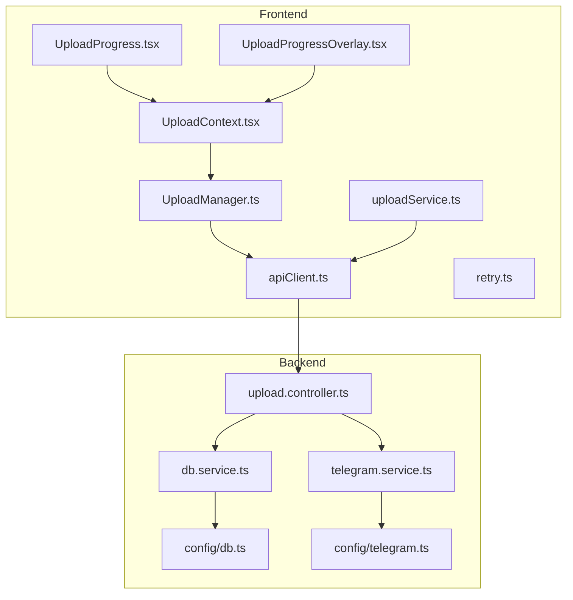
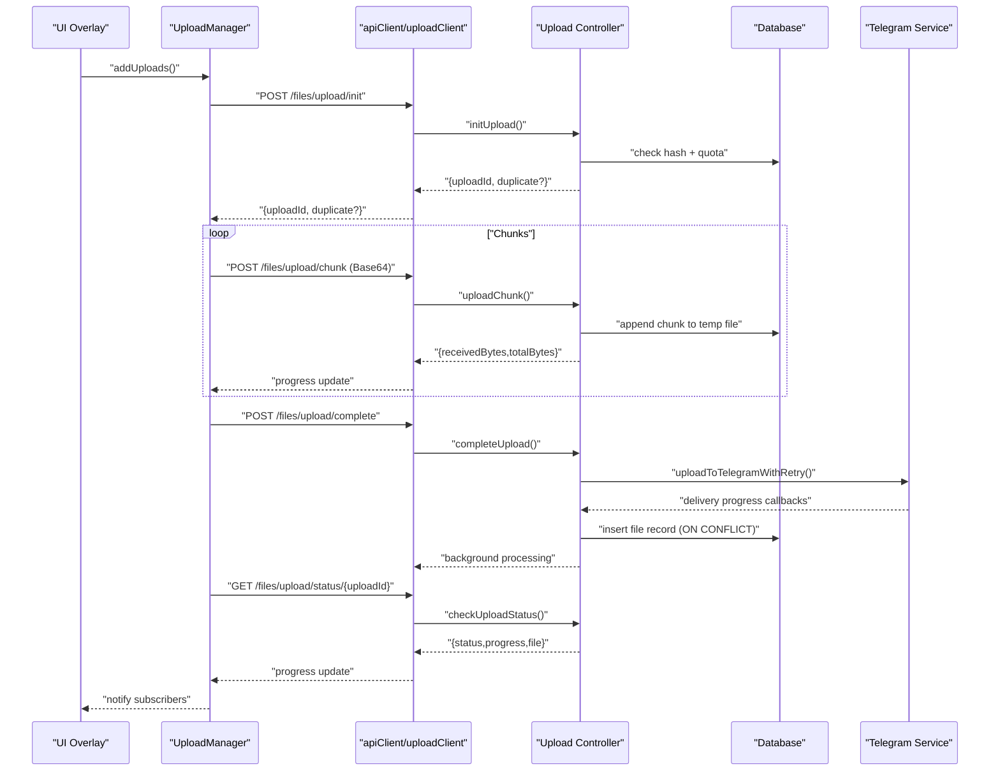
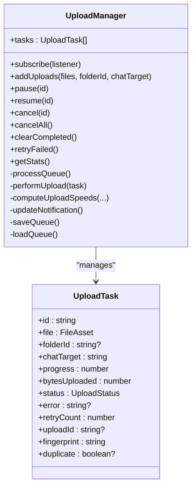
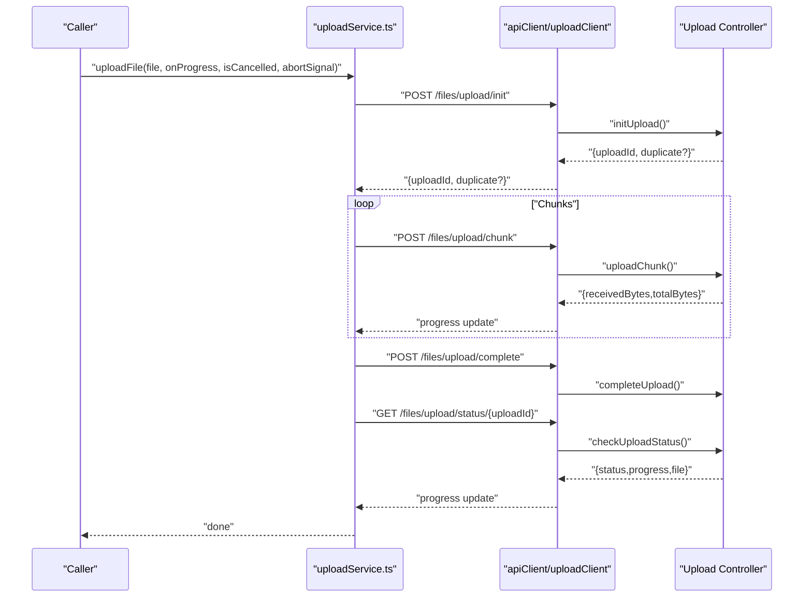
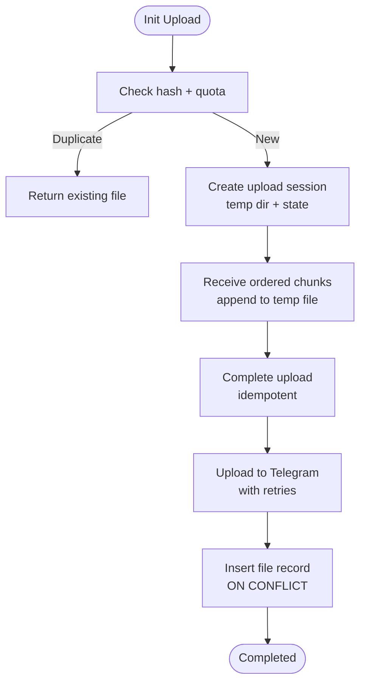
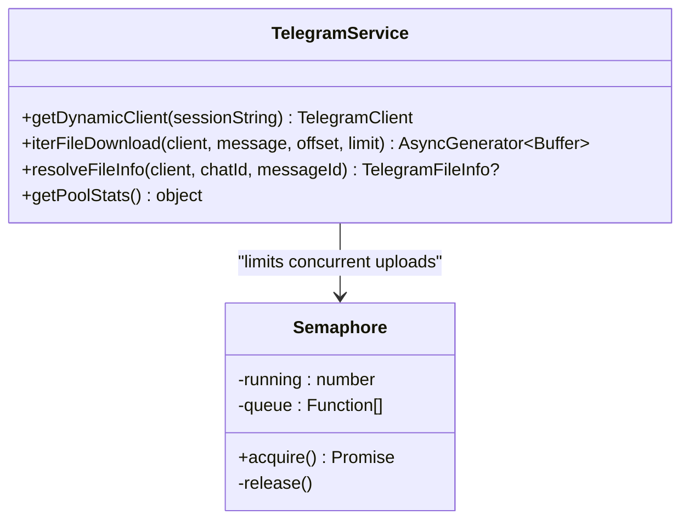
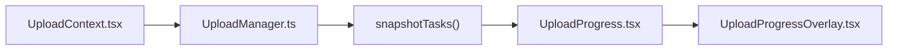
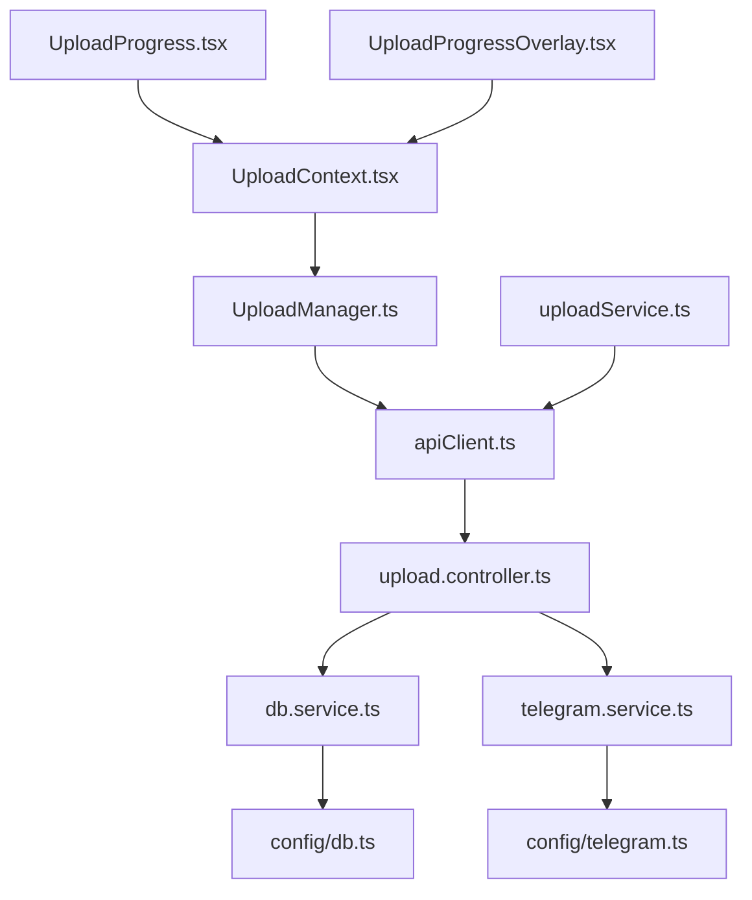

# Upload System Architecture

<cite>
**Referenced Files in This Document**
- [UploadManager.ts](file://app/src/services/UploadManager.ts)
- [uploadService.ts](file://app/src/services/uploadService.ts)
- [apiClient.ts](file://app/src/services/apiClient.ts)
- [retry.ts](file://app/src/utils/retry.ts)
- [UploadContext.tsx](file://app/src/context/UploadContext.tsx)
- [UploadProgress.tsx](file://app/src/components/UploadProgress.tsx)
- [UploadProgressOverlay.tsx](file://app/src/components/UploadProgressOverlay.tsx)
- [upload.controller.ts](file://server/src/controllers/upload.controller.ts)
- [telegram.service.ts](file://server/src/services/telegram.service.ts)
- [db.service.ts](file://server/src/services/db.service.ts)
- [db.ts](file://server/src/config/db.ts)
- [telegram.ts](file://server/src/config/telegram.ts)
- [sharedSpaceApi.ts](file://app/src/services/sharedSpaceApi.ts)
</cite>

## Table of Contents
1. [Introduction](#introduction)
2. [Project Structure](#project-structure)
3. [Core Components](#core-components)
4. [Architecture Overview](#architecture-overview)
5. [Detailed Component Analysis](#detailed-component-analysis)
6. [Dependency Analysis](#dependency-analysis)
7. [Performance Considerations](#performance-considerations)
8. [Troubleshooting Guide](#troubleshooting-guide)
9. [Conclusion](#conclusion)

## Introduction
This document explains the upload system architecture with a focus on chunked uploads, progress tracking, and resumable transfers. It covers the production-grade UploadManager implementation for queueing, chunk processing, and progress monitoring; the upload service integration with backend endpoints; Telegram API integration for file storage; and robust error handling with auto-retry mechanisms. It also provides guidance on upload speed optimization, pause/resume functionality, duplicate prevention, memory management, and troubleshooting.

## Project Structure
The upload system spans the frontend React Native application and the backend Node.js/Express server:
- Frontend services manage file selection, chunked upload orchestration, progress reporting, and UI overlays.
- Backend controllers coordinate chunk persistence, deduplication, Telegram upload, and status polling.
- Telegram client integration manages reliable file delivery with retries and concurrency control.
- Database services persist file metadata and enforce uniqueness and quotas.

**Diagram sources**
- [UploadManager.ts](file://app/src/services/UploadManager.ts#L126-L992)
- [uploadService.ts](file://app/src/services/uploadService.ts#L1-L207)
- [UploadContext.tsx](file://app/src/context/UploadContext.tsx#L1-L123)
- [UploadProgress.tsx](file://app/src/components/UploadProgress.tsx#L1-L250)
- [UploadProgressOverlay.tsx](file://app/src/components/UploadProgressOverlay.tsx#L1-L360)
- [apiClient.ts](file://app/src/services/apiClient.ts#L1-L164)
- [retry.ts](file://app/src/utils/retry.ts#L1-L34)
- [upload.controller.ts](file://server/src/controllers/upload.controller.ts#L1-L540)
- [telegram.service.ts](file://server/src/services/telegram.service.ts#L1-L260)
- [db.service.ts](file://server/src/services/db.service.ts#L1-L315)
- [db.ts](file://server/src/config/db.ts#L1-L61)
- [telegram.ts](file://server/src/config/telegram.ts#L1-L29)

**Section sources**
- [UploadManager.ts](file://app/src/services/UploadManager.ts#L126-L992)
- [uploadService.ts](file://app/src/services/uploadService.ts#L1-L207)
- [UploadContext.tsx](file://app/src/context/UploadContext.tsx#L1-L123)
- [UploadProgress.tsx](file://app/src/components/UploadProgress.tsx#L1-L250)
- [UploadProgressOverlay.tsx](file://app/src/components/UploadProgressOverlay.tsx#L1-L360)
- [apiClient.ts](file://app/src/services/apiClient.ts#L1-L164)
- [retry.ts](file://app/src/utils/retry.ts#L1-L34)
- [upload.controller.ts](file://server/src/controllers/upload.controller.ts#L1-L540)
- [telegram.service.ts](file://server/src/services/telegram.service.ts#L1-L260)
- [db.service.ts](file://server/src/services/db.service.ts#L1-L315)
- [db.ts](file://server/src/config/db.ts#L1-L61)
- [telegram.ts](file://server/src/config/telegram.ts#L1-L29)

## Core Components
- UploadManager: Production-grade queue manager with concurrency control, exponential backoff, persistence, progress computation, and Android progress notifications.
- uploadService: Standalone helper for single-file uploads with chunking, cancellation, and polling.
- API client: Axios-based HTTP client with token injection, server-waking UI, and retry logic.
- UploadContext: React context wrapping UploadManager for UI binding and derived stats.
- Upload UI components: Task cards and overlay for progress visualization and controls.
- Backend upload controller: Chunk ingestion, deduplication, Telegram upload, and status polling.
- Telegram service: Client pool, session management, and progressive file handling.
- Database service: Schema initialization, indexes, triggers, and storage quota enforcement.

**Section sources**
- [UploadManager.ts](file://app/src/services/UploadManager.ts#L126-L992)
- [uploadService.ts](file://app/src/services/uploadService.ts#L1-L207)
- [apiClient.ts](file://app/src/services/apiClient.ts#L1-L164)
- [UploadContext.tsx](file://app/src/context/UploadContext.tsx#L1-L123)
- [UploadProgress.tsx](file://app/src/components/UploadProgress.tsx#L1-L250)
- [UploadProgressOverlay.tsx](file://app/src/components/UploadProgressOverlay.tsx#L1-L360)
- [upload.controller.ts](file://server/src/controllers/upload.controller.ts#L1-L540)
- [telegram.service.ts](file://server/src/services/telegram.service.ts#L1-L260)
- [db.service.ts](file://server/src/services/db.service.ts#L1-L315)

## Architecture Overview
The system implements a three-phase upload pipeline:
1) Initialize upload session and deduplicate by hash.
2) Stream file chunks to the backend with progress tracking.
3) Finalize on the server and poll Telegram delivery until completion.

**Diagram sources**
- [UploadManager.ts](file://app/src/services/UploadManager.ts#L800-L992)
- [upload.controller.ts](file://server/src/controllers/upload.controller.ts#L134-L540)
- [telegram.service.ts](file://server/src/services/telegram.service.ts#L38-L97)
- [apiClient.ts](file://app/src/services/apiClient.ts#L31-L42)

## Detailed Component Analysis

### UploadManager Implementation
UploadManager orchestrates production-grade uploads with:
- Queue management: Immutable updates, throttled notifications, and snapshot-based React rendering.
- Concurrency: Fixed 3 concurrent uploads matching server semaphore.
- Chunking: 5 MB chunks via native File + FileHandle or fetch fallback.
- Progress tracking: Byte-accurate overall progress and per-task progress.
- Persistence: AsyncStorage-backed queue and historical stats.
- Pause/Resume/Cancel: AbortController-driven lifecycle transitions.
- Auto-retry: Exponential backoff with 5 attempts and fatal error detection.
- Duplicate prevention: Fingerprinting by URI/name/size and server-side hash checks.
- Speed computation: EMA-based upload speed over a 3-second window.

**Diagram sources**
- [UploadManager.ts](file://app/src/services/UploadManager.ts#L126-L992)

**Section sources**
- [UploadManager.ts](file://app/src/services/UploadManager.ts#L126-L992)

### Upload Service Integration (HTTP Communication)
The upload service encapsulates a single-file upload flow:
- Reads file chunks using the new SDK 55 APIs or fetch fallback.
- Initializes upload session and deduplicates by hash.
- Streams chunks to the backend with progress callbacks.
- Completes upload and polls Telegram delivery until completion.
- Supports cancellation via AbortSignal and AbortController.

**Diagram sources**
- [uploadService.ts](file://app/src/services/uploadService.ts#L67-L207)
- [upload.controller.ts](file://server/src/controllers/upload.controller.ts#L134-L540)
- [apiClient.ts](file://app/src/services/apiClient.ts#L31-L42)

**Section sources**
- [uploadService.ts](file://app/src/services/uploadService.ts#L1-L207)
- [apiClient.ts](file://app/src/services/apiClient.ts#L1-L164)

### Backend Upload Controller
The backend coordinates chunked uploads and Telegram delivery:
- Initialization: Deduplication by hash, storage quota checks, and session creation.
- Chunking: Ordered chunk acceptance with expected index validation and temp file assembly.
- Completion: Idempotent finalization, pre-upload dedup, Telegram upload with retries, and DB insertion with conflict handling.
- Cancellation: Graceful cancellation with temp file cleanup.
- Status polling: Progress and completion state exposed to the client.

**Diagram sources**
- [upload.controller.ts](file://server/src/controllers/upload.controller.ts#L134-L540)
- [db.service.ts](file://server/src/services/db.service.ts#L31-L47)

**Section sources**
- [upload.controller.ts](file://server/src/controllers/upload.controller.ts#L1-L540)
- [db.service.ts](file://server/src/services/db.service.ts#L1-L315)

### Telegram API Integration
The Telegram service provides:
- Client pooling with TTL and auto-reconnect.
- Dynamic client retrieval keyed by session fingerprint.
- Progressive file download via iterDownload for streaming.
- Robust upload with anti-FLOOD_WAIT backoff and retry logic.

**Diagram sources**
- [telegram.service.ts](file://server/src/services/telegram.service.ts#L31-L97)

**Section sources**
- [telegram.service.ts](file://server/src/services/telegram.service.ts#L1-L260)

### UI Integration and Progress Tracking
React context and components bind UploadManager to the UI:
- UploadContext exposes tasks and aggregate stats, triggering re-renders on new snapshots.
- UploadProgress renders individual task status, progress bar, and actions.
- UploadProgressOverlay aggregates overall progress, speeds, and task list with expand/collapse.

**Diagram sources**
- [UploadContext.tsx](file://app/src/context/UploadContext.tsx#L1-L123)
- [UploadProgress.tsx](file://app/src/components/UploadProgress.tsx#L1-L250)
- [UploadProgressOverlay.tsx](file://app/src/components/UploadProgressOverlay.tsx#L1-L360)
- [UploadManager.ts](file://app/src/services/UploadManager.ts#L272-L310)

**Section sources**
- [UploadContext.tsx](file://app/src/context/UploadContext.tsx#L1-L123)
- [UploadProgress.tsx](file://app/src/components/UploadProgress.tsx#L1-L250)
- [UploadProgressOverlay.tsx](file://app/src/components/UploadProgressOverlay.tsx#L1-L360)

## Dependency Analysis
- Frontend depends on:
  - UploadManager for orchestration and persistence.
  - apiClient for HTTP communication with token injection and retry logic.
  - React context and components for UI binding and progress display.
- Backend depends on:
  - Upload controller for upload lifecycle.
  - Telegram service for reliable file delivery.
  - Database service for schema, indexes, triggers, and quota enforcement.
  - Database pool configuration for connection limits and timeouts.

**Diagram sources**
- [UploadManager.ts](file://app/src/services/UploadManager.ts#L126-L992)
- [uploadService.ts](file://app/src/services/uploadService.ts#L1-L207)
- [UploadContext.tsx](file://app/src/context/UploadContext.tsx#L1-L123)
- [UploadProgress.tsx](file://app/src/components/UploadProgress.tsx#L1-L250)
- [UploadProgressOverlay.tsx](file://app/src/components/UploadProgressOverlay.tsx#L1-L360)
- [apiClient.ts](file://app/src/services/apiClient.ts#L1-L164)
- [upload.controller.ts](file://server/src/controllers/upload.controller.ts#L1-L540)
- [telegram.service.ts](file://server/src/services/telegram.service.ts#L1-L260)
- [db.service.ts](file://server/src/services/db.service.ts#L1-L315)
- [db.ts](file://server/src/config/db.ts#L1-L61)
- [telegram.ts](file://server/src/config/telegram.ts#L1-L29)

**Section sources**
- [UploadManager.ts](file://app/src/services/UploadManager.ts#L126-L992)
- [uploadService.ts](file://app/src/services/uploadService.ts#L1-L207)
- [UploadContext.tsx](file://app/src/context/UploadContext.tsx#L1-L123)
- [UploadProgress.tsx](file://app/src/components/UploadProgress.tsx#L1-L250)
- [UploadProgressOverlay.tsx](file://app/src/components/UploadProgressOverlay.tsx#L1-L360)
- [apiClient.ts](file://app/src/services/apiClient.ts#L1-L164)
- [upload.controller.ts](file://server/src/controllers/upload.controller.ts#L1-L540)
- [telegram.service.ts](file://server/src/services/telegram.service.ts#L1-L260)
- [db.service.ts](file://server/src/services/db.service.ts#L1-L315)
- [db.ts](file://server/src/config/db.ts#L1-L61)
- [telegram.ts](file://server/src/config/telegram.ts#L1-L29)

## Performance Considerations
- Chunk sizing: 5 MB chunks balance throughput and memory usage; adjust based on device/network.
- Concurrency: Limit to 3 concurrent uploads on both client and server to prevent resource exhaustion.
- Progress accuracy: Use onUploadProgress with known chunk lengths to compute precise progress.
- Speed computation: EMA smoothing over a 3-second window reduces jitter and provides stable metrics.
- Memory management: Server-side temp files are cleaned up after successful insert; Telegram uploads are streamed via iterDownload to avoid full buffering.
- Network timeouts: uploadClient has a 10-minute timeout to accommodate long uploads; client-side exponential backoff complements this.
- Database pool: Conservative pool size (max 5) and idle timeouts prevent connection thrashing on free-tier deployments.

[No sources needed since this section provides general guidance]

## Troubleshooting Guide
Common issues and resolutions:
- Network interruptions:
  - Client retries: Automatic exponential backoff for transient errors and timeouts.
  - UploadManager retries: Up to 5 attempts with backoff for server-side transient failures.
  - Cancel and resume: Use pause/resume/cancel to recover from persistent failures.
- Upload failures:
  - Fatal Telegram errors: Detected and surfaced as non-recoverable; inspect error messages and logs.
  - Duplicate uploads: Fingerprinting and server-side hash checks prevent duplicates; UI indicates “Already exists.”
  - Empty files: Server rejects 0-byte uploads; ensure file size is resolved before upload.
- Progress anomalies:
  - Ensure onUploadProgress is used with accurate chunk totals; fallback to chunk length when total is unavailable.
  - Throttled notifications: Avoid excessive React re-renders; UI updates are batched.
- Memory and disk:
  - Server temp files are removed after completion; monitor disk usage on devices.
  - Telegram client pool evicts expired clients to prevent leaks.
- Database constraints:
  - ON CONFLICT handling ensures idempotent inserts; unique indexes prevent duplicates.

**Section sources**
- [UploadManager.ts](file://app/src/services/UploadManager.ts#L697-L760)
- [upload.controller.ts](file://server/src/controllers/upload.controller.ts#L332-L481)
- [apiClient.ts](file://app/src/services/apiClient.ts#L114-L132)
- [retry.ts](file://app/src/utils/retry.ts#L14-L33)

## Conclusion
The upload system combines a robust client-side queue manager with a resilient backend pipeline and Telegram integration. It delivers accurate progress tracking, pause/resume capabilities, duplicate prevention, and efficient resource usage. The modular design enables easy maintenance and extension, while comprehensive error handling and retries ensure reliability across varied network conditions.