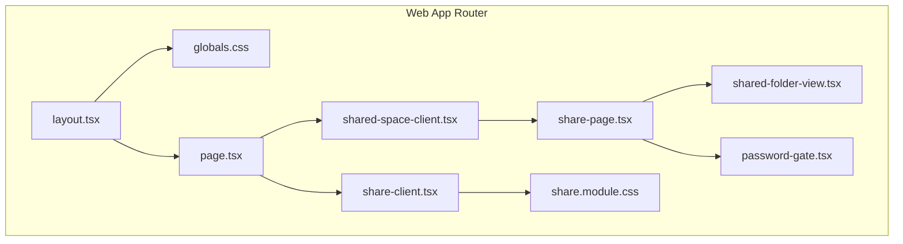
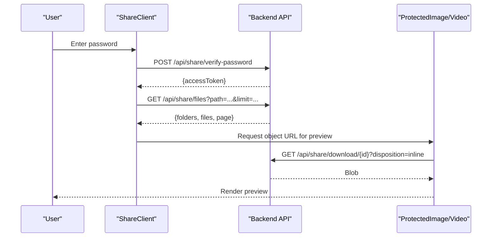
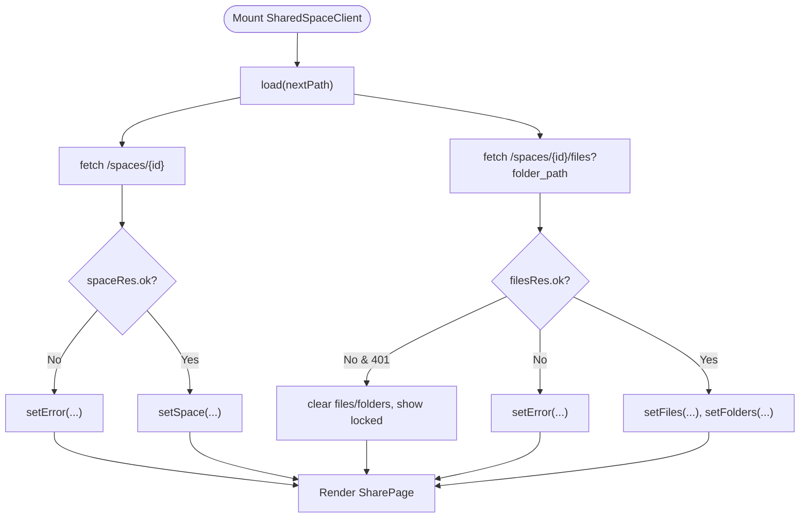
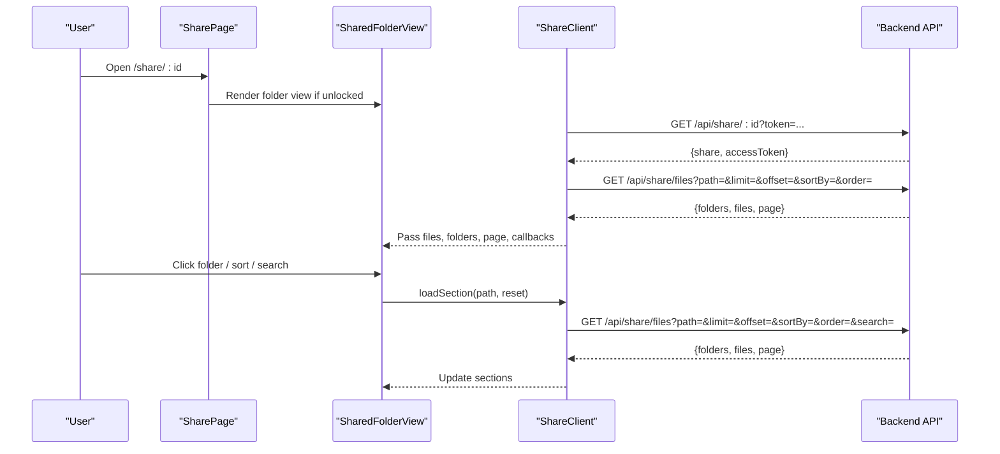
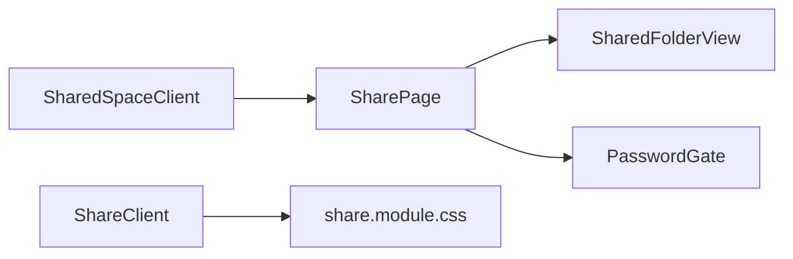
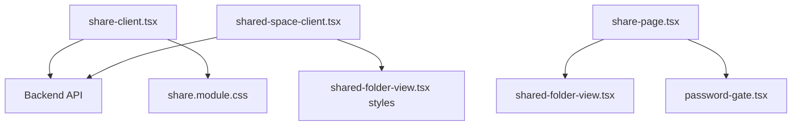

# Client-Side State Management

<cite>
**Referenced Files in This Document**
- [shared-space-client.tsx](file://web/app/s/[spaceId]/shared-space-client.tsx)
- [share-client.tsx](file://web/app/share/[shareId]/share-client.tsx)
- [share.module.css](file://web/app/share/[shareId]/share.module.css)
- [share-page.tsx](file://web/app/s/[spaceId]/share-page.tsx)
- [shared-folder-view.tsx](file://web/app/s/[spaceId]/shared-folder-view.tsx)
- [password-gate.tsx](file://web/app/s/[spaceId]/password-gate.tsx)
- [globals.css](file://web/app/globals.css)
- [layout.tsx](file://web/app/layout.tsx)
- [page.tsx](file://web/app/page.tsx)
</cite>

## Table of Contents
1. [Introduction](#introduction)
2. [Project Structure](#project-structure)
3. [Core Components](#core-components)
4. [Architecture Overview](#architecture-overview)
5. [Detailed Component Analysis](#detailed-component-analysis)
6. [Dependency Analysis](#dependency-analysis)
7. [Performance Considerations](#performance-considerations)
8. [Troubleshooting Guide](#troubleshooting-guide)
9. [Conclusion](#conclusion)

## Introduction
This document explains client-side state management for the web application’s shared space features. It focuses on two primary client components:
- Shared space client for authenticated, password-protected shared spaces
- Individual share client for public or password-gated shared links

It documents state management patterns, component communication, data fetching strategies, CSS global styling approach, and practical examples of handling shared space data, user interactions, and backend synchronization. It also covers performance optimization techniques for large file lists and user experience enhancements for web-based file sharing.

## Project Structure
The web application uses Next.js app router pages under the web directory. Two distinct client components implement shared space experiences:
- Shared space client: manages state for authenticated shared spaces with password gates, folder navigation, uploads, and file listings
- Individual share client: manages state for public/shared-link experiences with optional password verification, pagination, sorting, and file previews

**Diagram sources**
- [layout.tsx](file://web/app/layout.tsx#L1-L16)
- [globals.css](file://web/app/globals.css#L1-L184)
- [page.tsx](file://web/app/page.tsx#L1-L9)
- [shared-space-client.tsx](file://web/app/s/[spaceId]/shared-space-client.tsx#L1-L167)
- [share-page.tsx](file://web/app/s/[spaceId]/share-page.tsx#L1-L73)
- [shared-folder-view.tsx](file://web/app/s/[spaceId]/shared-folder-view.tsx#L1-L369)
- [password-gate.tsx](file://web/app/s/[spaceId]/password-gate.tsx#L1-L97)
- [share-client.tsx](file://web/app/share/[shareId]/share-client.tsx#L1-L860)
- [share.module.css](file://web/app/share/[shareId]/share.module.css#L1-L847)

**Section sources**
- [layout.tsx](file://web/app/layout.tsx#L1-L16)
- [globals.css](file://web/app/globals.css#L1-L184)
- [page.tsx](file://web/app/page.tsx#L1-L9)

## Core Components
This section outlines the core client components responsible for shared space state management and their roles.

- Shared space client (authenticated shared spaces)
  - Manages space metadata, file/folder lists, password verification, upload, and navigation
  - Uses React state hooks and memoization for efficient updates
  - Implements concurrent fetches for space and files, and handles access tokens

- Individual share client (public/shared links)
  - Manages share metadata, password verification, pagination, sorting, and file previews
  - Implements lazy image/video previews via object URLs and controlled download flows
  - Supports breadcrumb navigation and responsive UI via CSS modules

- Global styling and layout
  - Centralized CSS variables define theme tokens and spacing
  - Layout injects global styles and sets metadata

**Section sources**
- [shared-space-client.tsx](file://web/app/s/[spaceId]/shared-space-client.tsx#L1-L167)
- [share-client.tsx](file://web/app/share/[shareId]/share-client.tsx#L1-L860)
- [share.module.css](file://web/app/share/[shareId]/share.module.css#L1-L847)
- [globals.css](file://web/app/globals.css#L1-L184)
- [layout.tsx](file://web/app/layout.tsx#L1-L16)

## Architecture Overview
The client architecture separates concerns across components and uses a layered state management pattern:
- Top-level clients orchestrate state and pass props down
- Page-level components render either a password gate or the folder view
- View components render UI, handle user interactions, and trigger data fetches
- Global CSS provides consistent theming and responsive behavior

**Diagram sources**
- [share-client.tsx](file://web/app/share/[shareId]/share-client.tsx#L264-L298)
- [share-client.tsx](file://web/app/share/[shareId]/share-client.tsx#L175-L262)
- [share-client.tsx](file://web/app/share/[shareId]/share-client.tsx#L695-L746)

## Detailed Component Analysis

### Shared Space Client (Authenticated Shared Spaces)
The shared-space-client orchestrates state for authenticated shared spaces:
- State: space, files, folders, folder path, password, access token, error, loading
- Fetching: concurrent requests for space and files; conditional access token header
- Interactions: password verification, upload via FormData, navigation up and into folders

**Diagram sources**
- [shared-space-client.tsx](file://web/app/s/[spaceId]/shared-space-client.tsx#L43-L80)

Key patterns:
- Concurrent fetches with Promise.all for space and files
- Access token header applied conditionally
- Controlled upload via FormData and subsequent reload
- Memoized headers to avoid unnecessary re-renders

Practical examples:
- Unlocking a shared space: submit password, receive access token, update state, reload data
- Uploading a file: attach folder path and file, send multipart/form-data, refresh listing
- Navigating folders: update folder path, trigger load, merge lists

**Section sources**
- [shared-space-client.tsx](file://web/app/s/[spaceId]/shared-space-client.tsx#L29-L167)

### Share Client (Public/Shared Links)
The share-client manages public/shared-link experiences:
- State: share metadata, access token, password, search, sort, sections (per path), downloading file ID
- Fetching: session initialization, paginated file listings, per-section lazy loading
- Interactions: password verification, search debouncing, sorting, download via object URLs

**Diagram sources**
- [share-client.tsx](file://web/app/share/[shareId]/share-client.tsx#L89-L173)
- [share-client.tsx](file://web/app/share/[shareId]/share-client.tsx#L175-L262)
- [share-page.tsx](file://web/app/s/[spaceId]/share-page.tsx#L40-L72)

Key patterns:
- Per-section state keyed by path with expanded/loading/error flags
- Debounced search query with trailing effect
- Pagination via offset/limit and hasMore flag
- Conditional rendering based on access token and share type (file vs folder)

Practical examples:
- Unlocking a share: POST password verification, set access token, clear sections, reload root
- Browsing nested folders: expand folder, lazy load contents, merge files into section
- Downloading files: request blob via download endpoint, create object URL, trigger download

**Section sources**
- [share-client.tsx](file://web/app/share/[shareId]/share-client.tsx#L89-L476)
- [share.module.css](file://web/app/share/[shareId]/share.module.css#L1-L847)

### Component Communication Strategies
- Props drilling: SharePage receives state and handlers from SharedSpaceClient and passes them to SharedFolderView and PasswordGate
- Callbacks: Handlers for navigation, upload, and unlocking are passed down to child components
- Local state isolation: ShareClient maintains per-section state keyed by path to avoid cross-folder contamination

**Diagram sources**
- [shared-space-client.tsx](file://web/app/s/[spaceId]/shared-space-client.tsx#L149-L166)
- [share-page.tsx](file://web/app/s/[spaceId]/share-page.tsx#L40-L72)
- [shared-folder-view.tsx](file://web/app/s/[spaceId]/shared-folder-view.tsx#L194-L365)
- [password-gate.tsx](file://web/app/s/[spaceId]/password-gate.tsx#L14-L47)
- [share-client.tsx](file://web/app/share/[shareId]/share-client.tsx#L1-L860)
- [share.module.css](file://web/app/share/[shareId]/share.module.css#L1-L847)

**Section sources**
- [share-page.tsx](file://web/app/s/[spaceId]/share-page.tsx#L40-L72)
- [shared-folder-view.tsx](file://web/app/s/[spaceId]/shared-folder-view.tsx#L194-L365)
- [password-gate.tsx](file://web/app/s/[spaceId]/password-gate.tsx#L14-L47)

### Data Fetching Approaches
- Concurrent fetching: SharedSpaceClient loads space and files in parallel
- Conditional headers: Access token header applied only when available
- Paginated queries: ShareClient uses offset/limit with hasMore to support infinite scroll-like behavior
- Debounced search: Search input updates are throttled to reduce network calls
- Controlled downloads: Object URLs are created and revoked to prevent memory leaks

**Section sources**
- [shared-space-client.tsx](file://web/app/s/[spaceId]/shared-space-client.tsx#L47-L50)
- [share-client.tsx](file://web/app/share/[shareId]/share-client.tsx#L122-L125)
- [share-client.tsx](file://web/app/share/[shareId]/share-client.tsx#L193-L200)
- [share-client.tsx](file://web/app/share/[shareId]/share-client.tsx#L300-L320)

### CSS Global Styling Approach
- CSS custom properties define semantic tokens for colors, spacing, typography, shadows, and transitions
- Global resets and base styles normalize browser defaults
- Animations for skeleton loading, fade-in, and staggered list entries
- Focus-visible styles for accessibility
- Scrollbar customization for consistent UX across browsers
- Module CSS for component-specific styles (e.g., share.module.css) to avoid conflicts

**Section sources**
- [globals.css](file://web/app/globals.css#L1-L184)
- [layout.tsx](file://web/app/layout.tsx#L1-L16)
- [share.module.css](file://web/app/share/[shareId]/share.module.css#L1-L847)

## Dependency Analysis
The client components depend on:
- React hooks for state and effects
- Next.js routing and navigation utilities
- Backend APIs for space metadata, file listings, password verification, and downloads
- CSS modules for scoped styling

**Diagram sources**
- [share-client.tsx](file://web/app/share/[shareId]/share-client.tsx#L1-L860)
- [share.module.css](file://web/app/share/[shareId]/share.module.css#L1-L847)
- [shared-space-client.tsx](file://web/app/s/[spaceId]/shared-space-client.tsx#L1-L167)
- [shared-folder-view.tsx](file://web/app/s/[spaceId]/shared-folder-view.tsx#L1-L369)
- [share-page.tsx](file://web/app/s/[spaceId]/share-page.tsx#L1-L73)
- [password-gate.tsx](file://web/app/s/[spaceId]/password-gate.tsx#L1-L97)

**Section sources**
- [share-client.tsx](file://web/app/share/[shareId]/share-client.tsx#L1-L860)
- [shared-space-client.tsx](file://web/app/s/[spaceId]/shared-space-client.tsx#L1-L167)
- [share-page.tsx](file://web/app/s/[spaceId]/share-page.tsx#L1-L73)
- [shared-folder-view.tsx](file://web/app/s/[spaceId]/shared-folder-view.tsx#L1-L369)
- [password-gate.tsx](file://web/app/s/[spaceId]/password-gate.tsx#L1-L97)

## Performance Considerations
- Memory management for large file lists
  - Revoke object URLs after use to prevent memory leaks
  - Abort controller pattern for cancellable fetches
  - Lazy loading of nested folder contents to avoid loading entire tree upfront
- Rendering optimizations
  - Memoization of derived values (e.g., formatted stats)
  - Debounced search to reduce frequent renders and network calls
  - Conditional rendering of heavy previews (images/videos) until loaded
- Network efficiency
  - Concurrent fetches for space and files
  - Pagination with offset/limit to avoid large payloads
  - Minimal re-renders by structuring state per path section

**Section sources**
- [share-client.tsx](file://web/app/share/[shareId]/share-client.tsx#L695-L746)
- [share-client.tsx](file://web/app/share/[shareId]/share-client.tsx#L122-L125)
- [share-client.tsx](file://web/app/share/[shareId]/share-client.tsx#L175-L262)
- [shared-space-client.tsx](file://web/app/s/[spaceId]/shared-space-client.tsx#L47-L50)

## Troubleshooting Guide
Common issues and resolutions:
- Authentication failures
  - Incorrect password: surface user-friendly error messages and retain input
  - Expired link: display appropriate error and guide users accordingly
- Network errors
  - Use error boundaries and fallback UIs; show actionable messages
  - Implement retry logic for transient failures
- Large file previews
  - Fallback to download prompt when preview fails
  - Revoke object URLs on unmount or error to free memory
- Infinite scroll/pagination
  - Verify hasMore flag and offset progression
  - Debounce search to avoid rapid successive requests

**Section sources**
- [share-client.tsx](file://web/app/share/[shareId]/share-client.tsx#L264-L298)
- [share-client.tsx](file://web/app/share/[shareId]/share-client.tsx#L207-L224)
- [share-client.tsx](file://web/app/share/[shareId]/share-client.tsx#L709-L742)
- [shared-space-client.tsx](file://web/app/s/[spaceId]/shared-space-client.tsx#L103-L110)

## Conclusion
The client-side state management in the shared space features follows a clean separation of concerns:
- SharedSpaceClient coordinates authenticated shared spaces with password verification, uploads, and folder navigation
- ShareClient manages public/shared-link experiences with robust state per path, pagination, and safe preview handling
- Global CSS and module CSS provide consistent theming and responsive behavior
- Performance and UX are prioritized through memory-safe object URL handling, debounced search, concurrent fetching, and lazy loading

These patterns enable scalable, maintainable, and user-friendly web-based file sharing experiences.