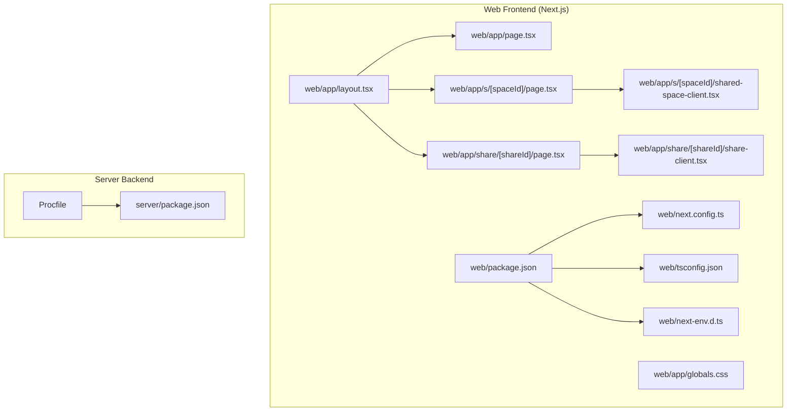
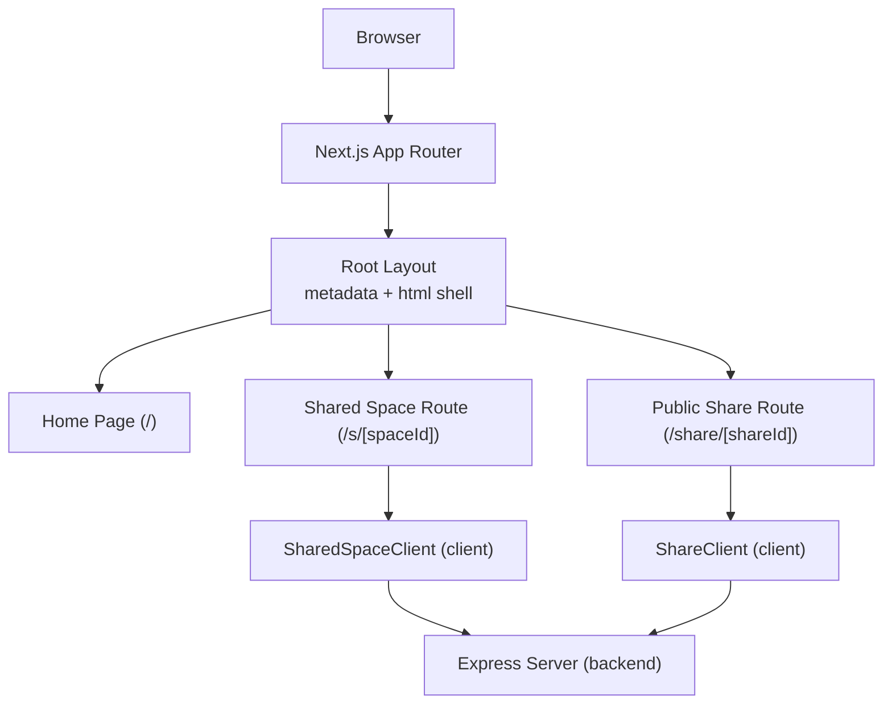
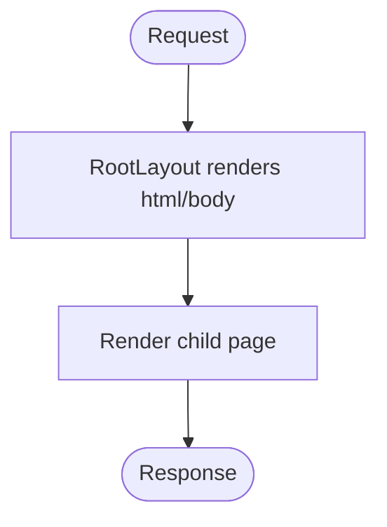
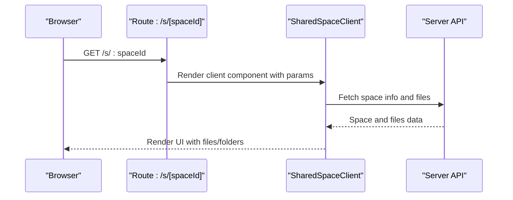
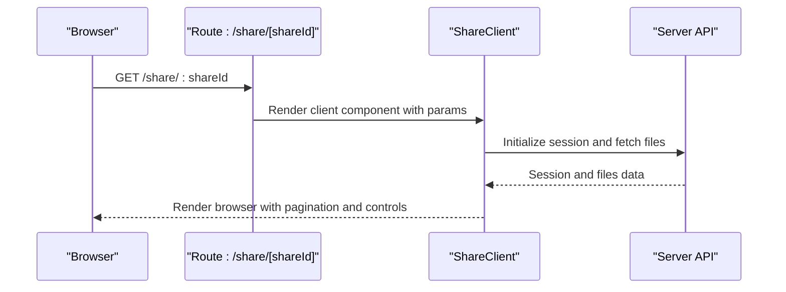
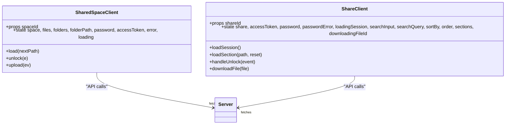
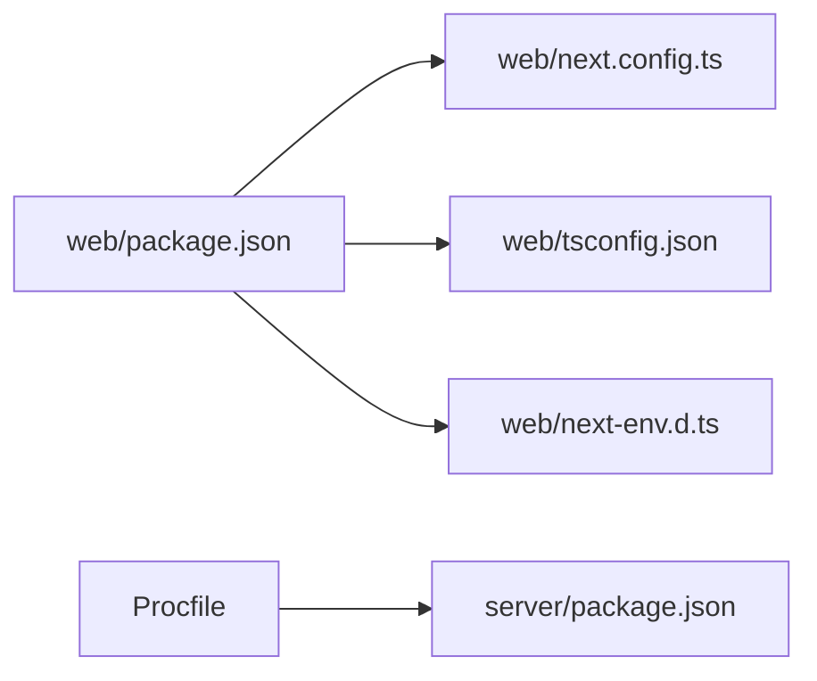

# Next.js Application Architecture

<cite>
**Referenced Files in This Document**
- [web/app/layout.tsx](file://web/app/layout.tsx)
- [web/app/page.tsx](file://web/app/page.tsx)
- [web/app/globals.css](file://web/app/globals.css)
- [web/app/s/[spaceId]/page.tsx](file://web/app/s/[spaceId]/page.tsx)
- [web/app/s/[spaceId]/shared-space-client.tsx](file://web/app/s/[spaceId]/shared-space-client.tsx)
- [web/app/share/[shareId]/page.tsx](file://web/app/share/[shareId]/page.tsx)
- [web/app/share/[shareId]/share-client.tsx](file://web/app/share/[shareId]/share-client.tsx)
- [web/next.config.ts](file://web/next.config.ts)
- [web/tsconfig.json](file://web/tsconfig.json)
- [web/package.json](file://web/package.json)
- [web/next-env.d.ts](file://web/next-env.d.ts)
- [server/package.json](file://server/package.json)
- [Procfile](file://Procfile)
</cite>

## Table of Contents
1. [Introduction](#introduction)
2. [Project Structure](#project-structure)
3. [Core Components](#core-components)
4. [Architecture Overview](#architecture-overview)
5. [Detailed Component Analysis](#detailed-component-analysis)
6. [Dependency Analysis](#dependency-analysis)
7. [Performance Considerations](#performance-considerations)
8. [Troubleshooting Guide](#troubleshooting-guide)
9. [Conclusion](#conclusion)

## Introduction
This document explains the Next.js application architecture for the web frontend, focusing on the app directory structure introduced in Next.js 13+, routing patterns, metadata configuration, global styling, and build configuration. It also covers how the root layout defines the application shell, how pages are organized under the app directory, and how Next.js handles server-side rendering (SSR) and static generation. Practical examples demonstrate the layout.tsx shell, route organization, and SSR behavior for shared spaces and public shares. Performance considerations, build optimization strategies, and deployment preparation are included to guide production readiness.

## Project Structure
The web application follows the Next.js app directory pattern with a root layout, global styles, and route-specific pages. The server backend is separate and deployed independently, while the Next.js frontend serves the public-facing UI.

**Diagram sources**
- [web/app/layout.tsx](file://web/app/layout.tsx#L1-L16)
- [web/app/page.tsx](file://web/app/page.tsx#L1-L9)
- [web/app/globals.css](file://web/app/globals.css#L1-L26)
- [web/app/s/[spaceId]/page.tsx](file://web/app/s/[spaceId]/page.tsx#L1-L7)
- [web/app/s/[spaceId]/shared-space-client.tsx](file://web/app/s/[spaceId]/shared-space-client.tsx#L1-L162)
- [web/app/share/[shareId]/page.tsx](file://web/app/share/[shareId]/page.tsx#L1-L7)
- [web/app/share/[shareId]/share-client.tsx](file://web/app/share/[shareId]/share-client.tsx#L1-L860)
- [web/next.config.ts](file://web/next.config.ts#L1-L8)
- [web/tsconfig.json](file://web/tsconfig.json#L1-L36)
- [web/package.json](file://web/package.json#L1-L21)
- [web/next-env.d.ts](file://web/next-env.d.ts#L1-L7)
- [server/package.json](file://server/package.json#L1-L57)
- [Procfile](file://Procfile#L1-L2)

**Section sources**
- [web/app/layout.tsx](file://web/app/layout.tsx#L1-L16)
- [web/app/page.tsx](file://web/app/page.tsx#L1-L9)
- [web/app/globals.css](file://web/app/globals.css#L1-L26)
- [web/app/s/[spaceId]/page.tsx](file://web/app/s/[spaceId]/page.tsx#L1-L7)
- [web/app/s/[spaceId]/shared-space-client.tsx](file://web/app/s/[spaceId]/shared-space-client.tsx#L1-L162)
- [web/app/share/[shareId]/page.tsx](file://web/app/share/[shareId]/page.tsx#L1-L7)
- [web/app/share/[shareId]/share-client.tsx](file://web/app/share/[shareId]/share-client.tsx#L1-L860)
- [web/next.config.ts](file://web/next.config.ts#L1-L8)
- [web/tsconfig.json](file://web/tsconfig.json#L1-L36)
- [web/package.json](file://web/package.json#L1-L21)
- [web/next-env.d.ts](file://web/next-env.d.ts#L1-L7)
- [server/package.json](file://server/package.json#L1-L57)
- [Procfile](file://Procfile#L1-L2)

## Core Components
- Root Layout: Defines the HTML shell and global metadata for the entire application.
- Global Styles: Provides theme variables and base styles applied across pages.
- Pages: Route handlers for the home page and public routes for shared spaces and shares.
- Client Components: Interactive components that fetch data and manage UI state.
- Build Configuration: Next.js configuration, TypeScript setup, and environment typing.

Key implementation references:
- Root layout and metadata: [web/app/layout.tsx](file://web/app/layout.tsx#L1-L16)
- Global CSS: [web/app/globals.css](file://web/app/globals.css#L1-L26)
- Home page: [web/app/page.tsx](file://web/app/page.tsx#L1-L9)
- Shared space route: [web/app/s/[spaceId]/page.tsx](file://web/app/s/[spaceId]/page.tsx#L1-L7)
- Shared space client: [web/app/s/[spaceId]/shared-space-client.tsx](file://web/app/s/[spaceId]/shared-space-client.tsx#L1-L162)
- Public share route: [web/app/share/[shareId]/page.tsx](file://web/app/share/[shareId]/page.tsx#L1-L7)
- Public share client: [web/app/share/[shareId]/share-client.tsx](file://web/app/share/[shareId]/share-client.tsx#L1-L860)
- Next.js config: [web/next.config.ts](file://web/next.config.ts#L1-L8)
- TypeScript config: [web/tsconfig.json](file://web/tsconfig.json#L1-L36)
- Environment types: [web/next-env.d.ts](file://web/next-env.d.ts#L1-L7)
- Frontend scripts: [web/package.json](file://web/package.json#L1-L21)
- Backend scripts: [server/package.json](file://server/package.json#L1-L57)
- Deployment: [Procfile](file://Procfile#L1-L2)

**Section sources**
- [web/app/layout.tsx](file://web/app/layout.tsx#L1-L16)
- [web/app/globals.css](file://web/app/globals.css#L1-L26)
- [web/app/page.tsx](file://web/app/page.tsx#L1-L9)
- [web/app/s/[spaceId]/page.tsx](file://web/app/s/[spaceId]/page.tsx#L1-L7)
- [web/app/s/[spaceId]/shared-space-client.tsx](file://web/app/s/[spaceId]/shared-space-client.tsx#L1-L162)
- [web/app/share/[shareId]/page.tsx](file://web/app/share/[shareId]/page.tsx#L1-L7)
- [web/app/share/[shareId]/share-client.tsx](file://web/app/share/[shareId]/share-client.tsx#L1-L860)
- [web/next.config.ts](file://web/next.config.ts#L1-L8)
- [web/tsconfig.json](file://web/tsconfig.json#L1-L36)
- [web/next-env.d.ts](file://web/next-env.d.ts#L1-L7)
- [web/package.json](file://web/package.json#L1-L21)
- [server/package.json](file://server/package.json#L1-L57)
- [Procfile](file://Procfile#L1-L2)

## Architecture Overview
The application uses Next.js app directory routing with a root layout that wraps all pages. Public routes serve shared spaces and public shares, fetching data client-side and rendering interactive UIs. The server backend provides APIs consumed by client components.

**Diagram sources**
- [web/app/layout.tsx](file://web/app/layout.tsx#L1-L16)
- [web/app/page.tsx](file://web/app/page.tsx#L1-L9)
- [web/app/s/[spaceId]/page.tsx](file://web/app/s/[spaceId]/page.tsx#L1-L7)
- [web/app/s/[spaceId]/shared-space-client.tsx](file://web/app/s/[spaceId]/shared-space-client.tsx#L1-L162)
- [web/app/share/[shareId]/page.tsx](file://web/app/share/[shareId]/page.tsx#L1-L7)
- [web/app/share/[shareId]/share-client.tsx](file://web/app/share/[shareId]/share-client.tsx#L1-L860)
- [server/package.json](file://server/package.json#L1-L57)

## Detailed Component Analysis

### Root Layout and Metadata
The root layout defines the HTML document shell and global metadata. It imports global CSS and renders child pages within the html/body structure.

**Diagram sources**
- [web/app/layout.tsx](file://web/app/layout.tsx#L1-L16)
- [web/app/globals.css](file://web/app/globals.css#L1-L26)

**Section sources**
- [web/app/layout.tsx](file://web/app/layout.tsx#L1-L16)
- [web/app/globals.css](file://web/app/globals.css#L1-L26)

### Home Page
The home page is a simple server-rendered page that introduces the application and directs users to shared spaces.

**Section sources**
- [web/app/page.tsx](file://web/app/page.tsx#L1-L9)

### Shared Space Route (/s/[spaceId])
This route handles public shared spaces. The server-side page resolves the dynamic parameter and delegates rendering to a client component that manages authentication, file listing, and uploads.

**Diagram sources**
- [web/app/s/[spaceId]/page.tsx](file://web/app/s/[spaceId]/page.tsx#L1-L7)
- [web/app/s/[spaceId]/shared-space-client.tsx](file://web/app/s/[spaceId]/shared-space-client.tsx#L1-L162)

**Section sources**
- [web/app/s/[spaceId]/page.tsx](file://web/app/s/[spaceId]/page.tsx#L1-L7)
- [web/app/s/[spaceId]/shared-space-client.tsx](file://web/app/s/[spaceId]/shared-space-client.tsx#L1-L162)

### Public Share Route (/share/[shareId])
This route serves public shares. The client component handles session initialization, optional password verification, pagination, and file downloads.

**Diagram sources**
- [web/app/share/[shareId]/page.tsx](file://web/app/share/[shareId]/page.tsx#L1-L7)
- [web/app/share/[shareId]/share-client.tsx](file://web/app/share/[shareId]/share-client.tsx#L1-L860)

**Section sources**
- [web/app/share/[shareId]/page.tsx](file://web/app/share/[shareId]/page.tsx#L1-L7)
- [web/app/share/[shareId]/share-client.tsx](file://web/app/share/[shareId]/share-client.tsx#L1-L860)

### Client Components: Data Fetching and State
Client components encapsulate data fetching, state management, and UI rendering. They use environment variables for API base URLs and implement robust error handling and loading states.

**Diagram sources**
- [web/app/s/[spaceId]/shared-space-client.tsx](file://web/app/s/[spaceId]/shared-space-client.tsx#L1-L162)
- [web/app/share/[shareId]/share-client.tsx](file://web/app/share/[shareId]/share-client.tsx#L1-L860)

**Section sources**
- [web/app/s/[spaceId]/shared-space-client.tsx](file://web/app/s/[spaceId]/shared-space-client.tsx#L1-L162)
- [web/app/share/[shareId]/share-client.tsx](file://web/app/share/[shareId]/share-client.tsx#L1-L860)

### Global Styling Approach
Global CSS defines theme variables and base styles applied to the entire application. The root layout imports the stylesheet to ensure consistent styling across pages.

**Section sources**
- [web/app/globals.css](file://web/app/globals.css#L1-L26)
- [web/app/layout.tsx](file://web/app/layout.tsx#L1-L16)

### Next.js Configuration and TypeScript Setup
- Next.js configuration enables strict mode for React.
- TypeScript compiler options target modern JS, enforce strictness, and integrate with Next's tooling.
- Environment types are generated and referenced for type-safe development.

**Section sources**
- [web/next.config.ts](file://web/next.config.ts#L1-L8)
- [web/tsconfig.json](file://web/tsconfig.json#L1-L36)
- [web/next-env.d.ts](file://web/next-env.d.ts#L1-L7)

## Dependency Analysis
The frontend depends on Next.js runtime and React, while the backend provides APIs consumed by client components. Scripts orchestrate local development and production builds.

**Diagram sources**
- [web/package.json](file://web/package.json#L1-L21)
- [web/next.config.ts](file://web/next.config.ts#L1-L8)
- [web/tsconfig.json](file://web/tsconfig.json#L1-L36)
- [web/next-env.d.ts](file://web/next-env.d.ts#L1-L7)
- [server/package.json](file://server/package.json#L1-L57)
- [Procfile](file://Procfile#L1-L2)

**Section sources**
- [web/package.json](file://web/package.json#L1-L21)
- [web/next.config.ts](file://web/next.config.ts#L1-L8)
- [web/tsconfig.json](file://web/tsconfig.json#L1-L36)
- [web/next-env.d.ts](file://web/next-env.d.ts#L1-L7)
- [server/package.json](file://server/package.json#L1-L57)
- [Procfile](file://Procfile#L1-L2)

## Performance Considerations
- Client components use concurrent data fetching and memoization to reduce re-renders and network overhead.
- Pagination and lazy loading improve perceived performance for large file lists.
- Environment variables centralize API base configuration, enabling easy optimization and CDN usage.
- Strict TypeScript configuration helps catch performance-related regressions early.
- Next.js build optimizations (enabled by default) minimize bundle sizes and improve caching.

[No sources needed since this section provides general guidance]

## Troubleshooting Guide
Common issues and resolutions:
- API connectivity: Verify NEXT_PUBLIC_API_BASE is set and reachable from the client.
- Authentication errors: Confirm access tokens and password verification flows return expected statuses.
- Network failures: Implement retry logic and user-friendly error messages in client components.
- Build errors: Ensure TypeScript and Next.js versions match project expectations.

**Section sources**
- [web/app/s/[spaceId]/shared-space-client.tsx](file://web/app/s/[spaceId]/shared-space-client.tsx#L1-L162)
- [web/app/share/[shareId]/share-client.tsx](file://web/app/share/[shareId]/share-client.tsx#L1-L860)
- [web/tsconfig.json](file://web/tsconfig.json#L1-L36)
- [web/next.config.ts](file://web/next.config.ts#L1-L8)

## Conclusion
The Next.js application leverages the app directory to organize routes, metadata, and global styles effectively. The root layout establishes a consistent shell, while client components deliver responsive, authenticated experiences for shared spaces and public shares. With strict TypeScript configuration, modular client logic, and clear separation from the backend server, the architecture supports maintainability, performance, and scalable deployment.