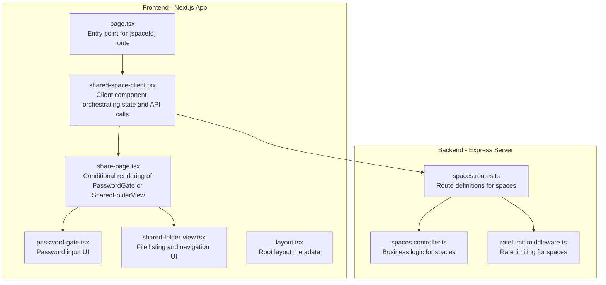
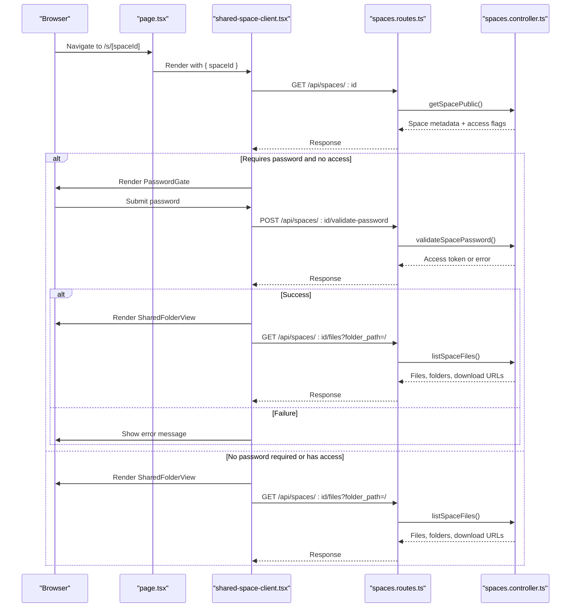
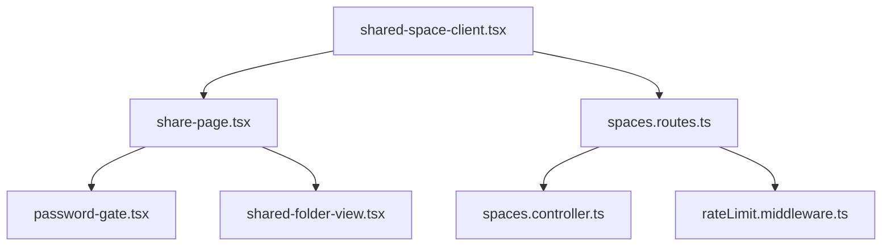

# Shared Space Interface Implementation

<cite>
**Referenced Files in This Document**
- [page.tsx](file://web/app/s/[spaceId]/page.tsx)
- [shared-space-client.tsx](file://web/app/s/[spaceId]/shared-space-client.tsx)
- [share-page.tsx](file://web/app/s/[spaceId]/share-page.tsx)
- [shared-folder-view.tsx](file://web/app/s/[spaceId]/shared-folder-view.tsx)
- [password-gate.tsx](file://web/app/s/[spaceId]/password-gate.tsx)
- [spaces.routes.ts](file://server/src/routes/spaces.routes.ts)
- [spaces.controller.ts](file://server/src/controllers/spaces.controller.ts)
- [rateLimit.middleware.ts](file://server/src/middlewares/rateLimit.middleware.ts)
- [layout.tsx](file://web/app/layout.tsx)
</cite>

## Table of Contents
1. [Introduction](#introduction)
2. [Project Structure](#project-structure)
3. [Core Components](#core-components)
4. [Architecture Overview](#architecture-overview)
5. [Detailed Component Analysis](#detailed-component-analysis)
6. [Dependency Analysis](#dependency-analysis)
7. [Performance Considerations](#performance-considerations)
8. [Security Considerations](#security-considerations)
9. [Troubleshooting Guide](#troubleshooting-guide)
10. [Conclusion](#conclusion)

## Introduction
This document explains the shared space interface implementation for collaborative file access and password-protected sharing. It covers the dynamic route pattern for shared spaces, the password gate access control mechanism, and the shared folder view components. The focus areas include the page.tsx entry point, share-page.tsx presentation logic, shared-folder-view.tsx file listing and interaction, and password-gate.tsx authentication flow. The documentation also addresses security considerations, access control mechanisms, and user experience optimization for public file sharing scenarios.

## Project Structure
The shared space feature is implemented in the Next.js app under the dynamic route group `web/app/s/[spaceId]`. The frontend components are complemented by server-side routes and controllers that enforce access control, handle password validation, and manage file listings and uploads.

**Diagram sources**
- [page.tsx](file://web/app/s/[spaceId]/page.tsx#L1-L7)
- [shared-space-client.tsx](file://web/app/s/[spaceId]/shared-space-client.tsx#L1-L162)
- [share-page.tsx](file://web/app/s/[spaceId]/share-page.tsx#L1-L73)
- [password-gate.tsx](file://web/app/s/[spaceId]/password-gate.tsx#L1-L97)
- [shared-folder-view.tsx](file://web/app/s/[spaceId]/shared-folder-view.tsx#L1-L143)
- [layout.tsx](file://web/app/layout.tsx#L1-L16)
- [spaces.routes.ts](file://server/src/routes/spaces.routes.ts#L1-L35)
- [spaces.controller.ts](file://server/src/controllers/spaces.controller.ts#L1-L498)
- [rateLimit.middleware.ts](file://server/src/middlewares/rateLimit.middleware.ts#L1-L47)

**Section sources**
- [page.tsx](file://web/app/s/[spaceId]/page.tsx#L1-L7)
- [shared-space-client.tsx](file://web/app/s/[spaceId]/shared-space-client.tsx#L1-L162)
- [share-page.tsx](file://web/app/s/[spaceId]/share-page.tsx#L1-L73)
- [password-gate.tsx](file://web/app/s/[spaceId]/password-gate.tsx#L1-L97)
- [shared-folder-view.tsx](file://web/app/s/[spaceId]/shared-folder-view.tsx#L1-L143)
- [layout.tsx](file://web/app/layout.tsx#L1-L16)
- [spaces.routes.ts](file://server/src/routes/spaces.routes.ts#L1-L35)
- [spaces.controller.ts](file://server/src/controllers/spaces.controller.ts#L1-L498)
- [rateLimit.middleware.ts](file://server/src/middlewares/rateLimit.middleware.ts#L1-L47)

## Core Components
- Dynamic Route Entry Point: page.tsx extracts the spaceId from route parameters and renders the client component.
- Client Orchestrator: shared-space-client.tsx manages state, loads space metadata and files, handles password validation, and coordinates uploads.
- Presentation Layer: share-page.tsx conditionally renders either the password gate or the shared folder view based on access state.
- UI Components:
  - password-gate.tsx: Provides a styled password input form with validation feedback.
  - shared-folder-view.tsx: Renders folder navigation, file listings, and download actions.

Key responsibilities:
- Dynamic route handling via Next.js dynamic route groups.
- Access control enforcement through password validation and JWT-based access tokens.
- File listing and navigation with folder traversal.
- Upload capability when enabled by space permissions.

**Section sources**
- [page.tsx](file://web/app/s/[spaceId]/page.tsx#L1-L7)
- [shared-space-client.tsx](file://web/app/s/[spaceId]/shared-space-client.tsx#L1-L162)
- [share-page.tsx](file://web/app/s/[spaceId]/share-page.tsx#L1-L73)
- [password-gate.tsx](file://web/app/s/[spaceId]/password-gate.tsx#L1-L97)
- [shared-folder-view.tsx](file://web/app/s/[spaceId]/shared-folder-view.tsx#L1-L143)

## Architecture Overview
The shared space architecture follows a client-driven pattern with server-side access control and rate limiting. The client component fetches space metadata and file listings, validates passwords, and maintains UI state. The server enforces permissions, expiration, and rate limits.

**Diagram sources**
- [page.tsx](file://web/app/s/[spaceId]/page.tsx#L1-L7)
- [shared-space-client.tsx](file://web/app/s/[spaceId]/shared-space-client.tsx#L1-L162)
- [spaces.routes.ts](file://server/src/routes/spaces.routes.ts#L1-L35)
- [spaces.controller.ts](file://server/src/controllers/spaces.controller.ts#L1-L498)

## Detailed Component Analysis

### Dynamic Route Pattern and Entry Point
- The dynamic route group `web/app/s/[spaceId]` captures the space identifier from the URL.
- page.tsx awaits the resolved route parameters and passes the spaceId to the client component.
- This pattern enables server-side rendering of the client component with the spaceId available.

Implementation highlights:
- Parameter extraction and async resolution.
- Delegation to the client component for state management and API interactions.

**Section sources**
- [page.tsx](file://web/app/s/[spaceId]/page.tsx#L1-L7)

### Client Component Orchestration
shared-space-client.tsx is the central orchestrator for shared space interactions:
- State management: space metadata, files, folders, current folder path, password, access token, loading/error states.
- API integration: fetches space metadata and file listings, validates passwords, and handles uploads.
- Conditional rendering: delegates to share-page.tsx with props derived from state.
- Access control: sets access token upon successful password validation and re-fetches data.

Key flows:
- Initial load: fetches space and files for the current folder path.
- Password validation: posts the password to the server, receives an access token, updates state, and reloads data.
- Upload: constructs a multipart form and posts to the upload endpoint.

```mermaid
flowchart TD
Start(["Client Mount"]) --> Load["load(folderPath)"]
Load --> FetchSpace["Fetch /api/spaces/:id"]
Load --> FetchFiles["Fetch /api/spaces/:id/files?folder_path"]
FetchSpace --> SpaceOK{"Space OK?"}
SpaceOK --> |No| HandleSpaceError["Set error and loading=false"]
SpaceOK --> |Yes| FetchFiles
FetchFiles --> FilesOK{"Files OK?"}
FilesOK --> |No & 401| ShowPasswordGate["Set empty files/folders and show password gate"]
FilesOK --> |No| HandleFilesError["Set error and loading=false"]
FilesOK --> |Yes| UpdateState["Update space, files, folders"]
UpdateState --> Render["Render SharePage"]
UnlockStart(["Unlock Password"]) --> Validate["POST /api/spaces/:id/validate-password"]
Validate --> ValidateOK{"Valid?"}
ValidateOK --> |No| ShowUnlockError["Set error and loading=false"]
ValidateOK --> |Yes| SetToken["Set access token and has_access=true"]
SetToken --> Reload["Reload data with new token"]
```

**Diagram sources**
- [shared-space-client.tsx](file://web/app/s/[spaceId]/shared-space-client.tsx#L1-L162)
- [spaces.controller.ts](file://server/src/controllers/spaces.controller.ts#L255-L295)

**Section sources**
- [shared-space-client.tsx](file://web/app/s/[spaceId]/shared-space-client.tsx#L1-L162)

### Presentation Logic: Conditional Rendering
share-page.tsx implements the presentation logic:
- Determines whether to render the password gate or the shared folder view based on space requires_password and has_access flags.
- Passes props for UI components, including callbacks for navigation, upload, and password handling.

Behavioral logic:
- If password-protected and no access, render PasswordGate with loading, error, and form handlers.
- Otherwise, render SharedFolderView with navigation controls and file listing.

**Section sources**
- [share-page.tsx](file://web/app/s/[spaceId]/share-page.tsx#L1-L73)

### Password Gate Component
password-gate.tsx provides the authentication UI:
- Displays the shared folder name and a subtitle prompting for the password.
- Form input bound to the parent's password state and submit handler.
- Loading state and error messaging for user feedback.

Security considerations:
- Uses password input type and disables auto-fill hints to reduce exposure.
- Communicates errors returned by the server after validation attempts.

**Section sources**
- [password-gate.tsx](file://web/app/s/[spaceId]/password-gate.tsx#L1-L97)

### Shared Folder View Component
shared-folder-view.tsx renders the file listing and navigation:
- Header with brand, title, and current path.
- Optional upload button when allowed by space permissions.
- Error and loading indicators.
- Navigation row to go up and clickable rows for subfolders.
- File rows with names and optional download links when allowed.

Interaction patterns:
- onUp navigates to the parent folder.
- onOpenFolder updates the current folder path.
- onUpload triggers the upload flow via the client component.

**Section sources**
- [shared-folder-view.tsx](file://web/app/s/[spaceId]/shared-folder-view.tsx#L1-L143)

### Backend Routing and Controllers
The server enforces access control and provides endpoints for shared spaces:
- Route definitions: GET /spaces/:id, POST /spaces/:id/validate-password, GET /spaces/:id/files, POST /spaces/:id/upload.
- Controller logic:
  - getSpacePublic: checks expiration, determines requires_password, and sets has_access accordingly.
  - validateSpacePassword: verifies password hash, signs access token, and sets a secure cookie.
  - listSpaceFiles: enforces access control, lists files and child folders, and generates signed download URLs when allowed.
  - uploadToSpace: validates file size/type, ensures upload permission, and stores files via Telegram.

Rate limiting:
- spaceViewLimiter: throttles public views.
- spacePasswordLimiter: restricts password attempts.
- spaceUploadLimiter: limits upload frequency.

**Section sources**
- [spaces.routes.ts](file://server/src/routes/spaces.routes.ts#L1-L35)
- [spaces.controller.ts](file://server/src/controllers/spaces.controller.ts#L218-L355)
- [rateLimit.middleware.ts](file://server/src/middlewares/rateLimit.middleware.ts#L24-L40)

## Dependency Analysis
The frontend and backend components interact through well-defined API boundaries. The client depends on the server for space metadata, file listings, password validation, and uploads. The server enforces access control and rate limits.

**Diagram sources**
- [shared-space-client.tsx](file://web/app/s/[spaceId]/shared-space-client.tsx#L1-L162)
- [share-page.tsx](file://web/app/s/[spaceId]/share-page.tsx#L1-L73)
- [password-gate.tsx](file://web/app/s/[spaceId]/password-gate.tsx#L1-L97)
- [shared-folder-view.tsx](file://web/app/s/[spaceId]/shared-folder-view.tsx#L1-L143)
- [spaces.routes.ts](file://server/src/routes/spaces.routes.ts#L1-L35)
- [spaces.controller.ts](file://server/src/controllers/spaces.controller.ts#L1-L498)
- [rateLimit.middleware.ts](file://server/src/middlewares/rateLimit.middleware.ts#L1-L47)

**Section sources**
- [shared-space-client.tsx](file://web/app/s/[spaceId]/shared-space-client.tsx#L1-L162)
- [share-page.tsx](file://web/app/s/[spaceId]/share-page.tsx#L1-L73)
- [spaces.routes.ts](file://server/src/routes/spaces.routes.ts#L1-L35)
- [spaces.controller.ts](file://server/src/controllers/spaces.controller.ts#L1-L498)
- [rateLimit.middleware.ts](file://server/src/middlewares/rateLimit.middleware.ts#L1-L47)

## Performance Considerations
- Parallel API calls: The client fetches space metadata and files concurrently to reduce latency.
- Minimal re-renders: Props are memoized where appropriate to avoid unnecessary re-renders.
- Rate limiting: Server-side rate limits prevent abuse and maintain responsiveness for legitimate users.
- Efficient file listing: The controller computes child folders and filters results server-side to minimize payload sizes.

## Security Considerations
- Access control:
  - requireSpaceAccess ensures the space exists, is not expired, and the requester has validated access via password or existing token.
  - hasSpacePasswordAccess verifies the JWT-based access token against the configured secret.
- Password validation:
  - validateSpacePassword uses bcrypt comparison and rate limits attempts.
  - On success, the server signs an access token and sets a secure cookie.
- Token-based downloads:
  - Signed download tokens are generated with short TTLs and verified before streaming files.
- Rate limiting:
  - spacePasswordLimiter restricts password attempts.
  - spaceViewLimiter throttles public views.
  - spaceUploadLimiter controls upload frequency.

Best practices:
- Enforce expiration dates on shared spaces.
- Use HTTPS and secure cookies in production.
- Sanitize and validate folder paths to prevent directory traversal.
- Monitor access logs for suspicious activity.

**Section sources**
- [spaces.controller.ts](file://server/src/controllers/spaces.controller.ts#L128-L159)
- [spaces.controller.ts](file://server/src/controllers/spaces.controller.ts#L255-L295)
- [spaces.controller.ts](file://server/src/controllers/spaces.controller.ts#L427-L497)
- [rateLimit.middleware.ts](file://server/src/middlewares/rateLimit.middleware.ts#L30-L40)

## Troubleshooting Guide
Common issues and resolutions:
- Share not found: Occurs when the space ID is invalid or missing. Verify the link and ensure the space exists.
- Link expired: When expires_at is in the past, the server responds with a 410 error. Regenerate the link with a future expiration.
- Incorrect password: After several failed attempts, the server may rate-limit further attempts. Advise users to wait and try again.
- Unauthorized access: Without proper access token or password, file listing returns 401. Ensure password validation succeeds and the token is included in subsequent requests.
- Upload failures: Check file size limits, allowed MIME types, and upload permissions. Ensure the access token is present in headers.

Operational tips:
- Use the error prop to surface meaningful messages to users.
- Implement retry logic for transient network errors.
- Log access attempts and failures for monitoring and debugging.

**Section sources**
- [shared-space-client.tsx](file://web/app/s/[spaceId]/shared-space-client.tsx#L54-L70)
- [shared-space-client.tsx](file://web/app/s/[spaceId]/shared-space-client.tsx#L103-L121)
- [spaces.controller.ts](file://server/src/controllers/spaces.controller.ts#L133-L158)
- [spaces.controller.ts](file://server/src/controllers/spaces.controller.ts#L264-L294)

## Conclusion
The shared space interface combines a clean dynamic route pattern with robust client orchestration and server-side access control. The modular UI components enable a smooth user experience for browsing, downloading, and uploading files in password-protected shared spaces. The backend enforces security through JWT-based access tokens, rate limits, and signed download URLs, ensuring both usability and safety for public file sharing scenarios.