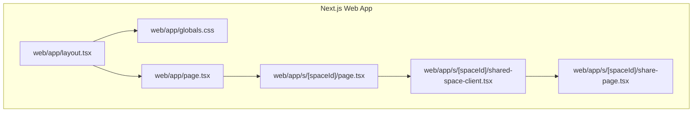
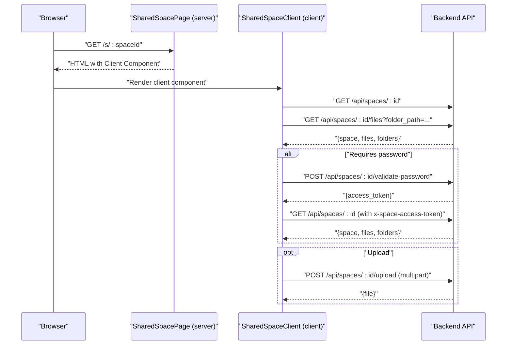
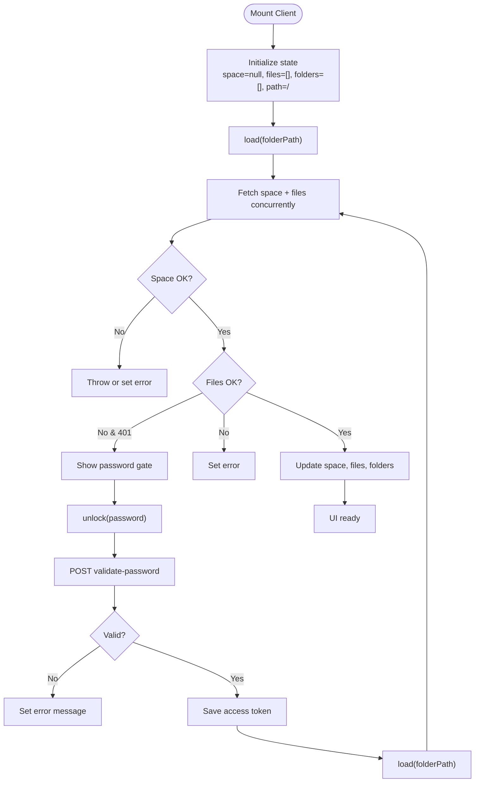
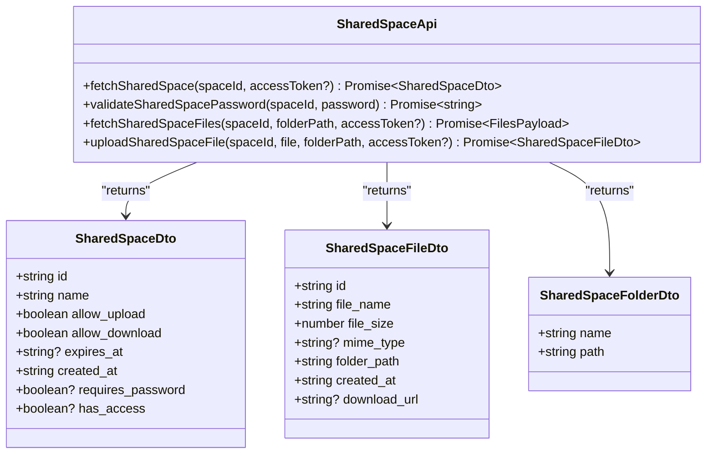
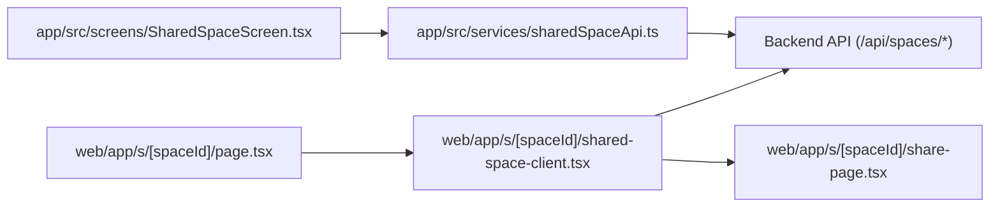

# Web Application Integration

<cite>
**Referenced Files in This Document**
- [layout.tsx](file://web/app/layout.tsx)
- [page.tsx](file://web/app/page.tsx)
- [next.config.ts](file://web/next.config.ts)
- [globals.css](file://web/app/globals.css)
- [page.tsx](file://web/app/s/[spaceId]/page.tsx)
- [shared-space-client.tsx](file://web/app/s/[spaceId]/shared-space-client.tsx)
- [share-page.tsx](file://web/app/s/[spaceId]/share-page.tsx)
- [shared-space-api.ts](file://app/src/services/sharedSpaceApi.ts)
- [shared-space-screen.tsx](file://app/src/screens/SharedSpaceScreen.tsx)
- [password-gate-component.tsx](file://app/src/components/PasswordGateComponent.tsx)
- [file-list-component.tsx](file://app/src/components/FileListComponent.tsx)
- [api-client.ts](file://app/src/services/apiClient.ts)
- [auth-context.tsx](file://app/src/context/AuthContext.tsx)
</cite>

## Table of Contents
1. [Introduction](#introduction)
2. [Project Structure](#project-structure)
3. [Core Components](#core-components)
4. [Architecture Overview](#architecture-overview)
5. [Detailed Component Analysis](#detailed-component-analysis)
6. [Dependency Analysis](#dependency-analysis)
7. [Performance Considerations](#performance-considerations)
8. [Troubleshooting Guide](#troubleshooting-guide)
9. [Conclusion](#conclusion)
10. [Appendices](#appendices)

## Introduction
This document explains the web application integration for the Next.js-based frontend focused on shared space access. It covers the Next.js application structure, the shared space client-side implementation, and cross-platform state management patterns between web and mobile. It also documents server-side rendering considerations, SEO metadata, and integration with the backend API, along with guidance for extending functionality and maintaining consistency across platforms.

## Project Structure
The web application resides under the web directory and follows Next.js App Router conventions. Key areas:
- Root layout and metadata configuration
- Global styles
- Dynamic route for shared spaces
- Client component for shared space interactions
- Shared space presentation shell

**Diagram sources**
- [layout.tsx](file://web/app/layout.tsx#L1-L16)
- [globals.css](file://web/app/globals.css#L1-L26)
- [page.tsx](file://web/app/page.tsx#L1-L9)
- [page.tsx](file://web/app/s/[spaceId]/page.tsx#L1-L7)
- [shared-space-client.tsx](file://web/app/s/[spaceId]/shared-space-client.tsx#L1-L162)
- [share-page.tsx](file://web/app/s/[spaceId]/share-page.tsx)

**Section sources**
- [layout.tsx](file://web/app/layout.tsx#L1-L16)
- [globals.css](file://web/app/globals.css#L1-L26)
- [page.tsx](file://web/app/page.tsx#L1-L9)
- [page.tsx](file://web/app/s/[spaceId]/page.tsx#L1-L7)
- [shared-space-client.tsx](file://web/app/s/[spaceId]/shared-space-client.tsx#L1-L162)

## Core Components
- Root layout and metadata: Defines site metadata and wraps children in HTML.
- Global styles: Provides CSS variables and typography for the entire app.
- Shared space page: Dynamic route handler that renders the client component.
- Shared space client: Client-side state machine for shared space access, password gating, file/folder listing, and uploads.
- Shared space presentation: Reusable UI shell for shared space views.

Key responsibilities:
- Client-side state management for space metadata, files, folders, current path, password, and access token.
- Asynchronous loading and error handling for space and file listings.
- Password validation and access token propagation.
- File upload flow with multipart form submission.

**Section sources**
- [layout.tsx](file://web/app/layout.tsx#L1-L16)
- [globals.css](file://web/app/globals.css#L1-L26)
- [page.tsx](file://web/app/s/[spaceId]/page.tsx#L1-L7)
- [shared-space-client.tsx](file://web/app/s/[spaceId]/shared-space-client.tsx#L1-L162)
- [share-page.tsx](file://web/app/s/[spaceId]/share-page.tsx)

## Architecture Overview
The web app integrates with the backend API to render shared spaces. The client component orchestrates:
- Fetching space metadata and file listing concurrently
- Handling password-protected spaces
- Managing access tokens via request headers
- Uploading files to the current folder path

**Diagram sources**
- [page.tsx](file://web/app/s/[spaceId]/page.tsx#L1-L7)
- [shared-space-client.tsx](file://web/app/s/[spaceId]/shared-space-client.tsx#L1-L162)

## Detailed Component Analysis

### Next.js Root Layout and Metadata
- Sets site title and description for SEO.
- Wraps children in html/body for proper document structure.

**Section sources**
- [layout.tsx](file://web/app/layout.tsx#L1-L16)

### Global Styles
- CSS variables define theme tokens.
- Base typography and background gradient for visual consistency.

**Section sources**
- [globals.css](file://web/app/globals.css#L1-L26)

### Shared Space Dynamic Route
- Server component resolves the dynamic segment and renders the client component.
- Passes the spaceId prop to the client.

**Section sources**
- [page.tsx](file://web/app/s/[spaceId]/page.tsx#L1-L7)

### Shared Space Client Component
Responsibilities:
- Manage state: space, files, folders, current folder path, password, access token, loading, and errors.
- Concurrently fetch space metadata and files.
- Handle password validation and propagate access token.
- Upload files to the current folder path.
- Provide callbacks for navigation and actions to the shared page shell.

**Diagram sources**
- [shared-space-client.tsx](file://web/app/s/[spaceId]/shared-space-client.tsx#L1-L162)

**Section sources**
- [shared-space-client.tsx](file://web/app/s/[spaceId]/shared-space-client.tsx#L1-L162)

### Shared Space Presentation Shell
- Receives props from the client component (space, files, folders, loading, error, callbacks).
- Renders the UI for shared space content, including navigation, upload controls, and file listing.

Note: The implementation of the presentation shell is referenced here for completeness; the actual file path is provided for traceability.

**Section sources**
- [share-page.tsx](file://web/app/s/[spaceId]/share-page.tsx)

### Cross-Platform Shared Space API
- Mobile service module defines DTOs and functions to fetch shared space metadata, validate passwords, list files and folders, and upload files.
- Uses an API client with token injection and retry logic.
- Exposes typed interfaces for space, file, and folder entities.

**Diagram sources**
- [shared-space-api.ts](file://app/src/services/sharedSpaceApi.ts#L1-L81)

**Section sources**
- [shared-space-api.ts](file://app/src/services/sharedSpaceApi.ts#L1-L81)

### Mobile Shared Space Screen and UI Components
- SharedSpaceScreen manages state, loads data, handles password gates, and triggers downloads.
- PasswordGateComponent renders a secure input and submits the password to unlock the space.
- FileListComponent renders folders and files, supports navigation and download actions.

These components demonstrate the shared state management patterns used on the web client.

**Section sources**
- [shared-space-screen.tsx](file://app/src/screens/SharedSpaceScreen.tsx#L1-L282)
- [password-gate-component.tsx](file://app/src/components/PasswordGateComponent.tsx#L1-L91)
- [file-list-component.tsx](file://app/src/components/FileListComponent.tsx#L1-L89)

### API Client and Authentication Context
- apiClient centralizes base URL determination, token injection, logging, and retry logic.
- AuthContext manages authentication state, persistence, and lifecycle on the mobile app.

While primarily used on the mobile app, these patterns inform consistent client-side behavior across platforms.

**Section sources**
- [api-client.ts](file://app/src/services/apiClient.ts#L1-L164)
- [auth-context.tsx](file://app/src/context/AuthContext.tsx#L1-L98)

## Dependency Analysis
- The server route depends on the client component to hydrate the UI.
- The client component depends on the backend API for space metadata, files, password validation, and uploads.
- The mobile app shares the same API service definitions and state management patterns, enabling cross-platform consistency.

**Diagram sources**
- [page.tsx](file://web/app/s/[spaceId]/page.tsx#L1-L7)
- [shared-space-client.tsx](file://web/app/s/[spaceId]/shared-space-client.tsx#L1-L162)
- [shared-space-api.ts](file://app/src/services/sharedSpaceApi.ts#L1-L81)

**Section sources**
- [page.tsx](file://web/app/s/[spaceId]/page.tsx#L1-L7)
- [shared-space-client.tsx](file://web/app/s/[spaceId]/shared-space-client.tsx#L1-L162)
- [shared-space-api.ts](file://app/src/services/sharedSpaceApi.ts#L1-L81)

## Performance Considerations
- Concurrent requests: The client component fetches space metadata and files in parallel to reduce latency.
- Minimal re-renders: Uses memoization and stable callbacks to avoid unnecessary updates.
- Environment-aware API base: Ensures correct backend endpoint resolution for development and production.
- Upload timeouts: Upload client has extended timeouts suitable for large files.

Recommendations:
- Enable Next.js image optimization and static exports where appropriate.
- Consider caching strategies for file listings and space metadata.
- Lazy-load heavy UI components if needed.
- Monitor API retries and adjust retry thresholds based on network conditions.

**Section sources**
- [shared-space-client.tsx](file://web/app/s/[spaceId]/shared-space-client.tsx#L47-L50)
- [api-client.ts](file://app/src/services/apiClient.ts#L36-L42)

## Troubleshooting Guide
Common issues and resolutions:
- Password validation failures: The client sets specific error messages for invalid password, not found, expired, and rate-limited scenarios.
- Access token propagation: Ensure the access token header is included in subsequent requests after successful validation.
- Upload failures: Verify multipart form data and that the current folder path is correct.
- Network errors: Confirm API base URL and CORS configuration on the backend.

Operational tips:
- Use browser dev tools to inspect network requests and responses.
- Log and display user-friendly error messages for better UX.
- Validate backend endpoints and headers consistently across web and mobile clients.

**Section sources**
- [shared-space-client.tsx](file://web/app/s/[spaceId]/shared-space-client.tsx#L103-L121)
- [shared-space-client.tsx](file://web/app/s/[spaceId]/shared-space-client.tsx#L137-L142)

## Conclusion
The web application integrates seamlessly with the shared space backend through a client-driven architecture. By leveraging concurrent fetching, robust error handling, and consistent state management patterns, it delivers a responsive and reliable user experience. The shared API definitions and UI components enable cross-platform parity between web and mobile implementations.

## Appendices

### SSR/SSG Configuration
- Strict mode is enabled for improved error detection.
- The shared space page is rendered as a server component that delegates to a client component for interactivity.

**Section sources**
- [next.config.ts](file://web/next.config.ts#L1-L8)
- [page.tsx](file://web/app/s/[spaceId]/page.tsx#L1-L7)

### SEO Optimization Strategies
- Site metadata is defined at the root layout level for title and description.
- Canonical URLs and structured data can be added at the page level if needed.

**Section sources**
- [layout.tsx](file://web/app/layout.tsx#L4-L7)

### Client-Side Routing and Navigation
- Dynamic route pattern for shared spaces ensures predictable URLs.
- The client component exposes callbacks for navigating up and into folders.

**Section sources**
- [page.tsx](file://web/app/s/[spaceId]/page.tsx#L1-L7)
- [shared-space-client.tsx](file://web/app/s/[spaceId]/shared-space-client.tsx#L156-L158)

### State Synchronization Between Web and Mobile
- Shared DTOs and API functions ensure consistent data contracts.
- UI components (e.g., file list) mirror structure across platforms for predictable behavior.

**Section sources**
- [shared-space-api.ts](file://app/src/services/sharedSpaceApi.ts#L3-L27)
- [file-list-component.tsx](file://app/src/components/FileListComponent.tsx#L1-L89)