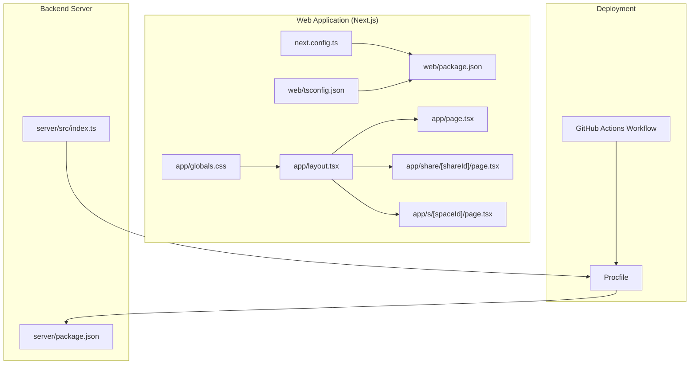
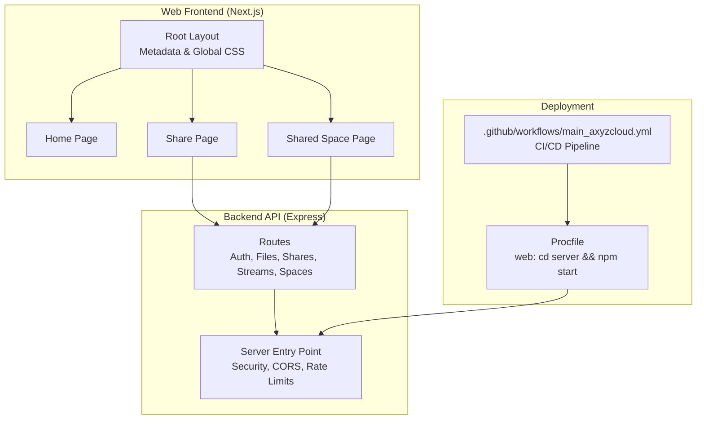
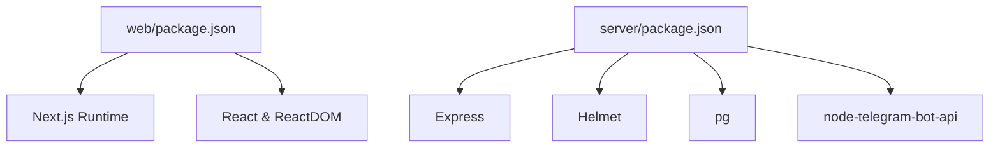

# Web Deployment and Optimization

<cite>
**Referenced Files in This Document**
- [next.config.ts](file://web/next.config.ts)
- [package.json](file://web/package.json)
- [tsconfig.json](file://web/tsconfig.json)
- [layout.tsx](file://web/app/layout.tsx)
- [page.tsx](file://web/app/page.tsx)
- [s/[spaceId]/page.tsx](file://web/app/s/[spaceId]/page.tsx)
- [share/[shareId]/page.tsx](file://web/app/share/[shareId]/page.tsx)
- [globals.css](file://web/app/globals.css)
- [Procfile](file://Procfile)
- [server package.json](file://server/package.json)
- [server index.ts](file://server/src/index.ts)
- [.github workflows main_axyzcloud.yml](file://.github/workflows/main_axyzcloud.yml)
- [README.md](file://README.md)
</cite>

## Table of Contents
1. [Introduction](#introduction)
2. [Project Structure](#project-structure)
3. [Core Components](#core-components)
4. [Architecture Overview](#architecture-overview)
5. [Detailed Component Analysis](#detailed-component-analysis)
6. [Dependency Analysis](#dependency-analysis)
7. [Performance Considerations](#performance-considerations)
8. [Troubleshooting Guide](#troubleshooting-guide)
9. [Conclusion](#conclusion)
10. [Appendices](#appendices)

## Introduction
This document focuses on web deployment and optimization for the Next.js-based web application. It explains the current Next.js build configuration, outlines performance optimization techniques (static generation, code splitting, image optimization, and bundle analysis), and provides production deployment strategies aligned with the existing repository setup. It also covers caching strategies, CDN integration considerations, and monitoring setup for the web interface.

## Project Structure
The web application resides under the web directory and uses Next.js App Router. The repository includes:
- Next.js configuration and scripts
- App Router pages for shared spaces and public shares
- Global styles and metadata
- A Procfile for platform deployment
- A GitHub Actions workflow for CI/CD
- A Node.js server for backend APIs

**Diagram sources**
- [next.config.ts](file://web/next.config.ts#L1-L8)
- [package.json](file://web/package.json#L1-L21)
- [tsconfig.json](file://web/tsconfig.json#L1-L36)
- [layout.tsx](file://web/app/layout.tsx#L1-L16)
- [page.tsx](file://web/app/page.tsx#L1-L9)
- [share/[shareId]/page.tsx](file://web/app/share/[shareId]/page.tsx#L1-L7)
- [s/[spaceId]/page.tsx](file://web/app/s/[spaceId]/page.tsx#L1-L7)
- [globals.css](file://web/app/globals.css#L1-L184)
- [Procfile](file://Procfile#L1-L2)
- [.github workflows main_axyzcloud.yml](file://.github/workflows/main_axyzcloud.yml#L1-L71)
- [server package.json](file://server/package.json#L1-L57)
- [server index.ts](file://server/src/index.ts#L1-L315)

**Section sources**
- [next.config.ts](file://web/next.config.ts#L1-L8)
- [package.json](file://web/package.json#L1-L21)
- [tsconfig.json](file://web/tsconfig.json#L1-L36)
- [layout.tsx](file://web/app/layout.tsx#L1-L16)
- [page.tsx](file://web/app/page.tsx#L1-L9)
- [share/[shareId]/page.tsx](file://web/app/share/[shareId]/page.tsx#L1-L7)
- [s/[spaceId]/page.tsx](file://web/app/s/[spaceId]/page.tsx#L1-L7)
- [globals.css](file://web/app/globals.css#L1-L184)
- [Procfile](file://Procfile#L1-L2)
- [.github workflows main_axyzcloud.yml](file://.github/workflows/main_axyzcloud.yml#L1-L71)
- [server package.json](file://server/package.json#L1-L57)
- [server index.ts](file://server/src/index.ts#L1-L315)

## Core Components
- Next.js configuration: Minimal configuration currently enables React Strict Mode.
- Build scripts: Dev, build, and start commands are defined for the web app.
- App Router pages: Root page, public share page, and shared space page.
- Global styles and metadata: Centralized CSS variables and layout metadata.
- Deployment artifacts: Procfile and GitHub Actions workflow for automated builds and deployments.
- Backend server: Express server with security, CORS, rate limiting, and logging.

Key configuration highlights:
- Next.js runtime: React 19 with Next 15.5.3.
- TypeScript bundler resolution and strictness configured.
- React Strict Mode enabled for early detection of unsafe lifecycles.

**Section sources**
- [next.config.ts](file://web/next.config.ts#L1-L8)
- [package.json](file://web/package.json#L1-L21)
- [tsconfig.json](file://web/tsconfig.json#L1-L36)
- [layout.tsx](file://web/app/layout.tsx#L1-L16)
- [page.tsx](file://web/app/page.tsx#L1-L9)
- [share/[shareId]/page.tsx](file://web/app/share/[shareId]/page.tsx#L1-L7)
- [s/[spaceId]/page.tsx](file://web/app/s/[spaceId]/page.tsx#L1-L7)
- [globals.css](file://web/app/globals.css#L1-L184)
- [Procfile](file://Procfile#L1-L2)
- [server package.json](file://server/package.json#L1-L57)

## Architecture Overview
The web application is a Next.js frontend that serves public share and shared space views. The backend server exposes REST endpoints and handles file streaming, authentication, and shared link rendering. The deployment pipeline builds and deploys the application using GitHub Actions and a Procfile for platform execution.

**Diagram sources**
- [layout.tsx](file://web/app/layout.tsx#L1-L16)
- [page.tsx](file://web/app/page.tsx#L1-L9)
- [share/[shareId]/page.tsx](file://web/app/share/[shareId]/page.tsx#L1-L7)
- [s/[spaceId]/page.tsx](file://web/app/s/[spaceId]/page.tsx#L1-L7)
- [server index.ts](file://server/src/index.ts#L1-L315)
- [.github workflows main_axyzcloud.yml](file://.github/workflows/main_axyzcloud.yml#L1-L71)
- [Procfile](file://Procfile#L1-L2)

## Detailed Component Analysis

### Next.js Build Configuration and Scripts
- next.config.ts: Enables React Strict Mode to surface potential issues early.
- package.json: Defines dev, build, and start scripts for the web app.
- tsconfig.json: Sets strict TypeScript compilation, module resolution via bundler, and JSX preservation for Next.js.

Practical implications:
- Strict Mode helps detect unsafe lifecycle patterns and extra renders.
- Bundler module resolution improves tree-shaking and import performance.
- Incremental builds reduce rebuild times during development.

**Section sources**
- [next.config.ts](file://web/next.config.ts#L1-L8)
- [package.json](file://web/package.json#L1-L21)
- [tsconfig.json](file://web/tsconfig.json#L1-L36)

### App Router Pages and Metadata
- Root layout sets site metadata and global CSS.
- Home page provides a placeholder landing with guidance for accessing shared spaces.
- Share and space pages render client components after extracting route parameters.

Recommendations:
- Use dynamic metadata generation for social previews and SEO.
- Consider static generation for predictable share pages to improve performance.

**Section sources**
- [layout.tsx](file://web/app/layout.tsx#L1-L16)
- [page.tsx](file://web/app/page.tsx#L1-L9)
- [share/[shareId]/page.tsx](file://web/app/share/[shareId]/page.tsx#L1-L7)
- [s/[spaceId]/page.tsx](file://web/app/s/[spaceId]/page.tsx#L1-L7)

### Global Styles and Theming
- globals.css defines CSS variables for brand tokens, spacing, typography, shadows, and transitions.
- Includes reusable animations and focus-visible styles for accessibility.

Recommendations:
- Keep critical CSS minimal and defer non-critical styles.
- Consider CSS-in-JS or modular CSS for component-level scoping.

**Section sources**
- [globals.css](file://web/app/globals.css#L1-L184)

### Backend Server Security, CORS, and Rate Limiting
- Helmet CSP configuration with nonce injection for inline scripts.
- Flexible CORS handling with dynamic origin checks and credential support.
- Global rate limiter and stricter auth limiter to mitigate abuse.
- Health check endpoint for platform keep-alive compatibility.

Recommendations:
- Align frontend caching headers with backend CORS and CSP policies.
- Use signed tokens for share URLs to avoid exposing internal IDs.

**Section sources**
- [server index.ts](file://server/src/index.ts#L46-L77)
- [server index.ts](file://server/src/index.ts#L85-L98)
- [server index.ts](file://server/src/index.ts#L100-L108)
- [server index.ts](file://server/src/index.ts#L222-L231)

### Deployment Artifacts and CI/CD
- Procfile: Starts the server from the server directory.
- GitHub Actions workflow: Builds the project, zips artifacts, and deploys to an Azure Web App.

Recommendations:
- Add environment-specific configuration and secrets management.
- Integrate frontend build outputs if deploying a static Next.js app.

**Section sources**
- [Procfile](file://Procfile#L1-L2)
- [.github workflows main_axyzcloud.yml](file://.github/workflows/main_axyzcloud.yml#L1-L71)

## Dependency Analysis
The web application depends on Next.js and React. The server depends on Express, security libraries, database drivers, and Telegram integration. The deployment pipeline relies on Node.js 20 and GitHub Actions.

**Diagram sources**
- [package.json](file://web/package.json#L1-L21)
- [server package.json](file://server/package.json#L1-L57)

**Section sources**
- [package.json](file://web/package.json#L1-L21)
- [server package.json](file://server/package.json#L1-L57)

## Performance Considerations
This section outlines practical techniques to optimize the web application’s performance, aligned with the current codebase and deployment setup.

- Static Generation and ISR
  - Use static generation for predictable share pages to reduce server load and latency.
  - Implement incremental static regeneration for frequently updated content.
  - Reference: [share/[shareId]/page.tsx](file://web/app/share/[shareId]/page.tsx#L1-L7), [s/[spaceId]/page.tsx](file://web/app/s/[spaceId]/page.tsx#L1-L7)

- Code Splitting and Route-Based Loading
  - Leverage Next.js automatic code splitting by organizing components per route.
  - Lazy-load heavy components and images until needed.
  - Reference: [layout.tsx](file://web/app/layout.tsx#L1-L16)

- Image Optimization
  - Use Next.js Image component and optimized image formats for thumbnails and previews.
  - Serve appropriately sized images and leverage responsive attributes.
  - Reference: [server index.ts](file://server/src/index.ts#L158-L192) (HTML preview with image thumbnail)

- Bundle Analysis and Tree Shaking
  - Analyze bundles using Next.js telemetry or external tools to remove unused code.
  - Keep dependencies lean and enable bundler module resolution.
  - Reference: [tsconfig.json](file://web/tsconfig.json#L14-L24)

- Caching Strategies
  - Implement cache-control headers for static assets and API responses.
  - Use ETags or Last-Modified for cache revalidation.
  - Align frontend caching with backend CORS and CSP policies.
  - Reference: [server index.ts](file://server/src/index.ts#L66-L77)

- CDN Integration
  - Host static assets behind a CDN to reduce origin load and latency.
  - Ensure CDN respects cache headers and supports HTTPS.
  - Consider edge computing for dynamic content acceleration.

- Monitoring Setup
  - Track key metrics: response times, error rates, bandwidth, and uptime.
  - Use platform health checks and structured logs.
  - Reference: [server index.ts](file://server/src/index.ts#L222-L231)

- Build Optimization
  - Enable incremental builds and strict TypeScript settings.
  - Reference: [tsconfig.json](file://web/tsconfig.json#L11-L19)

- Production Deployment Checklist
  - Verify environment variables and secrets are configured.
  - Confirm Procfile and CI/CD pipeline are aligned with deployment targets.
  - Reference: [Procfile](file://Procfile#L1-L2), [.github workflows main_axyzcloud.yml](file://.github/workflows/main_axyzcloud.yml#L1-L71)

**Section sources**
- [share/[shareId]/page.tsx](file://web/app/share/[shareId]/page.tsx#L1-L7)
- [s/[spaceId]/page.tsx](file://web/app/s/[spaceId]/page.tsx#L1-L7)
- [layout.tsx](file://web/app/layout.tsx#L1-L16)
- [server index.ts](file://server/src/index.ts#L66-L77)
- [server index.ts](file://server/src/index.ts#L158-L192)
- [tsconfig.json](file://web/tsconfig.json#L11-L19)
- [Procfile](file://Procfile#L1-L2)
- [.github workflows main_axyzcloud.yml](file://.github/workflows/main_axyzcloud.yml#L1-L71)

## Troubleshooting Guide
Common issues and resolutions aligned with the repository:

- Build Failures
  - Ensure Node.js version matches the workflow and local environment.
  - Verify TypeScript strictness and bundler module resolution settings.
  - References: [package.json](file://web/package.json#L16-L18), [tsconfig.json](file://web/tsconfig.json#L14-L24)

- Deployment Issues
  - Confirm Procfile command starts the server from the correct directory.
  - Validate CI/CD artifact packaging and deployment target.
  - References: [Procfile](file://Procfile#L1-L2), [.github workflows main_axyzcloud.yml](file://.github/workflows/main_axyzcloud.yml#L30-L43)

- Backend Errors and Crashes
  - Review uncaught exception and rejection handlers.
  - Use health check endpoint for platform keep-alive.
  - References: [server index.ts](file://server/src/index.ts#L264-L272), [server index.ts](file://server/src/index.ts#L222-L231)

- Security and CORS
  - Adjust allowed origins and verify CSP directives.
  - References: [server index.ts](file://server/src/index.ts#L63-L77), [server index.ts](file://server/src/index.ts#L52-L61)

**Section sources**
- [package.json](file://web/package.json#L16-L18)
- [tsconfig.json](file://web/tsconfig.json#L14-L24)
- [Procfile](file://Procfile#L1-L2)
- [.github workflows main_axyzcloud.yml](file://.github/workflows/main_axyzcloud.yml#L30-L43)
- [server index.ts](file://server/src/index.ts#L264-L272)
- [server index.ts](file://server/src/index.ts#L222-L231)
- [server index.ts](file://server/src/index.ts#L63-L77)
- [server index.ts](file://server/src/index.ts#L52-L61)

## Conclusion
The repository provides a solid foundation for a Next.js web application with a complementary Node.js backend. By enabling static generation for predictable pages, leveraging code splitting, optimizing images, and aligning caching and CDN strategies with backend security policies, the application can achieve strong performance and reliability. The existing CI/CD pipeline and Procfile offer a clear path to production deployment, with room to enhance monitoring and environment configuration for robust operations.

## Appendices

### Practical Configuration Examples (Paths)
- Next.js configuration: [next.config.ts](file://web/next.config.ts#L1-L8)
- Build scripts and dependencies: [package.json](file://web/package.json#L1-L21)
- TypeScript configuration: [tsconfig.json](file://web/tsconfig.json#L1-L36)
- Root layout and metadata: [layout.tsx](file://web/app/layout.tsx#L1-L16)
- Home page: [page.tsx](file://web/app/page.tsx#L1-L9)
- Share page: [share/[shareId]/page.tsx](file://web/app/share/[shareId]/page.tsx#L1-L7)
- Shared space page: [s/[spaceId]/page.tsx](file://web/app/s/[spaceId]/page.tsx#L1-L7)
- Global CSS: [globals.css](file://web/app/globals.css#L1-L184)
- Procfile: [Procfile](file://Procfile#L1-L2)
- Backend server: [server package.json](file://server/package.json#L1-L57), [server index.ts](file://server/src/index.ts#L1-L315)
- CI/CD workflow: [.github workflows main_axyzcloud.yml](file://.github/workflows/main_axyzcloud.yml#L1-L71)