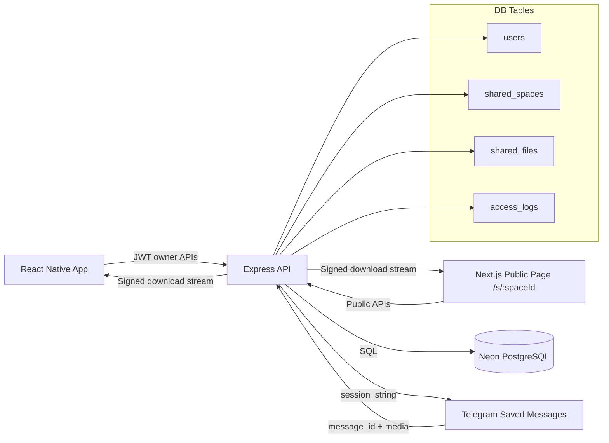

# Ayxa Shared Space System

## 1) Architecture Diagram

## 2) Database Schema + Field Purpose

### `users`
- `id`: owner identity and FK root for spaces.
- `session_string`: Telegram session used to upload/download from Saved Messages.

### `shared_spaces`
- `id`: public space identifier used in URL.
- `name`: space title for UI.
- `owner_id`: owner for access control and session lookup.
- `password_hash`: bcrypt hash for protected spaces.
- `allow_upload`: controls public/guest upload.
- `allow_download`: controls file download visibility.
- `expires_at`: link expiry.
- `created_at`: audit + sorting.

### `shared_files`
- `id`: file id for signed download URL binding.
- `space_id`: parent shared space.
- `telegram_message_id`: canonical pointer to Telegram media in Saved Messages.
- `file_name`: display and download naming.
- `file_size`: quota and UI metadata.
- `mime_type`: validation + response content type.
- `uploaded_by`: nullable actor tracking (guest uploads are null).
- `created_at`: timeline sorting.
- `telegram_file_id`: future optimization/diagnostics.
- `folder_path`: virtual folder explorer path.

### `access_logs`
- `id`: log row identity.
- `space_id`: target space.
- `user_ip`: abuse trace and analytics.
- `action`: `space_open`, `password_failed`, `download_file`, etc.
- `created_at`: rate/correlation analysis.

## 3) API Endpoints

### `POST /api/spaces/create` (auth)
- body: `{ name, password?, allow_upload, allow_download, expires_at? }`
- validation: name length, future expiry.
- security: owner JWT required, bcrypt password hash.
- response: `{ success, space }`

### `GET /api/spaces` (auth)
- response: owner spaces with file_count + total_size.

### `GET /api/spaces/:id` (public)
- response: public metadata + `requires_password` + `has_access`.
- security: expiry check + access log.

### `POST /api/spaces/:id/validate-password` (public)
- body: `{ password }`
- validation: bcrypt compare.
- security: rate-limited, issues access token + cookie.
- response: `{ success, access_token, expires_in_seconds }`

### `GET /api/spaces/:id/files?folder_path=/...` (public)
- response: `{ space, folder_path, folders[], files[] }`
- security: password gate, expiry check, signed URLs for each file.

### `POST /api/spaces/:id/upload` (public)
- multipart: `file`, optional `folder_path`.
- validation: max upload size + MIME allowlist.
- storage flow: uploads file to owner's Telegram Saved Messages, stores returned `message_id` in `shared_files`.
- security: checks `allow_upload`, password access, rate limiting.

### `GET /api/files/:id/download?sig=...` (public)
- validation: signed short-lived JWT token.
- security: verifies file id + space id + expiry + password access.
- behavior: reads Telegram message via owner session and streams file.

## 4) Security Controls

- bcrypt password hashing (`salt rounds = 12`).
- Space access token for locked spaces (`x-space-access-token` or httpOnly cookie).
- File upload size cap via multer + runtime size check.
- MIME allowlist.
- Link expiry enforcement in all public read/write/download paths.
- Per-action rate limiters for view/password/upload/download.
- Signed download token bound to both `space_id` and `file_id`, 10-minute TTL.

## 5) Performance and Flicker Fixes (RN/Web)

- Stable effects: one initial load guard (`hasLoadedRef`) and explicit dependencies.
- Memoized list rows and callbacks in `FileListComponent`.
- Isolated loading states: password submit/upload/list refresh do not reset entire screen.
- Folder navigation uses incremental reload without remounting screen state.
- Download links precomputed server-side to avoid extra client roundtrips.

## 6) Telegram Storage Model (Saved Messages)

1. User/guest uploads in shared space.
2. Backend resolves space owner and loads owner `session_string`.
3. File is sent to Telegram Saved Messages (`sendFile('me', ...)`).
4. Telegram returns `message_id`.
5. Backend persists file metadata + `telegram_message_id` in `shared_files`.
6. Downloads fetch by `message_id` and stream through signed endpoint.

## 7) Implementation Plan

1. Deploy DB migrations (`shared_spaces`, `shared_files`, `access_logs`, indexes).
2. Deploy backend routes/controllers and verify `/api/spaces/*` + `/api/files/:id/download`.
3. Enable RN `SharedSpaceScreen` deep-link routing for `/s/:spaceId`.
4. Deploy Next.js web app with `/s/[spaceId]` page.
5. Run load tests for password + upload + download endpoints.
6. Add observability dashboards for `access_logs` and error-rate alerts.
